 
# Create an access review of groups and applications in Azure AD

Access to groups and applications for employees and guests changes over time. To reduce the risk associated with stale access assignments, administrators can use Azure Active Directory (Azure AD) to create access reviews for group members or application access.

Microsoft 365 and Security group owners can also use Azure AD to create access reviews for group members as long as the Global or User administrator enables the setting via the **Access Reviews Settings** pane. For more information about these scenarios, see [Manage access reviews](manage-access-review.md).

Watch a short video that talks about enabling access reviews.

>[!VIDEO https://www.youtube.com/embed/X1SL2uubx9M]

This article describes how to create one or more access reviews for group members or application access.

## Prerequisites

- Microsoft Azure AD Premium P2 or Microsoft Entra ID Governance licenses.  
- Creating a review on inactive users and with [user-to-group affiliation](review-recommendations-access-reviews.md#user-to-group-affiliation) recommendations requires a Microsoft Entra ID Governance license.
- Global administrator, User administrator, or Identity Governance administrator to create reviews on groups or applications.
- Global administrators and Privileged Role administrators can create reviews on role-assignable groups. For more information, see [Use Azure AD groups to manage role assignments](../roles/groups-concept.md).
- Microsoft 365 and Security group owner.

For more information, see [License requirements](access-reviews-overview.md#license-requirements).

If you're reviewing access to an application, then before creating the review, see the article on how to [prepare for an access review of users' access to an application](access-reviews-application-preparation.md) to ensure the application is integrated with Azure AD.

## Create a single-stage access review

### Scope

[!INCLUDE [portal updates](~/articles/active-directory/includes/portal-update.md)]

1. Sign in to the [Azure portal](https://portal.azure.com) and open the [Identity Governance](https://portal.azure.com/#blade/Microsoft_AAD_ERM/DashboardBlade/) page.

2. On the left menu, select **Access reviews**.

3. Select **New access review** to create a new access review.

    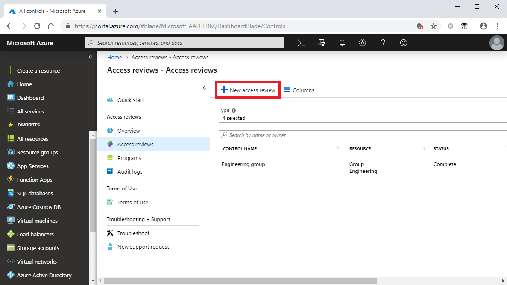

4. In the **Select what to review** box, select which resource you want to review.

    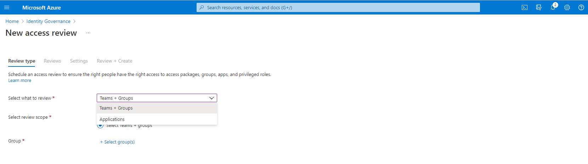

5. If you selected **Teams + Groups**, you have two options:

   - **All Microsoft 365 groups with guest users**: Select this option if you want to create recurring reviews on all your guest users across all your Microsoft Teams and Microsoft 365 groups in your organization. Dynamic groups and role-assignable groups aren't included. You can also choose to exclude individual groups by selecting **Select group(s) to exclude**.
   - **Select Teams + groups**: Select this option if you want to specify a finite set of teams or groups to review. A list of groups to choose from appears on the right.

     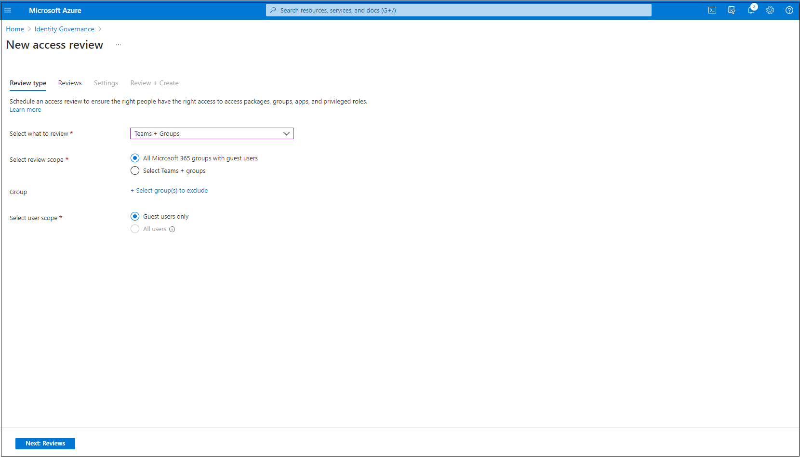

6. If you selected **Applications**, select one or more applications.

   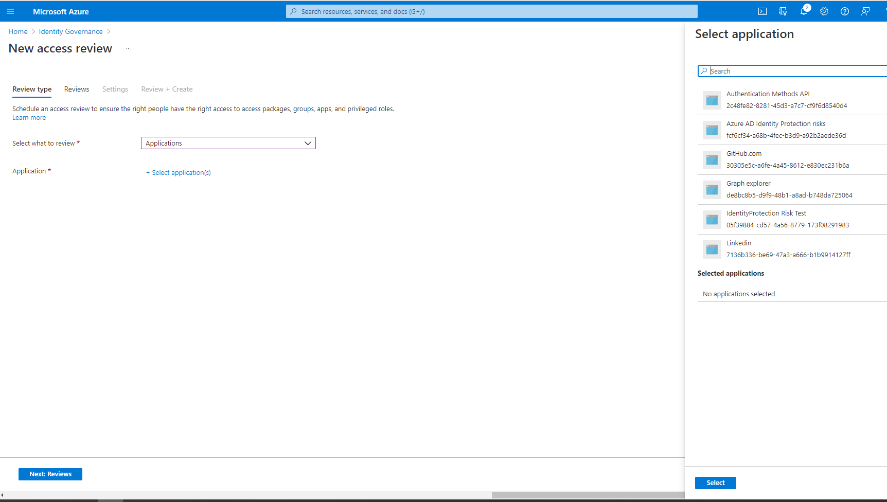

> [!NOTE]
> Selecting multiple groups or applications results in the creation of multiple access reviews. For example, if you select five groups to review, the result is five separate access reviews.

7. Now you can select a scope for the review. Your options are:
    - **Guest users only**: This option limits the access review to only the Azure AD B2B guest users in your directory.
    - **Everyone**: This option scopes the access review to all user objects associated with the resource.

    > [!NOTE]  
    > If you selected **All Microsoft 365 groups with guest users**, your only option is to review **Guest users only**.

8. Or if you're conducting group membership review, you can create access reviews for only the inactive users in the group. In the *Users scope* section, check the box next to **Inactive users (on tenant level)**. If you check the box, the scope of the review focuses on inactive users only, those who haven't signed in either interactively or non-interactively to the tenant. Then, specify **Days inactive**  with many days inactive up to 730 days (two years). Users in the group inactive for the specified number of days are the only users in the review.

    > [!NOTE]  
    > Recently created users are not affected when configuring the inactivity time. The Access Review will check if a user has been created in the time frame configured and disregard users who haven’t existed for at least that amount of time. For example, if you set the inactivity time as 90 days and a guest user was created or invited less than 90 days ago, the guest user will not be in scope of the Access Review. This ensures that a user can sign in at least once before being removed.

9. Select **Next: Reviews**.

### Next: Reviews
 
1. You can create a single-stage or multi-stage review. For a single stage review, continue here. To create a multi-stage access review, follow the steps in [Create a multi-stage access review](#create-a-multi-stage-access-review)

1. In the **Specify reviewers** section, in the **Select reviewers** box, select either one or more people to make decisions in the access reviews. You can choose from:

    - **Group owner(s)**: This option is only available when you do a review on a team or group.
    - **Selected user(s) or groups(s)**
    - **Users review their own access**
    - **Managers of users**

   If you choose either **Managers of users** or **Group owner(s)**, you can also specify a fallback reviewer. Fallback reviewers are asked to do a review when the user has no manager specified in the directory or if the group doesn't have an owner.

    > [!NOTE]  
    > In a team or group access review, only the group owners (at the time the review starts) are considered as reviewers. During the course of a review, if the list of group owners is updated, new group owners will not be considered reviewers as well as old group owners will still be considered reviewers. However, in the case of a recurring review, any changes on the group owners list will be considered in the next instance of that review.

    >[!IMPORTANT]
    > For PIM for Groups (Preview), you must select **Group owner(s)**. It is mandatory to assign at least one fallback reviewer to the review. The review will only assign active owner(s) as the reviewer(s). Eligible owners are not included. If there are no active owners when the review begins, the fallback reviewer(s) will be assigned to the review.

      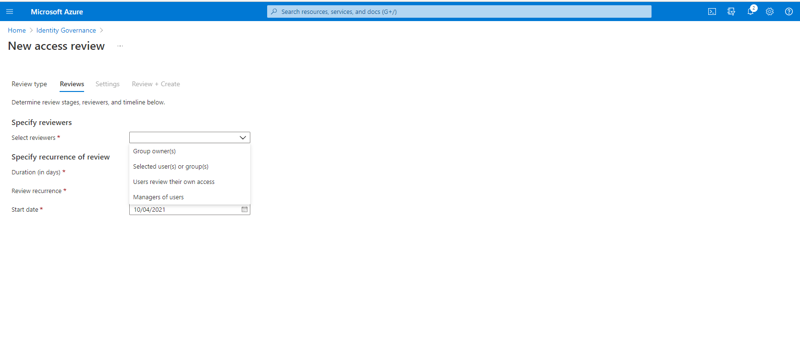

1. In the **Specify recurrence of review** section, specify the following selections:

   - **Duration (in days)**: How long a review is open for input from reviewers.
   - **Start date**: When the series of reviews begins.
   - **End date**: When the series of reviews ends. You can specify that it **Never** ends. Or, you can select **End on a specific date** or **End after number of occurrences**.

     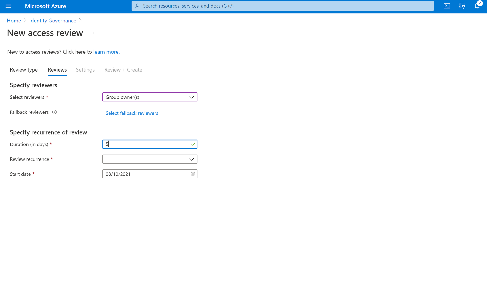

1. Select **Next: Settings**.

### Next: Settings

1. In the **Upon completion settings** section, you can specify what happens after the review finishes.

    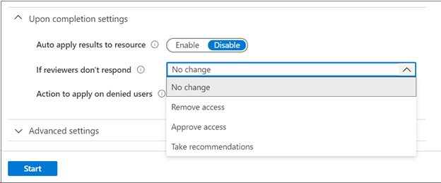

    - **Auto apply results to resource**: Select this checkbox if you want access of denied users to be removed automatically after the review duration ends. If the option is disabled, you have to manually apply the results when the review finishes. To learn more about applying the results of the review, see [Manage access reviews](manage-access-review.md).

    - **If reviewers don't respond**: Use this option to specify what happens for users not reviewed by any reviewer within the review period. This setting doesn't affect users who were reviewed by a reviewer. The dropdown list shows the following options:

       - **No change**: Leaves a user's access unchanged.
       - **Remove access**: Removes a user's access.
       - **Approve access**: Approves a user's access.
       - **Take recommendations**: Takes the system's recommendation to deny or approve the user's continued access.
    
        >[!WARNING]
        > If the settings **If reviewers don't respond** is set to **Remove access** or **Take recommendations** and **Auto apply results to resource** is enabled, all access to this resource could risk being revoked if the reviewers fail to respond.

    - **Action to apply on denied guest users**: This option is only available if the access review is scoped to include only guest users to specify what happens to guest users if they're denied either by a reviewer or by the **If reviewers don't respond** setting.

       - **Remove user's membership from the resource**: This option removes a denied guest user's access to the group or application being reviewed. They can still sign in to the tenant and won't lose any other access.
       - **Block user from signing-in for 30 days, then remove user from the tenant**: This option blocks a denied guest user from signing in to the tenant, no matter if they have access to other resources. If this action was taken in error, admins can reenable the guest user's access within 30 days after the guest user was disabled. If no action is taken on the disabled guest user after 30 days, they're deleted from the tenant.

    To learn more about best practices for removing guest users who no longer have access to resources in your organization, see [Use Azure AD Identity Governance to review and remove external users who no longer have resource access](access-reviews-external-users.md).

    > [!NOTE]
    > **Action to apply on denied guest users** isn't configurable on reviews scoped to more than guest users. It's also not configurable for reviews of **All Microsoft 365 groups with guest users.** When not configurable, the default option of removing a user's membership from the resource is used on denied users.

1. Use the **At end of review, send notification to** option to send notifications to other users or groups with completion updates. This feature allows for stakeholders other than the review creator to be updated on the progress of the review. To use this feature, choose **Select User(s) or Group(s)** and add another user or group for which you want to receive the status of completion.

1. In the **Enable review decision helpers** section choose whether you want your reviewer to receive recommendations during the review process:
    1. If you select **No sign-in within 30 days**, users who have signed in during the previous 30-day period are recommended for approval. Users who haven't signed in during the past 30 days are recommended for denial. This 30-day interval is irrespective of whether the sign-ins were interactive or not. The last sign-in date for the specified user will also display along with the recommendation.
    1. If you select **(Preview) User-to-Group Affiliation**, reviewers get the recommendation to Approve or Deny access for the users based on user’s average distance in the organization’s reporting-structure. Users who are distant from all the other users within the group are considered to have "low affiliation" and will get a deny recommendation in the group access reviews.

   > [!NOTE]
   > If you create an access review based on applications, your recommendations are based on the 30-day interval period depending on when the user last signed in to the application rather than the tenant. 

   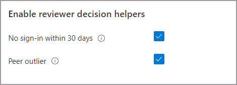

1. In the **Advanced settings** section, you can choose the following:

    - **Justification required**: Select this checkbox to require the reviewer to supply a reason for approval or denial.
    - **Email notifications**: Select this checkbox to have Azure AD send email notifications to reviewers when an access review starts and to administrators when a review finishes.
    - **Reminders**: Select this checkbox to have Azure AD send reminders of access reviews in progress to all reviewers. Reviewers receive the reminders halfway through the review, no matter if they've finished their review or not.
    - **Additional content for reviewer email**: The content of the email sent to reviewers is autogenerated based on the review details, such as review name, resource name, and due date. If you need to communicate more information, you can specify details such as instructions or contact information in the box. The information that you enter is included in the invitation, and reminder emails are sent to assigned reviewers. The section highlighted in the following image shows where this information appears.

      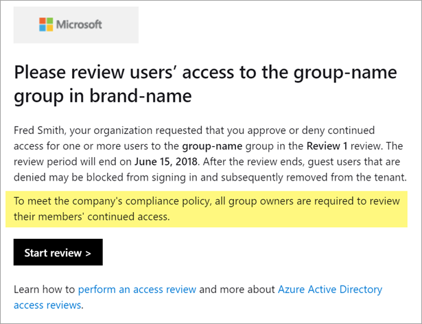

1. Select **Next: Review + Create**.

   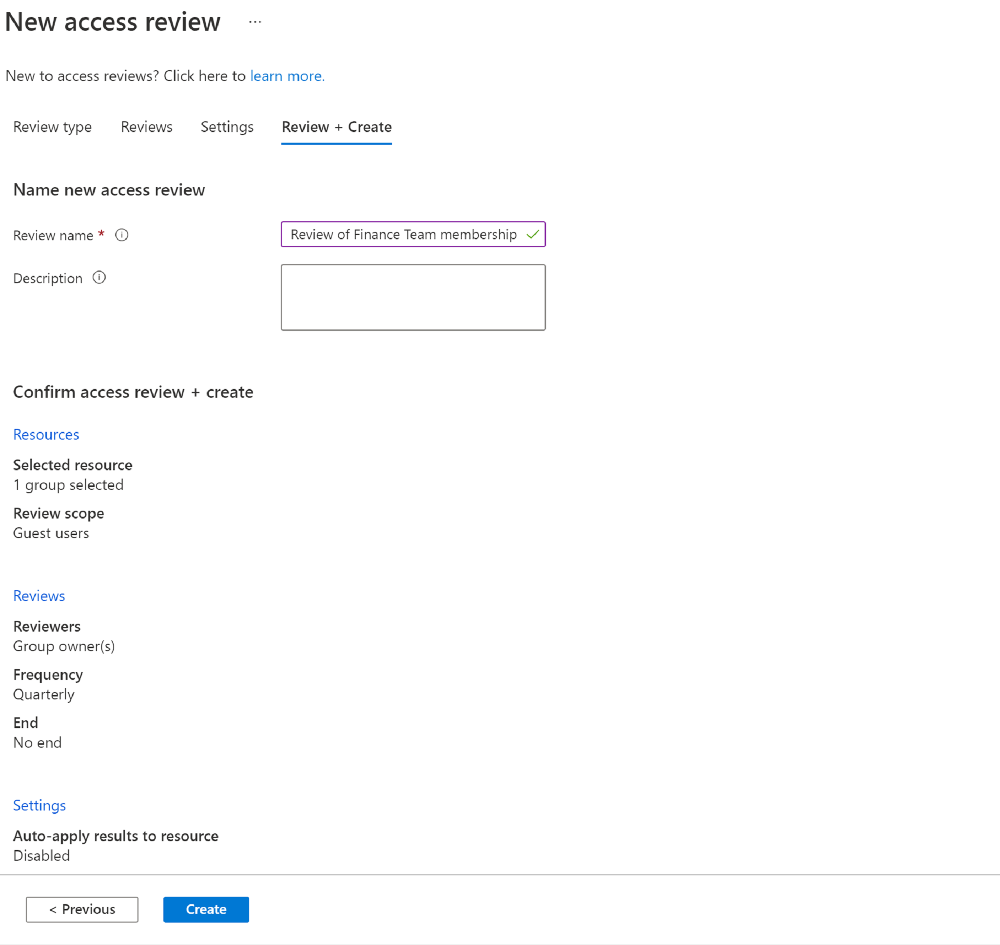

### Next: Review + Create

1. Name the access review. Optionally, give the review a description. The name and description are shown to the reviewers.

1. Review the information and select **Create**.

## Create a multi-stage access review

A multi-stage review allows the administrator to define two or three sets of reviewers to complete a review one after another. In a single-stage review, all reviewers make a decision within the same period and the last reviewer to make a decision "wins". In a multi-stage review, two or three independent sets of reviewers make a decision within their own stage, and the next stage doesn't happen until a decision is made in the previous stage. Multi-stage reviews can be used to reduce the burden on later-stage reviewers, allow for escalation of reviewers, or have independent groups of reviewers agree on decisions.
> [!WARNING]
> Data of users included in multi-stage access reviews are a part of the audit record at the start of the review. Administrators may delete the data at any time by deleting the multi-stage access review series. For general information about GDPR and protecting user data, see the [GDPR section of the Microsoft Trust Center](https://www.microsoft.com/trust-center/privacy/gdpr-overview) and the [GDPR section of the Service Trust portal](https://servicetrust.microsoft.com/ViewPage/GDPRGetStarted).

1. After you have selected the resource and scope of your review, move on to the **Reviews** tab. 

1. Select the checkbox next to **Multi-stage review**.

1. Under **First stage review**, select the reviewers from the dropdown menu next to **Select reviewers**. 

1. If you select **Group owner(s)** or **Managers of Users**, you have the option to add a fallback reviewer. To add a fallback, select **Select fallback reviewers** and add the users you want to be fallback reviewers.
 
    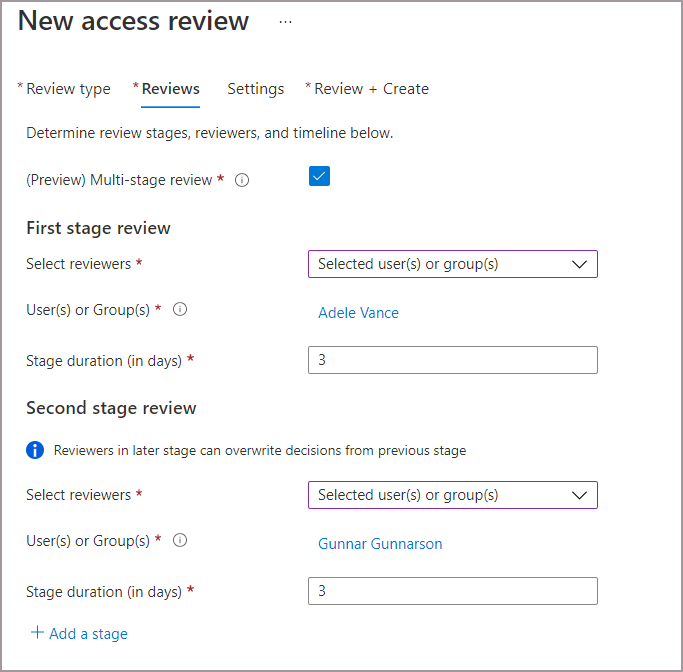

1. Add the duration for the first stage. To add the duration, enter a number in the field next to **Stage duration (in days)**. This is the number of days you wish for the first stage to be open to the first stage reviewers to make decisions.
 
1. Under **Second stage review**, select the reviewers from the dropdown menu next to **Select reviewers**. These reviewers will be asked to review after the duration of the first stage review ends.

1. Add any fallback reviewers if necessary.

1. Add the duration for the second stage.
 
1. By default, you'll see two stages when you create a multi-stage review. However, you can add up to three stages. If you want to add a third stage, select **+ Add a stage** and complete the required fields.  

1. You can decide to allow 2nd and 3rd stage reviewers to the see decisions made in the previous stage(s).If you want to allow them to see the decisions made prior, select the box next to **Show previous stage(s) decisions to later stage reviewers** under **Reveal review results**. Leave the box unchecked to disable this setting if you’d like your reviewers to review independently. 

    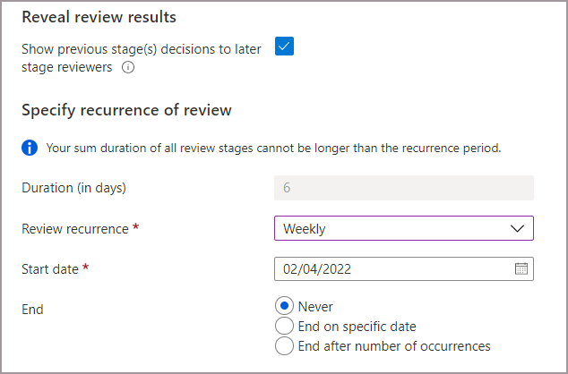

1. The duration of each recurrence is set to the sum of the duration day(s) you specified in each stage.

1. Specify the **Review recurrence**, the **Start date**, and **End date** for the review. The recurrence type must be at least as long as the total duration of the recurrence (i.e., the max duration for a weekly review recurrence is 7 days).

1. To specify which reviewees will continue from stage to stage, select one or multiple of the following options next to **Specify reviewees to go to next stage** :
     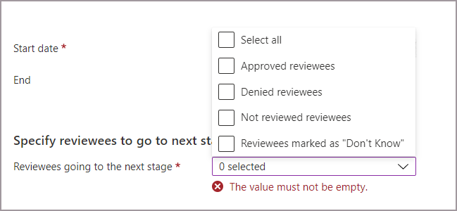

    1. **Approved reviewees** - Only reviewees that were approved move on to the next stage(s).
    1. **Denied reviewees** - Only reviewees that were denied move on to the next stage(s).
    1. **Not reviewed reviewees** - Only reviewees that haven't been reviewed will move on to the next stage(s).
    1. **Reviewees marked as "Don't Know"** - Only reviewees marked as "Don't know" move on to the next stage(s).
    1.  **All**: everyone moves on to the next stage if you’d like all stages of reviewers to make a decision.  

1. Continue on to the **settings tab** and finish the rest of the settings and create the review. Follow the instructions in [Next: Settings](#next-settings).

## Include B2B direct connect users and teams accessing Teams Shared Channels in access reviews

You can create access reviews for B2B direct connect users via shared channels in Microsoft Teams. As you collaborate externally, you can use Azure AD access reviews to make sure external access to shared channels stays current. To learn more about Teams Shared Channels and B2B direct connect users, read the [B2B direct connect](../external-identities/b2b-direct-connect-overview.md) article.

When you create an access review on a Team with shared channels, your reviewers can review continued need for access of those external users and Teams in the shared channels. External users in the shared channels are called B2B direct connect users. You can review access of B2B connect users and other supported B2B collaboration users and non-B2B internal users in the same review.

>[!NOTE]
> Currently, B2B direct connect users and teams are only included in single-stage reviews. If multi-stage reviews are enabled, the direct connect users and teams won't be included in the access review.

B2B direct connect users and teams are included in access reviews of the Teams-enabled Microsoft 365 group that the shared channels are a part of. To create the review, you must be a:
- Global Administrator
- User administrator 
- Identity Governance Administrator

Use the following instructions to create an access review on a team with shared channels:

1. Sign in to the [Azure portal](https://portal.azure.com) as a Global Administrator, User Admin or Identity Governance Admin.
  
1. Open the [Identity Governance](https://portal.azure.com/#blade/Microsoft_AAD_ERM/DashboardBlade/) page.

1. On the left menu, select **Access reviews**.

1. Select **+ New access review**.

1. Select **Teams + Groups** and then select **Select teams + groups** to set the **Review scope**. B2B direct connect users and teams aren't included in reviews of **All Microsoft 365 groups with guest users**.
 
1. Select a Team that has shared channels shared with 1 or more B2B direct connect users or Teams.  

1. Set the **Scope**. 
    
    

    - Choose **All users** to include:
        - All internal users
        - B2B collaboration users that are members of the Team
        - B2B direct connect users
        - Teams that access shared channels
    - Or, choose **Guest users only** to only include B2B direct connect users and Teams and B2B collaboration users. 

1. Continue on to the **Reviews** tab. Select a reviewer to complete the review, then specify the **Duration** and **Review recurrence**. 

    > [!NOTE]
    > - If you set **Select reviewers** to **Users review their own access** or **Managers of users**, B2B direct connect users and Teams won't be able to review their own access in your tenant. The owner of the Team under review will get an email that asks the owner to review the B2B direct connect user and Teams.
    > - If you select **Managers of users**, a selected fallback reviewer will review any user without a manager in the home tenant. This includes B2B direct connect users and Teams without a manager.

1. Go on to the **Settings** tab and configure additional settings. Then go to the **Review and Create** tab to start your access review. For more detailed information about creating a review and configuration settings, see our [Create a single-stage access review](#create-a-single-stage-access-review).

## Allow group owners to create and manage access reviews of their groups

The prerequisite role is a Global or User administrator.

1. Sign in to the [Azure portal](https://portal.azure.com) and open the [Identity Governance page](https://portal.azure.com/#blade/Microsoft_AAD_ERM/DashboardBlade/).

1. On the menu on the left, under **Access reviews**, select **Settings**.

1. On the **Delegate who can create and manage access reviews** page, set **Group owners can create and manage access reviews for groups they own** to **Yes**.

    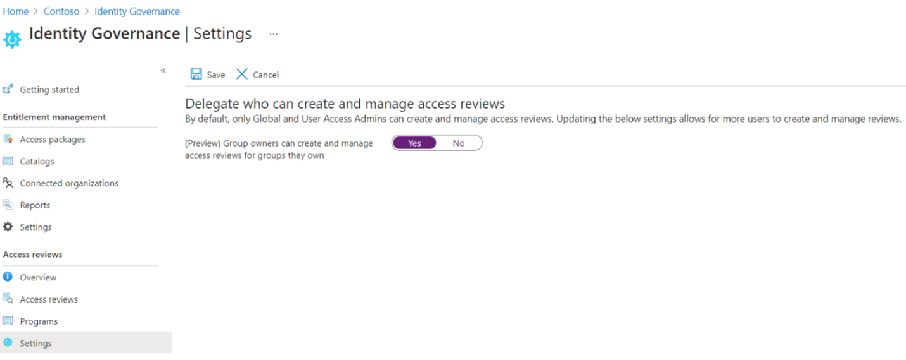

    > [!NOTE]
    > By default, the setting is set to **No**. To allow group owners to create and manage access reviews, change the setting to **Yes**.

## Start the access review

After you've specified the settings for an access review, select **Start**. The access review appears in your list with an indicator of its status.

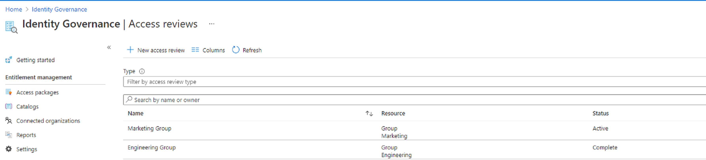

By default, Azure AD sends an email to reviewers shortly after the review starts. If you choose not to have Azure AD send the email, be sure to inform the reviewers that an access review is waiting for them to complete. You can show them the instructions for how to [review access to groups or applications](perform-access-review.md). If your review is for guests to review their own access, show them the instructions for how to [review access for yourself to groups or applications](review-your-access.md).

If you've assigned guests as reviewers and they haven't accepted their invitation to the tenant, they won't receive an email from access reviews. They must first accept the invitation before they can begin reviewing.

## Update the access review

After one or more access reviews have started, you might want to modify or update the settings of your existing access reviews. Here are some common scenarios to consider:

- **Update settings or reviewers:** If an access review is recurring, there are separate settings under **Current** and under **Series**. Updating the settings or reviewers under **Current** only applies changes to the current access review. Updating the settings under **Series** updates the settings for all future recurrences.

   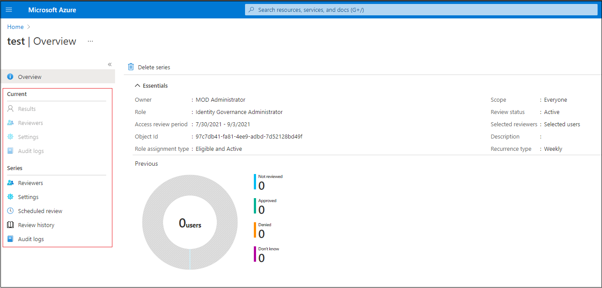

- **Add and remove reviewers:** When you update access reviews, you might choose to add a fallback reviewer in addition to the primary reviewer. Primary reviewers might be removed when you update an access review. Fallback reviewers aren't removable by design.

    > [!Note]
    > Fallback reviewers can only be added when the reviewer type is a manager or a group owner. Primary reviewers can be added when the reviewer type is the selected user.

- **Remind the reviewers:** When you update access reviews, you might choose to enable the **Reminders** option under **Advanced settings**. Users then receive an email notification at the midpoint of the review period, whether they've finished the review or not.

   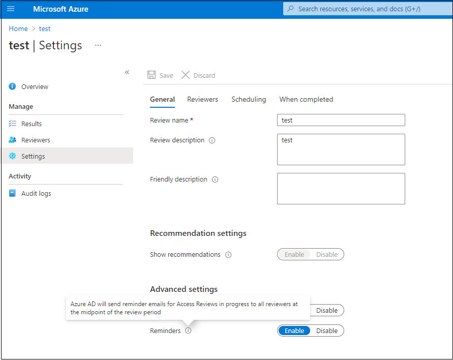

## Next steps

- [Complete an access review of groups or applications](complete-access-review.md)
- [Create an access review of PIM for Groups (preview)](create-access-review-pim-for-groups.md)
- [Review access to groups or applications](perform-access-review.md)
- [Review access for yourself to groups or applications](review-your-access.md)
