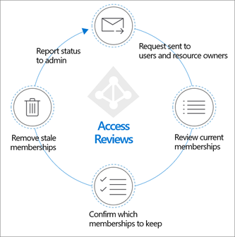
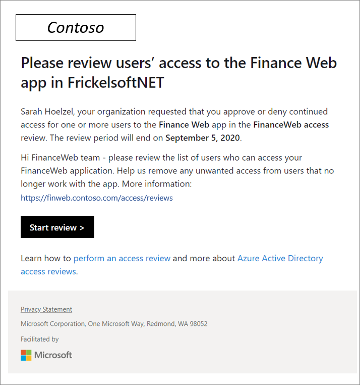
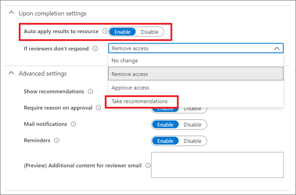
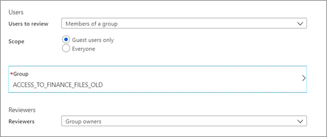
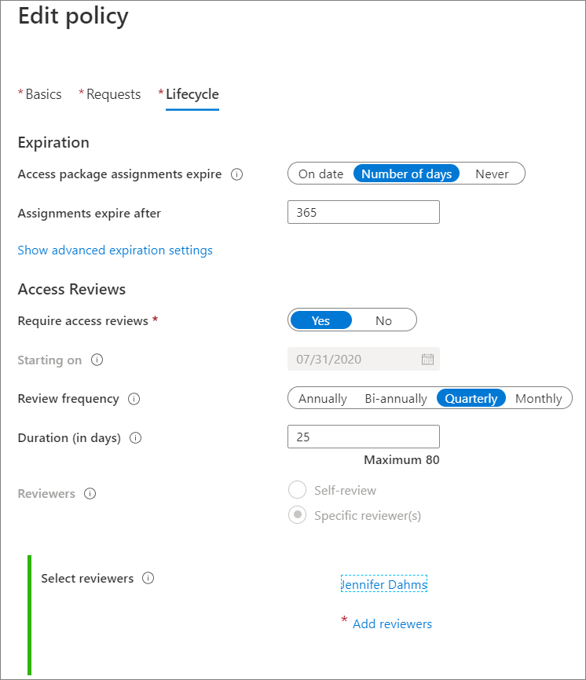
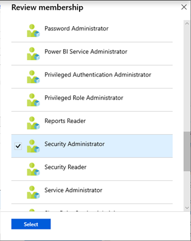
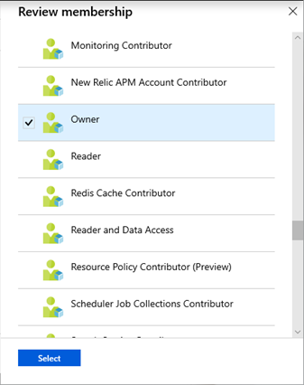

# Planning Azure Active Directory Access Reviews deployment

[Azure Active Directory (Azure AD) Access Reviews](access-reviews-overview.md) help your organization keep the network more secure by managing its [resource access lifecycle](identity-governance-overview.md). With Access Reviews, you can:

* Schedule regular reviews or perform ad-hoc reviews to see who has access to specific resources, such as applications and groups

* Track reviews for insights, compliance, or policy reasons

* Delegate reviews to specific admins, business owners, or end-users who can self-attest to the need for continued access

* Use the insights to efficiently determine if users should continue to have access

* Automate review outcomes, such as removing users’ access to resources

  

Access Reviews is an [Azure AD Identity Governance](identity-governance-overview.md) capability. The other capabilities are [Entitlement Management](entitlement-management-overview.md), [Privileged Identity Management](../privileged-identity-management/pim-configure.md) and [Terms of Use](../conditional-access/terms-of-use.md). Together, they help organizations address these four questions:

* Which users should have access to which resources?

* What are those users doing with that access?

* Is there effective organizational control for managing access?

* Can auditors verify that the controls are working?

Planning your Access Reviews deployment is essential to make sure you achieve your desired governance strategy for users in your organization.

### Key benefits

The key benefits of enabling Access Reviews are:

* **Control collaboration**. Access Reviews allows organizations to manage access to all the resources its users need. When their users share and collaborate, organizations can be assured that the information is among authorized users only.

* **Manage risk**. Access Reviews provide organizations a way to review access to data and applications, lowering the risk of data leakage and data spill. This includes capabilities to regularly review external partner’s access to corporate resources. 

* **Address compliance and governance**. With Access Reviews, you can govern and recertify the access lifecycle to groups, apps, and sites. You can control track reviews for compliance or risk-sensitive applications specific to your organization. 

* **Reduce cost**. Access Reviews are built in the cloud,  and natively works with cloud resources such as groups, applications, and Access Packages. Using Access Reviews is less costly than building your own tools or otherwise upgrading your on-premises toolset.

### Training resources

The following videos may be useful as you learn about Access Reviews:

* [What are Access Reviews in Azure AD?](https://youtu.be/kDRjQQ22Wkk)

* [How to create Access Reviews in Azure AD](https://youtu.be/6KB3TZ8Wi40)

* [How to enable Access Reviews in Azure AD](https://youtu.be/X1SL2uubx9M)

* [How to review access using My Access](https://youtu.be/tIKdQhdHLXU)

### Licenses

You need a valid Azure AD Premium (P2) license for each person, other than Global Administrators or User Administrators, who will create or perform Access Reviews. For more information, see [Access Reviews license requirements](access-reviews-overview.md).

You may also need other Identity Governance features, such as [Entitlement Lifecycle Management](entitlement-management-overview.md) or Privileged Identity Managements. In that case, you might also need related licenses. For more information, see [Azure Active Directory pricing](https://azure.microsoft.com/pricing/details/active-directory/).

## Plan the Access Reviews deployment project

Consider your organizational needs to determine the strategy for deploying Access Reviews in your environment.

### Engage the right stakeholders

When technology projects fail, they typically do so due to mismatched expectations on impact, outcomes, and responsibilities. To avoid these pitfalls, [ensure that you're engaging the right stakeholders](../fundamentals/active-directory-deployment-plans.md) and that project roles are clear.

For Access Reviews, you'll likely include representatives from the following teams within your organization:

* **IT administration** manages your IT infrastructure and administers your cloud investments and Software as a Service (SaaS) apps. This team will:

   * Review privileged access to infrastructure and apps, including Microsoft 365 and Azure AD.

   * Schedule and run Access Reviews on groups that are used to maintain exception lists or IT pilot projects, to maintain up-to-date access lists.

   * Ensure that programmatic (scripted) access to resources through Service Principals is governed and reviewed.

* **Development teams** build and maintain applications for your organization. This team will:

   * Control who can access and manage components in SaaS, PaaS, and IaaS resources that comprise the developed solutions.

   * Manage groups that can access applications and tools for internal application development.

   * Require privileged identities that have access to production software or solutions that are hosted for your customers

* **Business units** manage projects and own applications. This team will: 

   * Review, and approve or deny access to groups and applications for internal and external users.

   * Schedule and perform reviews to attest continued access for employees and external identities such as business partners.

* **Corporate governance** ensures that the organization is following internal policy and complying with regulations. This team will:

   * Request or schedule new Access Reviews.

   * Assess processes and procedures for reviewing access, including documentation and record keeping for compliance.

   * Review results of past reviews for most critical resources.

> [!NOTE]
> For reviews requiring manual evaluations, be sure to plan for adequate reviewers and review cycles that meet your policy and compliance needs. If review cycles are too frequent, or there are too few reviewers, quality may be lost and too many or too few people may have access. 

### Plan communications

Communication is critical to the success of any new business process. Proactively communicate to users how and when their experience will change, and how to gain support if they experience issues. 

#### Communicate changes in accountability

Access Reviews support shifting responsibility of reviewing and acting on continued access to business owners. Decoupling access decisions from IT drives more accurate access decisions. This is a cultural change in resource owner’s accountability and responsibility. Proactively communicate this change and ensure resource owners are trained and able to use the insights to make good decisions.

Clearly, IT will want to stay in control for all infrastructure-related access decision, and privileged role assignments. 

#### Customize email communication

When you schedule a review, you nominate users who will perform this review. These reviewers then receive an email notification of new reviews assigned to them, as well as reminders before a review assigned to them expires.

Administrators can choose to send this notification either half-way before the review expires or a day before it expires. 

The email sent to reviewers can be customized to include a custom short message that encourages them to act on the review. We recommend you use the additional text to:

* Include a personal message to reviewers, so they understand it is sent by your Compliance or IT department.

* Include a hyperlink or reference to internal information on what the expectations of the review are and additional reference or training material.

* Include a link to instructions on [how to perform a self-review of access.](review-your-access.md) 

  

Upon selecting Start review, reviewers will be directed to the [myAccess portal](https://myapplications.microsoft.com/) for group and application Access Reviews. The portal gives them an overview of all users who have access to the resource they're reviewing, and system recommendations based on last sign-in and access information.

### Plan a pilot

We encourage customers to initially pilot Access Reviews with a small group and target non-critical resources. Piloting can help you adjust processes and communications as needed, and  increase users’ and reviewers’ ability to meet security and compliance requirements.

In your pilot, we recommend:

* Start with reviews where the results are not automatically applied, and you can control the implications.

* Ensure that all users have valid email addresses listed in Azure AD, and they receive email communication to take the appropriate action. 

* Document any access removed as a part of the pilot in case you need to quickly restore it.

* Monitor audit logs to ensure everything is all events are properly audited.

For more information, see [best practices for a pilot](../fundamentals/active-directory-deployment-plans.md).

## Introduction to Access Reviews

This section introduces Access Review concepts you should know before planning your reviews.

### What resource types can be reviewed?

Once you integrate your organization’s resources with Azure AD (such as users, applications, and groups), they can be managed and reviewed. 

Typical targets for review include:

* [Applications integrated with Azure AD for Single Sign-on](../manage-apps/what-is-application-management.md) (such as SaaS, line-of-business).

* Group [membership](../fundamentals/active-directory-manage-groups.md?context=azure%2factive-directory%2fusers-groups-roles%2fcontext%2fugr-context) (synchronized to Azure AD, or created in Azure AD or Microsoft 365, including Microsoft Teams).

* [Access Package](./entitlement-management-overview.md) that group resources (groups, apps, and sites) into a single package to manage access.

* [Azure AD roles​ and Azure Resource roles](../privileged-identity-management/pim-resource-roles-assign-roles.md) as defined in Privileged Identity Management.

### Who will create and manage Access Reviews?

The administrative role required to create, manage, or read an Access Review depends on the type of resource being reviewed. The following table denotes the roles required for each resource type:

| Resource type| Create and manage Access Reviews (Creators)| Read Access Review results |
| - | - | -|
| Group or application| Global Administrator 
User Administrator| Creators and Security Administrator |
| Privileged roles in Azure AD| Global Administrator 
Privileged Role Administrator| Creators 
Security Reader
Security Administrator |
| Privileged roles in Azure (resources)| Global Administrator
User Administrator
Resource Owner| Creators |
| Access package| Global Administrator
Creator of Access Package| Global Administrator only |

For more information, see [Administrator role permissions in Azure Active Directory](../roles/permissions-reference.md).

### Who will review the access to the resource?

The creator of the access review decides at the time of creation who will perform the review. This setting can't be changed once the review is started. Reviewers are represented by three personas:

* Resource Owners, who are the business owners of the resource.

* A set of individually selected delegates, as selected by the Access Reviews administrator.

* End-users who will each self-attest to their need for continued access.

When creating an Access Review, administrators can choose one or more reviewers. All reviewers can start and carry out a review, choosing users for continued access to a resource or removing them. 

### Components of an Access Review

Before implementing your Access Reviews, you should plan the types of reviews relevant to your organization. To do so, you will need to make business decisions about what you want to review and the actions to take based on those reviews.

To create an access review policy, you must have the following information.

* What is the resource(s) to review?

* Whose access is being reviewed.

* How often should the review occur?

* Who will perform the review?

   * How will they be notified to review?

   * What are the timelines to be enforced for review?

* What automatic actions should be enforced based on the review?

   * What happens if the reviewer doesn't respond in time?

* What manual actions will be taken as a result based on the review?

* What communications should be sent based on actions taken?

**Example Access Review plan**

| Component| Value |
| - | - |
| **Resources to review**| Access to Microsoft Dynamics |
| **Review frequency**| Monthly |
| **Who performs review**| Dynamics business group Program Managers |
| **Notification**| Email 24 hours prior to review to alias Dynamics-Pms
Include encouraging custom message to reviewers to secure their buy-in |
| **Timeline**| 48 hours from notification |
|**Automatic actions**| Remove access from any account that has no interactive sign-in within 90 days, by removing user from security group dynamics-access. 
*Perform actions if not reviewed within timeline.* |
| **Manual actions**| Reviewers may perform removals approval prior to automated action if desired. |
| **Communications**| Send internal (member) users who are removed an email explaining they are removed and how to regain access. |

 

### Automate actions based on Access Reviews

You can choose to have access removal automated by setting the Auto apply results to resource option to Enable.

  

Once the review is completed and has ended, users who were not approved by the reviewer will automatically be removed from the resource – or kept with continued access. This could mean removing their group membership, their application assignment, or revoking their right to elevate to a privileged role.

Take recommendations

The recommendations are displayed to reviewers as part of the reviewer experience and indicate a person’s last sign-in to the tenant, or last access to an application. This information helps reviewers make the right access decision. Selecting Take recommendations will follow Access Review’s recommendations. At the end of an Access Review, the system will apply these recommendations automatically for users that reviewers have not responded for.

Recommendations are based on the criteria in the access review. For example, if you configure the review to remove access with no interactive sign-in for 90 days, it will recommend that all users who fit that criteria be removed. Microsoft is continually working on enhancing recommendations. 

### Review guest user access

Use Access Reviews to review and clean up collaboration partners’ identities from external organizations. Configuration of a per-partner review may satisfy compliance requirements.

External identities can be granted access to company resources through one of the following actions:

* Added to a group 

* Invited to Teams 

* Assigned to an enterprise application or access package

* Assigned a privileged role in Azure AD or in an Azure subscription

See [sample script](https://github.com/microsoft/access-reviews-samples/tree/master/ExternalIdentityUse). The script will show where external identities invited into the tenant are used. You can see external user’s group membership, role assignments, and application assignments in Azure AD. The script won't show any assignments outside of Azure AD, for example direct rights assignment to Sharepoint resources, without the use of groups.

When creating an Access Review for groups or applications, you can choose to let the reviewer focus on Everyone with access, or Guest users only. By selecting Guest users only, reviewers are given a focused list of external identities from Azure AD B2B that have access to the resource.

 

> [!IMPORTANT]
> This will NOT include external members who have a userType of member. This will also not include users invited outside of Azure AD B2B collaboration, for example those who have access to shared content directly through SharePoint.

## Plan Access Reviews for Access Packages

[Access packages](entitlement-management-overview.md) can vastly simplify your governance and Access Review strategy. An Access Package is a bundle of all the resources with the access a user needs to work on a project or perform their task. For example, you may want to create an Access Package that includes all the applications that developers in your organization need, or all applications to which external users should have access. An administrator or delegated Access Package manager then groups the resources (groups or apps), and the roles the users need for those resources.

When [creating an Access Package](entitlement-management-access-package-create.md), you can create one or more access policies that set conditions for which users can request an Access Package, what the approval process looks like, and how often a person would have to re-request access. Access Reviews are configured while creating or editing an Access Package policy.

Open the Lifecycle tab to scroll down to Access Reviews.

 

## Plan Access Reviews for groups

Besides Access Packages, reviewing group membership is the most effective way of governing access. We recommend that access to resources is assigned via [security groups or Microsoft 365 groups](../fundamentals/active-directory-manage-groups.md), and that users are added to those groups to gain access.

A single group can be granted access to all appropriate resources. You can assign the group access to individual resources, or to an Access Package that groups applications and other resources. With this method, you can review access to the group rather than an individual’s access to each application. 

Group membership can be reviewed by: 

* Administrators

* Group owners

* Selected users, delegated review capability when the review is created

* Members of the group, attesting for themselves

### Group ownership

We recommend that group owners review membership, as they're best situated to know who needs access. Ownership of groups differs with the type of group:

Groups that are created in Microsoft 365 and Azure AD have one or more well-defined owners. In most cases, these owners make perfect reviewers for their own groups as they know who should have access. 

For example, Microsoft Teams uses Microsoft 365 Groups as the underlying authorization model to grant users access to resources that are in SharePoint, Exchange, OneNote, or other Microsoft 365 services. The creator of the team automatically becomes an owner and should be responsible for attesting to the membership of that group. 

Groups created manually in the Azure AD portal or via scripting through Microsoft Graph may not necessarily have owners defined. We recommend that you define them either through the Azure AD Portal in the group’s “Owners” section or via Graph.

Groups that are synchronized from on-premises Active Directory cannot have an owner in Azure AD. When creating an Access Review for them, you should select individuals who are best suited to decide on membership in them.

> [!NOTE]
> We recommend defining business policies that define how groups are created to ensure clear group ownership and accountability for regular review of membership. 

### Review membership of exclusion groups in Conditional Access policies 

There are times when Conditional Access policies designed to keep your network secure shouldn't apply to all users. For example, a Conditional Access policy that only allows users to sign in while on the corporate network may not apply to the Sales team, which travels extensively. In that case, the Sales team members would be put into a group and that group would be excluded from the Conditional Access policy. 

Review such a group membership regularly as the exclusion represents a potential risk if the wrong members are excluded from the requirement.

You can [use Azure AD access reviews to manage users excluded from Conditional Access policies](conditional-access-exclusion.md).

### Review external user’s group memberships

To minimize manual work and associated potential errors, consider using [Dynamic Groups](../enterprise-users/groups-create-rule.md) to assign group membership based on a user’s attributes. You may want to create one or more Dynamic Groups for external users. The internal sponsor can act as a reviewer for membership in the group. 

Note: External users who are removed from a group as the result of an Access Review aren't deleted from the tenant. 

They can be deleted from a tenant either removed manually, or via a script.

### Review access to on-premises groups

Access Reviews can't change the group membership of groups that you synchronize from on-premises with [Azure AD Connect](../hybrid/whatis-azure-ad-connect.md). This is because the source of authority is on-premises.

You can still use Access Reviews to schedule and maintain regular reviews of on-premises groups. Reviewers will then take action in the on-premises group. This strategy keeps Access Reviews as the tool for all reviews.

You can use the results from an Access Review on on-premises groups and process them further, either by:

* Downloading the CSV report from the Access Review and manually taking action.

* Using Microsoft Graph to programmatically access results and decisions in completed Access Reviews.

For example, to access results for a Windows AD-managed group, use this [PowerShell sample script](https://github.com/microsoft/access-reviews-samples/tree/master/AzureADAccessReviewsOnPremises). The script outlines the required Graph calls and exports the Windows AD-PowerShell commands to carry out the changes.

## Plan access reviews for applications 

When you review access to an application, you're reviewing the access for employees and external identities to the information and data within the application. Choose to review an application when you need to know who has access to a specific application, instead of an Access Package or a group. 

We recommend you plan reviews for applications in the following scenarios:

* Users are granted direct access to the application (outside of a group or Access Package).

* The application exposes critical or sensitive information.

* The application has specific compliance requirements to which you must attest.

* You suspect inappropriate access.

To create access reviews for an application, set User assignment required? property to Yes. If set to No, all users in your directory, including external identities, can access the application and you can't review access to the application. 

 

You then must [assign the users and groups](../manage-apps/assign-user-or-group-access-portal.md) that you want to have access. 

### Reviewers for an application

Access reviews can be for the members of a group or for users who were assigned to an application. Applications in Azure AD don't necessarily have an owner, which is why the option for selecting the application owner as a reviewer isn't possible. You can further scope a review to review only guest users  assigned to the application, rather than reviewing all access.

## Plan review of Azure AD and Azure resource roles

[Privileged Identity Management (PIM)](../privileged-identity-management/pim-configure.md) simplifies how enterprises manage privileged access to resources in Azure AD. This keeps the list of privileged roles, both in [Azure AD](../roles/permissions-reference.md) and [Azure resources](../../role-based-access-control/built-in-roles.md) much smaller and increases the overall security of the directory.

Access Reviews allows reviewers to attest whether users still need to be in a role. Just like Access Reviews for Access Packages, reviews for Azure AD roles and Azure resource are integrated into the PIM admin user experience. We recommend you review the following role assignments regularly:

* Global Administrator

* User Administrator

* Privileged Authentication Administrator

* Conditional Access Administrator

* Security Administrator

* All Microsoft 365 and Dynamics Service Administration roles

Roles selected here include permanent and eligible role. 

In the Reviewers section, select one or more people to review all the users. Or you can select to have the members review their own access.

 

## Deploy Access Reviews

After you've prepared a strategy and a plan to review access for resources integrated with Azure AD, deploy and manage reviews by using the resources below.

### Review Access Packages

To reduce the risk of stale access, administrators can enable periodic reviews of users who have active assignments to an access package. Follow the instructions in the link below:

| How-to articles| Description |
| - | - |
| [Create Access Reviews](entitlement-management-access-reviews-create.md)| Enable reviews of Access Package. |
| [Perform Access Reviews](entitlement-management-access-reviews-review-access.md)| Perform access reviews for other users that are assigned to an Access Package. |
| [Self-review assigned Access Package(s)](entitlement-management-access-reviews-self-review.md)| Self-review of assigned Access Package(s) |

> [!NOTE]
> End-users who self-review and say they no longer need access are not removed from the Access Package immediately. They are removed from the Access Package when the review ends or if an administrator stops the review.

### Review groups and apps

Access needs to groups and applications for employees and guests likely change over time. To reduce the risk associated with stale access assignments, administrators can create access reviews for group members or application access. Follow the instructions in the link below:

| How-to articles| Description |
| - | - |
| [Create Access Reviews](create-access-review.md)| Create one or more access reviews for group members or application access. |
| [Perform Access Reviews](perform-access-review.md)| Perform access review for members of a group or users with access to an application. |
| [Self-review your access](review-your-access.md)| Members review own access to a group or an application |
| [Complete Access Review](complete-access-review.md)| View an Access Review and apply the results |
| [Take action for on-premises groups](https://github.com/microsoft/access-reviews-samples/tree/master/AzureADAccessReviewsOnPremises)| Sample PowerShell script to act on Access Reviews for on-premises groups. |

### Review Azure AD roles

To reduce the risk associated with stale role assignments, you should regularly review access of privileged Azure AD roles.

Follow the instructions in the links below:

| How-to articles | Description |
| - | - |
 [Create Access Reviews](../privileged-identity-management/pim-how-to-start-security-review.md?toc=%2fazure%2factive-directory%2fgovernance%2ftoc.json)| Create access reviews for privileged Azure AD roles in PIM |
| [Self-review your access](../privileged-identity-management/pim-how-to-perform-security-review.md?toc=%2fazure%2factive-directory%2fgovernance%2ftoc.json)| If you are assigned to an administrative role, approve or deny access to your role |
| [Complete an Access Review](../privileged-identity-management/pim-how-to-complete-review.md?toc=%2fazure%2factive-directory%2fgovernance%2ftoc.json)| View an Access Review and apply the results |

### Review Azure resource roles

To reduce the risk associated with stale role assignments, you should regularly review access of privileged Azure resource roles. 

Follow the instructions in the links below:

| How-to articles| Description |
| - | -|
| [Create Access Reviews](../privileged-identity-management/pim-resource-roles-start-access-review.md?toc=%2fazure%2factive-directory%2fgovernance%2ftoc.json)| Create access reviews for privileged Azure resource roles in PIM |
| [Self-review your access](../privileged-identity-management/pim-resource-roles-perform-access-review.md?toc=%2fazure%2factive-directory%2fgovernance%2ftoc.json)| If you are assigned to an administrative role, approve or deny access to your role |
| [Complete an Access Review](../privileged-identity-management/pim-resource-roles-complete-access-review.md?toc=%2fazure%2factive-directory%2fgovernance%2ftoc.json)| View an Access Review and apply the results |

## Use the Access Reviews API

See [graph API methods](/graph/api/resources/accessreviewsv2-root?view=graph-rest-beta&preserve-view=true) and [role and application permission authorization checks](/graph/api/resources/accessreviewsv2-root?view=graph-rest-beta&preserve-view=true) to interact with and manage reviewable resources. The Access Reviews methods in the Microsoft Graph API are available for both application and user contexts. When running scripts in the application context, the account used to run the API (the service principle) must be granted the “AccessReview.Read.All” permission to query Access Reviews information.

Popular Access Reviews tasks to automate using the Graph API for Access Reviews are:

* Create and start an Access Review

* Manually end an Access Review before its scheduled end

* List all running Access Reviews and their status

* See the history of a review series and the decisions and actions taken in each review.

* Collect decisions from an Access Review

* Collect decisions from completed reviews where the reviewer took a different decision than what the system recommended.

When creating new Graph API queries for automation, we recommend using the [Graph Explorer](https://developer.microsoft.com/en-us/graph/graph-explorer). You can build and explore your Graph queries before putting them into scripts and code. This can help you to quickly iterate your query so that you get exactly the results you're looking for, without changing the code of your script.

## Monitor Access Reviews

Access Reviews activities are recorded and available from the [Azure AD’s audit logs](../reports-monitoring/concept-audit-logs.md). You can filter the audit data on the category, activity type, and date range. Here is a sample query:

| Category| Policy |
| - | - |
| Activity type| Create access review |
| | Update access review |
| | Access Review ended |
| | Delete access review |
| | Approve decision |
| | Deny decision |
| | Reset decision |
| | Apply decision |
| Date range| seven days |

For more advanced queries and analysis of Access Reviews, and to track changes and completion of reviews, we recommend you export your Azure AD Audit Logs to [Azure Log Analytics](../reports-monitoring/quickstart-azure-monitor-route-logs-to-storage-account.md) or Azure Event Hub. When stored in Azure Log Analytics, you can use the [powerful analytics language](../reports-monitoring/howto-analyze-activity-logs-log-analytics.md) – and build your own dashboards.

## Next steps

Learn about the below related technologies.

* [What is Azure AD Entitlement Management?](entitlement-management-overview.md)

* [What is Azure AD Privileged Identity Management?](../privileged-identity-management/pim-configure.md)