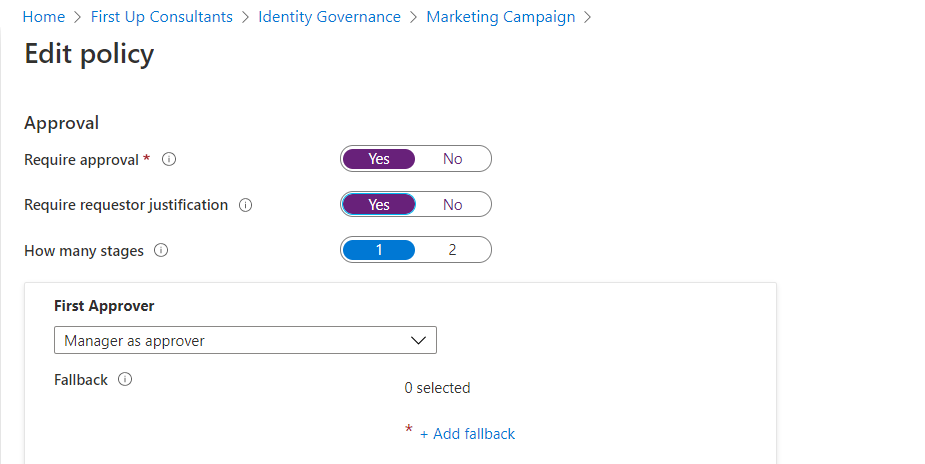
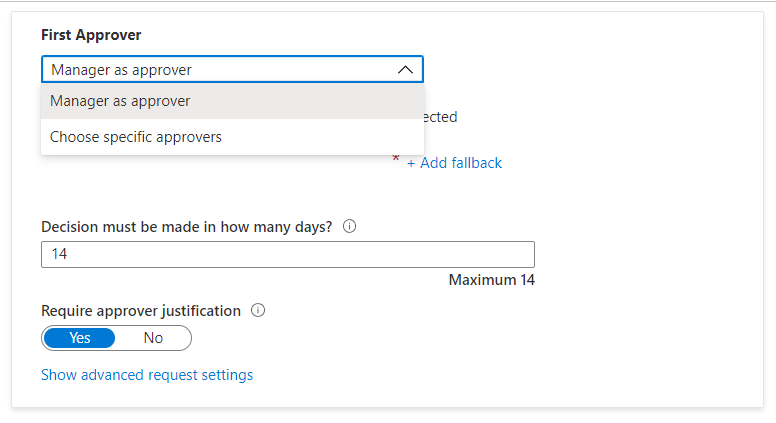
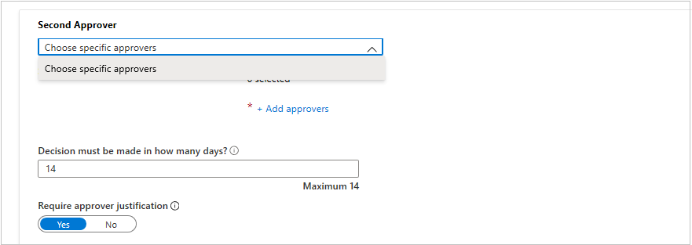
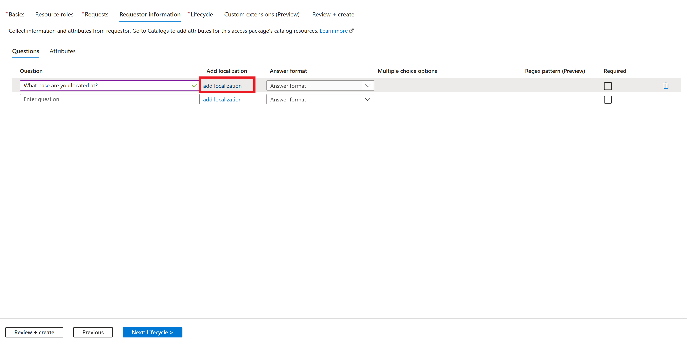
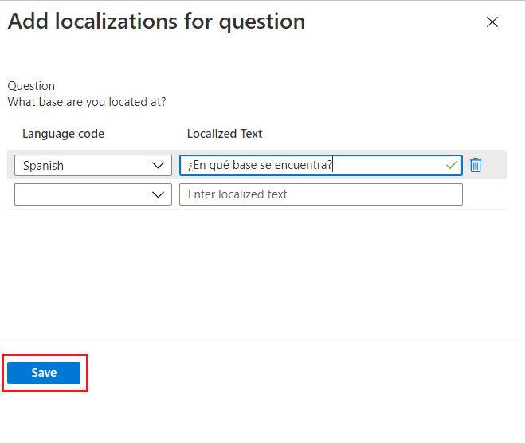

# Change approval and requestor information settings for an access package in Azure AD entitlement management

As an access package manager, you can change the approval and requestor information settings for an access package at any time by editing an existing policy or adding a new policy.

This article describes how to change the approval and requestor information settings for an existing access package.

## Approval

In the Approval section, you specify whether an approval is required when users request this access package. The approval settings work in the following way:

- Only one of the selected approvers or fallback approvers needs to approve a request for single-stage approval. 
- Only one of the selected approvers from each stage needs to approve a request for multi-stage approval for the request to progress to the next stage.
- If one of the selected approved in a stage denies a request before another approver in that stage approves it, or if no one approves, the request terminates and the user does not receive access.
- The approver can be a specified user or member of a group, the requestor's Manager, Internal sponsor, or External sponsor depending on who the policy is governing access.

For a demonstration of how to add approvers to a request policy, watch the following video:

>[!VIDEO https://www.microsoft.com/videoplayer/embed/RE4cZfg]

For a demonstration of how to add a multi-stage approval to a request policy, watch the following video:

>[!VIDEO https://www.microsoft.com/videoplayer/embed/RE4d1Jw]

## Change approval settings of an existing access package

Follow these steps to specify the approval settings for requests for the access package:

**Prerequisite role:** Global administrator, Identity Governance administrator, User administrator, Catalog owner, or Access package manager

1. In the Azure portal, click **Azure Active Directory** and then click **Identity Governance**.

1. In the left menu, click **Access packages** and then open the access package.

1. Either select a policy to edit or add a new policy to the access package
    1. Click **Policies** and then **Add policy** if you want to create a new policy.
    1. Click the policy you wish to edit and then click **edit**.

1. Go to the **Request** tab.

1. To require approval for requests from the selected users, set the **Require approval** toggle to **Yes**. Or, to have requests automatically approved, set the toggle to **No**.

1. To require users to provide a justification to request the access package, set the **Require requestor justification** toggle to **Yes**.
    
1. Now determine if requests will require single or multi-stage approval. Set the **How many stages** to the number of stages of approval needed.

    

Use the following steps to add approvers after selecting how many stages you require: 

### Single-stage approval

1. Add the **First Approver**:
    
    If the policy is set to govern access for users in your directory, you can select **Manager as approver**. Or, add a specific user by clicking **Add approvers** after selecting Choose specific approvers from the dropdown menu.
    
    

    If this policy is set to govern access for users not in your directory, you can select **External sponsor** or **Internal sponsor**. Or, add a specific user by clicking **Add approvers** or groups under Choose specific approvers.
    
    
    
1. If you selected **Manager** as the first approver, click **Add fallback** to select one or more users or groups in your directory to be a fallback approver. Fallback approvers receive the request if entitlement management can't find the manager for the user requesting access.

    The manager is found by entitlement management using the **Manager** attribute. The attribute is in the user's profile in Azure AD. For more information, see [Add or update a user's profile information using Azure Active Directory](../fundamentals/active-directory-users-profile-azure-portal.md).

1. If you selected **Choose specific approvers**, click **Add approvers** to select one or more users or groups in your directory to be approvers.

1. In the box under **Decision must be made in how many days?**, specify the number of days that an approver has to review a request for this access package.

    If a request isn't approved within this time period, it will be automatically denied. The user will have to submit another request for the access package.

1. To require approvers to provide a justification for their decision, set Require approver justification to **Yes**.

    The justification is visible to other approvers and the requestor.

### Multi-stage approval

If you selected a multi-stage approval, you'll need to add an approver for each additional stage.

1. Add the **Second Approver**: 
    
    If the users are in your directory, add a specific user as the second approver by clicking **Add approvers** under Choose specific approvers.

    

    If the users aren't in your directory, select **Internal sponsor** or **External sponsor** as the second approver. After selecting the approver, add the fallback approvers.

     

1. Specify the number of days the second approver has to approve the request in the box under **Decision must be made in how many days?**. 

1. Set the Require approver justification toggle to **Yes** or **No**.

### Alternate approvers

You can specify alternate approvers, similar to specifying the primary approvers who can approve requests on each stage. Having alternate approvers will help ensure that the requests are approved or denied before they expire (timeout). You can list alternate approvers alongside the primary approver on each stage.

By specifying alternate approvers on a stage, in the event that the primary approvers were unable to approve or deny the request, the pending request gets forwarded to the alternate approvers, per the forwarding schedule you specified during policy setup. They receive an email to approve or deny the pending request.

After the request is forwarded to the alternate approvers, the primary approvers can still approve or deny the request. Alternate approvers use the same My Access site to approve or deny the pending request.

You can list people or groups of people to be approvers and alternate approvers. Please ensure that you list different sets of people to be the first, second, and alternate approvers.
For example, if you listed Alice and Bob as the first stage approver(s), list Carol and Dave as the alternate approvers. Use the following steps to add alternate approvers to an access package:

1. Under the approver on a stage, click **Show advanced request settings**.

    :::image type="content" source="media/entitlement-management-access-package-approval-policy/alternate-approvers-click-advanced-request.png" alt-text="Access package - Policy - Show advanced request settings":::

1. Set **If no action taken, forward to alternate approvers?** toggle to **Yes**.

1. Click **Add alternate approvers** and select the alternate approver(s) from the list.

    

    If you select Manager as approver for the First Approver, you will have an additional option, **Second level manager as alternate approver**,  available to choose in the alternate approver field. If you select this option, you need to add a fallback approver to forward the request to in case the system can't find the second level manager.

1. In the **Forward to alternate approver(s) after how many days** box, put in the number of days the approvers have to approve or deny a request. If no approvers have approved or denied the request before the request duration, the request expires (timeout), and the user will have to submit another request for the access package. 

    Requests can only be forwarded to alternate approvers a day after the request duration reaches half-life, and the decision of the main approver(s) has to time-out after at least 4 days. If the request time-out is less or equal than 3, there is not enough time to forward the request to alternate approver(s). In this example, the duration of the request is 14 days. So, the request duration reaches half-life at day 7. So the request can't be forwarded earlier than day 8. Also, requests can't be forwarded on the last day of the request duration. So in the example, the latest the request can be forwarded is day 13.

## Enable requests

1. If you want the access package to be made immediately available for users in the request policy to request, move the Enable toggle to **Yes**.

    You can always enable it in the future after you have finished creating the access package.

    If you selected **None (administrator direct assignments only)** and you set enable to **No**, then administrators can't directly assign this access package.

    

1. Click **Next**.

## Collect additional requestor information for approval

In order to make sure users are getting access to the right access packages, you can require requestors to answer custom text field or multiple choice questions at the time of request. There is a limit of 20 questions per policy and a limit of 25 answers for multiple choice questions. The questions will then be shown to approvers to help them make a decision.

1. Go to the **Requestor information** tab and click the **Questions** sub tab.
 
1. Type in what you want to ask the requestor, also known as the display string, for the question in the **Question** box.

    

1. If the community of users who will need access to the access package don't all have a common preferred language, then you can improve the experience for users requesting access on myaccess.microsoft.com. To improve the experience, you can provide alternative display strings for different languages. For example, if a user's web browser is set to Spanish, and you have Spanish display strings configured, then those strings will be displayed to the requesting user. To configure localization for requests, click **add localization**.
    1. Once in the **Add localizations for question** pane, select the **language code** for the language in which you are localizing the question.
    1. In the language you configured, type the question in the **Localized Text** box.
    1. Once you have added all the localizations needed, click **Save**.

    

1. Select the **Answer format** in which you would like requestors to answer. Answer formats include: *short text*, *multiple choice*, and *long text*.
 
    
 
1. If selecting multiple choice, click on the **Edit and localize** button to configure the answer options.
    1. After selecting Edit and localize the **View/edit question** pane will open.
    1. Type in the response options you wish to give the requestor when answering the question in the **Answer values** boxes.
    1. Type in as many responses as you need.
    1. If you would like to add your own localization for the multiple choice options, select the **Optional language code** for the language in which you want to localize a specific option.
    1. In the language you configured, type the option in the Localized text box.
    1. Once you have added all of the localizations needed for each multiple choice option, click **Save**.
    
    
  
1. To require requestors to answer this question when requesting access to an access package, click the check box under **Required**.

1. Fill out the remaining tabs (e.g., Lifecycle) based on your needs.

After you have configured requestor information in your access package policy, can view the requestor's responses to the questions. For guidance on seeing requestor information, see [View requestor's answers to questions](entitlement-management-request-approve.md#view-requestors-answers-to-questions).

## Next steps
- [Change lifecycle settings for an access package](entitlement-management-access-package-lifecycle-policy.md)
- [View requests for an access package](entitlement-management-access-package-requests.md)
