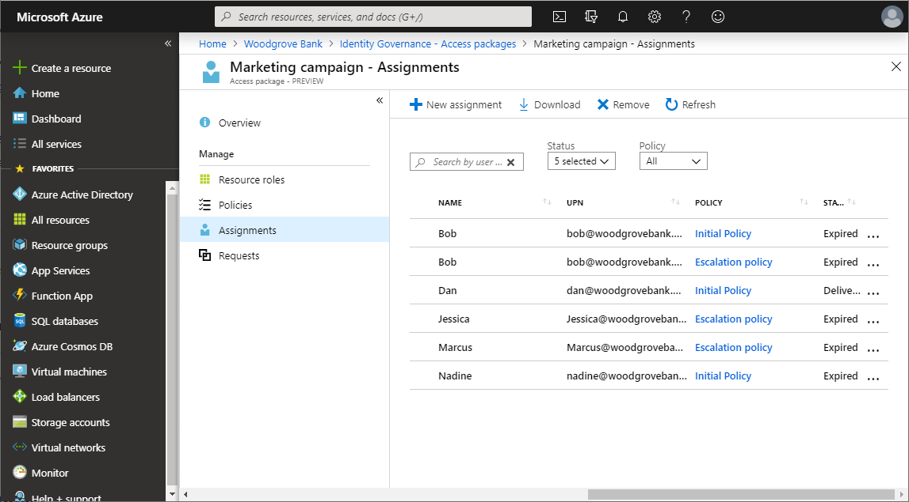
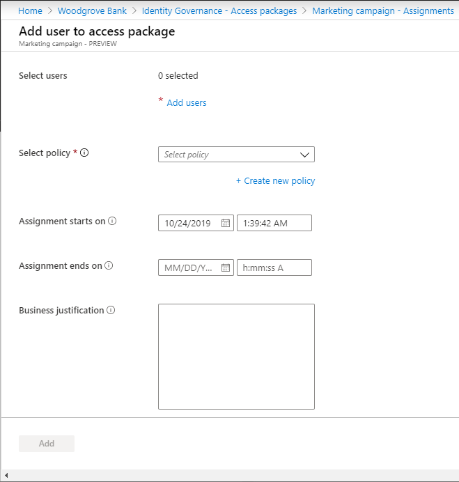
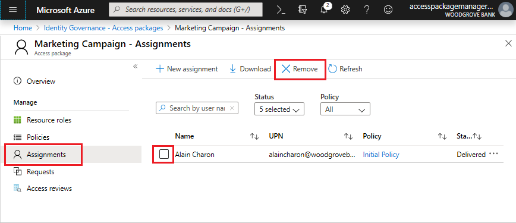

# View, add, and remove assignments for an access package in Azure AD entitlement management

In Azure AD entitlement management, you can see who has been assigned to access packages, their policy, and status. If an access package has an appropriate policy, you can also directly assign user to an access package. This article describes how to view, add, and remove assignments for access packages.

## Prerequisites

To use Azure AD entitlement management and assign users to access packages, you must have one of the following licenses:

- Azure AD Premium P2
- Enterprise Mobility + Security (EMS) E5 license

## View who has an assignment

**Prerequisite role:** Global administrator, User administrator, Catalog owner, Access package manager or Access package assignment manager

1. In the Azure portal, click **Azure Active Directory** and then click **Identity Governance**.

1. In the left menu, click **Access packages** and then open the access package.

1. Click **Assignments** to see a list of active assignments.

    

1. Click a specific assignment to see additional details.

1. To see a list of assignments that did not have all resource roles properly provisioned, click the filter status and select **Delivering**.

    You can see additional details on delivery errors by locating the user's corresponding request on the **Requests** page.

1. To see expired assignments, click the filter status and select **Expired**.

1. To download a CSV file of the filtered list, click **Download**.

### Viewing assignments programmatically

You can also retrieve assignments in an access package using Microsoft Graph.  A user in an appropriate role with an application that has the delegated `EntitlementManagement.ReadWrite.All` permission can call the API to [list accessPackageAssignments](/graph/api/accesspackageassignment-list?view=graph-rest-beta&preserve-view=true).

## Directly assign a user

In some cases, you might want to directly assign specific users to an access package so that users don't have to go through the process of requesting the access package. To directly assign users, the access package must have a policy that allows administrator direct assignments.

**Prerequisite role:** Global administrator, User administrator, Catalog owner, Access package manager or Access package assignment manager

1. In the Azure portal, click **Azure Active Directory** and then click **Identity Governance**.

1. In the left menu, click **Access packages** and then open the access package.

1. In the left menu, click **Assignments**.

1. Click **New assignment** to open Add user to access package.

    

1. Click **Add users** to select the users you want to assign this access package to.

1. In the **Select policy** list, select a policy that the users' future requests and lifecycle will be governed and tracked by. If you want the selected users to have different policy settings, you can click **Create new policy** to add a new policy.

1. Set the date and time you want the selected users' assignment to start and end. If an end date is not provided, the policy's lifecycle settings will be used.

1. Optionally provide a justification for your direct assignment for record keeping.

1. Click **Add** to directly assign the selected users to the access package.

    After a few moments, click **Refresh** to see the users in the Assignments list.

### Directly assigning users programmatically

You can also directly assign a user to an access package using Microsoft Graph.  A user in an appropriate role with an application that has the delegated `EntitlementManagement.ReadWrite.All` permission can call the API to [create an accessPackageAssignmentRequest](/graph/api/accesspackageassignmentrequest-post?view=graph-rest-beta&preserve-view=true).

## Remove an assignment

**Prerequisite role:** Global administrator, User administrator, Catalog owner, Access package manager or Access package assignment manager

1. In the Azure portal, click **Azure Active Directory** and then click **Identity Governance**.

1. In the left menu, click **Access packages** and then open the access package.

1. In the left menu, click **Assignments**.
 
1. Click the check box next to the user whose assignment you want to remove from the access package. 

1. Click the **Remove** button near the top of the left pane. 
 
    

    A notification will appear informing you that the assignment has been removed. 

## Next steps

- [Change request and settings for an access package](entitlement-management-access-package-request-policy.md)
- [View reports and logs](entitlement-management-reports.md)