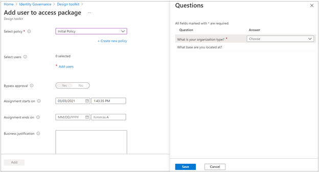
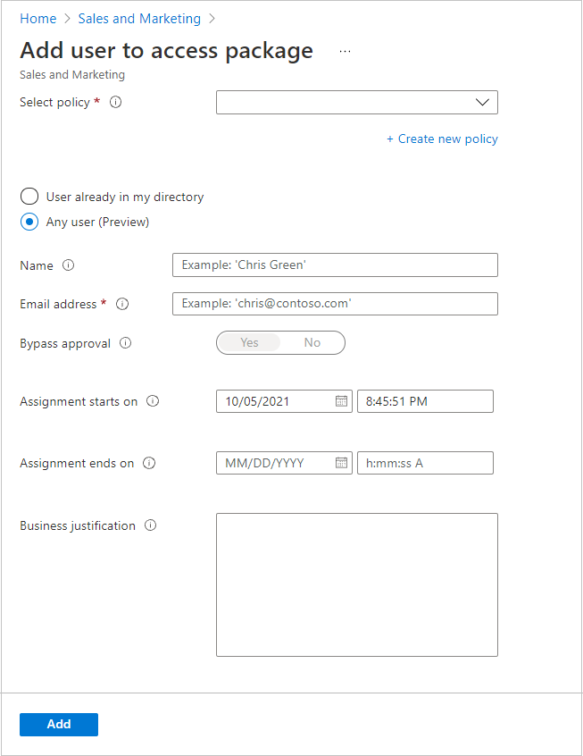

# View, add, and remove assignments for an access package in entitlement management

In entitlement management, you can see who has been assigned to access packages, their policy, status, and user lifecycle (preview). If an access package has an appropriate policy, you can also directly assign user to an access package. This article describes how to view, add, and remove assignments for access packages.

## Prerequisites

To use entitlement management and assign users to access packages, you must have one of the following licenses:


- Azure AD Premium P2
- Enterprise Mobility + Security (EMS) E5 license
- Microsoft Entra ID governance subscription

## View who has an assignment

[!INCLUDE [portal updates](~/articles/active-directory/includes/portal-update.md)]

**Prerequisite role:** Global Administrator, Identity Governance Administrator, Catalog owner, Access package manager or Access package assignment manager

1. Sign in to the [Microsoft Entra admin center](https://entra.microsoft.com) as at least an [Identity Governance Administrator](../roles/permissions-reference.md#identity-governance-administrator).

1. Browse to **Identity governance** > **Entitlement management** > **Access package**.

1. On the **Access packages** page open an access package.

1. Select **Assignments** to see a list of active assignments.

    

1. Select a specific assignment to see more details.

1. To see a list of assignments that didn't have all resource roles properly provisioned, select the filter status and select **Delivering**.

    You can see additional details on delivery errors by locating the user's corresponding request on the **Requests** page.

1. To see expired assignments, select the filter status and select **Expired**.

1. To download a CSV file of the filtered list, select **Download**.

## View assignments programmatically
### View assignments with Microsoft Graph
You can also retrieve assignments in an access package using Microsoft Graph.  A user in an appropriate role with an application that has the delegated `EntitlementManagement.Read.All` or `EntitlementManagement.ReadWrite.All` permission can call the API to [list accessPackageAssignments](/graph/api/entitlementmanagement-list-accesspackageassignments?view=graph-rest-beta&preserve-view=true). While an identity governance administrator can retrieve access packages from multiple catalogs, if user or application service principal is assigned only to catalog-specific delegated administrative roles, the request must supply a filter to indicate a specific access package, such as: `$filter=accessPackage/id eq 'a914b616-e04e-476b-aa37-91038f0b165b'`. An application that has the application permission `EntitlementManagement.Read.All` or `EntitlementManagement.ReadWrite.All` permission can also use this API to retrieve assignments across all catalogs.

### View assignments with PowerShell

You can perform this query in PowerShell with the `Get-MgEntitlementManagementAssignment` cmdlet from the [Microsoft Graph PowerShell cmdlets for Identity Governance](https://www.powershellgallery.com/packages/Microsoft.Graph.Identity.Governance/) module version 2.1.x or later module version.  This script illustrates using the Microsoft Graph PowerShell cmdlets module version 2.4.0. This cmdlet takes as a parameter the access package ID, which is included in the response from the `Get-MgEntitlementManagementAccessPackage` cmdlet.

```powershell
Connect-MgGraph -Scopes "EntitlementManagement.Read.All"
$accesspackage = Get-MgEntitlementManagementAccessPackage -Filter "displayName eq 'Marketing Campaign'"
$assignments = Get-MgEntitlementManagementAssignment -AccessPackageId $accesspackage.Id -ExpandProperty target -All -ErrorAction Stop
$assignments | ft Id,state,{$_.Target.id},{$_.Target.displayName}
```

## Directly assign a user 

In some cases, you might want to directly assign specific users to an access package so that users don't have to go through the process of requesting the access package. To directly assign users, the access package must have a policy that allows administrator direct assignments.

**Prerequisite role:** Global Administrator, Identity Governance Administrator, Catalog owner, Access package manager or Access package assignment manager

1. Sign in to the [Microsoft Entra admin center](https://entra.microsoft.com) as at least an [Identity Governance Administrator](../roles/permissions-reference.md#identity-governance-administrator).

1. Browse to **Identity governance** > **Entitlement management** > **Access package**.

1. On the **Access packages** page open an access package.

1. In the left menu, select **Assignments**.

1. Select **New assignment** to open Add user to access package.

    

1. In the **Select policy** list, select a policy that the users' future requests and lifecycle will be governed and tracked by. If you want the selected users to have different policy settings, you can select **Create new policy** to add a new policy.

1. Once you select a policy, you’ll be able to Add users to select the users you want to assign this access package to, under the chosen policy.

    > [!NOTE]
    > If you select a policy with questions, you can only assign one user at a time.

1. Set the date and time you want the selected users' assignment to start and end. If an end date isn't provided, the policy's lifecycle settings will be used.

1. Optionally provide a justification for your direct assignment for record keeping.

1. If the selected policy includes additional requestor information, select **View questions** to answer them on behalf of the users, then select **Save**.  

     

    

1. Select **Add** to directly assign the selected users to the access package.

    After a few moments, select **Refresh** to see the users in the Assignments list.
    
> [!NOTE]
> When assigning users to an access package, administrators will need to verify that the users are eligible for that access package based on the existing policy requirements. Otherwise, the users won't successfully be assigned to the access package. If the access package contains a policy that requires user requests to be approved, users can't be directly assigned to the package without necessary approval(s) from the designated approver(s).

## Directly assign any user (Preview)

Entitlement management also allows you to directly assign external users to an access package to make collaborating with partners easier. To do this, the access package must have a policy that allows users not yet in your directory to request access.

**Prerequisite role:** Global Administrator, Identity Governance Administrator, Catalog owner, Access package manager or Access package assignment manager

1. Sign in to the [Microsoft Entra admin center](https://entra.microsoft.com) as at least an [Identity Governance Administrator](../roles/permissions-reference.md#identity-governance-administrator).

1. Browse to **Identity governance** > **Entitlement management** > **Access package**.

1. On the **Access packages** page open an access package.

1. In the left menu, select **Assignments**.

1. Select **New assignment** to open **Add user to access package**.

1. In the **Select policy** list, select a policy that allows that is set to **For users not in your directory**

1. Select **Any user**. You’ll be able to specify which users you want to assign to this access package.
    

1. Enter the user’s **Name** (optional) and the user’s **Email address** (required).

    > [!NOTE]
    > - The user you want to add must be within the scope of the policy. For example, if your policy is set to **Specific connected organizations**, the user’s email address must be from the domain(s) of the selected organization(s). If the user you are trying to add has an email address of jen@*foo.com* but the selected organization’s domain is *bar.com*, you won't be able to add that user to the access package.
    > - Similarly, if you set your policy to include **All configured connected organizations**, the user’s email address must be from one of your configured connected organizations. Otherwise, the user won't be added to the access package.
    > - If you wish to add any user to the access package, you'll need to ensure that you select **All users (All connected organizations + any external user)** when configuring your policy.

1. Set the date and time you want the selected users' assignment to start and end. If an end date isn't provided, the policy's lifecycle settings will be used.
1. Select **Add** to directly assign the selected users to the access package.
1. After a few moments, select **Refresh** to see the users in the Assignments list.

## Directly assigning users programmatically
### Assign a user to an access package with Microsoft Graph
You can also directly assign a user to an access package using Microsoft Graph.  A user in an appropriate role with an application that has the delegated `EntitlementManagement.ReadWrite.All` permission, or an application with that application permission, can call the API to [create an accessPackageAssignmentRequest](/graph/api/entitlementmanagement-post-accesspackageassignmentrequests?view=graph-rest-beta&preserve-view=true). In this request, the value of the `requestType` property should be `AdminAdd`, and the `accessPackageAssignment` property is a structure that contains the `targetId` of the user being assigned.

### Assign a user to an access package with PowerShell

You can assign a user to an access package in PowerShell with the `New-MgEntitlementManagementAssignmentRequest` cmdlet from the [Microsoft Graph PowerShell cmdlets for Identity Governance](https://www.powershellgallery.com/packages/Microsoft.Graph.Identity.Governance/) module version 2.1.x or later module version.  This script illustrates using the Microsoft Graph PowerShell cmdlets module version 2.4.0.

```powershell
Connect-MgGraph -Scopes "EntitlementManagement.ReadWrite.All"
$accesspackage = Get-MgEntitlementManagementAccessPackage -Filter "displayname eq 'Marketing Campaign'" -ExpandProperty assignmentpolicies
$policy = $accesspackage.AssignmentPolicies[0]
$userid = "cdbdf152-82ce-479c-b5b8-df90f561d5c7"
$params = @{
   requestType = "adminAdd"
   assignment = @{
      targetId = $userid
      assignmentPolicyId = $policy.Id
      accessPackageId = $accesspackage.Id
   }
}
New-MgEntitlementManagementAssignmentRequest -BodyParameter $params
```

You can also assign multiple users that are in your directory to an access package using PowerShell with the `New-MgBetaEntitlementManagementAccessPackageAssignment` cmdlet from the [Microsoft Graph PowerShell cmdlets for Identity Governance](https://www.powershellgallery.com/packages/Microsoft.Graph.Identity.Governance/) module version 2.4.0 or later. This cmdlet takes as parameters
* the access package ID, which is included in the response from the `Get-MgEntitlementManagementAccessPackage` cmdlet,
* the access package assignment policy ID, which is included in the response from the `Get-MgEntitlementManagementAccessPackageAssignmentPolicy`cmdlet,
* the object IDs of the target users, either as an array of strings, or as a list of user members returned from the `Get-MgGroupMember` cmdlet.

For example, if you want to ensure all the users who are currently members of a group also have assignments to an access package, you can use this cmdlet to create requests for those users who don't currently have assignments.  Note that this cmdlet will only create assignments; it doesn't remove assignments for users who are no longer members of a group.

```powershell
Connect-MgGraph -Scopes "EntitlementManagement.ReadWrite.All,Directory.Read.All"
$members = Get-MgGroupMember -GroupId "a34abd69-6bf8-4abd-ab6b-78218b77dc15" -All

$accesspackage = Get-MgEntitlementManagementAccessPackage -Filter "displayname eq 'Marketing Campaign'" -ExpandProperty "assignmentPolicies"
$policy = $accesspackage.AssignmentPolicies[0]
$req = New-MgBetaEntitlementManagementAccessPackageAssignment -AccessPackageId $accesspackage.Id -AssignmentPolicyId $policy.Id -RequiredGroupMember $members
```

If you wish to add an assignment for a user who is not yet in your directory, you can use the `New-MgBetaEntitlementManagementAccessPackageAssignmentRequest` cmdlet from the [Microsoft Graph PowerShell cmdlets for Identity Governance](https://www.powershellgallery.com/packages/Microsoft.Graph.Identity.Governance/) beta module version 2.1.x or later beta module version.  This script illustrates using the Graph `beta` profile and Microsoft Graph PowerShell cmdlets module version 2.4.0. This cmdlet takes as parameters
* the access package ID, which is included in the response from the `Get-MgEntitlementManagementAccessPackage` cmdlet,
* the access package assignment policy ID, which is included in the response from the `Get-MgEntitlementManagementAccessPackageAssignmentPolicy`cmdlet,
* the email address of the target user.

```powershell
Connect-MgGraph -Scopes "EntitlementManagement.ReadWrite.All"
$accesspackage = Get-MgEntitlementManagementAccessPackage -Filter "displayname eq 'Marketing Campaign'" -ExpandProperty "assignmentPolicies"
$policy = $accesspackage.AssignmentPolicies[0]
$req = New-MgBetaEntitlementManagementAccessPackageAssignmentRequest -AccessPackageId $accesspackage.Id -AssignmentPolicyId $policy.Id -TargetEmail "sample@example.com"
```

## Remove an assignment

You can remove an assignment that a user or an administrator had previously requested.

**Prerequisite role:** Global Administrator, Identity Governance Administrator, Catalog owner, Access package manager or Access package assignment manager

1. Sign in to the [Microsoft Entra admin center](https://entra.microsoft.com) as at least an [Identity Governance Administrator](../roles/permissions-reference.md#identity-governance-administrator).

1. Browse to **Identity governance** > **Entitlement management** > **Access package**.

1. On the **Access packages** page open an access package.

1. In the left menu, select **Assignments**.
 
1. Select the check box next to the user whose assignment you want to remove from the access package. 

1. Select the **Remove** button near the top of the left pane. 
 
    

    A notification will appear informing you that the assignment has been removed. 

## Remove an assignment programmatically
### Remove an assignment with Microsoft Graph
You can also remove an assignment of a user to an access package using Microsoft Graph.  A user in an appropriate role with an application that has the delegated `EntitlementManagement.ReadWrite.All` permission, or an application with that application permission, can call the API to [create an accessPackageAssignmentRequest](/graph/api/entitlementmanagement-post-accesspackageassignmentrequests?view=graph-rest-beta&preserve-view=true).  In this request, the value of the `requestType` property should be `AdminRemove`, and the `accessPackageAssignment` property is a structure that contains the `id` property identifying the `accessPackageAssignment` being removed.

### Remove an assignment with PowerShell

You can remove a user's assignment in PowerShell with the `New-MgEntitlementManagementAssignmentRequest` cmdlet from the [Microsoft Graph PowerShell cmdlets for Identity Governance](https://www.powershellgallery.com/packages/Microsoft.Graph.Identity.Governance/) module version 2.1.x or later module version.  This script illustrates using the Microsoft Graph PowerShell cmdlets module version 2.4.0.

```powershell
Connect-MgGraph -Scopes "EntitlementManagement.ReadWrite.All"
$accessPackageId = "9f573551-f8e2-48f4-bf48-06efbb37c7b8"
$userId = "040a792f-4c5f-4395-902f-f0d9d192ab2c"
$filter = "accessPackage/Id eq '" + $accessPackageId + "' and state eq 'Delivered' and target/objectId eq '" + $userId + "'"
$assignment = Get-MgEntitlementManagementAssignment -Filter $filter -ExpandProperty target -all -ErrorAction stop
if ($assignment -ne $null) {
   $params = @{
      requestType = "adminRemove"
      assignment = @{ id = $assignment.id }
   }
   New-MgEntitlementManagementAssignmentRequest -BodyParameter $params
}
```

## Next steps

- [Change request and settings for an access package](entitlement-management-access-package-request-policy.md)
- [View reports and logs](entitlement-management-reports.md)