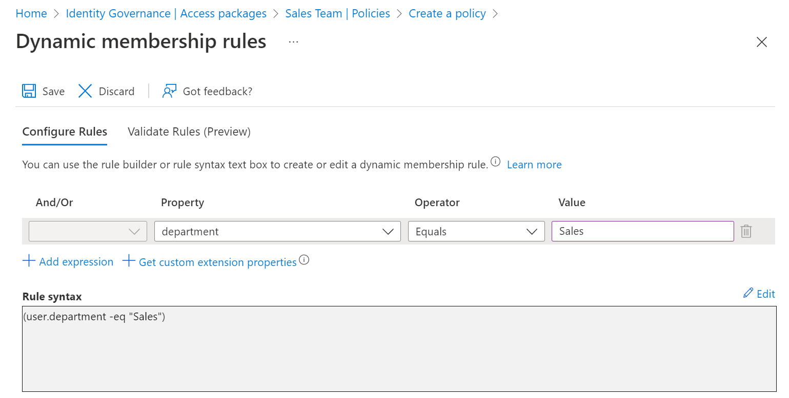
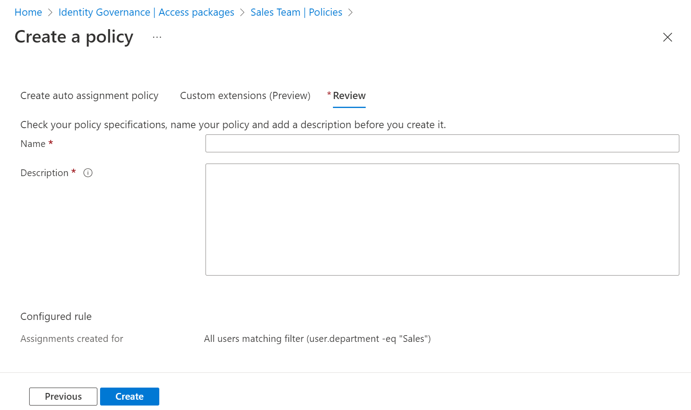

# Configure an automatic assignment policy for an access package in entitlement management

You can use rules to determine access package assignment based on user properties in Azure Active Directory (Azure AD), part of Microsoft Entra.  In Entitlement Management, an access package can have multiple policies, and each policy establishes how users get an assignment to the access package, and for how long.  As an administrator, you can establish a policy for automatic assignments by supplying a membership rule, that Entitlement Management will follow to create and remove assignments automatically.  Similar to a [dynamic group](../enterprise-users/groups-create-rule.md), when an automatic assignment policy is created, user attributes are evaluated for matches with the policy's membership rule. When an attribute changes for a user, these automatic assignment policy rules in the access packages are processed for membership changes. Assignments to users are then added or removed depending on whether they meet the rule criteria.

You can have at most one automatic assignment policy in an access package, and the policy can only be created by an administrator.  (Catalog owners and access package managers cannot create automatic assignment policies.)

This article describes how to create an access package automatic assignment policy for an existing access package.

## Before you begin

You'll need to have attributes populated on the users who will be in scope for being assigned access.  The attributes you can use in the rules criteria of an access package assignment policy are those attributes listed in [supported properties](../enterprise-users/groups-dynamic-membership.md#supported-properties), along with [extension attributes and custom extension properties](../enterprise-users/groups-dynamic-membership.md#extension-properties-and-custom-extension-properties).  These attributes can be brought into Azure AD from [Graph](/graph/api/resources/user), an HR system such as [SuccessFactors](../app-provisioning/sap-successfactors-integration-reference.md), [Azure AD Connect cloud sync](../cloud-sync/how-to-attribute-mapping.md) or [Azure AD Connect sync](../hybrid/how-to-connect-sync-feature-directory-extensions.md).  The rules can include up to 5000 users per policy.

## License requirements

[!INCLUDE [active-directory-entra-governance-license.md](../../../includes/active-directory-entra-governance-license.md)]

## Create an automatic assignment policy

To create a policy for an access package, you need to start from the access package's policy tab. Follow these steps to create a new policy for an access package.

**Prerequisite role:** Global administrator or Identity Governance administrator

1. In the Azure portal, click **Azure Active Directory** and then click **Identity Governance**.

1. In the left menu, click **Access packages** and then open the access package.

1. Click **Policies** and then **Add auto-assignment policy** to create a new policy.

1. In the first tab, you'll specify the rule.  Click **Edit**.

1. Provide a dynamic membership rule, using the [membership rule builder](../enterprise-users/groups-dynamic-membership.md) or by clicking **Edit** on the rule syntax text box.

   > [!NOTE]
   > The rule builder might not be able to display some rules constructed in the text box, and validating a rule currently requires the you to be in the Global administrator role. For more information, see [rule builder in the Azure portal](../enterprise-users/groups-create-rule.md#rule-builder-in-the-azure-portal).

    

1. Click **Save** to close the dynamic membership rule editor, then click **Next** to open the **Custom Extensions** tab.

1. If you have [custom extensions](entitlement-management-logic-apps-integration.md) in your catalog you wish to have run when the policy assigns or removes access, you can add them to this policy.  Then click next to open the **Review** tab.

1. Type a name and a description for the policy.

    

1. Click **Create** to save the policy.

   > [!NOTE]
   > At this time, Entitlement management will automatically create a dynamic security group corresponding to each policy, in order to evaluate the users in scope. This group should not be modified except by Entitlement Management itself.  This group may also be modified or deleted automatically by Entitlement Management, so don't use this group for other applications or scenarios.

1. Azure AD will evaluate the users in the organization that are in scope of this rule, and create assignments for those users who don't already have assignments to the access package. A policy can include at most 5000 users in its rule. It may take several minutes for the evaluation to occur, or for subsequent updates to user's attributes to be reflected in the access package assignments.

## Create an automatic assignment policy programmatically

There are two ways to create an access package assignment policy for automatic assignment programmatically, through Microsoft Graph and through the PowerShell cmdlets for Microsoft Graph.

### Create an access package assignment policy through Graph

You can create a policy using Microsoft Graph. A user in an appropriate role with an application that has the delegated `EntitlementManagement.ReadWrite.All` permission, or an application in a catalog role or with the `EntitlementManagement.ReadWrite.All` permission, can call the [create an accessPackageAssignmentPolicy](/graph/api/entitlementmanagement-post-assignmentpolicies?tabs=http&view=graph-rest-1.0&preserve-view=true) API. In your [request payload](/graph/api/resources/accesspackageassignmentpolicy?view=graph-rest-1.0&preserve-view=true), include the `displayName`, `description`, `specificAllowedTargets`, [`automaticRequestSettings`](/graph/api/resources/accesspackageautomaticrequestsettings?view=graph-rest-1.0&preserve-view=true) and `accessPackage` properties of the policy.

### Create an access package assignment policy through PowerShell

You can also create a policy in PowerShell with the cmdlets from the [Microsoft Graph PowerShell cmdlets for Identity Governance](https://www.powershellgallery.com/packages/Microsoft.Graph.Identity.Governance/) module version 1.16.0 or later.

This script below illustrates using the `v1.0` profile, to create a policy for automatic assignment to an access package.  See [create an accessPackageAssignmentPolicy](/graph/api/entitlementmanagement-post-assignmentpolicies?tabs=http&view=graph-rest-v1.0&preserve-view=true) for more examples.

```powershell
Connect-MgGraph -Scopes "EntitlementManagement.ReadWrite.All"

$apid = "cdd5f06b-752a-4c9f-97a6-82f4eda6c76d"

$pparams = @{
	DisplayName = "Sales department users"
	Description = "All users from sales department"
	AllowedTargetScope = "specificDirectoryUsers"
	SpecificAllowedTargets = @( @{
        "@odata.type" = "#microsoft.graph.attributeRuleMembers"
        description = "All users from sales department"
        membershipRule = '(user.department -eq "Sales")'
	} )
	AutomaticRequestSettings = @{
        RequestAccessForAllowedTargets = $true
	}
    AccessPackage = @{
      Id = $apid
    }
}
New-MgEntitlementManagementAssignmentPolicy -BodyParameter $pparams
```

## Next steps

- [View assignments for an access package](entitlement-management-access-package-assignments.md)
