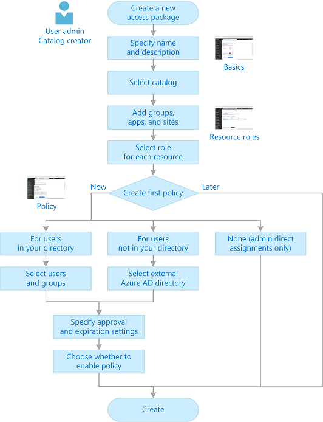
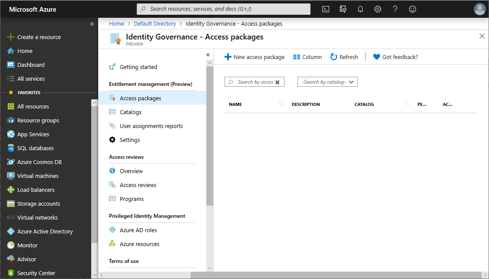
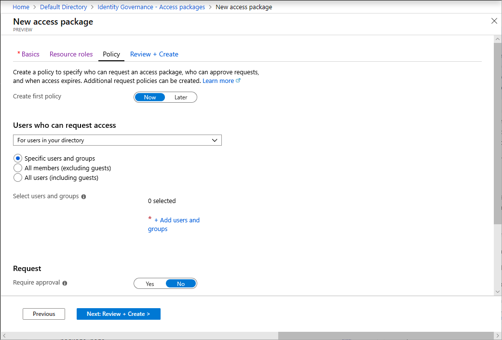

# Create a new access package in Azure AD entitlement management (Preview)

> [!IMPORTANT]
> Azure Active Directory (Azure AD) entitlement management is currently in public preview.
> This preview version is provided without a service level agreement, and it's not recommended for production workloads. Certain features might not be supported or might have constrained capabilities.
> For more information, see [Supplemental Terms of Use for Microsoft Azure Previews](https://azure.microsoft.com/support/legal/preview-supplemental-terms/).

An access package enables you to do a one-time setup of resources and policies that automatically administers access for the life of the access package. This article describes how to create a new access package.

## Overview

All access packages must be put in a container called a catalog. A catalog defines what resources you can add to your access package. If you don't specify a catalog, your access package will be put into the General catalog. Currently, you can't move an existing access package to a different catalog.

All access packages must have at least one policy. Policies specify who can request the access package and also approval and expiration settings. When you create a new access package, you can create an initial policy for users in your directory, for users not in your directory, for administrator direct assignments only, or you can choose to create the policy later.

The following diagram shows the high-level process to create a new access package.

## Start new access package

**Prerequisite role:** User administrator or Catalog owner

1. Sign in to the [Azure portal](https://portal.azure.com).

1. Click **Azure Active Directory** and then click **Identity Governance**.

1. In the left menu, click **Access packages**.

    

1. Click **New access package**.

## Basics

On the **Basics** tab, you give the access package a name and specify which catalog to create the access package in.

1. Enter a display name and description for the access package. Users will see this information when they submit a request for the access package.

1. In the **Catalog** drop-down list, select the catalog you want to create the access package in. For example, you might have a catalog owner that manages all the marketing resources that can be requested. In this case, you could select the marketing catalog.

    You will only see catalogs you have permission to create access packages in. To create access package in an existing catalog, you must be at least a User administrator, catalog owner, or access package manager.

    

    If you would like to create your access package in a new catalog, click **Create new**. Enter the Catalog name and description and then click **Create**.

    The access package you are creating and any resources included in it will be added to the new catalog. Additionally, you will automatically become the first owner of the catalog. You can add additional catalog owners.

    To create a new catalog, you must be at least a User administrator or Catalog creator.

1. Click **Next**.

## Resource roles

On the **Resource roles** tab, you select the resources to include in the access package.

1. Click the resource type you want to add (**Groups**, **Applications**, or **SharePoint sites**).

1. In the Select pane that appears, select one or more resources from the list.

    

    If you are creating the access package in the General catalog or a new catalog, you will be able to pick any resource from the directory that you own. You must be at least a User administrator or Catalog creator.

    If you are creating the access package in an existing catalog, you can select any resource that is already in the catalog without owning it.

    If you are a User administrator or catalog owner, you have the additional option of selecting resources you own that are not yet in the catalog. If you select resources not currently in the selected catalog, these resources will also be added to the catalog for other catalog administrators to build access packages with. If you only want to select resources that are currently in the selected catalog, check the **Only see** check box at the top of the Select pan.

1. Once you have selected the resources, in the **Role** list, select the role you want users to be assigned for the resource.

    

1. Click **Next**.

## Policy

On the **Policy** tab, you create the first policy to specify who can request the access package and also approval and expiration settings. Later, you can create more policies to allow additional groups of users to request the access package with their own approval and expiration settings. You can also choose to create the policy later.

1. Set the **Create first policy** toggle to **Now** or **Later**.

    

1. If you select **Later**, skip down to the [Review + create](#review--create) section to create your access package.

1. If you select **Now**, perform the steps in one of the following policy sections.

[!INCLUDE [Entitlement management policy](../../../includes/active-directory-entitlement-management-policy.md)]

## Review + create

On the **Review + create** tab, you can review your settings and check for any validation errors.

1. Review the access package's settings

    

1. Click **Create** to create the access package.

    The new access package appears in the list of access packages.

## Next steps

- [Edit and manage an existing access package](entitlement-management-access-package-edit.md)
- [Add a catalog owner or an access package manager](entitlement-management-delegate.md#add-a-catalog-owner-or-an-access-package-manager)
- [Create and manage a catalog](entitlement-management-catalog-create.md)
