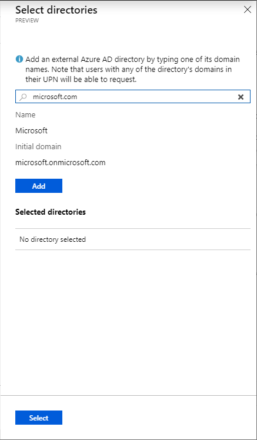

# Create a new access package in Azure AD entitlement management (Preview)

> [!IMPORTANT]
> Azure Active Directory (Azure AD) entitlement management is currently in public preview.
> This preview version is provided without a service level agreement, and it's not recommended for production workloads. Certain features might not be supported or might have constrained capabilities.
> For more information, see [Supplemental Terms of Use for Microsoft Azure Previews](https://azure.microsoft.com/support/legal/preview-supplemental-terms/).

An access package enables you to do a one-time setup of resources and policies that automatically administers access for the life of the access package. This article describes how to create a new access package.

## Overview

All access packages must be put in a container called a catalog. A catalog defines what resources you can add to your access package. If you don't specify a catalog, your access package will be put into the Default Catalog. Currently, you can't move an existing access package to a different catalog.

All access packages must have at least one policy. Policies specify who can request the access package and also approval and expiration settings. When you create a new access package, you can create an initial policy for users in your directory, for users not in your directory, for administrator direct assignments only, or you can choose to create the policy later.

The following diagram shows the high-level process to create a new access package.

## Start new access package

**Prerequisite role:** User administrator or Catalog owner

1. Sign in to the [Azure portal](https://portal.azure.com).

1. Open the **Entitlement management** page at [https://aka.ms/elm](https://aka.ms/elm).

1. In the left menu, click **Access packages**.

    

1. Click **New access package**.

## Basics

On the **Basics** tab, you give the access package a name and specify which catalog to create the access package in.

1. Enter a display name and description for the access package. Users will see this information when they submit a request for the access package.

1. In the **Catalog** drop-down list, select the catalog you want to create the access package in. For example, you might have a catalog owner that manages all the marketing resources that can be requested. In this case, you could select the marketing catalog.

    You will only see catalogs you have permission to create access packages in. To create access package in an existing catalog, you must be at least a User administrator, Catalog owner, or Access package manager.

    

    If you would like to create your access package in a new catalog, click **Create new**. Enter the Catalog name and description and then click **Create**.

    The access package you are creating and any resources included in it will be added to the new catalog. Additionally, you will automatically become the first owner of the catalog. You can add additional catalog owners.

    To create a new catalog, you must be at least a User administrator or Catalog creator.

1. Click **Next**.

## Resource roles

On the **Resource roles** tab, you select the resources to include in the access package.

1. Click the resource type you want to add (**Groups**, **Applications**, or **SharePoint sites**).

1. In the Select pane that appears, select one or more resources from the list.

    

    If you are creating the access package in the Default Catalog or a new catalog, you will be able to pick any resource from the directory that you own. You must be at least a User administrator or Catalog creator.

    If you are creating the access package in an existing catalog, you can select any resource that is already in the catalog without owning it.

    If you are a User administrator or Catalog Owner, you have the additional option of selecting resources you own that are not yet in the catalog. If you select resources not currently in the selected catalog, these resources will also be added to the catalog for other catalog administrators to build access packages with. If you only want to select resources that are currently in the selected catalog, check the **Only see** check box at the top of the Select pan.

1. Once you have selected the resources, in the **Role** list, select the role you want users to be assigned for the resource.

    

1. Click **Next**.

## Policy

On the **Policy** tab, you create the first policy to specify who can request the access package and also approval and expiration settings. Later, you can create more policies to allow additional groups of users to request the access package with their own approval and expiration settings. You can also choose to create the policy later.

1. Set the **Create first policy** toggle to **Now** or **Later**.

    

1. If you select **Later**, skip down to the [Review + create](#review--create) section to create your access package.

1. If you select **Now**, perform the steps in one of the following policy sections.

### Policy: For users in your directory

Follow these steps if you want your policy to be for users and groups in your directory that can request this access package.

1. In the **Users who can request access** section, select **For users in your directory**.

1. In the **Select users and groups** section, click **Add users and groups**.

1. In the Select users and groups pane, select the users and groups you want to add.

    

1. Click **Select** to add the users and groups.

1. Skip down to the [Policy: Request](#policy-request) section.

### Policy: For users not in your directory

Follow these steps if you want your policy to be for users not in your directory that can request this access package. Directories must be configured to be allowed in the **Organizational relationships collaboration restrictions** settings.

1. In the **Users who can request access** section, select **For users not in your directory**.

1. In the **Select external Azure AD directory** section, click **Add directories**.

1. Enter a domain name and search for an external Azure AD directory.

1. Verify it is the correct directory by the provided directory name and initial domain.

    > [!NOTE]
    > All users from the directory will be able to request this access package. This includes users from all subdomains associated with the directory, not just the domain used in the search.

    

1. Click **Add** to add the directory.

1. Repeat this step to add any more directories.

1. Once you have added all directories you'd like to include in the policy, click **Select**.

1. Skip down to the [Policy: Request](#policy-request) section.

### Policy: None (administrator direct assignments only)

Follow these steps if you want your policy to bypass access requests and allow administrators to directly assign specific users to the access package. Users won't have to request the access package. You can still set expiration settings, but there are no request settings.

1. In the **Users who can request access** section, select **None (administrator direct assignments only**.

    After you create the access package, you can directly assign specific internal and external users to the access package. If you specify an external user, a guest user account will be created in your directory.

1. Skip down to the [Policy: Expiration](#policy-expiration) section.

### Policy: Request

In the Request section, you specify approval settings when users request the access package.

1. To require approval for requests from the selected users, set the **Require approval** toggle to **Yes**. To have requests automatically approved, set the toggle to **No**.

1. If you require approval, in the **Select approvers** section, click **Add approvers**.

1. In the Select approvers pane, select one or more users and/or groups to be approvers.

    Only one of the selected approvers needs to approve a request. Approval from all approvers is not required. The approval decision is based on whichever approver reviews the request first.

    

1. Click **Select** to add the approvers.

1. Click **Show advanced request settings** to show additional settings.

    

1. To require users to provide a justification to request the access package, set **Require justification** to **Yes**.

1. To require the approver to provide a justification to approve a request for the access package, set **Require approver justification** to **Yes**.

1. In the **Approval request timeout (days)** box, specify the amount of time the approvers have to review a request. If no  approvers review it in this amount of days, the request expires and the user will have to submit another request for the access package.

### Policy: Expiration

In the Expiration section, you specify when a user's assignment to the access package expires.

1. In the **Expiration** section, set **Access package expires** to **On date**, **Number of days**, or **Never**.

    For **On date**, select an expiration date in the future.

    For **Number of days**, specify a number between 0 and 3660 days.

    Based on your selection, a user's assignment to the access package expires on a certain date, a certain number of days after they are approved, or never.

1. Click **Show advanced expiration settings** to show additional settings.

1. To allow user to extend their assignments, set **Allow users to extend access** to **Yes**.

    If extensions are allowed in the policy, the user will receive an email 14 and 1 days before their access package assignment is set to expire prompting them to extend the assignment.

    

### Policy: Enable policy

1. If you want the access package to be made immediately available to the users in the policy, click **Yes** to enable the policy.

    You can always enable it in the future after you have finished creating the access package.

    

1. Click **Next**.

## Review + create

On the **Review + create** tab, you can review your settings and check for any validation errors.

1. Review the access package's settings

    

1. Click **Create** to create the access package.

    The new access package appears in the list of access packages.

## Next steps

- [Edit and manage an existing access package](entitlement-management-access-package-edit.md)
- [Manage access for external users](entitlement-management-external-users.md)
