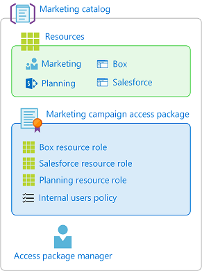
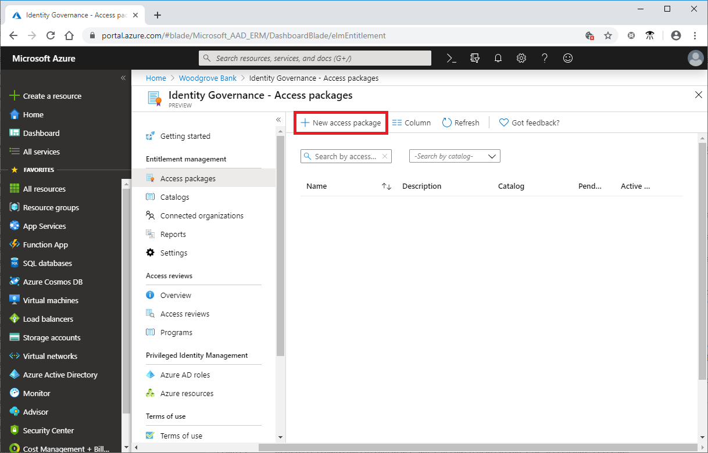
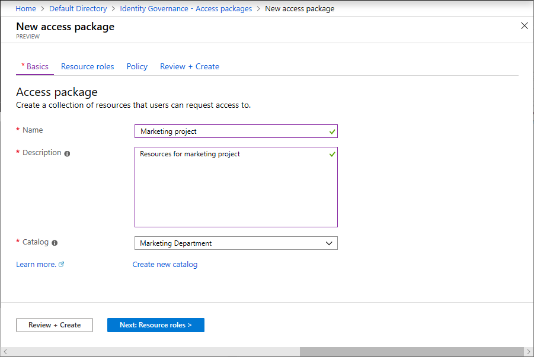
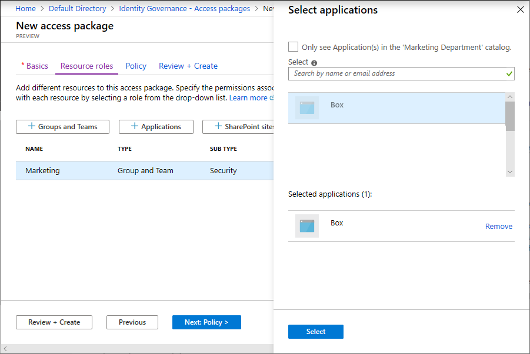
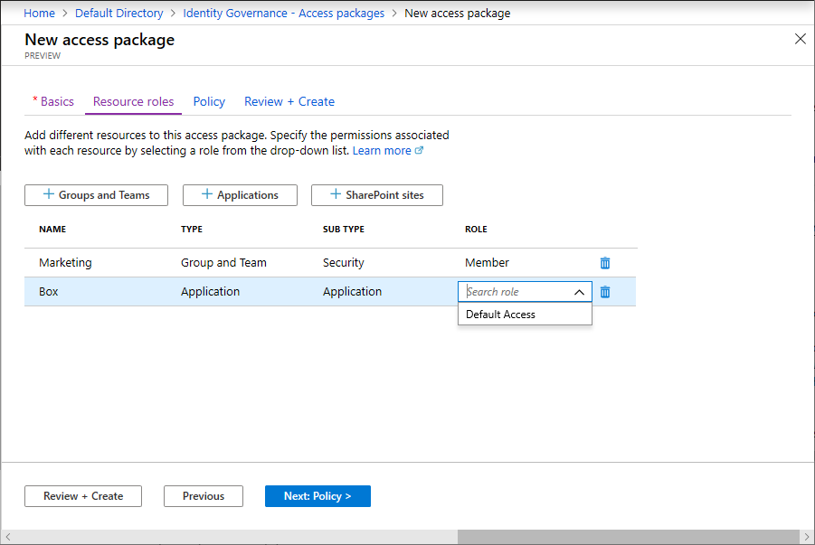
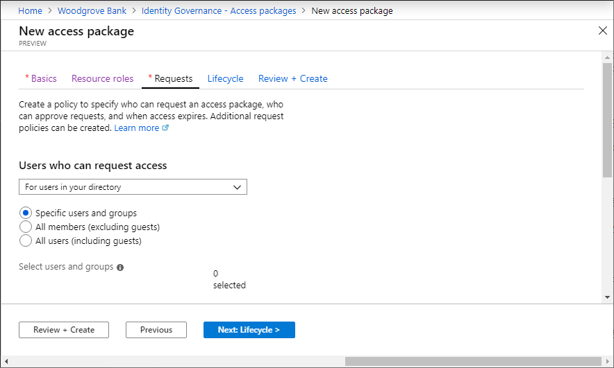
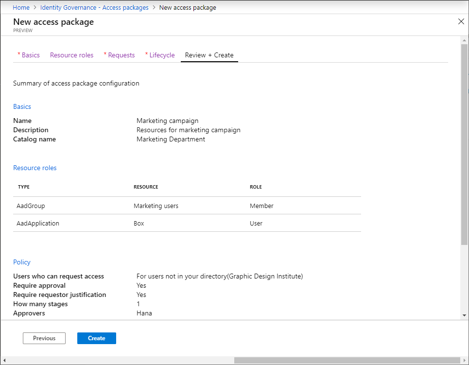

# Create an access package in entitlement management

An access package enables you to do a one-time setup of resources and policies that automatically administers access for the life of the access package. This article describes how to create an access package.

## Overview

All access packages must be in a container called a catalog. A catalog defines what resources you can add to your access package. If you don't specify a catalog, your access package goes in the general catalog. Currently, you can't move an existing access package to a different catalog.

An access package can be used to assign access to roles of multiple resources that are in the catalog. If you're an administrator or catalog owner, you can add resources to the catalog while you're creating an access package.

If you're an access package manager, you can't add resources that you own to a catalog. You're restricted to using the resources available in the catalog. If you need to add resources to a catalog, you can ask the catalog owner.

All access packages must have at least one policy for users to be assigned to them. Policies specify who can request the access package, along with approval and lifecycle settings. When you create an access package, you can create an initial policy for users in your directory, for users not in your directory, or for administrator direct assignments only. Or, you can choose to create the policy later.



Here are the high-level steps to create an access package with an initial policy:

1. In Identity Governance, start the process to create an access package.

1. Select the catalog where you want to put the access package.

1. Add resource roles from resources in the catalog to your access package.

1. Specify an initial policy for users who can request access.

1. Specify approval settings and lifecycle settings in that policy.

Then once the access package is created, you can [change the hidden setting](entitlement-management-access-package-edit.md#change-the-hidden-setting), [add or remove resource roles](entitlement-management-access-package-resources.md), and [add additional policies](entitlement-management-access-package-request-policy.md).

## Start the creation process

[!INCLUDE [portal updates](~/articles/active-directory/includes/portal-update.md)]

To complete the following steps, you need a role of global Administrator, Identity Governance Administrator, catalog owner, or access package manager.

1. Sign in to the [Microsoft Entra admin center](https://entra.microsoft.com) as at least an [Identity Governance Administrator](../roles/permissions-reference.md#identity-governance-administrator).

1. Browse to **Identity governance** > **Entitlement management** > **Access package**.

1. Select **New access package**.

    

## Configure basics

On the **Basics** tab, you give the access package a name and specify which catalog to create the access package in.

1. Enter a display name and description for the access package. Users will see this information when they submit a request for the access package.

1. In the **Catalog** dropdown list, select the catalog where you want to put the access package. For example, you might have a catalog owner who manages all the marketing resources that can be requested. In this case, you could select the marketing catalog.

    You see only catalogs that you have permission to create access packages in. To create an access package in an existing catalog, you must be a Global Administrator or Identity Governance Administrator. Or you must be a catalog owner or access package manager in that catalog.

    

    If you're a global Administrator, an Identity Governance Administrator, or catalog creator, and you want to create your access package in a new catalog that's not listed, select **Create new catalog**. Enter the catalog name and description, and then select **Create**.

    The access package that you're creating, and any resources included in it, are added to the new catalog. Later, you can add more catalog owners or add attributes to the resources that you put in the catalog. To learn more about how to edit the attributes list for a specific catalog resource and the prerequisite roles, read [Add resource attributes in the catalog](entitlement-management-catalog-create.md#add-resource-attributes-in-the-catalog).

1. Select **Next: Resource roles**.

## Select resource roles

On the **Resource roles** tab, you select the resources to include in the access package. Users who request and receive the access package will receive all the resource roles, such as group membership, in the access package.

If you're not sure which resource roles to include, you can skip adding them while creating the access package, and then [add them](entitlement-management-access-package-resources.md) later.

1. Select the resource type that you want to add (**Groups and Teams**, **Applications**, or **SharePoint sites**).

1. In the **Select applications** panel that appears, select one or more resources from the list.

    

    If you're creating the access package in the general catalog or a new catalog, you can choose any resource from the directory that you own. You must be at least a global administrator, an Identity Governance Administrator, or catalog creator.

    If you're creating the access package in an existing catalog, you can select any resource that's already in the catalog without owning it.

    If you're a global administrator, an Identity Governance Administrator, or catalog owner, you have the additional option of selecting resources that you own but that aren't yet in the catalog. If you select resources not currently in the selected catalog, these resources are also added to the catalog for other catalog administrators to build access packages with. To see all the resources that can be added to the catalog, select the **See all** checkbox at the top of the panel. If you want to select only resources that are currently in the selected catalog, leave the **See all** checkbox cleared (the default state).

1. In the **Role** list, select the role that you want users to be assigned for the resource. For more information on selecting the appropriate roles for a resource, read [Add resource roles](entitlement-management-access-package-resources.md#add-resource-roles).

    

1. Select **Next: Requests**.

>[!NOTE]
>You can add dynamic groups to a catalog and to an access package. However, you can select only the owner role when you're managing a dynamic group resource in an access package.

## Create request policies

On the **Requests** tab, you create the first policy to specify who can request the access package. You also configure approval settings. Later, you can create more request policies to allow additional groups of users to request the access package with their own approval settings.



Depending on which users you want to be able to request this access package, perform the steps in one of the following sections.

[!INCLUDE [Entitlement management request policy](../../../includes/active-directory-entitlement-management-request-policy.md)]

[!INCLUDE [Entitlement management lifecycle policy](../../../includes/active-directory-entitlement-management-lifecycle-policy.md)]

## Review and create the access package

On the **Review + create** tab, you can review your settings and check for any validation errors.

1. Review the access package's settings.

    

1. Select **Create** to create the access package.

    The new access package appears in the list of access packages.

1. If the access package is intended to be visible to everyone in scope of the policies, then leave the **Hidden** setting of the access package at **No**. Optionally, if you intend to only allow users with the direct link to request the access package, [edit the access package](entitlement-management-access-package-edit.md#change-the-hidden-setting) to change the **Hidden** setting to **Yes**.  Then [copy the link to request the access package](entitlement-management-access-package-settings.md#share-link-to-request-an-access-package) and share it with users who need access.

## Create an access package programmatically

There are two ways to create an access package programmatically: through Microsoft Graph and through the PowerShell cmdlets for Microsoft Graph.

### Create an access package by using Microsoft Graph

You can create an access package by using Microsoft Graph. A user in an appropriate role with an application that has the delegated `EntitlementManagement.ReadWrite.All` permission can call the API to:

1. [List the accessPackageResources objects in the catalog](/graph/api/entitlementmanagement-list-accesspackagecatalogs?tabs=http&view=graph-rest-beta&preserve-view=true) and [create an accessPackageResourceRequest object](/graph/api/entitlementmanagement-post-accesspackageresourcerequests?tabs=http&view=graph-rest-beta&preserve-view=true) for any resources that aren't yet in the catalog.
1. [List the accessPackageResourceRoles object](/graph/api/accesspackage-list-accesspackageresourcerolescopes?tabs=http&view=graph-rest-beta&preserve-view=true) of each `accessPackageResource` object in an `accessPackageCatalog` object. The user will use this list of roles to select a role later on, when creating an `accessPackageResourceRoleScope` object.
1. [Create an accessPackage object](/graph/tutorial-access-package-api).
1. [Create an accessPackageResourceRoleScope object](/graph/api/accesspackage-post-accesspackageresourcerolescopes?tabs=http&view=graph-rest-beta&preserve-view=true) for each resource role needed in the access package.
1. [Create an accessPackageAssignmentPolicy object](/graph/api/entitlementmanagement-post-accesspackageassignmentpolicies?tabs=http&view=graph-rest-beta&preserve-view=true) for each policy needed in the access package.

### Create an access package by using Microsoft PowerShell

You can also create an access package in PowerShell by using the cmdlets from the [Microsoft Graph PowerShell cmdlets for Identity Governance](https://www.powershellgallery.com/packages/Microsoft.Graph.Identity.Governance/) beta module version 2.1.x or later beta module version.  This script illustrates using the Graph `beta` profile and Microsoft Graph PowerShell cmdlets module version 2.4.0.

First, retrieve the ID of the catalog (and of the resource and its roles in that catalog) that you want to include in the access package. Use a script similar to the following example:

```powershell
Connect-MgGraph -Scopes "EntitlementManagement.ReadWrite.All"

$catalog = Get-MgBetaEntitlementManagementAccessPackageCatalog -Filter "displayName eq 'Marketing'"

$rsc = Get-MgBetaEntitlementManagementAccessPackageCatalogAccessPackageResource -AccessPackageCatalogId $catalog.Id -Filter "resourceType eq 'Application'" -ExpandProperty "accessPackageResourceScopes"
$filt = "(originSystem eq 'AadApplication' and accessPackageResource/id eq '" + $rsc.Id + "')"
$rr = Get-MgBetaEntitlementManagementAccessPackageCatalogAccessPackageResourceRole -AccessPackageCatalogId $catalog.Id -Filter $filt -ExpandProperty "accessPackageResource"
```

Then, create the access package:

```powershell
$params = @{
    CatalogId = $catalog.id
    DisplayName = "sales reps"
    Description = "outside sales representatives"
}

$ap = New-MgBetaEntitlementManagementAccessPackage -BodyParameter $params
```

After you create the access package, assign the resource roles to it.  For example, if you want to include the second resource role of the resource returned earlier as a resource role of the new access package, you can use a script similar to this one:

```powershell
$rparams = @{
    AccessPackageResourceRole = @{
       OriginId = $rr[2].OriginId
       DisplayName = $rr[2].DisplayName
       OriginSystem = $rr[2].OriginSystem
       AccessPackageResource = @{
          Id = $rsc.Id
          ResourceType = $rsc.ResourceType
          OriginId = $rsc.OriginId
          OriginSystem = $rsc.OriginSystem
       }
    }
    AccessPackageResourceScope = @{
       OriginId = $rsc.OriginId
       OriginSystem = $rsc.OriginSystem
    }
}
New-MgBetaEntitlementManagementAccessPackageResourceRoleScope -AccessPackageId $ap.Id -BodyParameter $rparams
```

Finally, create the policies.  In this policy, only the administrator can assign access, and there are no access reviews. For more examples, see [Create an assignment policy through PowerShell](entitlement-management-access-package-request-policy.md#create-an-access-package-assignment-policy-through-powershell) and [Create an accessPackageAssignmentPolicy](/graph/api/entitlementmanagement-post-assignmentpolicies?tabs=http&view=graph-rest-beta&preserve-view=true).

```powershell

$pparams = @{
    AccessPackageId = $ap.Id
    DisplayName = "direct"
    Description = "direct assignments by administrator"
    AccessReviewSettings = $null
    RequestorSettings = @{
        ScopeType = "NoSubjects"
        AcceptRequests = $true
        AllowedRequestors = @(
        )
    }
    RequestApprovalSettings = @{
        IsApprovalRequired = $false
        IsApprovalRequiredForExtension = $false
        IsRequestorJustificationRequired = $false
        ApprovalMode = "NoApproval"
        ApprovalStages = @(
        )
    }
}
New-MgEntitlementManagementAccessPackageAssignmentPolicy -BodyParameter $pparams

```

## Next steps

- [Share a link to request an access package](entitlement-management-access-package-settings.md)
- [Change resource roles for an access package](entitlement-management-access-package-resources.md)
- [Directly assign a user to an access package](entitlement-management-access-package-assignments.md)
- [Create an access review for an access package](entitlement-management-access-reviews-create.md)
