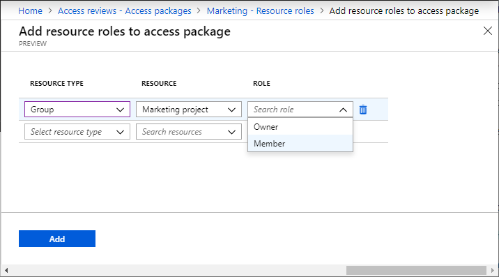
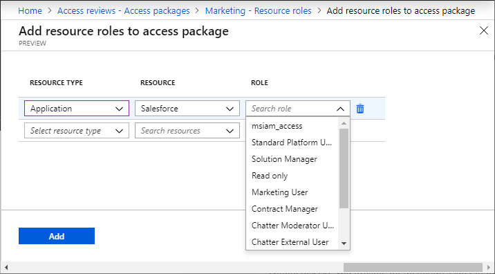
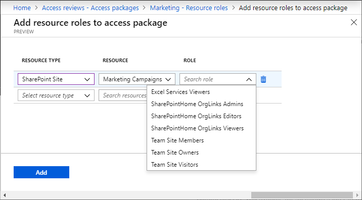
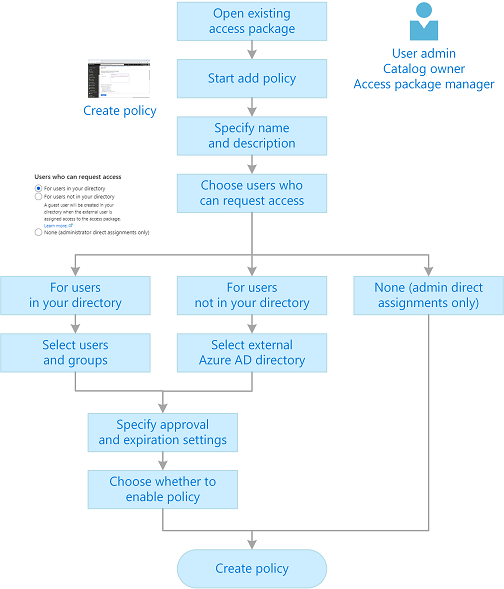
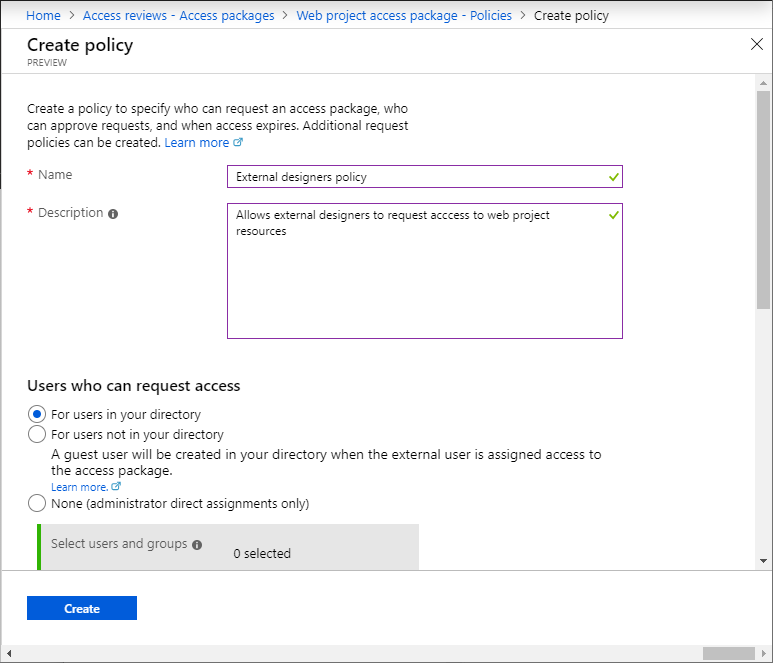
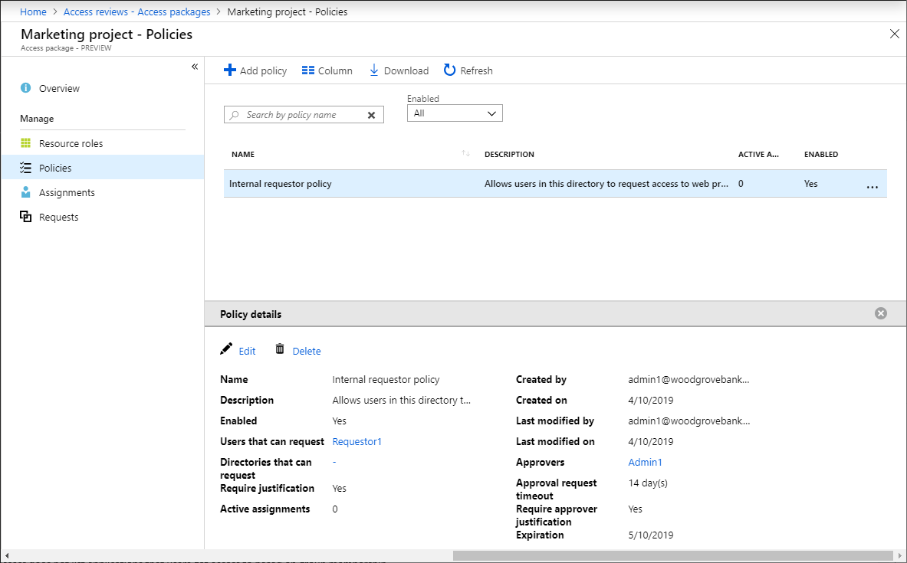
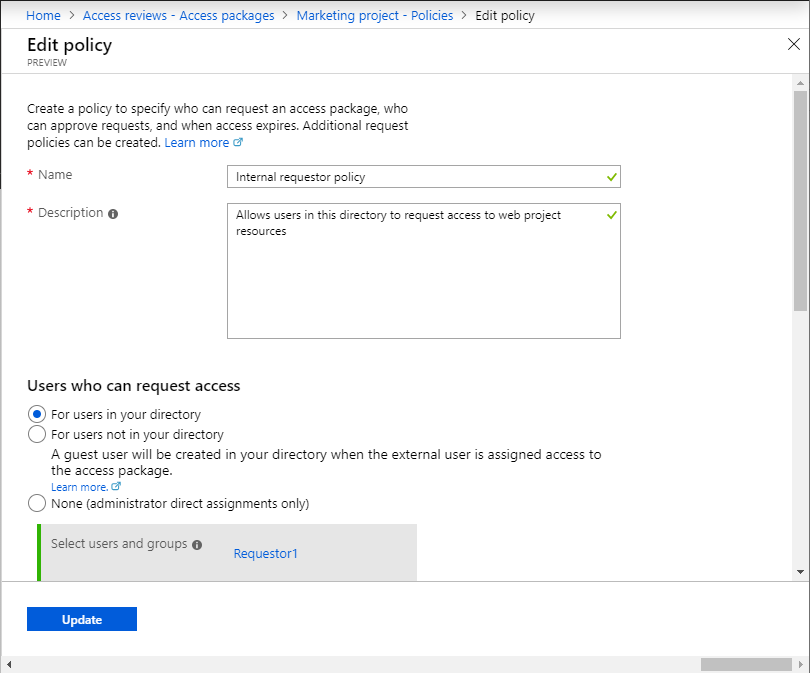
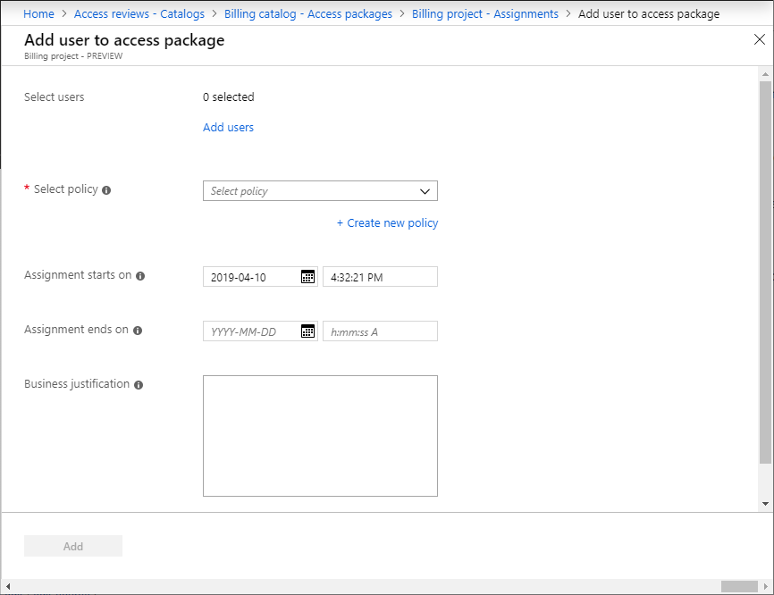

# Edit and manage an existing access package in Azure AD entitlement management (Preview)

> [!IMPORTANT]
> Azure Active Directory (Azure AD) entitlement management is currently in public preview.
> This preview version is provided without a service level agreement, and it's not recommended for production workloads. Certain features might not be supported or might have constrained capabilities.
> For more information, see [Supplemental Terms of Use for Microsoft Azure Previews](https://azure.microsoft.com/support/legal/preview-supplemental-terms/).

An access package enables you to do a one-time setup of resources and policies that automatically administers access for the life of the access package. As an access package manager, you can change the resources in an access package at any time without worrying about provisioning the user's access to the new resources, or removing their access from the previous resources. Policies can also be updated at any time, however, the policy changes only affect new accesses.

This article describes how to edit and manage existing access packages.

## Add resource roles

A resource role is a collection of permissions associated with a resource. The way you make resources available for users to request is add resource roles to your access package. You can add resource roles for groups, applications, and SharePoint sites.

### Add a group resource role

You can add users to a group when they are assigned an access package. You can use any Office 365 group or Azure AD security group. Here are some considerations when selecting a group:

- When a group is part of an access package, then a user who is assigned that access package is added to that group, if not already present.
- When a user's access package assignment expires, they will be removed from the group, unless they they have access to another access package that includes that group.
- When a user is added to a group, they can see all the other members of that group.
- Azure AD cannot change the membership of a group that was synchronized from Windows Server Active Directory using Azure AD Connect.  
- The membership of dynamic groups cannot be updated using entitlement management.

**Prerequisite role:** User administrator, Catalog owner, or Access package manager

1. In the Azure portal, click **Azure Active Directory** and then click **Identity governance**.

1. In the left menu, click **Access packages** and then open the access package.

1. In the left menu, click **Resource roles**.

1. Click **Add resource roles**.

1. For **Resource type**, select **Group**.

1. For **Resource**, select a group that is available in the catalog.

    If you don't see the group you want to add in the list, follow the steps to [add the group to the catalog](entitlement-management-catalog-create.md#add-resources-to-a-catalog).

1. For **Role**, select **Owner** or **Member**.

    You typically select the Member role. If you select the Owner role, that will allow users to add or remove other members or owners.

    

1. Click **Add**.

    Any users with existing assignments to the access package will automatically be given access to this group when it is added.

### Add an application resource role

You can assign users access to an Azure AD enterprise application, including both SaaS applications and your own applications federated to Azure AD, when they are assigned an access package. For applications that integrate with Azure AD through federated single sign on, Azure AD will issue federation tokens for users assigned to the application. Here are some considerations when selecting an application:

- When an application's role is part of an access package, then a user who is assigned that access package is added to that application role, if not already present.
- When a user's access package assignment expires, their access will be removed from the application, unless they have access to another access package that includes that application.
- Applications can have multiple roles, as well as groups assigned to roles.

**Prerequisite role:** User administrator, Catalog owner, or Access package manager

1. In the Azure portal, click **Azure Active Directory** and then click **Identity governance**.

1. In the left menu, click **Access packages** and then open the access package.

1. In the left menu, click **Resource roles**.

1. Click **Add resource roles**.

1. For **Resource type**, select **Application**.

1. For **Resource**, select an application that is available in the catalog.

    If you don't see the application you want to add in the list, follow the steps to [add the application to the catalog](entitlement-management-catalog-create.md#add-resources-to-a-catalog).

1. For **Role**, select an application role.

    

1. Click **Add**.

    Any users with existing assignments to the access package will automatically be given access to this application when it is added.

### Add an SharePoint site resource role

You can assign users access to a SharePoint Online site or SharePoint Online site collection when they are assigned an access package.

**Prerequisite role:** User administrator, Catalog owner, or Access package manager

1. In the Azure portal, click **Azure Active Directory** and then click **Identity governance**.

1. In the left menu, click **Access packages** and then open the access package.

1. In the left menu, click **Resource roles**.

1. Click **Add resource roles**.

1. For **Resource type**, select **SharePoint site**.

1. For **Resource**, select a SharePoint site that is available in the catalog.

    If you don't see the SharePoint site you want to add in the list, follow the steps to [add the SharePoint site to the catalog](entitlement-management-catalog-create.md#add-resources-to-a-catalog).

1. For **Role**, select a SharePoint site role.

    

1. Click **Add**.

    Any users with existing assignments to the access package will automatically be given access to this SharePoint site when it is added.

## Remove resource roles

**Prerequisite role:** User administrator, Catalog owner, or Access package manager

1. In the Azure portal, click **Azure Active Directory** and then click **Identity governance**.

1. In the left menu, click **Access packages** and then open the access package.

1. In the left menu, click **Resource roles**.

1. Click the ellipsis (**...**) and then click **Remove resource role**.

    Any users with existing assignments to the access package will automatically have their access revoked to this resource role when it is removed.

## Add a new policy

The way you specify who can request an access package is to create a policy. You can create multiple policies for a single access package if you want to allow different sets of users to be granted assignments with different approval and expiration settings. A single policy cannot be used to assign internal and external users to the same access package. However, you can create two policies in the same access package -- one for internal users and one for external users. If there are multiple policies that apply to a user, they will be prompted at the time of their request to select the policy they would like to be assigned to.

The following diagram shows the high-level process to create a policy for an existing access package.

**Prerequisite role:** User administrator, Catalog owner, or Access package manager

1. In the Azure portal, click **Azure Active Directory** and then click **Identity governance**.

1. In the left menu, click **Access packages** and then open the access package.

1. Click **Policies** and then **Add policy**.

1. Type a name and a description for the policy.

    

1. Based on your selection for **Users who can request access**, perform the steps in one of the following policy sections.

[!INCLUDE [Entitlement management policy](../../../includes/active-directory-entitlement-management-policy.md)]

## Edit an existing policy

You can edit a policy at any time. If you change the expiration date for a policy, the expiration date for requests that are already in a pending approval or approved state will not change.

**Prerequisite role:** User administrator, Catalog owner, or Access package manager

1. In the Azure portal, click **Azure Active Directory** and then click **Identity governance**.

1. In the left menu, click **Access packages** and then open the access package.

1. Click **Policies** and then click the policy you want to edit.

    The **Policy details** pane opens at the bottom of the page.

    

1. Click **Edit** to edit the policy.

    

1. When finished, click **Update**.

## Directly assign a user

You can directly assign specific users to an access package if you do not need them to request the access package.

**Prerequisite role:** User administrator, Catalog owner, or Access package manager

1. In the Azure portal, click **Azure Active Directory** and then click **Identity governance**.

1. In the left menu, click **Access packages** and then open the access package.

1. Add a new policy.

1. In the **Users who can request access** section, select **None (administrator direct assignments only)**.

1. Specify expiration settings.

1. Open the **Assignments** page for the access package.

1. Click **New assignment** to open Add user to access package.

    

1. Select the users you want to give an assignment to.

1. Select the policy you created in a previous step that you want the users' assignment to be governed by.

1. Set the date and time you want the users' assignment to start and end. If an end date is not provided, the policy's expiration settings will be used.

1. Optionally provide a justification for your direct assignment for record keeping.

1. Click **Add** to directly assign the selected users to the access package.

    After a few moments, click **Refresh** to see the users in the Assignments list.

## View who has an assignment

**Prerequisite role:** User administrator, Catalog owner, or Access package manager

1. In the Azure portal, click **Azure Active Directory** and then click **Identity governance**.

1. In the left menu, click **Access packages** and then open the access package.

1. Click **Assignments** to see a list of active assignments.

1. Click a specific assignment to see additional details.

1. To see a list of assignments that did not have all resource roles properly provisioned, click the filter status and select **Delivering**.

    You can see additional details on delivery errors by locating the user's corresponding request on the **Requests** page.

1. To see expired assignments, click the filter status and select **Expired**.

1. To download a CSV file of the filtered list, click **Download**.

## View requests

**Prerequisite role:** User administrator, Catalog owner, or Access package manager

1. In the Azure portal, click **Azure Active Directory** and then click **Identity governance**.

1. In the left menu, click **Access packages** and then open the access package.

1. Click **Requests**.

1. Click a specific request to see additional details.

## View a request's delivery errors

**Prerequisite role:** User administrator, Catalog owner, or Access package manager

1. In the Azure portal, click **Azure Active Directory** and then click **Identity governance**.

1. In the left menu, click **Access packages** and then open the access package.

1. Click **Requests**.

1. Select the request you want to view.

    If the request has any delivery errors, the request status will be **Undelivered** and the substatus will be **Partially delivered**.

    If there are any delivery errors, in the request's detail pane, there will be a count of delivery errors.

1. Click the count to see all of the request's delivery errors.

## Cancel a pending request

You can only cancel a pending request that has not yet been delivered.

**Prerequisite role:** User administrator, Catalog owner, or Access package manager

1. In the Azure portal, click **Azure Active Directory** and then click **Identity governance**.

1. In the left menu, click **Access packages** and then open the access package.

1. Click **Requests**.

1. Click the request you want to cancel

1. In the request details pane, click **Cancel request**.

## Copy My Access portal link

Most users in your directory can sign in to the My Access portal and automatically see a list of access packages they can request. However, for external business partner users that are not yet in your directory, you will need to send them a link that they can use to request an access package. As long as the access package is enabled for external users and you have a policy for the external user's directory, the external user can use the My Access portal link to request the access package.

**Prerequisite role:** User administrator, Catalog owner, or Access package manager

1. In the Azure portal, click **Azure Active Directory** and then click **Identity governance**.

1. In the left menu, click **Access packages** and then open the access package.

1. On the Overview page, copy the **My Access portal link**.

    

1. Email or send the link to your external business partner. They can share the link with their users to request the access package.

## Change the Hidden setting

Access packages are discoverable by default. This means that if a policy allows a user to request the access package, they will automatically see the access package listed in their My Access portal.

**Prerequisite role:** User administrator, Catalog owner, or Access package manager

1. In the Azure portal, click **Azure Active Directory** and then click **Identity governance**.

1. In the left menu, click **Access packages** and then open the access package.

1. On the Overview page, click **Edit**.

1. Set the **Hidden** setting.

    If set to **No**, the access package will be listed in the user's My Access portal.

    If set to **Yes**, the access package will not be listed in the user's My Access portal. The only way a user can view the access package is if they have the direct **My Access portal link** to the access package.

## Delete

An access package can only be deleted if it has no active user assignments.

**Prerequisite role:** User administrator, Catalog owner, or Access package manager

1. In the Azure portal, click **Azure Active Directory** and then click **Identity governance**.

1. In the left menu, click **Access packages** and then open the access package.

1. In the left menu, click **Assignments** and remove access for all users.

1. In the left menu, click **Overview** and then click **Delete**.

1. In the delete message that appears, click **Yes**.

## Next steps

- [Request process and email notifications](entitlement-management-process.md)
- [Manage access for external users](entitlement-management-external-users.md)
