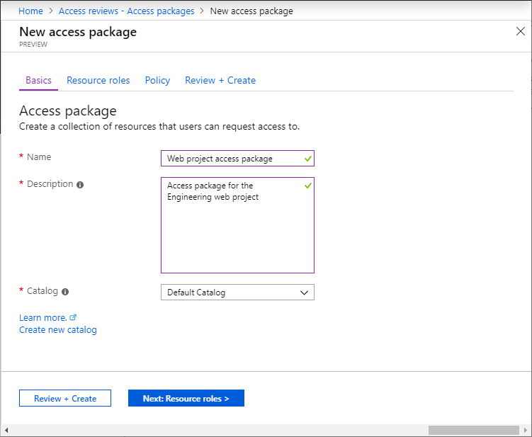
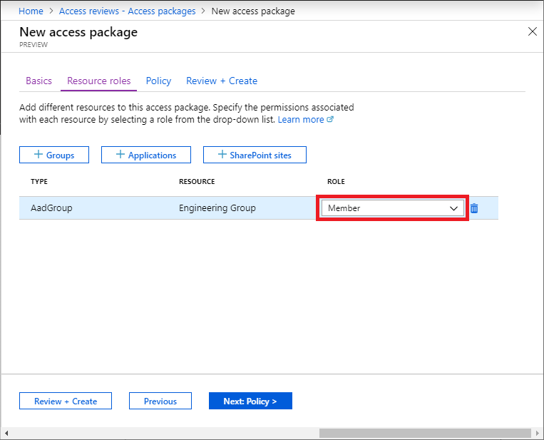
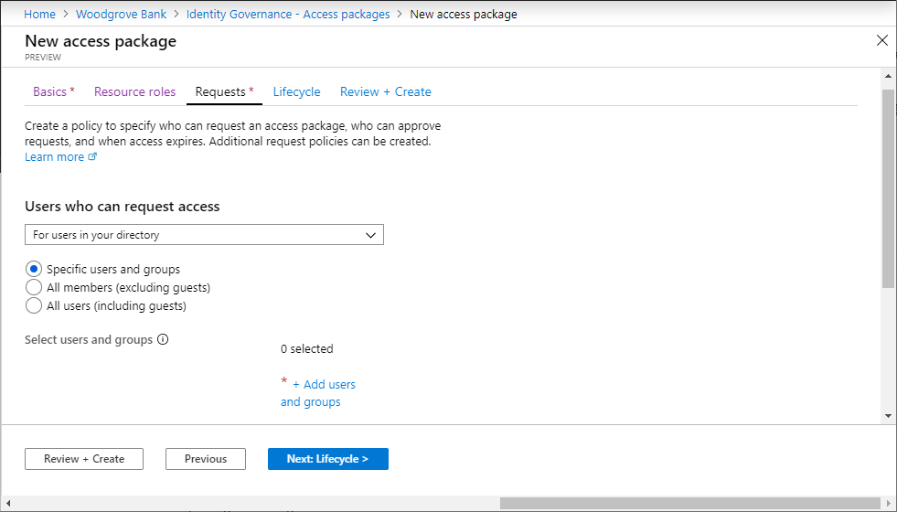
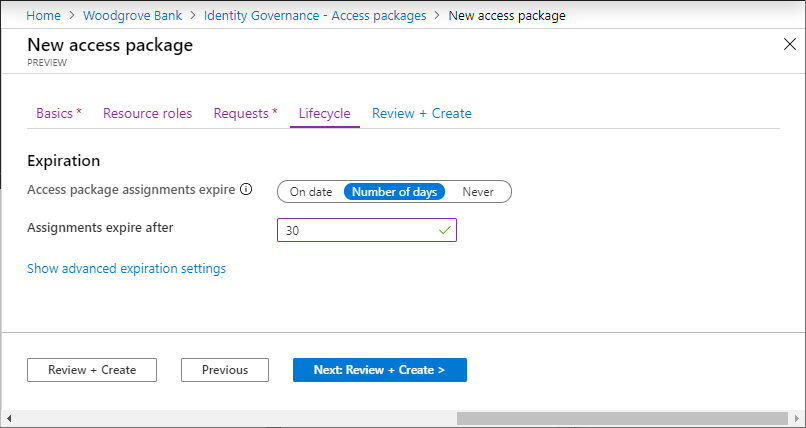
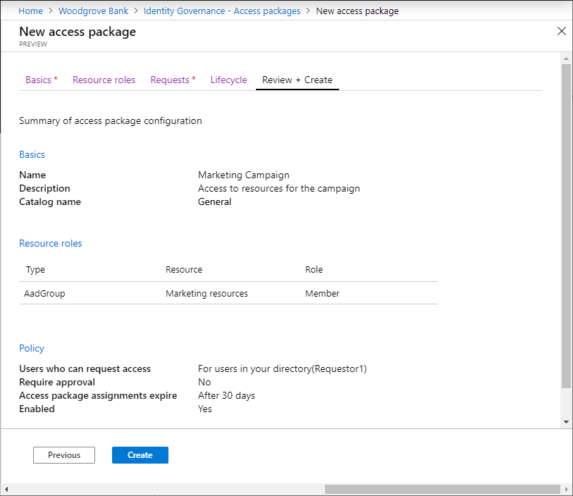
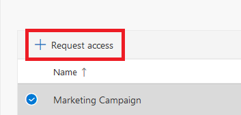
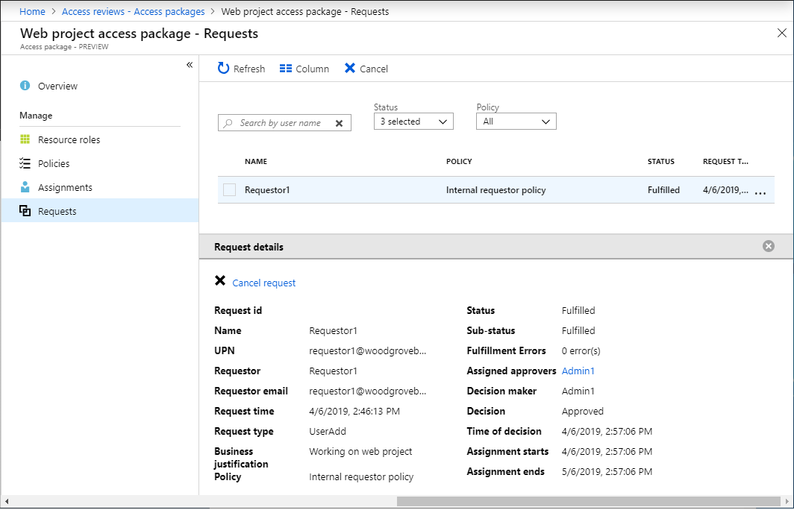

# Tutorial: Create your first access package in Azure AD entitlement management

Managing access to all the resources employees need, such as groups, applications, and sites, is an important function for organizations. You want to grant employees the right level of access they need to be productive and remove their access when it is no longer needed.

In this tutorial, you work for Woodgrove Bank as an IT administrator. You've been asked to create a package of resources for a marketing campaign that internal users can self-service request. Requests do not require approval and user's access expires after 30 days. For this tutorial, the marketing campaign resources are just membership in a single group, but it could be a collection of groups, applications, or SharePoint Online sites.

In this tutorial, you learn how to:

> [!div class="checklist"]
> * Create an access package with a group as a resource
> * Allow a user in your directory to request access
> * Demonstrate how an internal user can request the access package

For a step-by-step demonstration of the process of deploying Azure Active Directory entitlement management, including creating your first access package, view the following video:

>[!VIDEO https://www.youtube.com/embed/zaaKvaaYwI4]

## Prerequisites

To use Azure AD entitlement management, you must have one of the following licenses:

- Azure AD Premium P2
- Enterprise Mobility + Security (EMS) E5 license

For more information, see [License requirements](entitlement-management-overview.md#license-requirements).

## Step 1: Set up users and group

A resource directory has one or more resources to share. In this step, you create a group named **Marketing resources** in the Woodgrove Bank directory that is the target resource for entitlement management. You also set up an internal requestor.

**Prerequisite role:** Global administrator or User administrator

1. Sign in to the [Azure portal](https://portal.azure.com) as a Global administrator or User administrator.  

1. In the left navigation, click **Azure Active Directory**.

1. Create or configure the following two users. You can use these names or different names. **Admin1** can be the user you are currently signed in as.

    | Name | Directory role |
    | --- | --- |
    | **Admin1** | Global administrator -or- User administrator |
    | **Requestor1** | User |

1. Create an Azure AD security group named **Marketing resources** with a membership type of **Assigned**.

    This group will be the target resource for entitlement management. The group should be empty of members to start.

## Step 2: Create an access package

An *access package* is a bundle of resources that a team or project needs and is governed with policies. Access packages are defined in containers called *catalogs*. In this step, you create a **Marketing Campaign** access package in the **General** catalog.

**Prerequisite role:** Global administrator, User administrator, Catalog owner, or Access package manager

1. In the Azure portal, in the left navigation, click **Azure Active Directory**.

2. In the left menu, click **Identity Governance**

3. In the left menu, click **Access packages**.  If you see **Access denied**, ensure that an Azure AD Premium P2 license is present in your directory.

4. Click **New access package**.

    

5. On the **Basics** tab, type the name **Marketing Campaign** access package and description **Access to resources for the campaign**.

6. Leave the **Catalog** drop-down list set to **General**.

    

7. Click **Next** to open the **Resource roles** tab.

    On this tab, you select the resources and the resource role to include in the access package.

8. Click **Groups and Teams**.

9. In the Select groups pane, find and select the **Marketing resources** group you created earlier.

    By default, you see groups inside and outside the **General** catalog. When you select a group outside of the **General** catalog, it will be added to the **General** catalog.

    

10. Click **Select** to add the group to the list.

11. In the **Role** drop-down list, select **Member**.

    

    >[!NOTE]
    > When using [dynamic groups](../users-groups-roles/groups-create-rule.md) you will not see any other roles available besides owner. This is by design.
    > 

12. Click **Next** to open the **Requests** tab.

    On this tab, you create a request policy. A *policy* defines the rules or guardrails to access an access package. You create a policy that allows a specific user in the resource directory to request this access package.

13. In the **Users who can request access** section, click **For users in your directory** and then click **Specific users and groups**.

    

14. Click **Add users and groups**.

15. In the Select users and groups pane, select the **Requestor1** user you created earlier.

    

16. Click **Select**.

17. Scroll down to the **Approval** and **Enable requests** sections.

18. Leave **Require approval** set to **No**.

19. For **Enable requests**, click **Yes** to enable this access package to be requested as soon as it is created.

    

20. Click **Next** to open the **Lifecycle** tab.

21. In the **Expiration** section, set **Access package assignments expire** to **Number of days**.

22. Set **Assignments expire after** to **30** days.

    

23. Click **Next** to open the **Review + Create** tab.

    

    After a few moments, you should see a notification that the access package was successfully created.

24. In left menu of the Marketing Campaign access package, click **Overview**.

25. Copy the **My Access portal link**.

    You'll use this link for the next step.

    

## Step 3: Request access

In this step, you perform the steps as the **internal requestor** and request access to the access package. Requestors submit their requests using a site called the My Access portal. The My Access portal enables requestors to submit requests for access packages, see the access packages they already have access to, and view their request history.

**Prerequisite role:** Internal requestor

1. Sign out of the Azure portal.

1. In a new browser window, navigate to the My Access portal link you copied in the previous step.

1. Sign in to the My Access portal as **Requestor1**.

    You should see the **Marketing Campaign** access package.

1. If necessary, in the **Description** column, click the arrow to view details about the access package.

    

1. Click the checkmark to select the package.

1. Click **Request access** to open the Request access pane.

    

1. In the **Business justification** box, type the justification **I am working on the new marketing campaign**.

    

1. Click **Submit**.

1. In the left menu, click **Request history** to verify that your request was submitted.

## Step 4: Validate that access has been assigned

In this step, you confirm that the **internal requestor** was assigned the access package and that they are now a member of the **Marketing resources** group.

**Prerequisite role:** Global administrator, User administrator, Catalog owner, or Access package manager

1. Sign out of the My Access portal.

1. Sign in to the [Azure portal](https://portal.azure.com) as **Admin1**.

1. Click **Azure Active Directory** and then click **Identity Governance**.

1. In the left menu, click **Access packages**.

1. Find and click **Marketing Campaign** access package.

1. In the left menu, click **Requests**.

    You should see Requestor1 and the Initial policy with a status of **Delivered**.

1. Click the request to see the request details.

    

1. In the left navigation, click **Azure Active Directory**.

1. Click **Groups** and open the **Marketing resources** group.

1. Click **Members**.

    You should see **Requestor1** listed as a member.

    

## Step 5: Clean up resources

In this step, you remove the changes you made and delete the **Marketing Campaign** access package.

**Prerequisite role:**  Global administrator or User administrator

1. In the Azure portal, click **Azure Active Directory** and then click **Identity Governance**.

1. Open the **Marketing Campaign** access package.

1. Click **Assignments**.

1. For **Requestor1**, click the ellipsis (**...**) and then click **Remove access**. In the message that appears, click **Yes**.

    After a few moments, the status will change from Delivered to Expired.

1. Click **Resource roles**.

1. For **Marketing resources**, click the ellipsis (**...**) and then click **Remove resource role**. In the message that appears, click **Yes**.

1. Open the list of access packages.

1. For **Marketing Campaign**, click the ellipsis (**...**) and then click **Delete**. In the message that appears, click **Yes**.

1. In Azure Active Directory, delete any users you created such as **Requestor1** and **Admin1**.

1. Delete the **Marketing resources** group.

## Next steps

Advance to the next article to learn about common scenario steps in entitlement management.
> [!div class="nextstepaction"]
> [Common scenarios](entitlement-management-scenarios.md)
