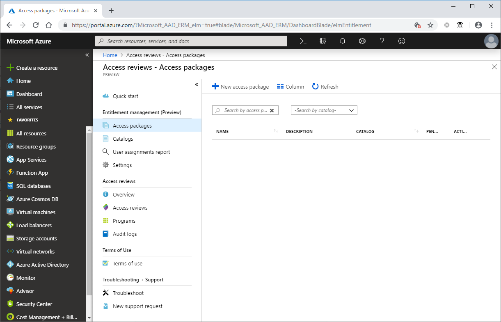
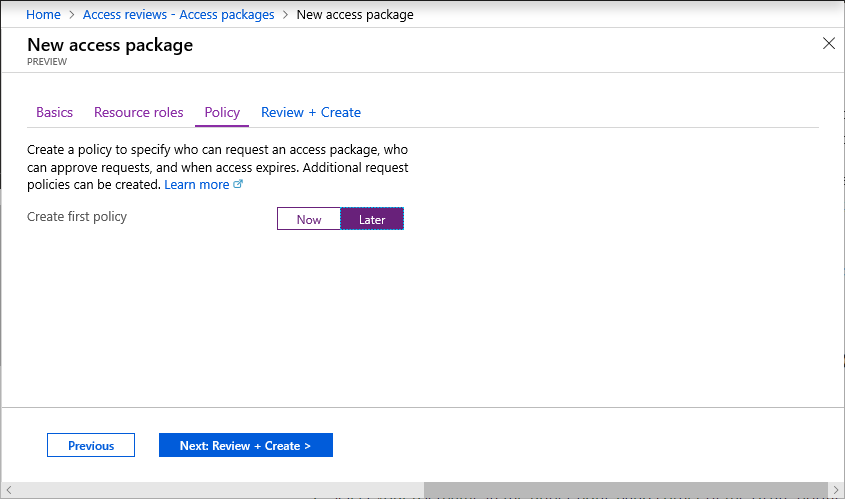
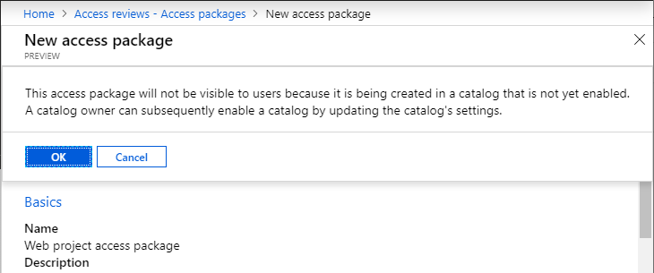
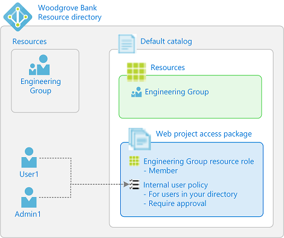
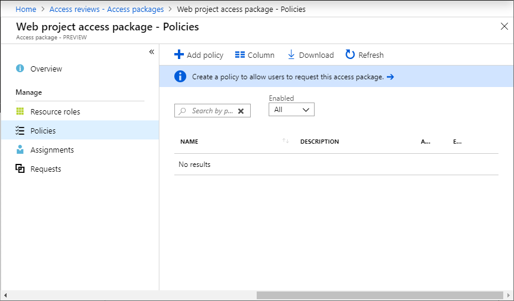
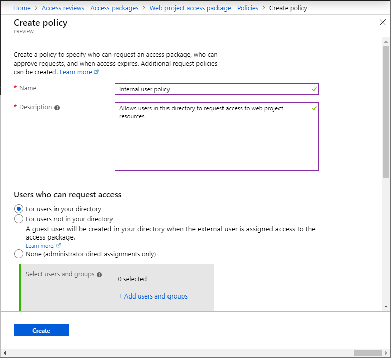
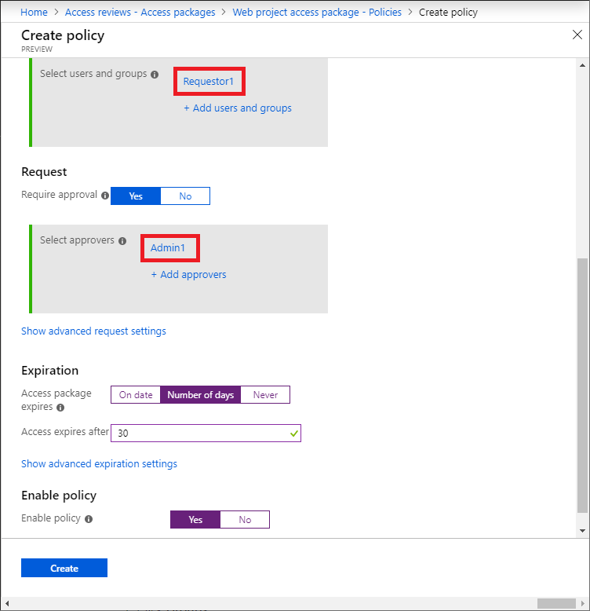
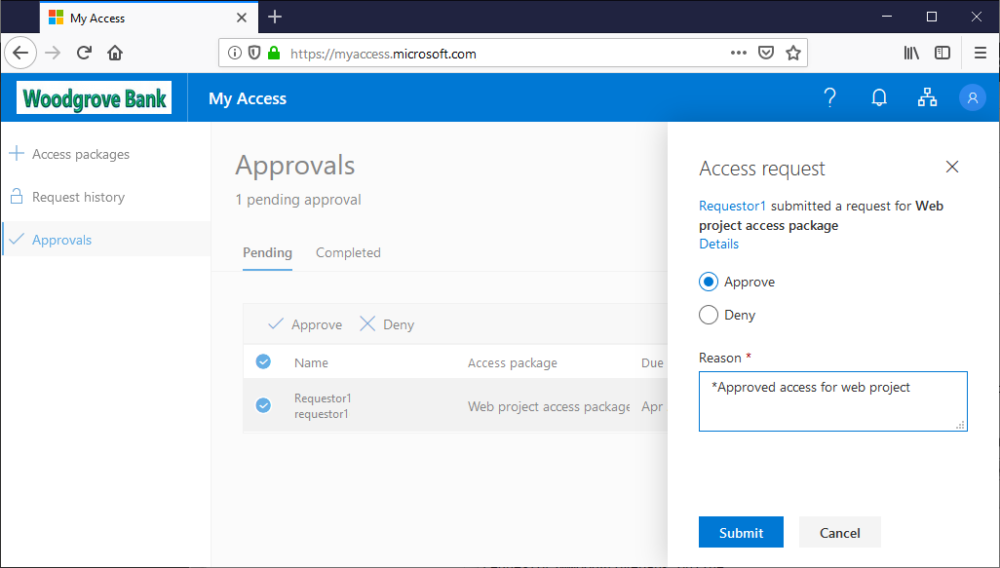

# Tutorial: Create your first access package in Azure AD entitlement management (Preview)

> [!IMPORTANT]
> Azure Active Directory (Azure AD) entitlement management is currently in public preview.
> This preview version is provided without a service level agreement, and it's not recommended for production workloads. Certain features might not be supported or might have constrained capabilities.
> For more information, see [Supplemental Terms of Use for Microsoft Azure Previews](https://azure.microsoft.com/support/legal/preview-supplemental-terms/).

Managing access to all the resources employees need, such as groups, applications, and sites, is an important function for organizations. You want to grant employees the right level of access they need to be productive and remove their access when it is no longer needed.

In this tutorial, you work for Woodgrove Bank as an IT administrator. You've been asked to create a package of resources for a web project that internal users can self-service request. Requests require approval and user's access expires after 30 days. For this tutorial, the web project resources are just membership in a single group, but it could be a collection of groups, applications, or SharePoint Online sites.

In this tutorial, you learn how to:

> [!div class="checklist"]
> * Create an access package with a group as a resource
> * Designate an approver
> * Demonstrate how an internal user can request the access package
> * Approve the access request

If you don't have an Azure AD Premium P2 or Enterprise Mobility + Security E5 license, create a free [Enterprise Mobility + Security E5 trial](https://signup.microsoft.com/Signup?OfferId=87dd2714-d452-48a0-a809-d2f58c4f68b7&ali=1).

## Prerequisites

To use Azure AD entitlement management (Preview), you must have one of the following licenses:

- Azure AD Premium P2
- Enterprise Mobility + Security (EMS) E5 license

## Step 1: Set up users and group

A resource directory has one or more resources to share. In this step, you create a group named **Engineering Group** in the Woodgrove Bank directory that is the target resource for entitlement management. You also set up an internal requestor.

**Prerequisite role:** Global administrator or User administrator

1. Sign in to the [Azure portal](https://portal.azure.com) as a Global administrator or User administrator.  

1. In the left navigation, click **Azure Active Directory**.

1. Create or configure the following two users. You can use these names or different names. **Admin1** can be the user you are currently signed in as.

    | Name | Directory role | Description |
    | --- | --- | --- |
    | **Admin1** | Global administrator -or- Limited administrator (User administrator) | Administrator and approver |
    | **Requestor1** | User | Internal requestor |

    For this tutorial, the administrator and approver are the same person, but you typically designate one or more people to be approvers.

1. Create an Azure AD security group named **Engineering Group** with a membership type of **Assigned**.

    This group will be the target resource for entitlement management. The group should be empty of members to start.

## Step 2: Create an access package

An *access package* is a bundle of all the resources a user needs to work on a project or perform their job. Access packages are defined in containers called *catalogs*. In this step, you create a **Web project access package** in the **General** catalog.

**Prerequisite role:** Global administrator or User administrator

1. In the Azure portal, in the left navigation, click **Azure Active Directory**.

1. In the left menu, click **Identity Governance**

1. In the left menu, click **Access packages**.  If you see **Access denied**, ensure that an Azure AD Premium P2 license is present in that directory.

1. Click **New access package**.

    

1. On the **Basics** tab, type the name **Web project access package** and description **Access package for the Engineering web project**.

1. Leave the **Catalog** drop-down list set to **General**.

    

1. Click **Next** to open the **Resource roles** tab.

    On this tab, you select the permissions to include in the access package.

1. Click **Groups**.

1. In the Select groups pane, find and select the **Engineering Group** group you created earlier.

    By default, you see groups inside and outside the **General** catalog. When you select a group outside of the **General** catalog, it will be added to the **General** catalog.

    

1. Click **Select** to add the group to the list.

1. In the **Role** drop-down list, select **Member**.

    

1. Click **Next** to open the **Policy** tab.

1. Set the **Create first policy** toggle to **Later**.

    You will create the policy in the next section.

    

1. Click **Next** to open the **Review + Create** tab.

    

1. Review the access package settings and then click **Create**.

    You might see a message that the access package will not be visible to users because the catalog is not yet enabled.

    

1. Click **OK**.

    After a few moments, you should see a notification that the access package was successfully created.

## Step 3: Create a policy

A *policy* defines the rules or guardrails to access an access package. In this step, you create a policy that allows a specific user in the resource directory to request the access package. You also specify that requests must be approved and who will be the approver.

**Prerequisite role:** Global administrator or User administrator

1. In the **Web project access package**, in the left menu, click **Policies**.

    

1. Click **Add policy** to open Create policy.

1. Type the name **Internal requestor policy** and description **Allows users in this directory to request access to web project resources**.

1. In the **Users who can request access** section, click **For users in your directory**.

    

1. Scroll down to the **Select users and groups** section and click **Add users and groups**.

1. In the Select users and groups pane, select the **Requestor1** user you created earlier and then click **Select**.

1. In the **Request** section, set **Require approval** to **Yes**.

1. In the **Select approvers** section, click **Add approvers**.

1. In the Select approvers pane, select the **Admin1** you created earlier and then click **Select**.

    For this tutorial, the administrator and approver are the same person, but you can designate another person as an approver.

1. In the **Expiration** section, set **Access package expires** to **Number of days**.

1. Set **Access expires after** to **30** days.

1. For **Enable policy**, click **Yes**.

    

1. Click **Create** to create the **Internal requestor policy**.

1. In left menu of the Web project access package, click **Overview**.

1. Copy the **My Access portal link**.

    You'll use this link for the next step.

    

## Step 4: Request access

In this step, you perform the steps as the **internal requestor** and request access to the access package. Requestors submit their requests using a site called the My Access portal. The My Access portal enables requestors to submit requests for access packages, see the access packages they already have access to, and view their request history.

**Prerequisite role:** Internal requestor

1. Sign out of the Azure portal.

1. In a new browser window, navigate to the My Access portal link you copied in the previous step.

1. Sign in to the My Access portal as **Requestor1**.

    You should see the **Web project access package**.

1. If necessary, in the **Description** column, click the arrow to view details about the access package.

    

1. Click the checkmark to select the package.

1. Click **Request access** to open the Request access pane.

1. In the **Business justification** box, type the justification **Working on web project**.

1. Set the **Request for specific period** toggle to **Yes**.

1. Set the **Start date** to today and **End date** to tomorrow.

    

1. Click **Submit**.

1. In the left menu, click **Request history** to verify that your request was submitted.

## Step 5: Approve access request

In this step, you sign in as the **approver** user and approve the access request for the internal requestor. Approvers use the same My Access portal as requestors use to submit requests. Using the My Access portal, approvers can view pending approvals and approve or deny requests.

**Prerequisite role:** Approver

1. Sign out of the My Access portal.

1. Sign in to the [My Access portal](https://myaccess.microsoft.com) as **Admin1**.

1. In the left menu, click **Approvals**.

1. On the **Pending** tab, find **Requestor1**.

    If you don't see the request from Requestor1, wait a few minutes and try again.

1. Click the **View** link to open the Access request pane.

1. Click **Approve**.

1. In the **Reason** box, type the reason **Approved access for web project**.

    

1. Click **Submit** to submit your decision.

    You should see a message that it was successfully approved.

## Step 6: Validate that access has been assigned

Now that you have approved the access request, in this step, you confirm that the **internal requestor** was assigned the access package and that they are now a member of the **Engineering Group** group.

**Prerequisite role:** Global administrator or User administrator

1. Sign out of the My Access portal.

1. Sign in to the [Azure portal](https://portal.azure.com) as the **Admin1**.

1. Click **Azure Active Directory** and then click **Identity Governance**.

1. In the left menu, click **Access packages**.

1. Find and click **Web project access package**.

1. In the left menu, click **Requests**.

    You should see Requestor1 and the Internal requestor policy with a status of **Delivered**.

1. Click the request to see the request details.

    

1. In the left navigation, click **Azure Active Directory**.

1. Click **Groups** and open the **Engineering Group** group.

1. Click **Members**.

    You should see **Requestor1** listed as a member.

    

## Step 7: Clean up resources

In this step, you remove the changes you made and delete the **Web project access package** access package.

**Prerequisite role:**  Global administrator or User administrator

1. In the Azure portal, click **Azure Active Directory** and then click **Identity Governance**.

1. Open **Web project access package**.

1. Click **Assignments**.

1. For **Requestor1**, click the ellipsis (**...**) and then click **Remove access**.

    The status will change from Delivered to Expired.

1. Click **Policies**.

1. For **Internal requestor policy**, click the ellipsis (**...**) and then click **Delete**.

1. Click **Resource roles**.

1. For **Engineering Group**, click the ellipsis (**...**) and then click **Remove resource role**.

1. Open the list of access packages.

1. For **Web project access project**, click the ellipsis (**...**) and then click **Delete**.

1. In Azure Active Directory, delete any users you created such as **Requestor1** and **Admin1**.

1. Delete the **Engineering Group** group.

## Next steps

Advance to the next article to learn about common scenario steps in entitlement management.
> [!div class="nextstepaction"]
> [Common scenarios](entitlement-management-scenarios.md)
