# Tutorial: Manage access to resources in entitlement management

Managing access to all the resources employees need, such as groups, applications, and sites, is an important function for organizations. You want to grant employees the right level of access they need to be productive and remove their access when it's no longer needed.

In this tutorial, you work for Woodgrove Bank as an IT administrator. You've been asked to create a package of resources for a marketing campaign that internal users can use to self-service request. Requests don't require approval and user's access expires after 30 days. For this tutorial, the marketing campaign resources are just membership in a single group, but it could be a collection of groups, applications, or SharePoint Online sites.

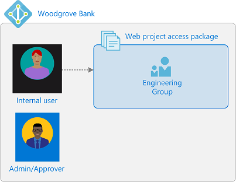

In this tutorial, you learn how to:

> [!div class="checklist"]
> * Create an access package with a group as a resource
> * Allow a user in your directory to request access
> * Demonstrate how an internal user can request the access package

For a step-by-step demonstration of the process of deploying Azure Active Directory entitlement management, including creating your first access package, view the following video:

>[!VIDEO https://www.youtube.com/embed/zaaKvaaYwI4]

This rest of this article uses the Azure portal to configure and demonstrate entitlement management. 

## Prerequisites

To use entitlement management, you must have one of the following licenses:

- Microsoft Azure AD Premium P2 or Microsoft Entra ID Governance
- Enterprise Mobility + Security (EMS) E5 license

For more information, see [License requirements](entitlement-management-overview.md#license-requirements).

## Step 1: Set up users and group

[!INCLUDE [portal updates](~/articles/active-directory/includes/portal-update.md)]

A resource directory has one or more resources to share. In this step, you create a group named **Marketing resources** in the Woodgrove Bank directory that is the target resource for entitlement management. You also set up an internal requestor.

**Prerequisite role:** Global administrator or User administrator

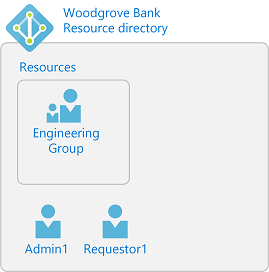

1. Sign in to the [Azure portal](https://portal.azure.com) as a Global administrator or User administrator.

1. In the left navigation, select **Azure Active Directory**.

1. [Create two users](../fundamentals/add-users-azure-active-directory.md). Use the following names or different names.

    | Name | Directory role |
    | --- | --- |
    | **Admin1** | Global administrator, or User administrator. This user can be the user you're currently signed in. |
    | **Requestor1** | User |

4. [Create an Azure AD security group](../fundamentals/active-directory-groups-create-azure-portal.md) named **Marketing resources** with a membership type of **Assigned**. This group is the target resource for entitlement management. The group should be empty of members to start.

## Step 2: Create an access package

An *access package* is a bundle of resources that a team or project needs and is governed with policies. Access packages are defined in containers called *catalogs*. In this step, you create a **Marketing Campaign** access package in the **General** catalog.

**Prerequisite role:** Global administrator, Identity Governance administrator, User administrator, Catalog owner, or Access package manager

1. In the Azure portal, in the left navigation, select **Azure Active Directory**.

1. In the left menu, select **Identity Governance**

1. In the left menu, select **Access packages**.  If you see **Access denied**, ensure that a Microsoft Azure AD Premium P2 or Microsoft Entra ID Governance license is present in your directory.

1. Select **New access package**.

    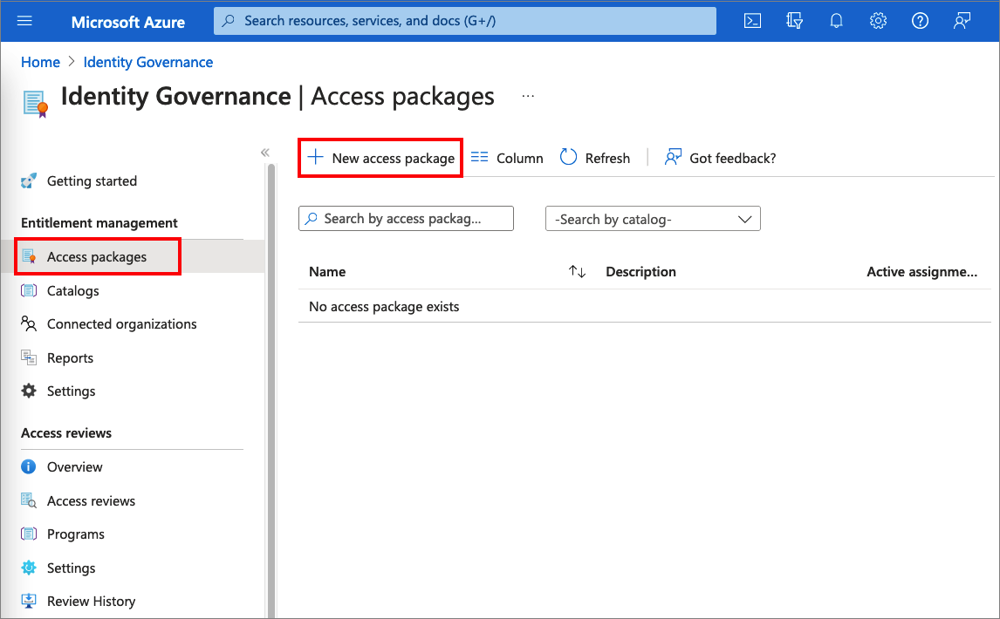

1. On the **Basics** tab, type the name *Marketing Campaign* access package and description *Access to resources for the campaign*.

1. Leave the **Catalog** drop-down list set to **General**.

    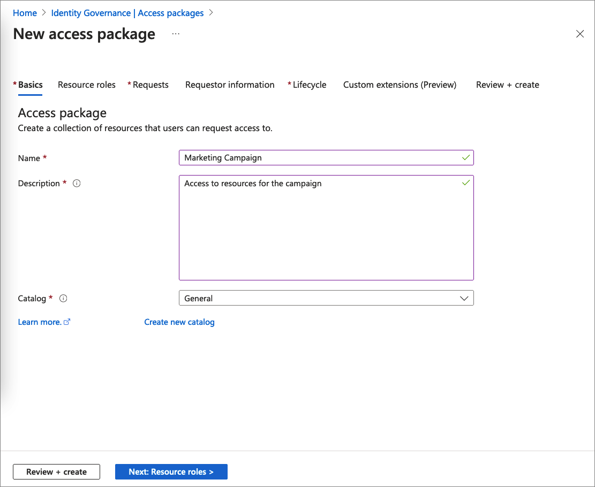

1. Select **Next** to open the **Resource roles** tab. On this tab, select the resources and the resource role to include in the access package. You can choose to manage access to groups and teams, applications, and SharePoint Online sites. In this scenario, select **Groups and Teams**.

    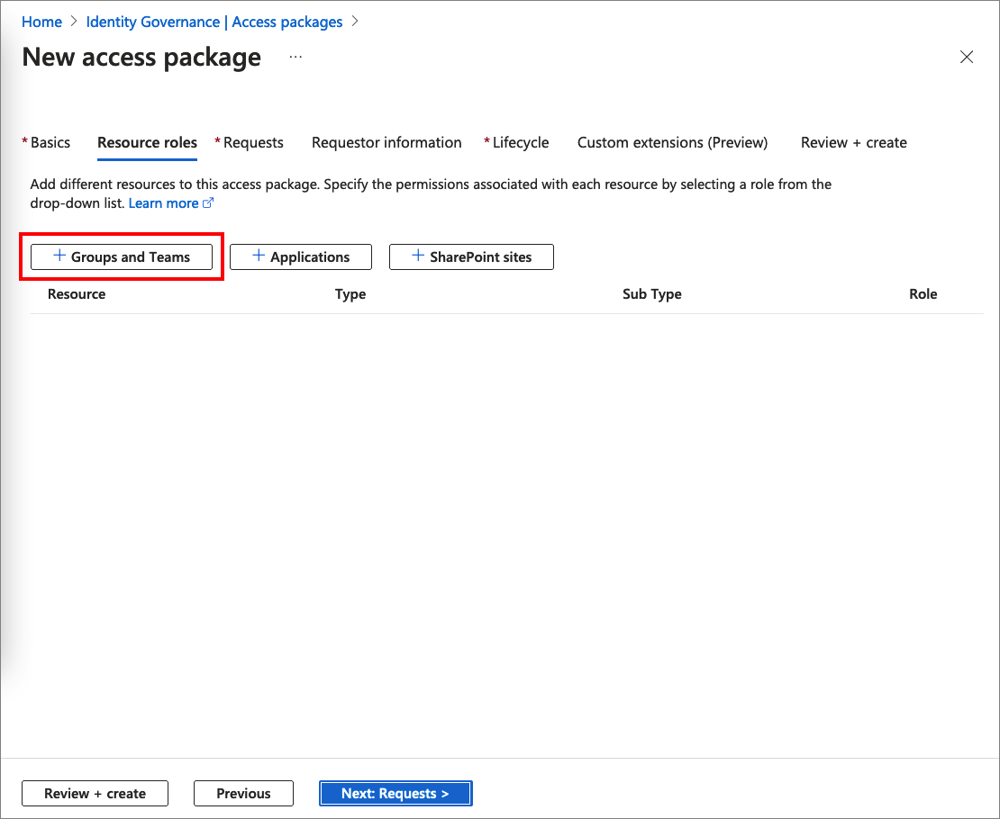

1. In the **Select groups** pane, find and select the **Marketing resources** group you created earlier.

     By default, you see groups inside the General catalog. When you select a group outside of the General catalog, which you can see if you check the **See all** check box, it will be added to the General catalog.

    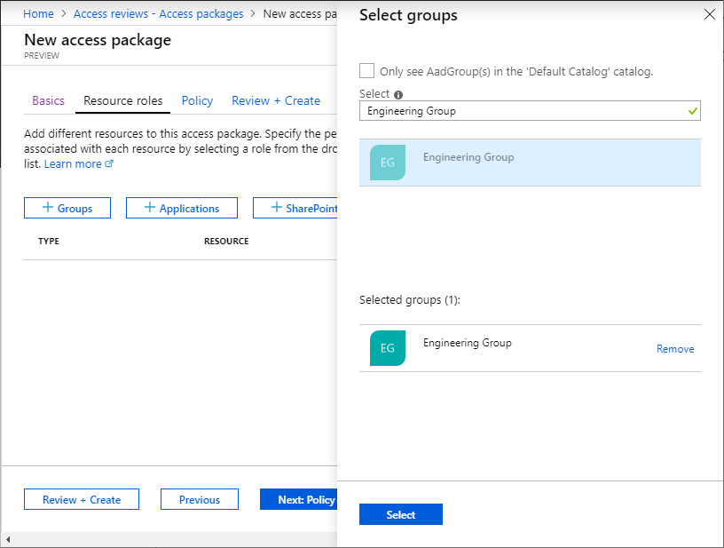

1. Choose **Select** to add the group to the list.

1. In the **Role** drop-down list, select **Member**. If you select the Owner role, it allows users to add or remove other members or owners. For more information on selecting the appropriate roles for a resource, read [add resource roles](entitlement-management-access-package-resources.md#add-resource-roles).

    :::image type="content" source="./media/entitlement-management-access-package-first/resource-roles.png" alt-text="Screenshot the shows how to select the member role." lightbox="./media/entitlement-management-access-package-first/resource-roles.png":::

    >[!IMPORTANT]
    >The [role-assignable groups](../roles/groups-concept.md) added to an access package will be indicated using the Sub Type **Assignable to roles**. For more information, check out the [Create a role-assignable group](../roles/groups-create-eligible.md) article. Keep in mind that once a role-assignable group is present in an access package catalog, administrative users who are able to manage in entitlement management, including global administrators, user administrators and catalog owners of the catalog, will be able to control the access packages in the catalog, allowing them to choose who can be added to those groups. If you don't see a role-assignable group that you want to add or you are unable to add it, make sure you have the required Azure AD role and entitlement management role to perform this operation. You might need to ask someone with the required roles add the resource to your catalog. For more information, see [Required roles to add resources to a catalog](entitlement-management-delegate.md#required-roles-to-add-resources-to-a-catalog).

    >[!NOTE]
    > When using [dynamic groups](../enterprise-users/groups-create-rule.md) you will not see any other roles available besides owner. This is by design.
    > 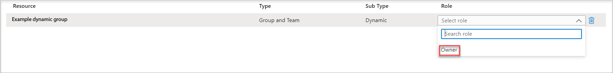
    

1. Select **Next** to open the **Requests** tab. On the Requests tab, you create a request policy. A *policy* defines the rules or guardrails to access an access package. You create a policy that allows a specific user in the resource directory to request this access package.

1. In the **Users who can request access** section, select **For users in your directory** and then select **Specific users and groups**.

    :::image type="content" source="./media/entitlement-management-access-package-first/new-access-package-requests.png" alt-text="Screenshot of the access package requests tab." lightbox="./media/entitlement-management-access-package-first/new-access-package-requests.png":::

1. Select **Add users and groups**.

1. In the Select users and groups pane, select the **Requestor1** user you created earlier.

    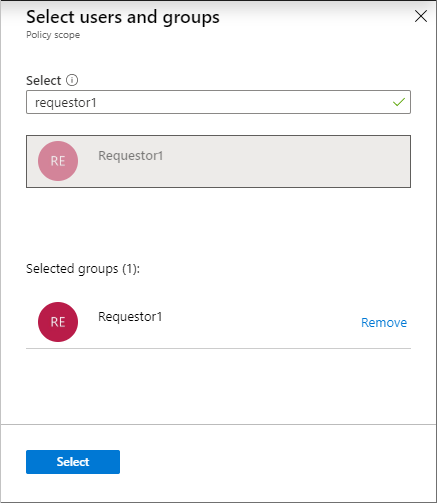

1. Choose **Select** to add the user to the list.

1. Scroll down to the **Approval** and **Enable requests** sections.

1. Leave **Require approval** set to **No**.

1. For **Enable requests**, select **Yes** to enable this access package to be requested as soon as it's created.

1. If your organization is set up to receive verified IDs, there is an option to configure an access package to require requestors to provide a verified ID.  To learn more, see: [Configure verified ID settings for an access package in entitlement management (Preview)](entitlement-management-verified-id-settings.md)

    :::image type="content" source="media/entitlement-management-access-package-first/verified-id-picker.png" alt-text="Screenshot of the Verified ID picker selection.":::

1. Select **Next** to open the **Requestor information** tab.

    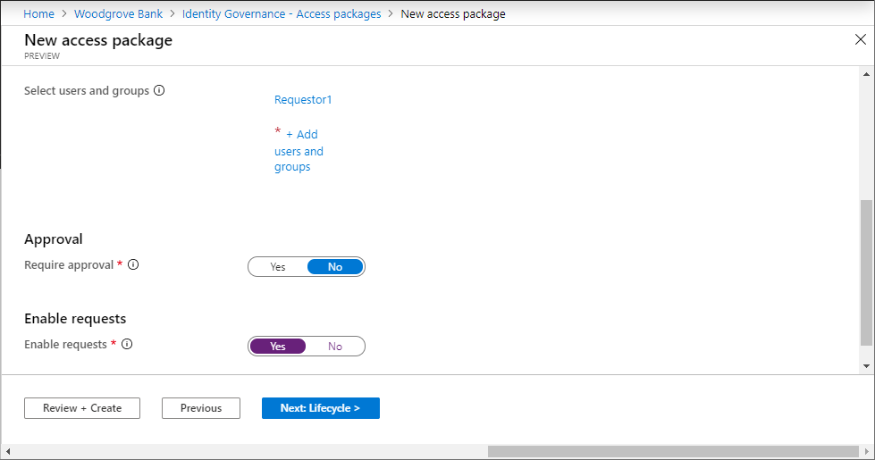

1. On the **Requestor information** tab, you can ask questions to collect more information from the requestor. The questions are shown on the request form and can be either required or optional. In this scenario, you haven't been asked to include requestor information for the access package, so you can leave these boxes empty. Select **Next** to open the **Lifecycle** tab.

1. On the **Lifecycle** tab, you specify when a user's assignment to the access package expires. You can also specify whether users can extend their assignments. In the **Expiration** section:
    1. Set the **Access package assignments expire** to **Number of days**.
    1. Set the **Assignments expire after** to **30** days.
    1. Leave the **Users can request specific timeline** default value, **Yes**.
    1. Set the **Require access reviews** to **No**.

    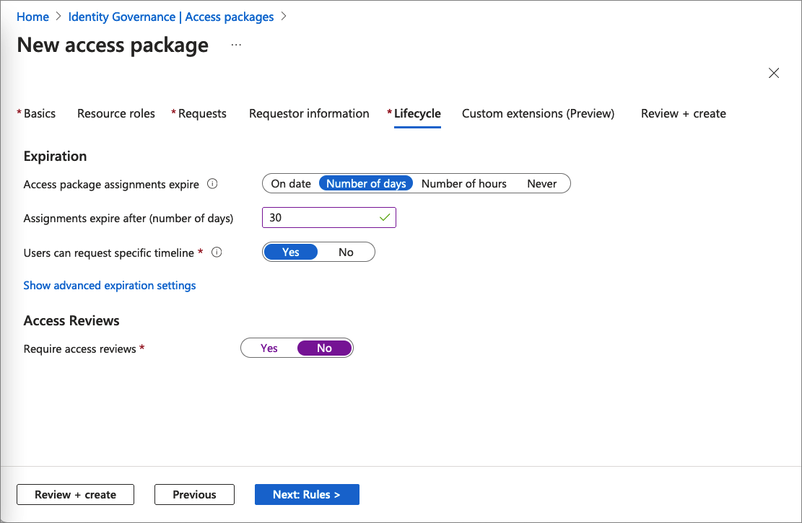

1. Skip the **Custom extensions (Preview)** step.

1. Select **Next** to open the **Review + Create** tab. 

1. On the **Review + Create** tab, select **Create**. After a few moments, you should see a notification that the access package was successfully created.

1. In left menu of the Marketing Campaign access package, select **Overview**.

1. Copy the **My Access portal link**.

    You'll use this link for the next step.

    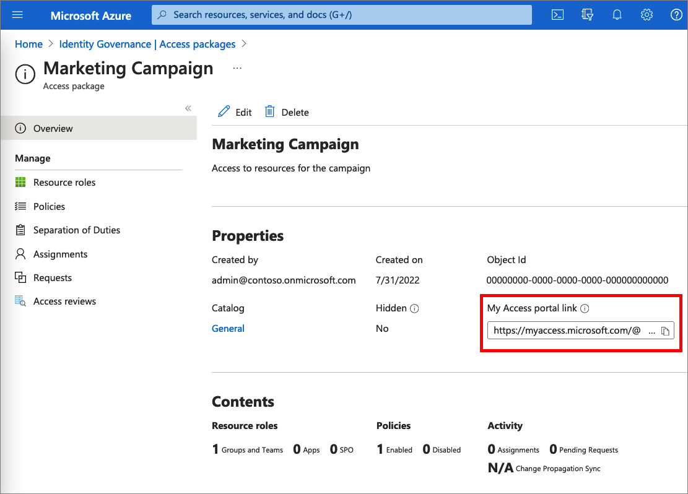

## Step 3: Request access

In this step, you perform the steps as the **internal requestor** and request access to the access package. Requestors submit their requests using a site called the My Access portal. The My Access portal enables requestors to submit requests for access packages, see the access packages they already have access to, and view their request history.

**Prerequisite role:** Internal requestor

1. Sign out of the Azure portal.

1. In a new browser window, navigate to the My Access portal link you copied in the previous step.

1. Sign in to the My Access portal as **Requestor1**.

    You should see the **Marketing Campaign** access package.

1. In the **Business justification** box, type the justification *I'm working on the new marketing campaign*.

    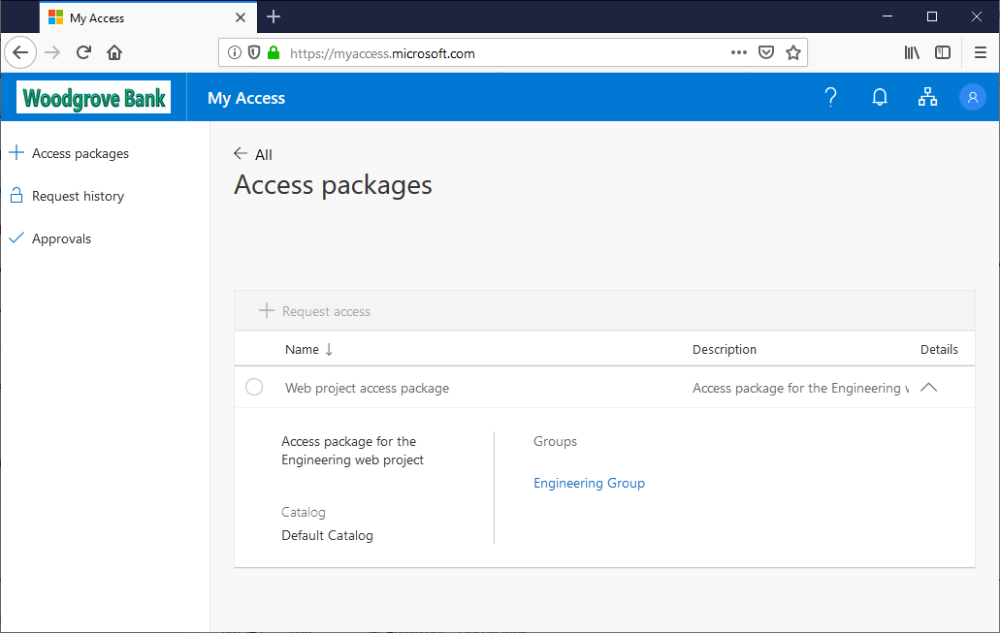

1. Select **Submit**.

1. In the left menu, select **Request history** to verify that your request was delivered. For more details, select **View**.

    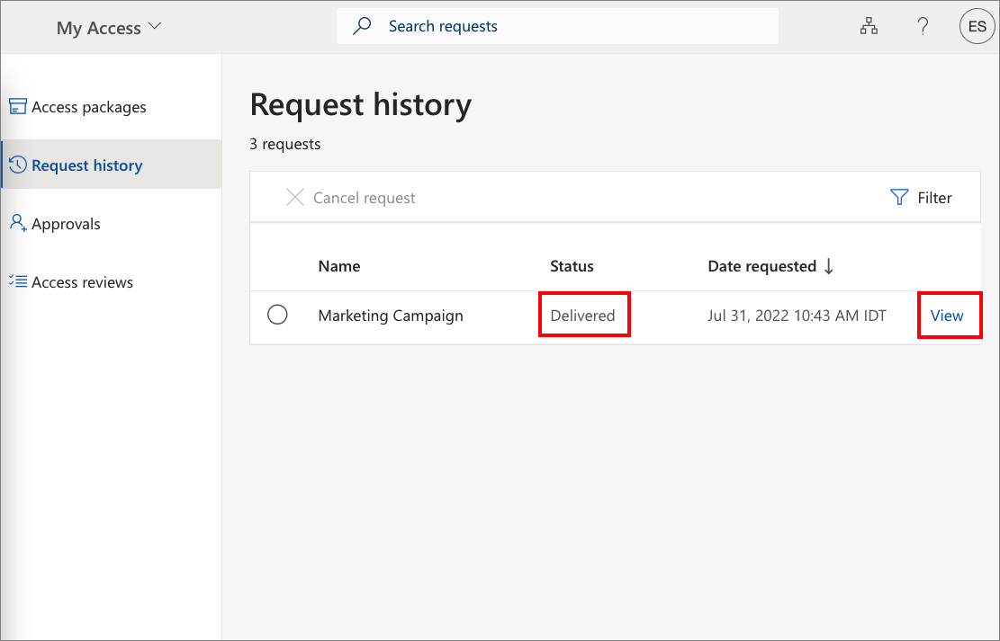

## Step 4: Validate that access has been assigned

In this step, you confirm that the **internal requestor** was assigned the access package and that they're now a member of the **Marketing resources** group.

**Prerequisite role:** Global administrator, User administrator, Catalog owner, or Access package manager

1. Sign out of the My Access portal.

1. Sign in to the [Azure portal](https://portal.azure.com) as **Admin1**.

1. Select **Azure Active Directory** and then select **Identity Governance**.

1. In the left menu, select **Access packages**.

1. Find and select **Marketing Campaign** access package.

1. In the left menu, select **Requests**.

    You should see Requestor1 and the Initial policy with a status of **Delivered**.

1. Select the request to see the request details.

    :::image type="content" source="./media/entitlement-management-access-package-first/request-details.png" alt-text="Screenshot of the access package request details." lightbox="./media/entitlement-management-access-package-first/request-details.png":::

1. In the left navigation, select **Azure Active Directory**.

1. Select **Groups** and open the **Marketing resources** group.

1. Select **Members**.

    You should see **Requestor1** listed as a member.

    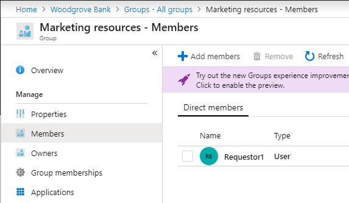

## Step 5: Clean up resources

In this step, you remove the changes you made and delete the **Marketing Campaign** access package.

**Prerequisite role:**  Global administrator or User administrator

1. In the Azure portal, select **Azure Active Directory** and then select **Identity Governance**.

1. Open the **Marketing Campaign** access package.

1. Select **Assignments**.

1. For **Requestor1**, select the ellipsis (**...**) and then select **Remove access**. In the message that appears, select **Yes**.

    After a few moments, the status will change from Delivered to Expired.

1. Select **Resource roles**.

1. For **Marketing resources**, select the ellipsis (**...**) and then select **Remove resource role**. In the message that appears, select **Yes**.

1. Open the list of access packages.

1. For **Marketing Campaign**, select the ellipsis (**...**) and then select **Delete**. In the message that appears, select **Yes**.

1. In Azure Active Directory, delete any users you created such as **Requestor1** and **Admin1**.

1. Delete the **Marketing resources** group.

## Next steps

Advance to the next article to learn about common scenario steps in entitlement management.
> [!div class="nextstepaction"]
> [Common scenarios](entitlement-management-scenarios.md)
