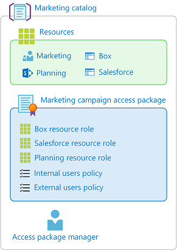
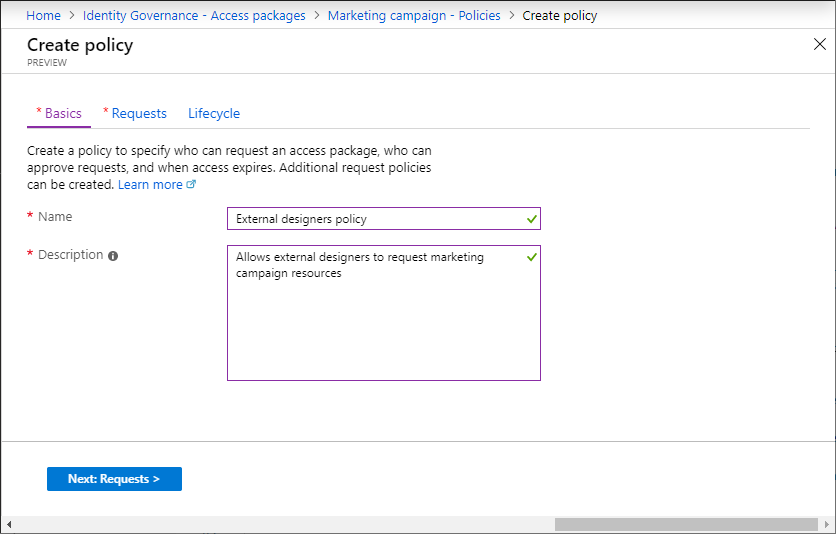
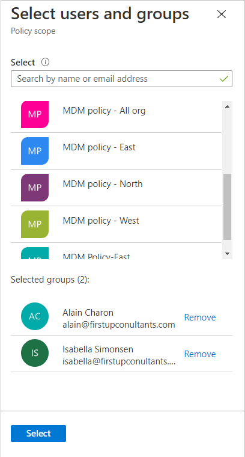
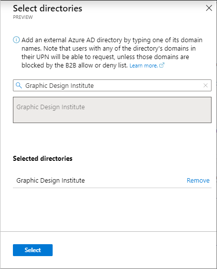
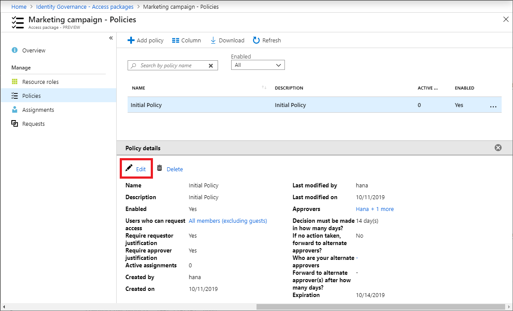
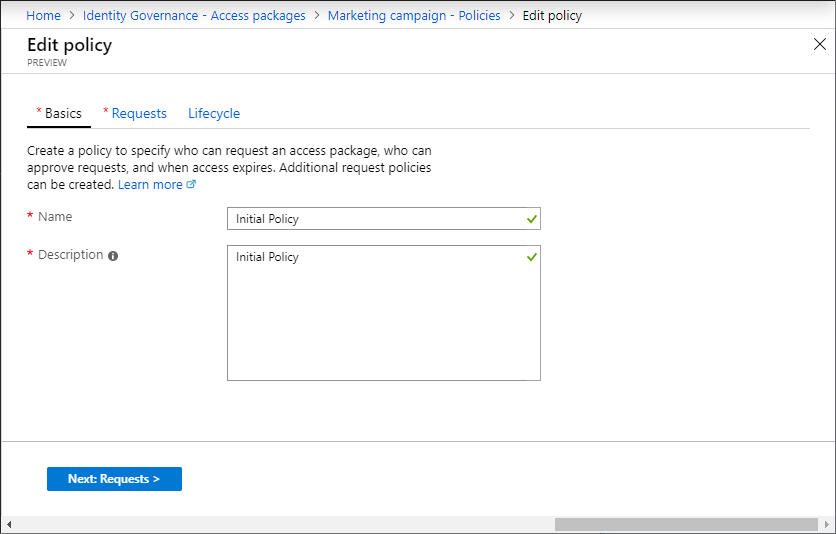

# Change request settings for an access package in entitlement management

As an access package manager, you can change the users who can request an access package at any time by editing a policy for access package assignment requests, or adding a new policy to the access package. This article describes how to change the request settings for an existing access package assignment policy.

## Choose between one or multiple policies

The way you specify who can request an access package is with a policy. Before creating a new policy or editing an existing policy in an access package, you need to determine how many policies the access package needs. 

When you create an access package, you can specify the request, approval and lifecycle settings, which are stored on the first policy of the access package. Most access packages will have a single policy for users to request access, but a single access package can have multiple policies. You would create multiple policies for an access package if you want to allow different sets of users to be granted assignments with different request and approval settings.

For example, a single policy cannot be used to assign internal and external users to the same access package. However, you can create two policies in the same access package, one for internal users and one for external users. If there are multiple policies that apply to a user to request, they will be prompted at the time of their request to select the policy they would like to be assigned to. The following diagram shows an access package with two policies.



In addition to policies for users to request access, you can also have policies for [automatic assignment](entitlement-management-access-package-auto-assignment-policy.md), and policies for direct assignment by administrators or catalog owners.

### How many policies will I need?

| Scenario | Number of policies |
| --- | --- |
| I want all users in my directory to have the same request and approval settings for an access package | One |
| I want all users in certain connected organizations to be able to request an access package | One |
| I want to allow users in my directory and also users outside my directory to request an access package | Two |
| I want to specify different approval settings for some users | One for each group of users |
| I want some users access package assignments to expire while other users can extend their access | One for each group of users |
| I want some users to request access and other users to be assigned access by an administrator | Two |
| I want some users in my organization to receive access automatically, other users in my organization to be able to request, and other users to be assigned access by an administrator | Three |

For information about the priority logic that is used when multiple policies apply, see [Multiple policies](entitlement-management-troubleshoot.md#multiple-policies).

## Open an existing access package and add a new policy with different request settings

[!INCLUDE [portal updates](~/articles/active-directory/includes/portal-update.md)]

If you have a set of users that should have different request and approval settings, you'll likely need to create a new policy. Follow these steps to start adding a new policy to an existing access package:

**Prerequisite role:** Global Administrator, Identity Governance Administrator, Catalog owner, or Access package manager

1. Sign in to the [Microsoft Entra admin center](https://entra.microsoft.com) as at least an [Identity Governance Administrator](../roles/permissions-reference.md#identity-governance-administrator).

1. Browse to **Identity governance** > **Entitlement management** > **Access package**.

1. On the **Access packages** page open the access package you want to edit.

1. Select **Policies** and then **Add policy**.

1. You will start on the **Basics** tab. Type a name and a description for the policy.

    

1. Select **Next** to open the **Requests** tab.

1. Change the **Users who can request access** setting. Use the steps in the following sections to change the setting to one of the following options: 
    - [For users in your directory](#for-users-in-your-directory) 
    - [For users not in your directory](#for-users-not-in-your-directory)
    - [None (administrator direct assignments only)](#none-administrator-direct-assignments-only)

## For users in your directory

Follow these steps if you want to allow users in your directory to be able to request this access package. When defining the request policy, you can specify individual users, or more commonly groups of users. For example, your organization may already have a group such as **All employees**.  If that group is added in the policy for users who can request access, then any member of that group can then request access.

1. In the **Users who can request access** section, click **For users in your directory**.

    When you select this option, new options appear to further refine who in your directory can request this access package.

    

1. Select one of the following options:

    |  | Description |
    | --- | --- |
    | **Specific users and groups** | Choose this option if you want only the users and groups in your directory that you specify to be able to request this access package. |
    | **All members (excluding guests)** | Choose this option if you want all member users in your directory to be able to request this access package. This option doesn't include any guest users you might have invited into your directory. |
    | **All users (including guests)** | Choose this option if you want all member users and guest users in your directory to be able to request this access package. |

    Guest users refer to external users that have been invited into your directory with [Microsoft Entra B2B](../external-identities/what-is-b2b.md). For more information about the differences between member users and guest users, see [What are the default user permissions in Microsoft Entra ID?](../fundamentals/users-default-permissions.md).

1. If you selected **Specific users and groups**, click **Add users and groups**.

1. In the Select users and groups pane, select the users and groups you want to add.

    

1. Click **Select** to add the users and groups.

1. If you want to require approval, use the steps in [Change approval settings for an access package in entitlement management](entitlement-management-access-package-approval-policy.md) to configure approval settings.

1. Go to the [Enable requests](#enable-requests) section.
 
## For users not in your directory

 **Users not in your directory** refers to users who are in another Microsoft Entra directory or domain. These users may not have yet been invited into your directory. Microsoft Entra directories must be configured to allow invitations in **Collaboration restrictions**. For more information, see [Configure external collaboration settings](../external-identities/external-collaboration-settings-configure.md).

> [!NOTE]
> A guest user account will be created for a user not yet in your directory whose request is approved or auto-approved. The guest will be invited, but will not receive an invite email. Instead, they will receive an email when their access package assignment is delivered. By default, later when that guest user no longer has any access package assignments, because their last assignment has expired or been cancelled, that guest user account will be blocked from sign in and subsequently deleted. If you want to have guest users remain in your directory indefinitely, even if they have no access package assignments, you can change the settings for your entitlement management configuration. For more information about the guest user object, see [Properties of a Microsoft Entra B2B collaboration user](../external-identities/user-properties.md).

Follow these steps if you want to allow users not in your directory to request this access package:

1. In the **Users who can request access** section, click **For users not in your directory**.

    When you select this option, new options appear.

    

1. Select whether the users who can request access are required to be affiliated with an existing connected organization, or can be anyone on the Internet.  A connected organization is one that you have a pre-existing relationship with, which might have an external Microsoft Entra directory or another identity provider.  Select one of the following options:

    |  | Description |
    | --- | --- |
    | **Specific connected organizations** | Choose this option if you want to select from a list of organizations that your administrator previously added. All users from the selected organizations can request this access package. |
    | **All configured connected organizations** | Choose this option if all users from all your configured connected organizations can request this access package. Only users from configured connected organizations can request access packages, so if a user is not from a Microsoft Entra tenant, domain or identity provider associated with an existing connected organization, they will not be able to request. |
    | **All users (All connected organizations + any new external users)** | Choose this option if any user on the internet should be able to request this access package.  If they don't belong to a connected organization in your directory, a connected organization will automatically be created for them when they request the package. The automatically created connected organization will be in a **proposed** state. For more information about the proposed state, see [State property of connected organizations](entitlement-management-organization.md#state-property-of-connected-organizations). |


1. If you selected **Specific connected organizations**, click **Add directories** to select from a list of connected organizations that your administrator previously added.

1. Type the name or domain name to search for a previously connected organization.

    

    If the organization you want to collaborate with isn't in the list, you can ask your administrator to add it as a connected organization. For more information, see [Add a connected organization](entitlement-management-organization.md).

1. Once you've selected all your connected organizations, click **Select**.

    > [!NOTE]
    > All users from the selected connected organizations can request this access package. For a connected organization that has a Microsoft Entra directory, users from all verified domains associated with the Microsoft Entra directory can request, unless those domains are blocked by the Azure B2B allow or deny list. For more information, see [Allow or block invitations to B2B users from specific organizations](../external-identities/allow-deny-list.md).

1. Next, use the steps in [Change approval settings for an access package in entitlement management](entitlement-management-access-package-approval-policy.md) to configure approval settings to specify who should approve requests from users not in your organization.
 
1. Go to the [Enable requests](#enable-requests) section.

## None (administrator direct assignments only)

Follow these steps if you want to bypass access requests and allow administrators to directly assign specific users to this access package. Users won't have to request the access package. You can still set lifecycle settings, but there are no request settings.

1. In the **Users who can request access** section, click **None (administrator direct assignments only)**.

    

    After you create the access package, you can directly assign specific internal and external users to the access package. If you specify an external user, a guest user account will be created in your directory. For information about directly assigning a user, see [View, add, and remove assignments for an access package](entitlement-management-access-package-assignments.md).

1. Skip to the [Enable requests](#enable-requests) section.

> [!NOTE]
> When assigning users to an access package, administrators will need to verify that the users are eligible for that access package based on the existing policy requirements. Otherwise, the users won't successfully be assigned to the access package. If the access package contains a policy that requires user requests to be approved, users can't be directly assigned to the package without necessary approval(s) from the designated approver(s).


## Open and edit an existing policy's request settings

To change the request and approval settings for an access package, you need to open the corresponding policy with those settings. Follow these steps to open and edit the request settings for an access package assignment policy:

**Prerequisite role:** Global Administrator, Identity Governance Administrator, Catalog owner, or Access package manager

1. Sign in to the [Microsoft Entra admin center](https://entra.microsoft.com) as at least an [Identity Governance Administrator](../roles/permissions-reference.md#identity-governance-administrator).

1. Browse to **Identity governance** > **Entitlement management** > **Access package**.

1. On the **Access packages** page open the access package whose policy request settings you want to edit.

1. Select **Policies** and then click the policy you want to edit.

    The Policy details pane opens at the bottom of the page.

    

1. Select **Edit** to edit the policy.

    

1. Select the **Requests** tab to open the request settings.

1. Use the steps in the previous sections to change the request settings as needed.

1. Go to the [Enable requests](#enable-requests) section.

## Enable requests

1. If you want the access package to be made immediately available for users in the request policy to request, move the Enable toggle to **Yes**.

    You can always enable it in the future after you have finished creating the access package.

    If you selected **None (administrator direct assignments only)** and you set enable to **No**, then administrators can't directly assign this access package.

    

1. Select **Next**.

1. If you want to require requestors to provide additional information when requesting access to an access package, use the steps in [Change approval and requestor information settings for an access package in entitlement management](entitlement-management-access-package-approval-policy.md#collect-additional-requestor-information-for-approval)
 to configure requestor information.

1. Configure lifecycle settings.

1. If you are editing a policy select **Update**. If you are adding a new policy, select **Create**.

## Create an access package assignment policy programmatically

There are two ways to create an access package assignment policy programmatically, through Microsoft Graph and through the PowerShell cmdlets for Microsoft Graph.

### Create an access package assignment policy through Graph

You can create a policy using Microsoft Graph. A user in an appropriate role with an application that has the delegated `EntitlementManagement.ReadWrite.All` permission, or an application in a catalog role or with the `EntitlementManagement.ReadWrite.All` permission, can call the [create an accessPackageAssignmentPolicy](/graph/api/entitlementmanagement-post-assignmentpolicies?tabs=http&view=graph-rest-1.0&preserve-view=true) API.

### Create an access package assignment policy through PowerShell

You can also create an access package in PowerShell with the cmdlets from the [Microsoft Graph PowerShell cmdlets for Identity Governance](https://www.powershellgallery.com/packages/Microsoft.Graph.Identity.Governance/) module version 2.1.x or later module version.

This script below illustrates creating a policy for direct assignment to an access package. In this policy, only the administrator can assign access, and there are no approvals or access reviews. See [Create an automatic assignment policy](entitlement-management-access-package-auto-assignment-policy.md#create-an-access-package-assignment-policy-through-powershell) for an example of how to create an automatic assignment policy, and [create an accessPackageAssignmentPolicy](/graph/api/entitlementmanagement-post-assignmentpolicies?tabs=http&view=graph-rest-v1.0&preserve-view=true) for more examples.

```powershell
Connect-MgGraph -Scopes "EntitlementManagement.ReadWrite.All"

$apid = "cdd5f06b-752a-4c9f-97a6-82f4eda6c76d"

$params = @{
    displayName = "New Policy"
    description = "policy for assignment"
    allowedTargetScope = "notSpecified"
    specificAllowedTargets = @(
    )
    expiration = @{
        endDateTime = $null
        duration = $null
        type = "noExpiration"
    }
    requestorSettings = @{
        enableTargetsToSelfAddAccess = $false
        enableTargetsToSelfUpdateAccess = $false
        enableTargetsToSelfRemoveAccess = $false
        allowCustomAssignmentSchedule = $true
        enableOnBehalfRequestorsToAddAccess = $false
        enableOnBehalfRequestorsToUpdateAccess = $false
        enableOnBehalfRequestorsToRemoveAccess = $false
        onBehalfRequestors = @(
        )
    }
    requestApprovalSettings = @{
        isApprovalRequiredForAdd = $false
        isApprovalRequiredForUpdate = $false
        stages = @(
        )
    }
    accessPackage = @{
        id = $apid
    }
}

New-MgEntitlementManagementAssignmentPolicy -BodyParameter $params
```

## Prevent requests from users with incompatible access

In addition to the policy checks on who can request, you may wish to further restrict access, in order to avoid a user who already has some access - via a group or another access package - from obtaining excessive access.

if you want to configure that a user cannot request an access package, if they already have an assignment to another access package, or are a member of a group, use the steps at [Configure separation of duties checks for an access package](entitlement-management-access-package-incompatible.md).

## Next steps

- [Change the approval settings for an access package](entitlement-management-access-package-approval-policy.md)
- [Change lifecycle settings for an access package](entitlement-management-access-package-lifecycle-policy.md)
- [View requests for an access package](entitlement-management-access-package-requests.md)
