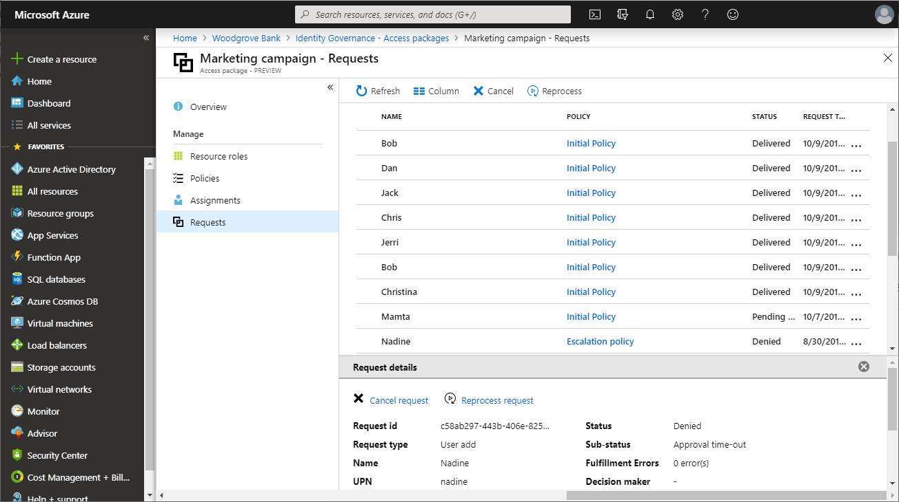

# View requests for an access package in Azure AD entitlement management

In Azure AD entitlement management, you can see who has requested access packages, their policy, and status. This article describes how to view requests for an access packages.

## View requests

**Prerequisite role:** Global administrator, User administrator, Catalog owner, or Access package manager

1. In the Azure portal, click **Azure Active Directory** and then click **Identity Governance**.

1. In the left menu, click **Access packages** and then open the access package.

1. Click **Requests**.

1. Click a specific request to see additional details.

    

## Next steps

- [Change request and approval settings for an access package](entitlement-management-access-package-request-policy.md)
- [View, add, and remove assignments for an access package](entitlement-management-access-package-assignments.md)
- [Troubleshoot requests](entitlement-management-troubleshoot.md#requests)
