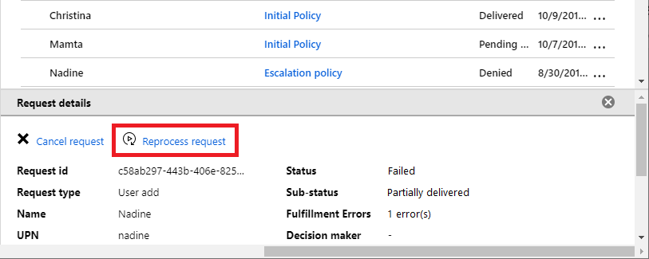

# View and manage requests for an access package in Azure AD entitlement management (Preview)

> [!IMPORTANT]
> Azure Active Directory (Azure AD) entitlement management is currently in public preview.
> This preview version is provided without a service level agreement, and it's not recommended for production workloads. Certain features might not be supported or might have constrained capabilities.
> For more information, see [Supplemental Terms of Use for Microsoft Azure Previews](https://azure.microsoft.com/support/legal/preview-supplemental-terms/).

In Azure AD entitlement management, you can see who has requested access packages, their policy, and status. This article describes how to view, reprocess, and cancel requests for an access packages.

## View requests

**Prerequisite role:** Global administrator, User administrator, Catalog owner, or Access package manager

1. In the Azure portal, click **Azure Active Directory** and then click **Identity Governance**.

1. In the left menu, click **Access packages** and then open the access package.

1. Click **Requests**.

1. Click a specific request to see additional details.

    

## View a request's delivery errors

**Prerequisite role:** Global administrator, User administrator, Catalog owner, or Access package manager

1. In the Azure portal, click **Azure Active Directory** and then click **Identity Governance**.

1. In the left menu, click **Access packages** and then open the access package.

1. Click **Requests**.

1. Select the request you want to view.

    If the request has any delivery errors, the request status will be **Undelivered** or **Partially delivered**.

    If there are any delivery errors, in the request's detail pane, there will be a count of delivery errors.

1. Click the count to see all of the request's delivery errors.

## Reprocess a request

If a request encounters an error, you can reprocess the request to try it again. You can only reprocess a request that has a status of **Delivery failed** or **Partially delivered** and a completed date of less than one week.

**Prerequisite role:** Global administrator, User administrator, Catalog owner, or Access package manager

1. In the Azure portal, click **Azure Active Directory** and then click **Identity Governance**.

1. In the left menu, click **Access packages** and then open the access package.

1. Click **Requests**.

1. Click the request you want to reprocess.

1. In the request details pane, click **Reprocess request**.

    

## Cancel a pending request

You can only cancel a pending request that has not yet been delivered or whose delivery has failed.

**Prerequisite role:** Global administrator, User administrator, Catalog owner, or Access package manager

1. In the Azure portal, click **Azure Active Directory** and then click **Identity Governance**.

1. In the left menu, click **Access packages** and then open the access package.

1. Click **Requests**.

1. Click the request you want to cancel.

1. In the request details pane, click **Cancel request**.

## Next steps

- [Change request and approval settings for an access package](entitlement-management-access-package-request-policy.md)
- [View, add, and remove assignments for an access package](entitlement-management-access-package-assignments.md)