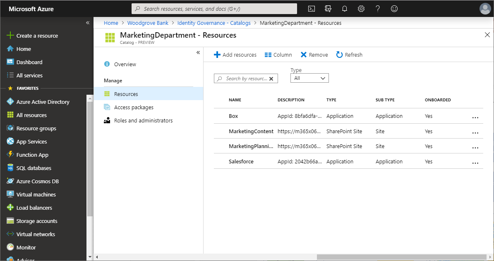
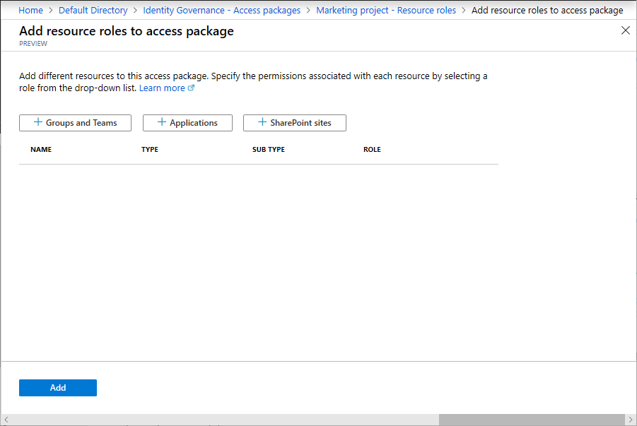
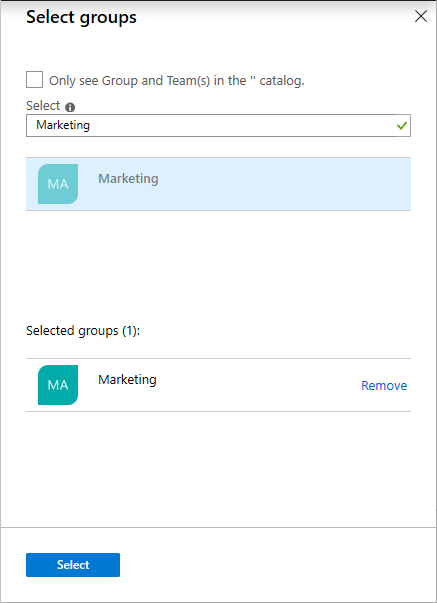
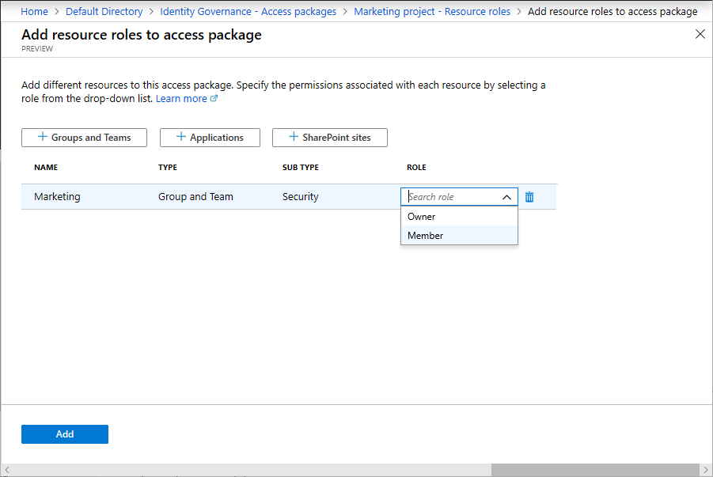
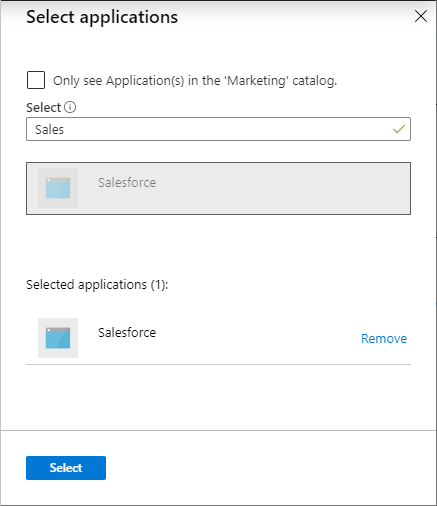
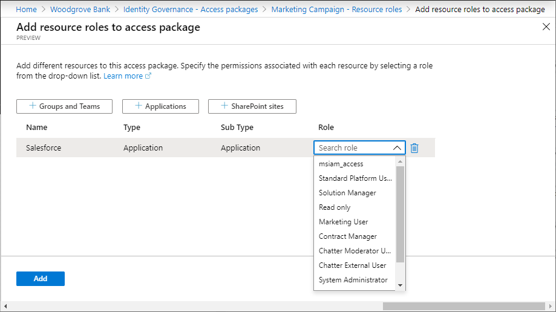
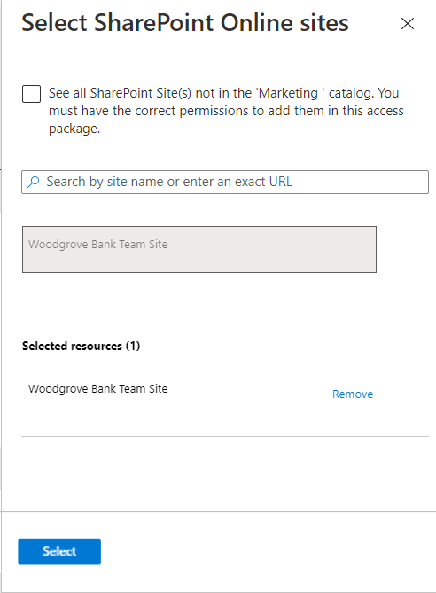
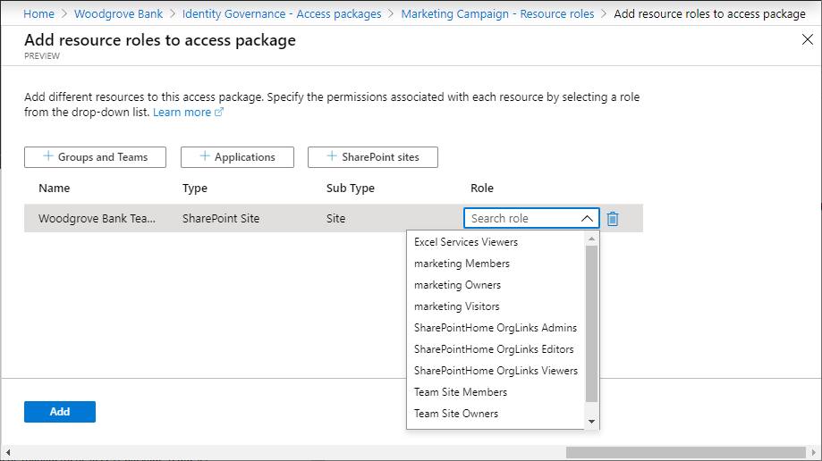

# Change resource roles for an access package in Azure AD entitlement management

As an access package manager, you can change the resources in an access package at any time without worrying about provisioning the user's access to the new resources, or removing their access from the previous resources. This article describes how to change the resource roles for an existing access package.

This video provides an overview of how to change an access package.

> [!VIDEO https://www.microsoft.com/videoplayer/embed/RE3LD4Z]

## Check catalog for resources

If you need to add resources to an access package, you should check whether the resources your need are available in the catalog. If you are an access package manager, you cannot add resources to a catalog, even if you own them. You are restricted to using the resources available in the catalog.

**Prerequisite role:** Global administrator, User administrator, Catalog owner, or Access package manager

1. In the Azure portal, click **Azure Active Directory** and then click **Identity Governance**.

1. In the left menu, click **Catalog** and then open the catalog.

1. In the left menu, click **Resources** to see the list of resources in this catalog.

    

1. If you are an access package manager and you need to add resources to the catalog, you can ask the catalog owner to add them.

## Add resource roles

A resource role is a collection of permissions associated with a resource. The way you make resources available for users to request is by adding resource roles to your access package. You can add resource roles for groups, teams, applications, and SharePoint sites.

**Prerequisite role:** Global administrator, User administrator, Catalog owner, or Access package manager

1. In the Azure portal, click **Azure Active Directory** and then click **Identity Governance**.

1. In the left menu, click **Access packages** and then open the access package.

1. In the left menu, click **Resource roles**.

1. Click **Add resource roles** to open the Add resource roles to access package page.

    

1. Depending on whether you want to add a group, team, application, or SharePoint site, perform the steps in one of the following resource role sections.

## Add a group or team resource role

You can have entitlement management automatically add users to a group or a team in Microsoft Teams when they are assigned an access package. 

- When a group or team is part of an access package and a user is assigned to that access package, the user is added to that group or team, if not already present.
- When a user's access package assignment expires, they are removed from the group or team, unless they currently have an assignment to another access package that includes that same group or team.

You can select any [Azure AD security group or Office 365 Group](../fundamentals/active-directory-groups-create-azure-portal.md). Administrators can add any group to a catalog; catalog owners can add any group to the catalog if they are owner of the group. Keep the following Azure AD constraints in mind when selecting a group:

- When a user, including a guest, is added as a member to a group or team, they can see all the other members of that group or team.
- Azure AD cannot change the membership of a group that was synchronized from Windows Server Active Directory using Azure AD Connect, or that was created in Exchange Online as a distribution group.  
- The membership of dynamic groups cannot be updated by adding or removing a member, so dynamic group memberships are not suitable for use with entitlement management.

For more information, see [Compare groups](https://docs.microsoft.com/office365/admin/create-groups/compare-groups) and [Office 365 Groups and Microsoft Teams](https://docs.microsoft.com/microsoftteams/office-365-groups).

1. On the **Add resource roles to access package** page, click **Groups and Teams** to open the Select groups pane.

1. Select the groups and teams you want to include in the access package.

    

1. Click **Select**.

    Once you select the group or team, the **Sub type** column will list one of the following subtypes:

    | Sub type | Description |
    | --- | --- |
    | Security | Used for granting access to resources. |
    | Distribution | Used for sending notifications to a group of people. |
    | O365 | Office 365 Group that is not Teams-enabled. Used for collaboration between users, both inside and outside your company. |
    | Team | Office 365 Group that is Teams-enabled. Used for collaboration between users, both inside and outside your company. |

1. In the **Role** list, select **Owner** or **Member**.

    You typically select the Member role. If you select the Owner role, that will allow users to add or remove other members or owners.

    

1. Click **Add**.

    Any users with existing assignments to the access package will automatically become members of this group or team when it is added.

## Add an application resource role

You can have Azure AD automatically assign users access to an Azure AD enterprise application, including both SaaS applications and your organization's applications federated to Azure AD, when a user is assigned an access package. For applications that integrate with Azure AD through federated single sign-on, Azure AD will issue federation tokens for users assigned to the application.

Applications can have multiple roles. When adding an application to an access package, if that application has more than one role, you will need to specify the appropriate role for those users. If you are developing applications, you can read more about how those roles are added to your applications in [How to: Configure the role claim issued in the SAML token for enterprise applications](../develop/active-directory-enterprise-app-role-management.md).

Once an application role is part of an access package:

- When a user is assigned that access package, the user is added to that application role, if not already present.
- When a user's access package assignment expires, their access will be removed from the application, unless they have an assignment to another access package that includes that application role.

Here are some considerations when selecting an application:

- Applications may also have groups assigned to their roles as well.  You can choose to add a group in place of an application role in an access package, however then the application will not be visible to the user as part of the access package in the My Access portal.

1. On the **Add resource roles to access package** page, click **Applications** to open the Select applications pane.

1. Select the applications you want to include in the access package.

    

1. Click **Select**.

1. In the **Role** list, select an application role.

    

1. Click **Add**.

    Any users with existing assignments to the access package will automatically be given access to this application when it is added.

## Add a SharePoint site resource role

Azure AD can automatically assign users access to a SharePoint Online site or SharePoint Online site collection when they are assigned an access package.

1. On the **Add resource roles to access package** page, click **SharePoint sites** to open the Select SharePoint Online sites pane.

1. Select the SharePoint Online sites you want to include in the access package.

    

1. Click **Select**.

1. In the **Role** list, select a SharePoint Online site role.

    

1. Click **Add**.

    Any users with existing assignments to the access package will automatically be given access to this SharePoint Online site when it is added.

## Remove resource roles

**Prerequisite role:** Global administrator, User administrator, Catalog owner, or Access package manager

1. In the Azure portal, click **Azure Active Directory** and then click **Identity Governance**.

1. In the left menu, click **Access packages** and then open the access package.

1. In the left menu, click **Resource roles**.

1. In the list of resource roles, find the resource role you want to remove.

1. Click the ellipsis (**...**) and then click **Remove resource role**.

    Any users with existing assignments to the access package will automatically have their access revoked to this resource role when it is removed.

## When changes are applied

In entitlement management, Azure AD will process bulk changes for assignment and resources in your access packages several times a day. So, if you make an assignment, or change the resource roles of your access package, it can take up to 24 hours for that change to be made in Azure AD, plus the amount of time it takes to propagate those changes to other Microsoft Online Services or connected SaaS applications. If your change affects just a few objects, the change will likely only take a few minutes to apply in Azure AD, after which other Azure AD components will then detect that change and update the SaaS applications. If your change affects thousands of objects, the change will take longer. For example, if you have an access package with 2 applications and 100 user assignments, and you decide to add a SharePoint site role to the access package, there may be a delay until all the users are part of that SharePoint site role. You can monitor the progress through the Azure AD audit log, the Azure AD provisioning log, and the SharePoint site audit logs.

When you remove a member of a team, they are removed from the Office 365 Group as well. Removal from the team's chat functionality might be delayed. For more information, see [Group membership](https://docs.microsoft.com/microsoftteams/office-365-groups#group-membership).

## Next steps

- [Create a basic group and add members using Azure Active Directory](../fundamentals/active-directory-groups-create-azure-portal.md)
- [How to: Configure the role claim issued in the SAML token for enterprise applications](../develop/active-directory-enterprise-app-role-management.md)
- [Introduction to SharePoint Online](/sharepoint/introduction)