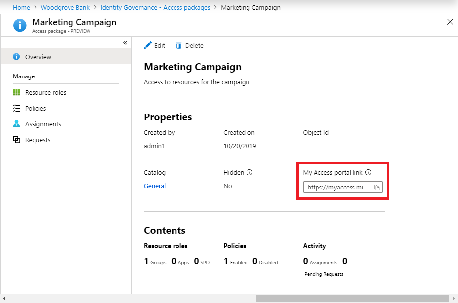

# Share link to request an access package in entitlement management

Most users in your directory can sign in to the My Access portal and automatically see a list of access packages they are in scope of a policy and can request. In addition, users from outside of your directory that are in scope, can also see access packages they are in scope of a policy and can request.  However, if you have sensitive access packages or external business partner users that aren't yet in your directory but aren't part of an existing connected organization, those access packages should be hidden.  Even though the user can request a hidden access package, they won't see it in the My access portal if they don't have the link. Instead, you'll need to send them a link that they can use to request that access package.

In order for the external user from another directory to use the My Access portal link to request the access package, the catalog for the access package must be [enabled for external users](entitlement-management-catalog-create.md) and there must be a [policy for the external user's directory](entitlement-management-access-package-request-policy.md) in the access package.

## Share link to request an access package

[!INCLUDE [portal updates](~/articles/active-directory/includes/portal-update.md)]

**Prerequisite role:** Global Administrator, Identity Governance Administrator, Catalog owner, or Access package manager

1. Sign in to the [Microsoft Entra admin center](https://entra.microsoft.com) as at least an [Identity Governance Administrator](../roles/permissions-reference.md#identity-governance-administrator).

1. Browse to **Identity governance** > **Entitlement management** > **Access package**.

1. On the **Access packages** page open the access package you want to share a link to request an access package for.

1. On the Overview page, check the **Hidden** setting.  If the **Hidden** setting is **Yes**, then even users who do not have the My Access portal link can browse and request the access package. If you do not wish to have them browse for the access package, then change the setting to **No**.

1. On the Overview page, copy the **My Access portal link**.

    

    It's important that you copy the entire My Access portal link when sending it to an internal business partner. This ensures that the partner gets access to your directory's portal to make their request. The link starts with `myaccess`, includes a directory hint, and ends with an access package ID.  (For US Government, the domain in the My Access portal link will be `myaccess.microsoft.us`.)

    `https://myaccess.microsoft.com/@<directory_hint>#/access-packages/<access_package_id>`

1. Email or send the link to your external business partner. They can share the link with their users in their organization to request the access package.

## Next steps

- [Request access to an access package](entitlement-management-request-access.md)
- [Approve or deny access requests](entitlement-management-request-approve.md)