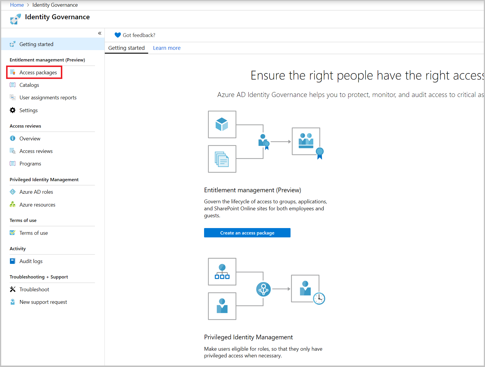
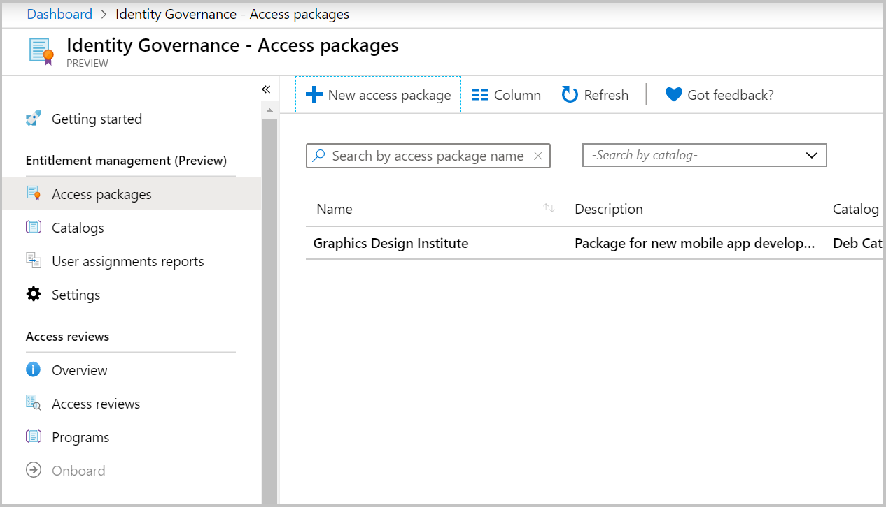
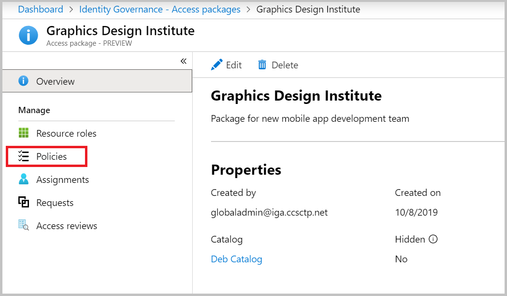
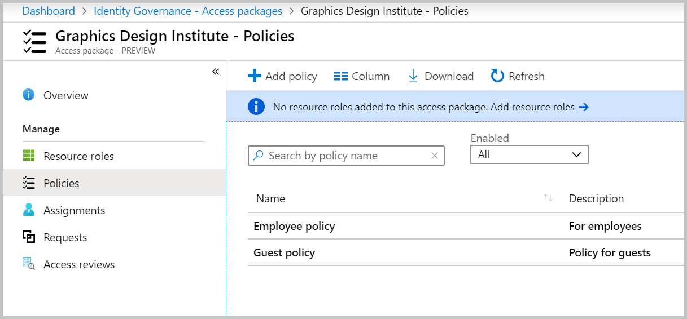
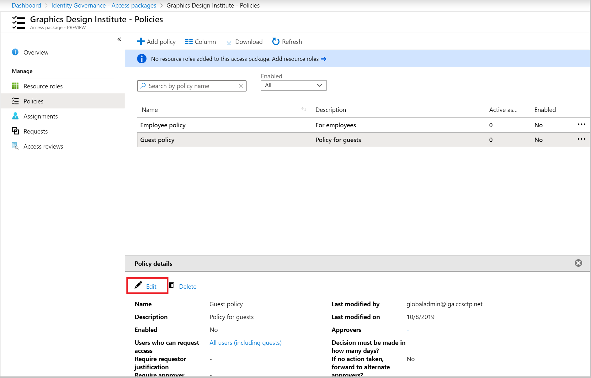
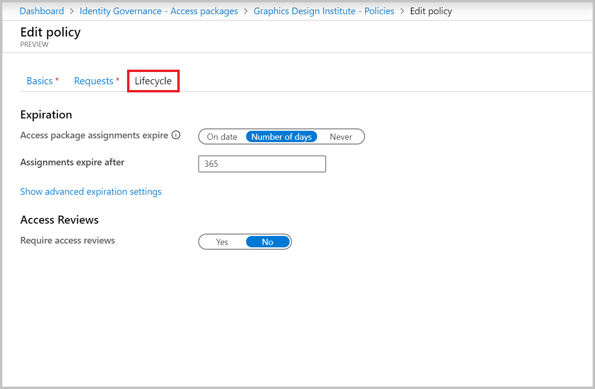
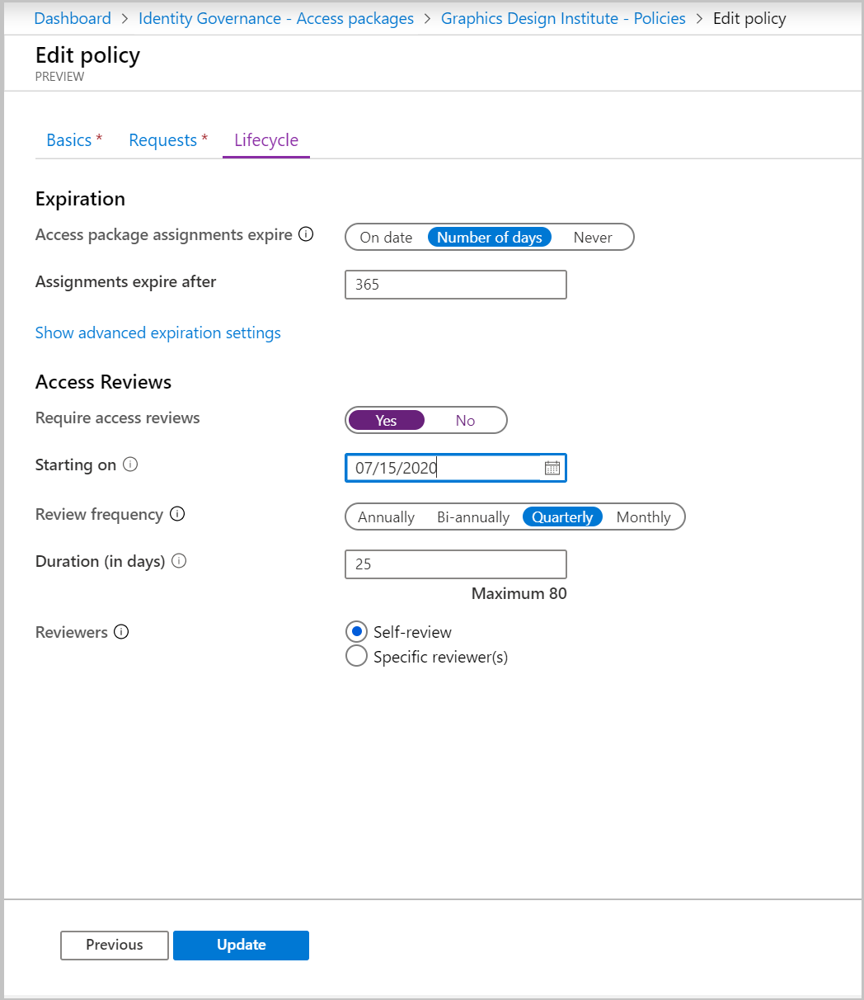
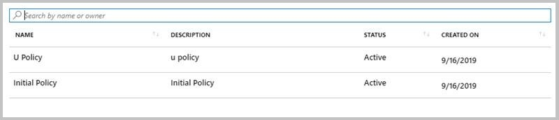

# Create an access review of Entitlement Management access packages (Preview)

> [!IMPORTANT]
> Azure Active Directory (Azure AD) entitlement management is currently in public preview.
> This preview version is provided without a service level agreement, and it's not recommended for production workloads. Certain features might not be supported or might have constrained capabilities.
> For more information, see [Supplemental Terms of Use for Microsoft Azure Previews](https://azure.microsoft.com/support/legal/preview-supplemental-terms/).

To reduce the risk of stale access, you should enable periodic reviews of users who have active assignments to the access package.  You can enable reviews of access package policies when creating a new policy or editing an existing policy. This article describes how to enable access reviews for Entitlement Manage access packages. 

## Prerequisites

To enable reviews of access packages, you must meet the prerequisites for creating an access package.  

## Enable reviews in an access package

You can enable access reviews when creating a new policy or editing an existing access package policy. Follow these steps to enable access reviews while creating a new policy in an access package:

## Enable reviews in an existing access package

Follow these steps to enable access reviews to an existing access package:

1. Sign in to the Azure portal and open the **Identity Governance Blade**. 

1. In the left menu, click on **Access packages** under **Entitlement Management**. !

1. In the right pane, select the access package for which you would like to create an access review.
 
1. In the left menu, click on **Policies**. 

1. Select the policy in which you want to create the access review. 

1. Click **Edit** under **Policy details**. 

1. Click on **Lifecycle**. 

1. Under **Access Reviews**, click **Yes** for Require access reviews. 

1. Set the **Starting on** date. The review will begin at the end of day on this date. For example, if you select the start date as July 15, 2020, the review will begin on July 15 at 11:59PM.

1. Set the **Review frequency** to **Annually**, **Bi-annually** (every 6 months), **Quarterly** (every 3 months), or **Monthly** (once per month).

1. Set the **Duration** to define how many days each review of the recurring series will be open for input from reviewers. For example, you might schedule an Annual review that starts on January 1 and is open for input for 30 days so that reviewers have until the end of the month to respond.

1. Set the **Reviewers** to be

    1. **Self-review** if you want the access package assignees to review their own access, or 
    1. Select **Specific reviewer(s)** if you want to choose one or more specific individuals to be the reviewers

1. Click on **Update** at the bottom of the page.

## View status of the review

After the start date of the review, it will appear in the list with an indicator of its status: 
 
 
By default, Azure AD will send an email to reviewers shortly after the review starts. The email will contain instructions for how to review access to access packages. If the review is for users to review their own access, show them the instructions for how to review access for yourself to access packages.
  
If you have assigned guests as reviewers who have not accepted their Azure AD guest invitation, they will not receive emails from Azure AD Access Reviews. They must first accept the invite and create an account with Azure AD prior to being able to receive emails.  

## Next steps

Advance to one of the following article to learn about how to use entitlement management access reviews:

- [Review access of access packages](entitlement-management-access-reviews-review-access.md) 
- [Complete an access review of access packages](entitlement-management-access-reviews-complete.md)