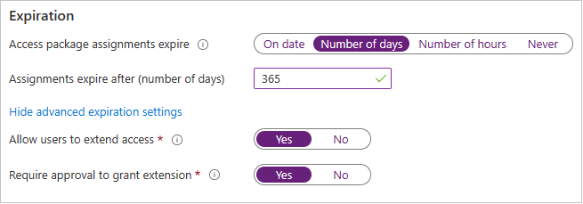
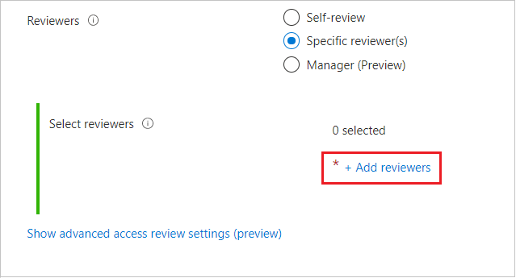
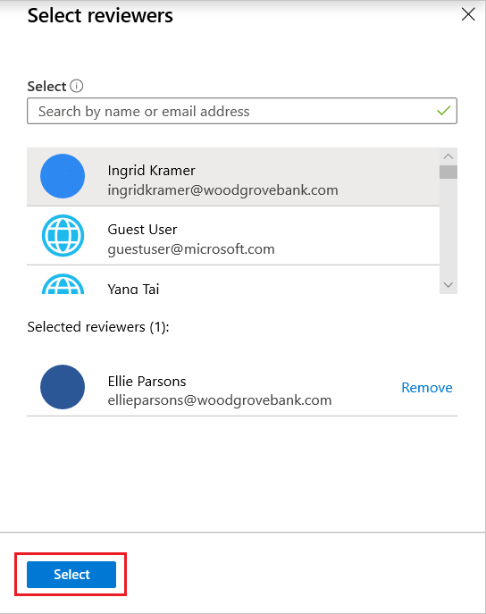
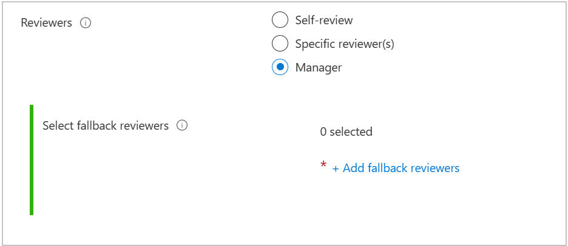
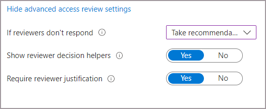
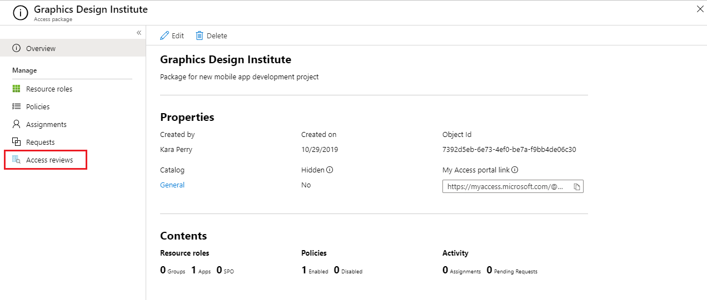
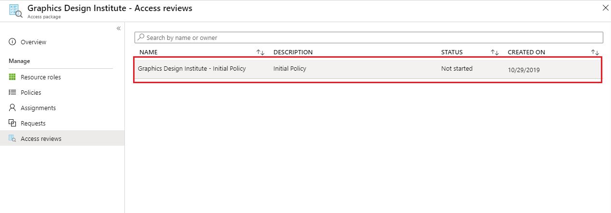
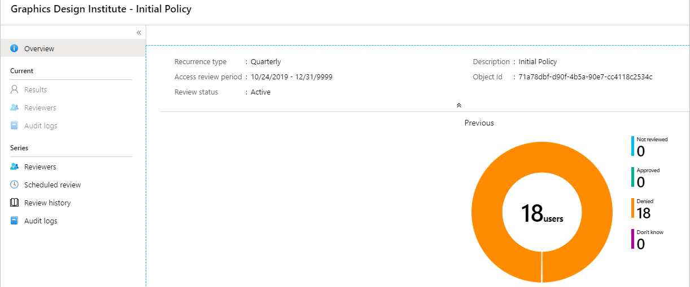

# Create an access review of an access package in entitlement management

To reduce the risk of stale access, you should enable periodic reviews of users who have active assignments to an access package in entitlement management. You can enable reviews when you create a new access package or edit an existing access package assignment policy. This article describes how to enable access reviews of access packages.

## Prerequisites

To enable reviews of access packages, you must meet the prerequisites for creating an access package:
- Microsoft Entra ID P2 or Microsoft Entra ID Governance
- Global administrator, Identity Governance administrator, Catalog owner, or Access package manager

For more information, see [License requirements](entitlement-management-overview.md#license-requirements).

## Create an access review of an access package

[!INCLUDE [portal updates](~/articles/active-directory/includes/portal-update.md)]

You can enable access reviews when [creating a new access package](entitlement-management-access-package-create.md) or [editing an existing access package assignment policy](entitlement-management-access-package-lifecycle-policy.md) policy. If you have multiple policies, for different communities of users to request access, you can have independent access review schedules for each policy. Follow these steps to enable access reviews of an access package's assignments:

1. Sign in to the [Microsoft Entra admin center](https://entra.microsoft.com) as at least an [Identity Governance Administrator](../roles/permissions-reference.md#identity-governance-administrator).

1. Browse to **Identity governance** > **Access reviews** > **Access package**.

1. To create a new access policy, select **New access** package.

1. To edit an existing access policy, in the left menu, select **Access packages** and open the access package you want to edit. Then, in the left menu, select **Policies** and select the policy that has the lifecycle settings you want to edit.

1. Open the **Lifecycle** tab for an access package assignment policy to specify when a user's assignment to the access package expires. You can also specify whether users can extend their assignments.

1. In the **Expiration** section, set Access package assignments expires to **On date**, **Number of days**, **Number of hours**, or **Never**.

    For **On date**, select an expiration date in the future.

    For **Number of days**, specify a number between 0 and 3660 days.

    For **Number of hours**, specify a number of hours.

    Based on your selection, a user's assignment to the access package expires on a certain date, a certain number of days after they're approved, or never.
    
    

1. Select Show advanced expiration settings to show other settings.

1. To allow user to extend their assignments, set **Allow users to extend access** to **Yes**.

    If extensions are allowed in the policy, the user will receive an email 14 days and also one day before their access package assignment is set to expire, prompting them to extend the assignment. The user must still be in the scope of the policy at the time they request an extension. Also, if the policy has an explicit end date for assignments, and a user submits a request to extend access, the extension date in the request must be at or before when assignments expire, as defined in the policy that was used to grant the user access to the access package. For example, if the policy indicates that assignments are set to expire on June 30, the maximum extension a user can request is June 30.

    If a user's access is extended, they won't be able to request the access package after the specified extension date (date set in the time zone of the user who created the policy).

1. To require approval to grant an extension, set **Require approval to grant extension** to **Yes**.

    The same approval settings that were specified on the Requests tab will be used.

1. Next, move the **Require access reviews** toggle to **Yes**.

    

1. Specify the date the reviews will start next to **Starting on**.

1. Next, set the **Review frequency** to **Annually**, **Bi-annually**, **Quarterly** or **Monthly**.
This setting determines how often access reviews will occur.

1. Set the **Duration** to define how many days each review of the recurring series will be open for input from reviewers. For example, you might schedule an annual review that starts on January 1 and is open for review for 30 days so that reviewers have until the end of the month to respond.

1. Next to **Reviewers**, select **Self-review** if you want users to perform their own access review or select **Specific reviewer(s)** if you want to designate a reviewer. You can also select **Manager** if you want to designate the reviewer’s manager to be the reviewer. If you select this option, you need to add a **fallback** to forward the review to in case the manager can't be found in the system.

1. If you selected **Specific reviewer(s)**, specify which users will do the access review:

    

    1. Select **Add reviewers**.
    1. In the **Select reviewers** pane, search for and select the user(s) you want to be a reviewer.
    1. When you've selected your reviewer(s), select the **Select** button.

    

1. If you selected **Manager**, specify the fallback reviewer: 
    1. Select **Add fallback reviewers**.
    1. In the Select fallback reviewers pane, search for and select the user(s) you want to be fallback reviewer(s) for the reviewer's manager.
    1. When you've selected your fallback reviewer(s), select the **Select** button. 

    

1. There are other advanced settings you can configure. To configure other advanced access review settings, select **Show advanced access review settings**:
    1. If you want to specify what happens to users' access when a reviewer doesn't respond, select **If reviewers don't respond**, and then select one of the following: 
        - **No change** if you don't want a decision made on the users' access.
        - **Remove access** if you want the users' access removed.
        - **Take recommendations** if you want a decision to be made based on recommendations from MyAccess.
        
        
        
    1. If you want to see system recommendations, select **Show reviewer decision helpers**. The system's recommendations are based on the users' activity. The reviewers will see one of the following recommendations: 
        - **approve** the review if the user has signed-in at least once during the last 30 days. 
        - **deny** the review if the user hasn't signed-in during the last 30 days.
    1. If you want the reviewer to share their reasons for their approval decision, select **Require reviewer justification**. Their justification is visible to other reviewers and the requestor.

1. Select **Review + Create** or select **next** if you're creating a new access package. Select **Update** if you're editing an access package, at the bottom of the page.

## View the status of the access review

After the start date, an access review will be listed in the **Access reviews** section. Follow these steps to view the status of an access review:

1. In **Identity Governance**, select **Access packages** then select the access package with the access review status you'd like to check.   

1. Once you are on the access package overview, select **Access reviews** on the left menu.
    
    

1. A list will appear that contains all of the policies that have access reviews associated with them. Select the review to see its report.

    
   
1. When you view the report, it shows the number of users reviewed and the actions taken by the reviewer on them.

    
 

## Access reviews email notifications
You can designate reviewers, or users can review their access themselves. By default, Microsoft Entra ID will send an email to reviewers or self-reviewers shortly after the review starts.

The email will include instructions on how to review access to access packages. If the review is for users to review their access, show them the instructions on how to perform a self-review of their access packages.
  
If you've assigned guest users as reviewers, and they haven't accepted their Microsoft Entra guest invitation, they won't receive emails from access reviews. They must first accept the invite and create an account with Microsoft Entra ID before they can receive the emails. 

## Next steps

- [Review access of access packages](entitlement-management-access-reviews-review-access.md)
- [Self-review of access packages](entitlement-management-access-reviews-self-review.md)
