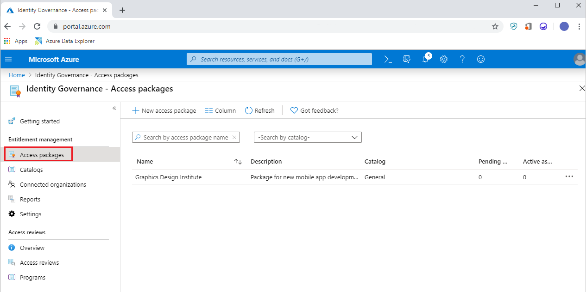
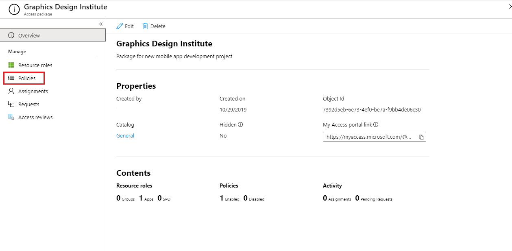
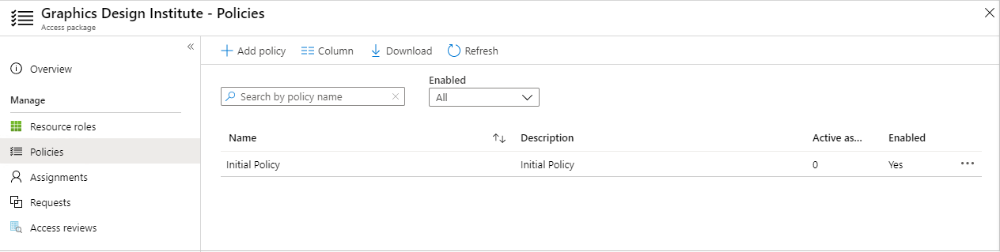
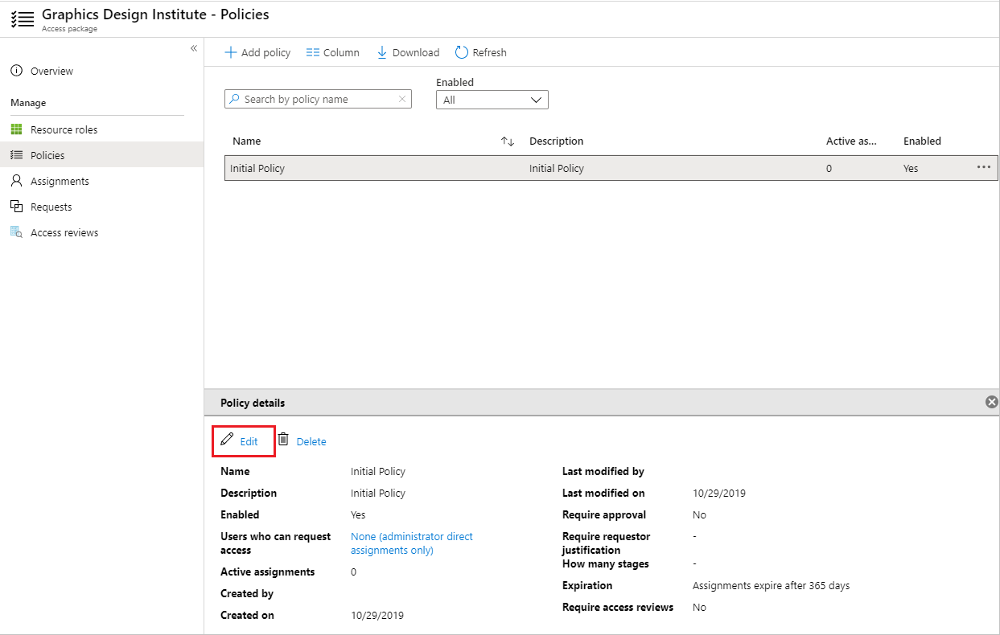
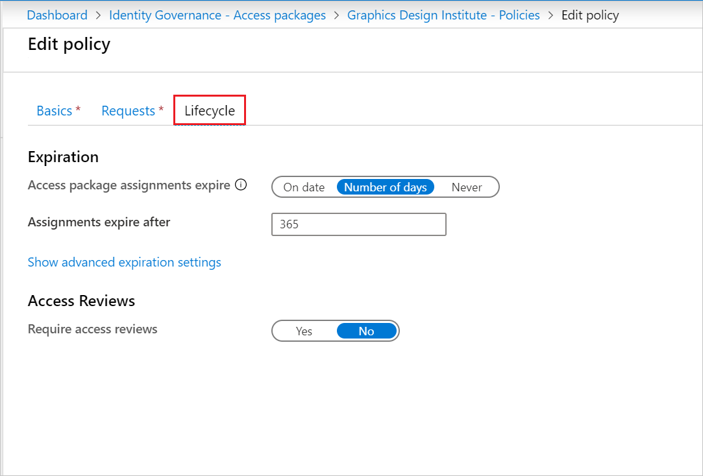
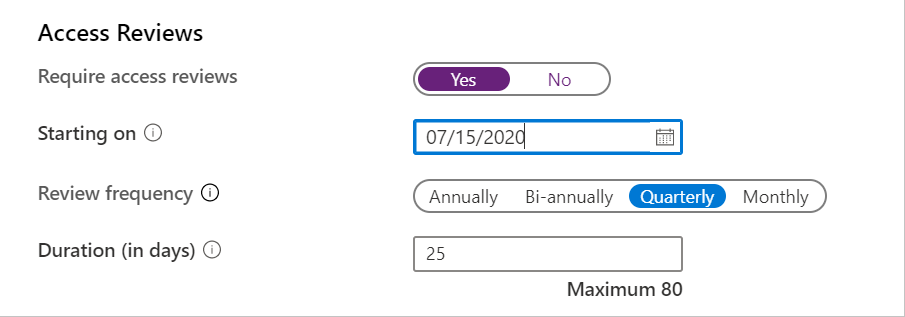
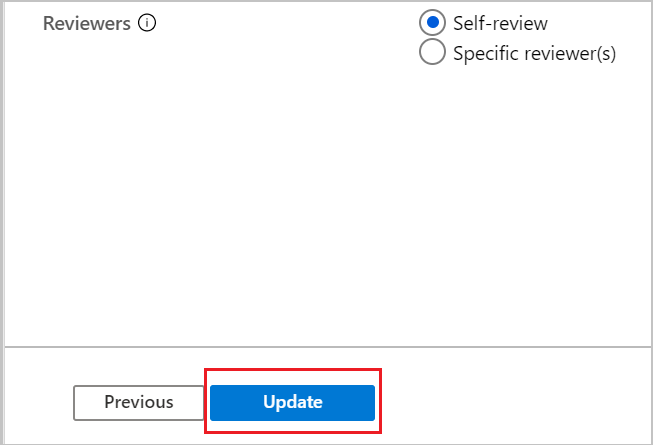

# Create an access review of an access package in Azure AD entitlement management (preview)

> [!IMPORTANT]
> Azure Active Directory (Azure AD) entitlement management is currently in public preview.
> This preview version is provided without a service level agreement, and it's not recommended for production workloads. Certain features might not be supported or might have constrained capabilities.
> For more information, see [Supplemental Terms of Use for Microsoft Azure Previews](https://azure.microsoft.com/support/legal/preview-supplemental-terms/).

To reduce the risk of stale access, you should enable periodic reviews of users who have active assignments to the access package.  You can enable reviews of access package policies when creating a new policy or editing an existing policy. This article describes how to enable access reviews for Entitlement Manage access packages. 

## Prerequisites

To enable reviews of access packages, you must meet the prerequisites for creating an access package:
- Azure AD Premium P2
- Global administrator, User administrator, Catalog owner, or Access package manager

For more information, see [License requirements](entitlement-management-overview.md#license-requirements).

## Create access reviews in an access package

You can enable access reviews when [creating a new policy](entitlement-management-access-package-create.md) or [editing an existing access package](entitlement-management-access-package-request-policy.md) policy. Follow these steps to enable access reviews while creating a new policy in an access package:

1. Once you are in the **Lifecycle** section while creating a new policy, scroll down to **Access Reviews**.
    
    

1. Move the **Require access reviews** toggle to **Yes**. 

1. Specify the date the reviews will start next to **Starting on**. 

1. Next, set the **Review frequency** to **Annually**, **Bi-annually**, **Quarterly** or **Monthly**. 
This determines how often access reviews will occur.

1. Set the **Duration** to define how many days each review of the recurring series will be open for input from reviewers. For example, you might schedule an Annual review that starts on January 1 and is open for input for 30 days so that reviewers have until the end of the month to respond.

1. Next to **Reviewers**, select **Self-review** if you want users to perform their own access review or select **Specific reviewer(s)** if you want to designate a reviewer.

    

1. If you selected **Specific reviewer(s)**, specify which users will perform the access review:
    1. Select **Add reviewers**
    1. In the **Select reviewers** pane, search for and select the user(s) you want to be a reviewer.
    1. Once you have selected your reviewer(s), click the **Select** button.

    

## Create access reviews in an existing access package

Follow these steps to enable access reviews to an existing access package:

1. Sign in to the Azure portal and open the **Identity Governance** blade. 

1. In the left menu, click on **Access packages** under **Entitlement management**. 
    
    

1. In the right pane, select the access package for which you would like to create an access review.
 
1. In the left menu, select **Policies**. 
      

1. Select the policy in which you want to create the access review.
  
        

1. Click **Edit** under **Policy details**. 
    
    

1. Click on **Lifecycle**. 

    

1. Under **Access Reviews**, click **Yes** for **Require access reviews**. 

    

1. Set the **Starting on** date. The review will begin at the end of day on this date. For example, if you select the start date as July 15, 2020, the review will begin on July 15 at 11:59PM.

1. Set the **Review frequency** to **Annually**, **Bi-annually** (every 6 months), **Quarterly** (every 3 months), or **Monthly** (once per month).

1. Set the **Duration (in days)** to specify how many days long the access review will be.

1. Set the **Reviewers** to be:

    1. **Self-review** if you want the access package assignees to review their own access, or 
    1. Select **Specific reviewer(s)** if you want to choose one or more specific individuals to be the reviewers

    

1. Click on **Update** at the bottom of the page.

## View the status of the review

After the start date of the review, it will appear in a list in **Access reviews** where you can view the status of the view. Use the following procedure to view the status of an access review: 

1. In **Identity Governance**, click on **Access packages** then select the access package with the access review status you'd like to check.   

1. Once you are on the access package overview, click on **Access reviews** on the left menu.
    
    

1. A list will appear that contains all of the policies that have access reviews associated with them. Click on the review to see its report.

    
   
1. When you view the report, it shows the number of users reviewed and the actions taken by the reviewer on them.

    
 

## Access reviews email notifications
You can designate reviewers, or users can review their access themselves. By default, Azure AD will send an email to reviewers or self-reviewers shortly after the review starts. 

The email will include instructions on how to review access to access packages. If the review is for users to review their access, show them the instructions on how to perform a self-review of their access packages.
  
If you have assigned guest users as reviewers, and they have not accepted their Azure AD guest invitation, they will not receive emails from Azure AD access reviews. They must first accept the invite and create an account with Azure AD before they can receive the emails.  

## Next steps

- [Review access of access packages](entitlement-management-access-reviews-review-access.md) 
- [Self-review of access packages](entitlement-management-access-reviews-self-review.md)