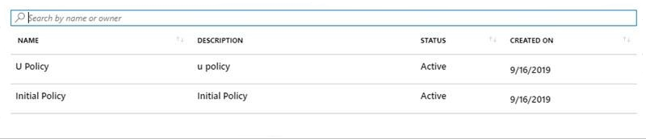

# Create an access review of Entitlement Management access packages (Preview)

> [!IMPORTANT]
> Azure Active Directory (Azure AD) entitlement management is currently in public preview.
> This preview version is provided without a service level agreement, and it's not recommended for production workloads. Certain features might not be supported or might have constrained capabilities.
> For more information, see [Supplemental Terms of Use for Microsoft Azure Previews](https://azure.microsoft.com/support/legal/preview-supplemental-terms/).

To reduce the risk of stale access, you should enable periodic reviews of users who have active assignments to the access package.  You can enable reviews of access package policies when creating a new policy or editing an existing policy. This article describes how to enable access reviews for Entitlement Manage access packages. 

## Prerequisites

To enable reviews of access packages, you must meet the prerequisites for creating an access package.  

## Enable reviews in an access package

You can enable access reviews when creating a new policy or editing an existing access package policy. Follow these steps to enable access reviews while creating a new policy in an access package:

[!INCLUDE [Entitlement management access reviews policy](../../../includes/active-directory-entitlement-management-access-reviews-policy.md)]

## View status of the review

After the start date of the review, it will appear in the list with an indicator of its status: 

 
By default, Azure AD will send an email to reviewers shortly after the review starts. The email will contain instructions for how to review access to access packages. If the review is for users to review their own access, show them the instructions for how to review access for yourself to access packages.
  
If you have assigned guests as reviewers who have not accepted their Azure AD guest invitation, they will not receive emails from Azure AD Access Reviews. They must first accept the invite and create an account with Azure AD prior to being able to receive emails.  

## Next steps

Advance to one of the following article to learn about how to use entitlement management access reviews:

- [Review access of access packages](entitlement-management-access-reviews-review-access.md) 
- [Complete an access review of access packages](entitlement-management-access-reviews-complete.md)