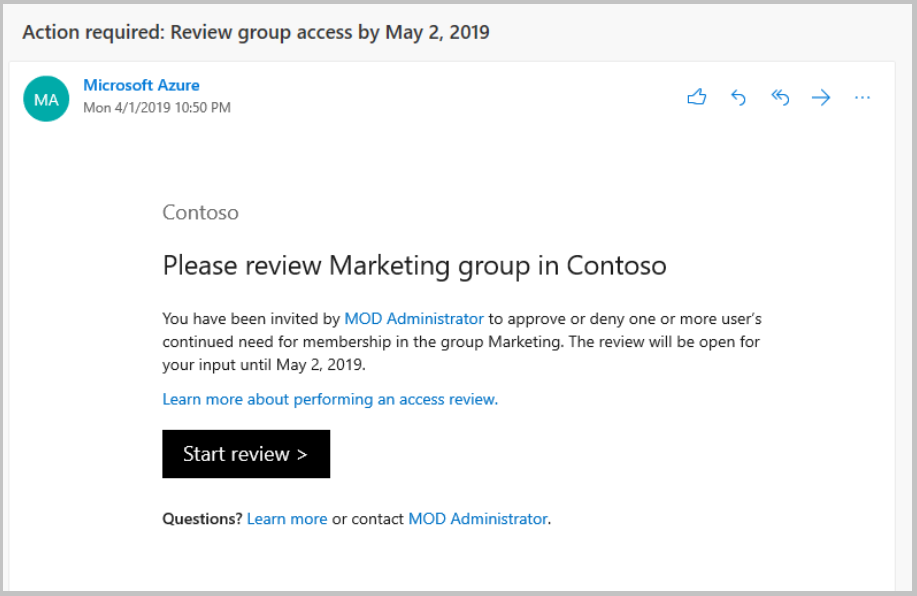

# Review access of access packages using Azure AD access reviews (Preview) 

> [!IMPORTANT]
> Azure Active Directory (Azure AD) entitlement management is currently in public preview.
> This preview version is provided without a service level agreement, and it's not recommended for production workloads. Certain features might not be supported or might have constrained capabilities.
> For more information, see [Supplemental Terms of Use for Microsoft Azure Previews](https://azure.microsoft.com/support/legal/preview-supplemental-terms/).

Azure AD Entitlement Management simplifies how enterprises manage access to groups, applications, and SharePoint sites. This article describes how a designated reviewer performs an access review for users assigned to an access package. 

## Open the access review

Use the following steps to find and open the access review:

1. Look for an email from Microsoft that asks you to review access. Here is an example email to review access: 

1. Click the Review access link to open the access review 

1. If you don’t have the email, you can find your pending access reviews by navigating directly to https://myaccess.microsoft.com  

## Next Steps