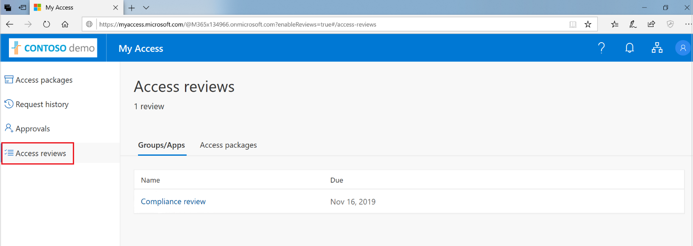
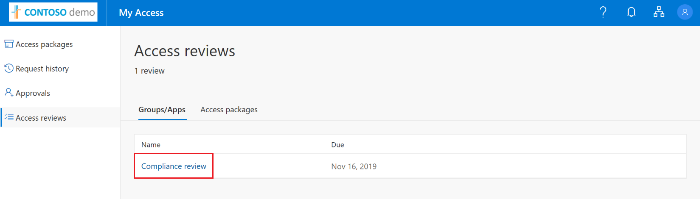
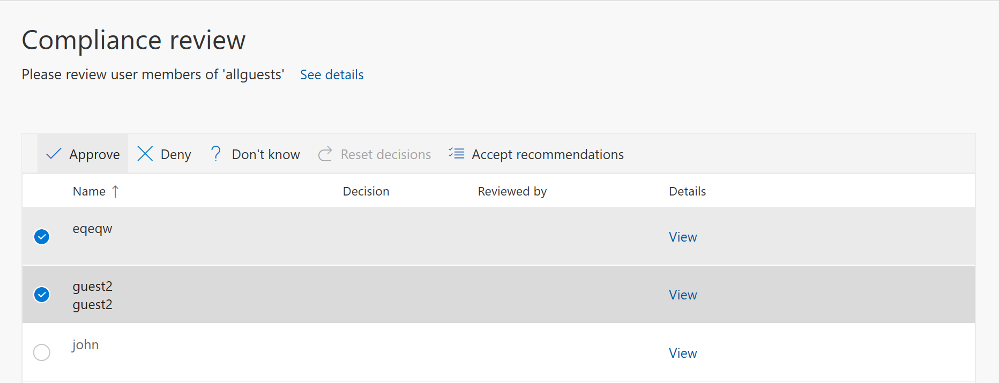
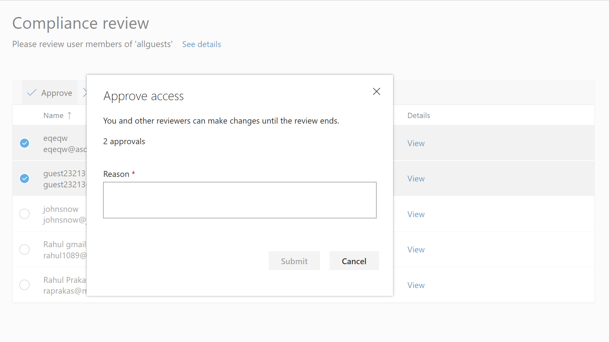
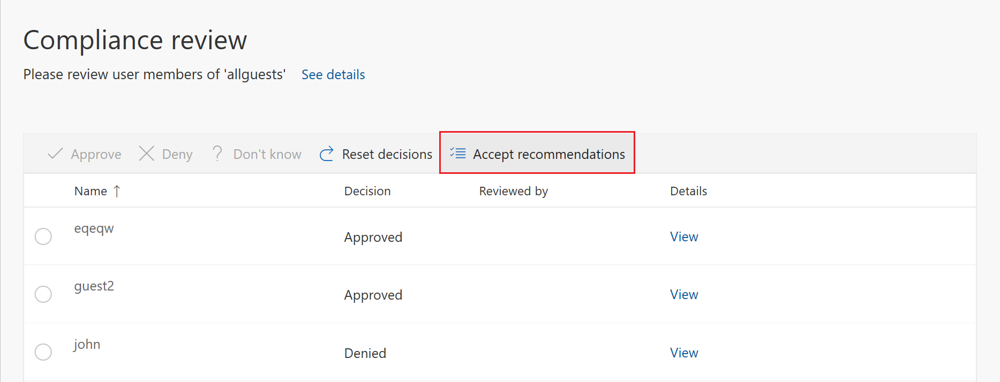
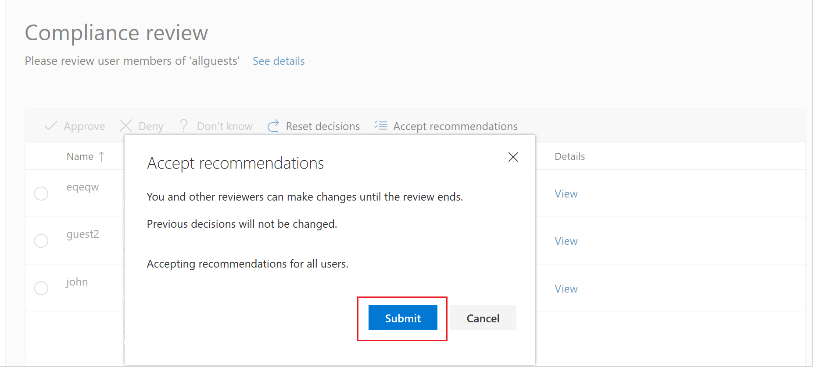

# Review access to an access package in Azure AD entitlement management (Preview)

> [!IMPORTANT]
> Azure Active Directory (Azure AD) entitlement management is currently in public preview.
> This preview version is provided without a service level agreement, and it's not recommended for production workloads. Certain features might not be supported or might have constrained capabilities.
> For more information, see [Supplemental Terms of Use for Microsoft Azure Previews](https://azure.microsoft.com/support/legal/preview-supplemental-terms/).

Azure AD Entitlement Management simplifies how enterprises manage access to groups, applications, and SharePoint sites. This article describes how to perform access reviews for other users assigned to an access package as a designated reviewer.

## Prerequisites

To review users' active access package assignments, you must meet the prerequisites for performing an access review:
- Azure AD Premium P2
- Global administrator
- Designated User administrator, Catalog owner, or Access package manager

For more information, see [License requirements](entitlement-management-overview.md#license-requirements).

## Open the access review

Use the following steps to find and open the access review:

1. You may receive an email from Microsoft that asks you to review access. Locate the email to open the access review. Here is an example email to review access: 
    
    

1. Click the **Review access** link to open the access review. 

1. If you don’t have the email, you can find your pending access reviews by navigating directly to https://myaccess.microsoft.com.  

1. Click on **Access reviews** on the left navigation bar to see a list of pending access reviews assigned to you.
    
    

1. Click on the review that you’d like to begin.
    
    

## Perform the access review

Once you have opened the access review, you will see the names of users for which you need to review. There are two ways that you can approve or deny access:
- You can manually approve or deny access for one or more users
- You can accept the system recommendations

### Manually approve or deny access for one or more users
1. Review the list of users and determine whether or not each user needs to continue to have access.

1. To approve or deny access, select the radio button to the left of the user’s name, and select **Approve** or **Deny** in the bar above the user names. 
   
    
   
    

1. If you are unsure, you can click the **Don’t know** button. 

    If you make this selection, the user maintains access, and this selection will be in the audit logs. This will notify any other reviewers that while you were unsure if the user's access should continue, you still completed the review.

1. You may be required to provide a reason for your decision. Type in a reason and click **Submit**.

1. You can change your decision at any time before the end of the review. To do so, select the user from the list and change the decision. For example, you can approve access for a user you previously denied.

If there are multiple reviewers, the last submitted response is recorded. Consider an example where an administrator designates two reviewers – Alice and Bob. Alice opens the review first and approves access. Before the review ends, Bob opens the review and denies access. In this case, the last deny access decision gets recorded.

>[!NOTE]
>If a user is denied access, they aren't removed from the access package immediately. The user will be removed from the access package when the review ends, or an administrator ends the review.

### Approve or deny access using the system generated recommendations

To review access for multiple users more quickly, you can use the system-generated recommendations, accepting the recommendations with a single click. The recommendations are generated based on the user's sign-in activity.

1.	In the bar at the top of the page, click **Accept recommendations**.
    
    
    
    You will see a summary of the recommended actions

1.	Click **Submit** to accept the recommendations.
    
    

## Next steps

- [Self-review of access packages](entitlement-management-access-reviews-self-review.md)