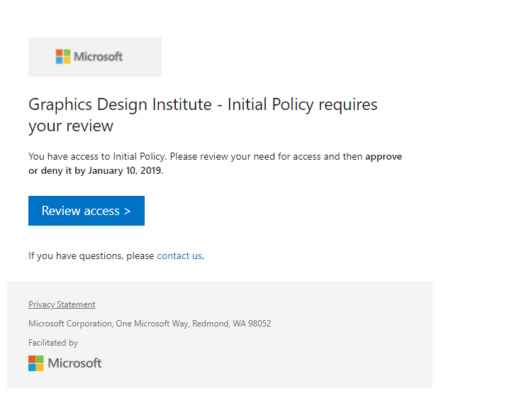

# Self-review of an access package in entitlement management

Entitlement management simplifies how enterprises manage access to groups, applications, and SharePoint sites. This article describes how a user does a self-review of their assigned access package(s).

## Open the access review

To do an access review, you must first open the access review. Use the following procedure to find and open the access review:

1. You may receive an email from Microsoft that asks you to review access. Locate the email to open the access review. Here's an example of an email requesting a review of access: 
    
    

1. Select the **Review access** link.

1. You can also go directly to https://myaccess.microsoft.com to find your pending access reviews if you don't receive an email.  (For US Government, use `https://myaccess.microsoft.us` instead.)

1. Select **Access reviews** on the left navigation bar to see a list of pending access reviews assigned to you.

1. Select the review that you’d like to begin.

## Perform the access review

Once you open the access review, you can see your access. Use the following procedure to do the access review:

1. Decide whether you still need access to the access package. For example, the project you're working on isn't complete, so you still need access to continue working on the project.

1. Select **Yes** to keep your access or select **No** to remove your access.
    >[!NOTE]
    >If you stated that you no longer need access, you aren't removed from the access package immediately. You will be removed from the access package when the review ends or if an administrator stops the review.

1. If you chose **Yes**, you may need to include a justification statement in the **Reason** box.

1. Select **Submit**.

You can return to the review if you change your mind and decide to change your response before the end of the review.

## Next steps

- [Review access to access packages](entitlement-management-access-reviews-review-access.md) 
