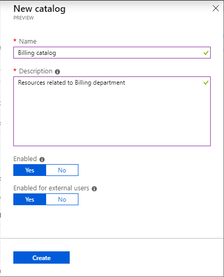

# Create and manage a catalog in Azure AD entitlement management (Preview)

> [!IMPORTANT]
> Azure Active Directory (Azure AD) entitlement management is currently in public preview.
> This preview version is provided without a service level agreement, and it's not recommended for production workloads. Certain features might not be supported or might have constrained capabilities.
> For more information, see [Supplemental Terms of Use for Microsoft Azure Previews](https://azure.microsoft.com/support/legal/preview-supplemental-terms/).

## Create a catalog

A catalog is a container of resources and access packages. You create a catalog when you want to group related resources and access packages. Whoever creates the catalog becomes the first catalog owner. A catalog owner can add additional catalog owners.

**Prerequisite role:** User administrator or Catalog creator

1. Sign in to the [Azure portal](https://portal.azure.com).

1. Click **Azure Active Directory** and then click **Identity Governance**.

1. In the left menu, click **Catalogs**.

    

1. Click **New catalog**.

1. Enter a unique name for the catalog and provide a description.

    Users will see this information in an access package's details.

1. If you want the access packages in this catalog to be available for users to request as soon as they are created, set **Enabled** to **Yes**.

1. If you want to allow users in selected external directories to be able to request access packages in this catalog, set **Enabled for external users** to **Yes**.

    

1. Click **Create** to create the catalog.

## Add resources to a catalog

To include resources in an access package, the resources must exist in a catalog. The types of resources you can add are groups, applications, and SharePoint Online sites. The groups can be cloud-created Office 365 groups or cloud-created Azure AD security groups. The applications can be Azure AD enterprise applications, including both SaaS applications and your own applications federated to Azure AD. The sites can be SharePoint Online sites or SharePoint Online site collections.

**Prerequisite role:** See [Required roles to add resources to a catalog](entitlement-management-delegate.md#required-roles-to-add-resources-to-a-catalog)

1. In the Azure portal, click **Azure Active Directory** and then click **Identity Governance**.

1. In the left menu, click **Catalogs** and then open the catalog you want to add resources to.

1. In the left menu, click **Resources**.

1. Click **Add resources**.

1. Click a resource type: **Groups**, **Applications**, or **SharePoint sites**.

    If you don't see a resource that you want to add or you are unable to add a resource, make sure you have the required Azure AD directory role and entitlement management role. You might need to have someone with the required roles add the resource to your catalog. For more information, see [Required roles to add resources to a catalog](entitlement-management-delegate.md#required-roles-to-add-resources-to-a-catalog).

1. Select one or more resources of the type that you would like to add to the catalog.

1. When finished, click **Add**.

    These resources can now be included in access packages within the catalog.

## Remove resources from a catalog

You can remove resources from a catalog. A resource can only be removed from a catalog if it is not being used in any of the catalog's access packages.

**Prerequisite role:** See [Required roles to add resources to a catalog](entitlement-management-delegate.md#required-roles-to-add-resources-to-a-catalog)

1. In the Azure portal, click **Azure Active Directory** and then click **Identity Governance**.

1. In the left menu, click **Catalogs** and then open the catalog you want to remove resources from.

1. In the left menu, click **Resources**.

1. Select the resources you want to remove.

1. Click **Remove** (or click the ellipsis (**...**) and then click **Remove resource**).

## Edit a catalog

You can edit the name and description for a catalog. Users see this information in an access package's details.

**Prerequisite role:** User administrator or Catalog owner

1. In the Azure portal, click **Azure Active Directory** and then click **Identity Governance**.

1. In the left menu, click **Catalogs** and then open the catalog you want to edit.

1. On the catalog's **Overview** page, click **Edit**.

1. Edit the catalog's name or description.

1. Click **Save**.

## Delete a catalog

You can delete a catalog, but only if it does not have any access packages.

**Prerequisite role:** User administrator or Catalog owner

1. In the Azure portal, click **Azure Active Directory** and then click **Identity Governance**.

1. In the left menu, click **Catalogs** and then open the catalog you want to delete.

1. On the catalog's **Overview**, click **Delete**.

1. In the message box that appears, click **Yes**.

## Next steps

- [Add a catalog creator](entitlement-management-delegate.md#add-a-catalog-creator)
- [Create and manage an access package](entitlement-management-access-package-create.md)
