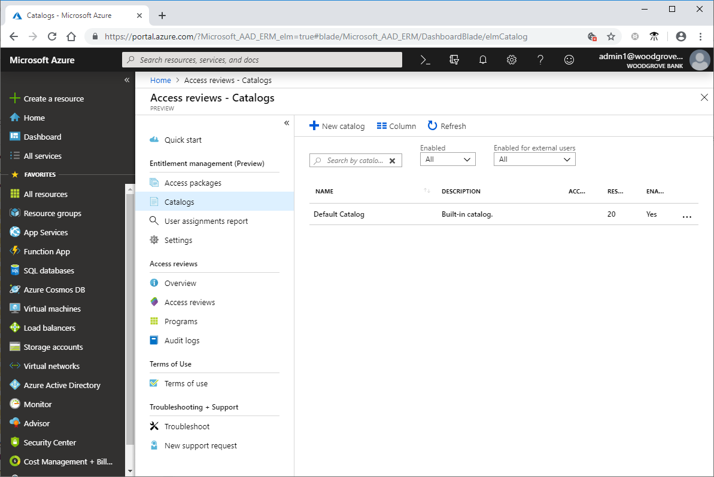
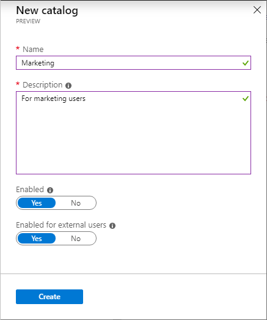
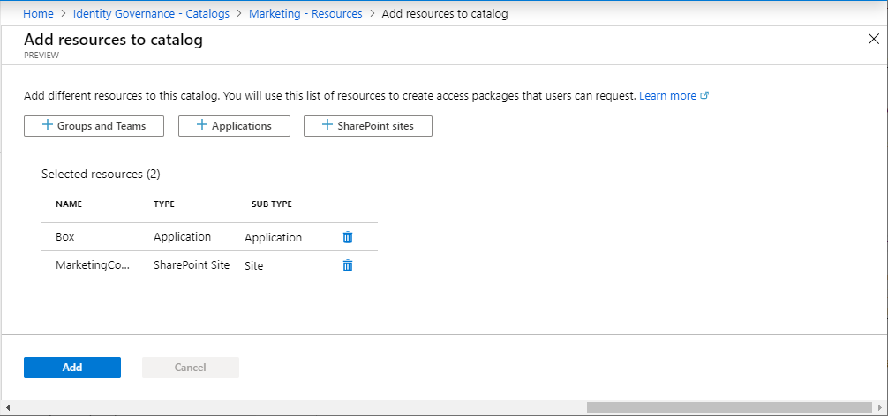
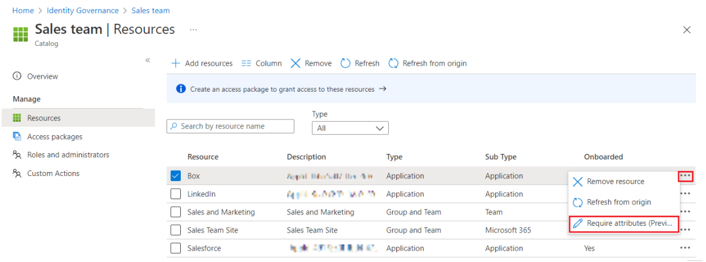
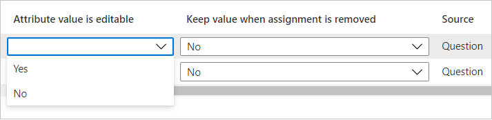
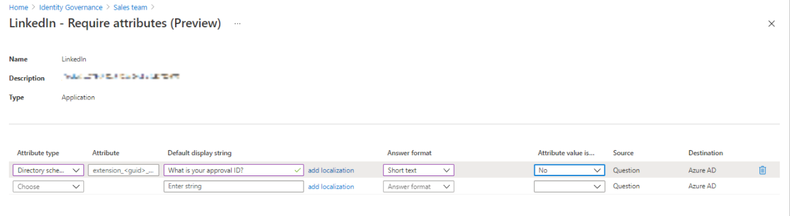
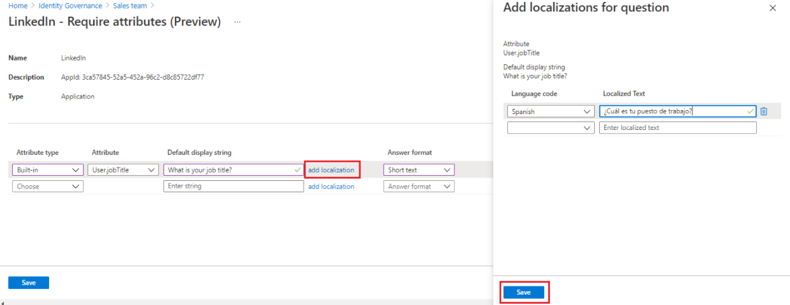
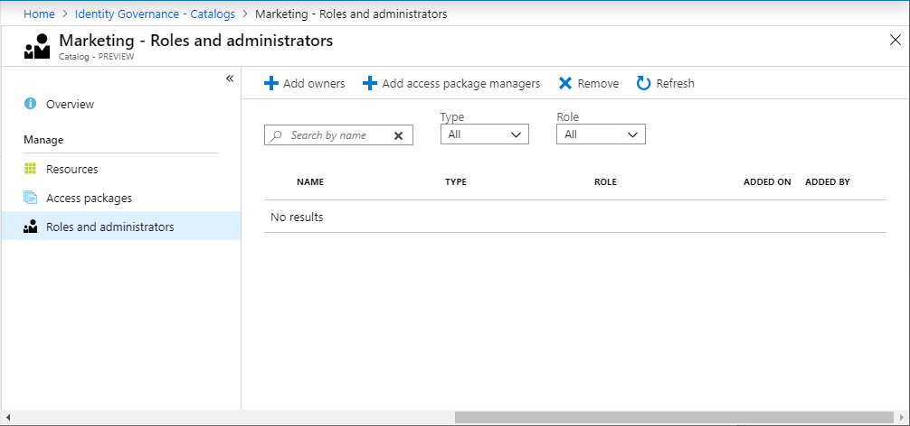
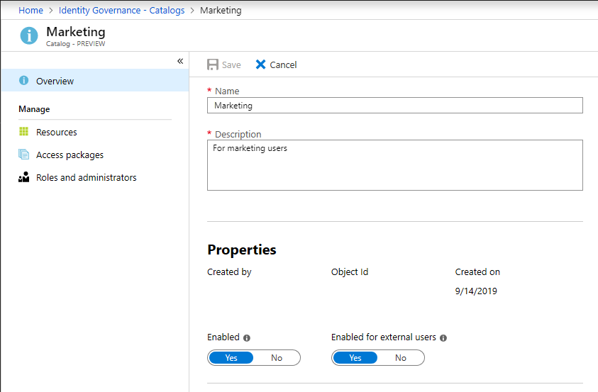

# Create and manage a catalog of resources in entitlement management

This article shows you how to create and manage a catalog of resources and access packages in entitlement management.

## Create a catalog

A catalog is a container of resources and access packages. You create a catalog when you want to group related resources and access packages. An administrator can create a catalog.  In addition, a user who has been delegated the [catalog creator](entitlement-management-delegate.md) role can create a catalog for resources that they own.  A nonadministrator who creates the catalog becomes the first catalog owner. A catalog owner can add more users, groups of users, or application service principals as catalog owners.

**Prerequisite roles:** Global Administrator, Identity Governance Administrator, or Catalog creator

> [!NOTE]
> Users who were assigned the User Administrator role will no longer be able to create catalogs or manage access packages in a catalog they don't own. If users in your organization were assigned the User Administrator role to configure catalogs, access packages, or policies in entitlement management, you should instead assign these users the Identity Governance administrator role.

To create a catalog:

1. Sign in to the [Microsoft Entra admin center](https://entra.microsoft.com) as at least an [Identity Governance Administrator](../roles/permissions-reference.md#identity-governance-administrator).

1. Browse to **Identity governance** > **Entitlement management** > **Catalogs**.

    

1. Select **New catalog**.

1. Enter a unique name for the catalog and provide a description.

    Users see this information in an access package's details.

1. If you want the access packages in this catalog to be available for users to request as soon as they're created, set **Enabled** to **Yes**.

1. If you want to allow users in external directories from connected organizations to be able to request access packages in this catalog, set **Enabled for external users** to **Yes**.  The access packages must also have a policy allowing users from connected organizations to request.  If the access packages in this catalog are intended only for users already in the directory, then set **Enabled for external users** to **No**.

    

1. Select **Create** to create the catalog.

## Create a catalog programmatically

There are two ways to create a catalog programmatically.

### Create a catalog with Microsoft Graph

You can create a catalog by using Microsoft Graph. A user in an appropriate role with an application that has the delegated `EntitlementManagement.ReadWrite.All` permission, or an application with that application permission, can call the API to [create an accessPackageCatalog](/graph/api/entitlementmanagement-post-accesspackagecatalogs?view=graph-rest-beta&preserve-view=true).

### Create a catalog with PowerShell

You can also create a catalog in PowerShell with the `New-MgEntitlementManagementCatalog` cmdlet from the [Microsoft Graph PowerShell cmdlets for Identity Governance](https://www.powershellgallery.com/packages/Microsoft.Graph.Identity.Governance/) module version 2.2.0 or later.

```powershell
Connect-MgGraph -Scopes "EntitlementManagement.ReadWrite.All"
$catalog = New-MgEntitlementManagementCatalog -DisplayName "Marketing"
```

## Add resources to a catalog

To include resources in an access package, the resources must exist in a catalog. The types of resources you can add to a catalog are groups, applications, and SharePoint Online sites.

* Groups can be cloud-created Microsoft 365 Groups or cloud-created Microsoft Entra security groups.

  * Groups that originate in an on-premises Active Directory can't be assigned as resources because their owner or member attributes can't be changed in Microsoft Entra ID. To give a user access to an application that uses AD security group memberships, create a new security group in Microsoft Entra ID, configure [group writeback to AD](../hybrid/connect/how-to-connect-group-writeback-v2.md), and [enable that group to be written to AD](../enterprise-users/groups-write-back-portal.md), so that the cloud-created group can be used by an AD-based application.

  * Groups that originate in Exchange Online as Distribution groups can't be modified in Microsoft Entra ID either, so cannot be added to catalogs.

* Applications can be Microsoft Entra enterprise applications, which include both software as a service (SaaS) applications and your own applications integrated with Microsoft Entra ID.

  * If your application has not yet been integrated with Microsoft Entra ID, see [govern access for applications in your environment](identity-governance-applications-prepare.md) and [integrate an application with Microsoft Entra ID](identity-governance-applications-integrate.md).

  * For more information on how to select appropriate resources for applications with multiple roles, see [Add resource roles](entitlement-management-access-package-resources.md#add-resource-roles).
* Sites can be SharePoint Online sites or SharePoint Online site collections.
> [!NOTE]
> Search SharePoint Site by site name or an exact URL as the search box is case sensitive.

**Prerequisite roles:** See [Required roles to add resources to a catalog](entitlement-management-delegate.md#required-roles-to-add-resources-to-a-catalog).

To add resources to a catalog:

1. Sign in to the [Microsoft Entra admin center](https://entra.microsoft.com) as at least an [Identity Governance Administrator](../roles/permissions-reference.md#identity-governance-administrator).

1. Browse to **Identity governance** > **Catalogs**.

1. On the **Catalogs** page open the catalog you want to add resources to.

1. On the left menu, select **Resources**.

1. Select **Add resources**.

1. Select the resource type **Groups and Teams**, **Applications**, or **SharePoint sites**.

    If you don't see a resource that you want to add or you're unable to add a resource, make sure you have the required Microsoft Entra directory role and entitlement management role. You might need to have someone with the required roles add the resource to your catalog. For more information, see [Required roles to add resources to a catalog](entitlement-management-delegate.md#required-roles-to-add-resources-to-a-catalog).

1. Select one or more resources of the type that you want to add to the catalog.

    

1. When you're finished, select **Add**.

    These resources can now be included in access packages within the catalog.

### Add resource attributes in the catalog

Attributes are required fields that requestors will be asked to answer before they submit their access request. Their answers for these attributes will be shown to approvers and also stamped on the user object in Microsoft Entra ID. 

> [!NOTE]
>All attributes set up on a resource require an answer before a request for an access package containing that resource can be submitted. If requestors don't provide an answer, their request won't be processed.

To require attributes for access requests:

1. Select **Resources** on the left menu, and a list of resources in the catalog appears. 

1. Select the ellipsis next to the resource where you want to add attributes, and then select **Require attributes**. 

    
 
1. Select the attribute type:

    1. **Built-in** includes Microsoft Entra user profile attributes.
    1. **Directory schema extension** provides a way to store more data in Microsoft Entra ID on user objects and other directory objects. This includes groups, tenant details, and service principals. Only extension attributes on user objects can be used to send out claims to applications.
1. If you chose **Built-in**, select an attribute from the dropdown list. If you chose **Directory schema extension**, enter the attribute name in the text box.

    > [!NOTE]
    > The User.mobilePhone attribute is a sensitive property that can be updated only by some administrators. Learn more at [Who can update sensitive user attributes?](/graph/api/resources/users#who-can-update-sensitive-attributes).

1. Select the answer format you want requestors to use for their answer. Answer formats include **short text**, **multiple choice**, and **long text**.

1. If you select multiple choice, select **Edit and localize** to configure the answer options. 
    1. In the **View/edit question** pane that appears, enter the response options you want to give the requestor when they answer the question in the **Answer values** boxes.
    1. Select the language for the response option. You can localize response options if you choose more languages.
    1. Enter as many responses as you need, and then select **Save**.

1. If you want the attribute value to be editable during direct assignments and self-service requests, select **Yes**.

    > [!NOTE]
    > 
    > - If you select **No** in the **Attribute value is editable** box and the attribute value *is empty*, users can enter the value of that attribute. After saving, the value can't be edited. 
    > - If you select **No** in the **Attribute value is editable** box and the attribute value *isn't empty*, users can't edit the preexisting value during direct assignments and self-service requests.
 
    

1. If you want to add localization, select **Add localization**.

    1. In the **Add localizations for question** pane, select the language code for the language in which you want to localize the question related to the selected attribute.
    1. In the language you configured, enter the question in the **Localized Text** box.
    1. After you add all the localizations you need, select **Save**.

       

1. After all attribute information is completed on the **Require attributes** page, select **Save**.

### Add a Multi-Geo SharePoint site

1. If you have [Multi-Geo](/microsoft-365/enterprise/multi-geo-capabilities-in-onedrive-and-sharepoint-online-in-microsoft-365) enabled for SharePoint, select the environment you want to select sites from.
    
    :::image type="content" source="media/entitlement-management-catalog-create/sharepoint-multi-geo-select.png" alt-text="Screenshot that shows the Select SharePoint Online sites pane.":::

1. Then select the sites you want to be added to the catalog.

### Add a resource to a catalog programmatically

You can also add a resource to a catalog by using Microsoft Graph. A user in an appropriate role, or a catalog and resource owner, with an application that has the delegated `EntitlementManagement.ReadWrite.All` permission can call the API to [create an accessPackageResourceRequest](/graph/api/entitlementmanagement-post-accesspackageresourcerequests?view=graph-rest-beta&preserve-view=true). An application with the application permission `EntitlementManagement.ReadWrite.All` and permissions to change resources, such as `Group.ReadWrite.All`, can also add resources to the catalog.

### Add a resource to a catalog with PowerShell

You can also add a resource to a catalog in PowerShell with the `New-MgEntitlementManagementResourceRequest` cmdlet from the [Microsoft Graph PowerShell cmdlets for Identity Governance](https://www.powershellgallery.com/packages/Microsoft.Graph.Identity.Governance/) module version 2.1.x or later module version.  The following example shows how to add a group to a catalog as a resource using Microsoft Graph PowerShell cmdlets module version 2.4.0.

```powershell
Connect-MgGraph -Scopes "EntitlementManagement.ReadWrite.All,Group.ReadWrite.All"

$g = Get-MgGroup -Filter "displayName eq 'Marketing'"
if ($null -eq $g) {throw "no group" }

$catalog = Get-MgEntitlementManagementCatalog -Filter "displayName eq 'Marketing'"
if ($null -eq $catalog) { throw "no catalog" }
$params = @{
  requestType = "adminAdd"
  resource = @{
    originId = $g.Id
    originSystem = "AadGroup"
  }
  catalog = @{ id = $catalog.id }
}

New-MgEntitlementManagementResourceRequest -BodyParameter $params
sleep 5
$ar = Get-MgEntitlementManagementCatalog -AccessPackageCatalogId $catalog.Id -ExpandProperty resources
$ar.resources
```

## Remove resources from a catalog

You can remove resources from a catalog. A resource can be removed from a catalog only if it isn't being used in any of the catalog's access packages.

**Prerequisite roles:** See [Required roles to add resources to a catalog](entitlement-management-delegate.md#required-roles-to-add-resources-to-a-catalog).

To remove resources from a catalog:

1. Sign in to the [Microsoft Entra admin center](https://entra.microsoft.com) as at least an [Identity Governance Administrator](../roles/permissions-reference.md#identity-governance-administrator).

1. Browse to **Identity governance** > **Entitlement management** > **Catalogs**.

1. On the **Catalogs** page open the catalog you want to remove resources from.

1. On the left menu, select **Resources**.

1. Select the resources you want to remove.

1. Select **Remove**. Optionally, select the ellipsis (**...**) and then select **Remove resource**.

## Add more catalog owners

[!INCLUDE [portal updates](~/articles/active-directory/includes/portal-update.md)]

The user who created a catalog becomes the first catalog owner. To delegate management of a catalog, add users to the catalog owner role. Adding more catalog owners helps to share the catalog management responsibilities.

**Prerequisite roles:** Global Administrator, Identity Governance Administrator, or Catalog owner

To assign a user to the catalog owner role:

1. Sign in to the [Microsoft Entra admin center](https://entra.microsoft.com) as at least an [Identity Governance Administrator](../roles/permissions-reference.md#identity-governance-administrator).

1. Browse to **Identity governance** > **Catalogs**.

1. On the **Catalogs** page open the catalog you want to add administrators to.

1. On the left menu, select **Roles and administrators**.

    

1. Select **Add owners** to select the members for these roles.

1. Select **Select** to add these members.

## Edit a catalog

You can edit the name and description for a catalog. Users see this information in an access package's details.

**Prerequisite roles:** Global Administrator, Identity Governance Administrator, or Catalog owner

To edit a catalog:

1. Sign in to the [Microsoft Entra admin center](https://entra.microsoft.com) as at least an [Identity Governance Administrator](../roles/permissions-reference.md#identity-governance-administrator).

1. Browse to **Identity governance** > **Catalogs**.

1. On the **Catalogs** page open the catalog you want to edit.

1. On the catalog's **Overview** page, select **Edit**.

1. Edit the catalog's name, description, or enabled settings.

    

1. Select **Save**.

## Delete a catalog

You can delete a catalog, but only if it doesn't have any access packages.

**Prerequisite roles:** Global Administrator, Identity Governance Administrator, or Catalog owner

To delete a catalog:

1. Sign in to the [Microsoft Entra admin center](https://entra.microsoft.com) as at least an [Identity Governance Administrator](../roles/permissions-reference.md#identity-governance-administrator).

1. Browse to **Identity governance** > **Catalogs**.

1. On the **Catalogs** page open the catalog you want to delete.

1. On the catalog's **Overview** page, select **Delete**.

1. On the message box that appears, select **Yes**.

### Delete a catalog programmatically

You can also delete a catalog by using Microsoft Graph. A user in an appropriate role with an application that has the delegated `EntitlementManagement.ReadWrite.All` permission can call the API to [delete an accessPackageCatalog](/graph/api/accesspackagecatalog-delete).

## Next steps

[Delegate access governance to access package managers](entitlement-management-delegate-managers.md)
