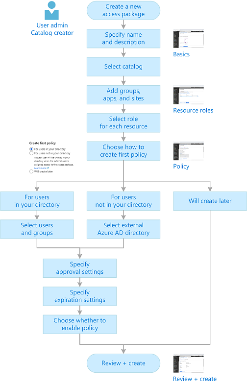
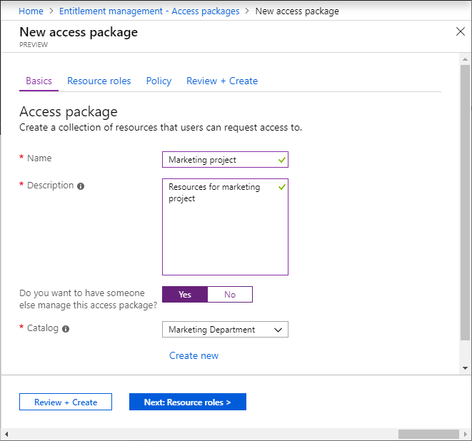
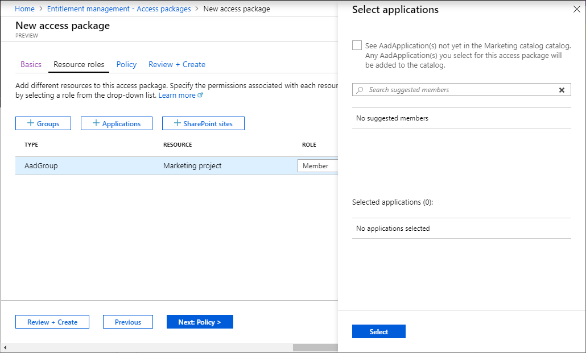
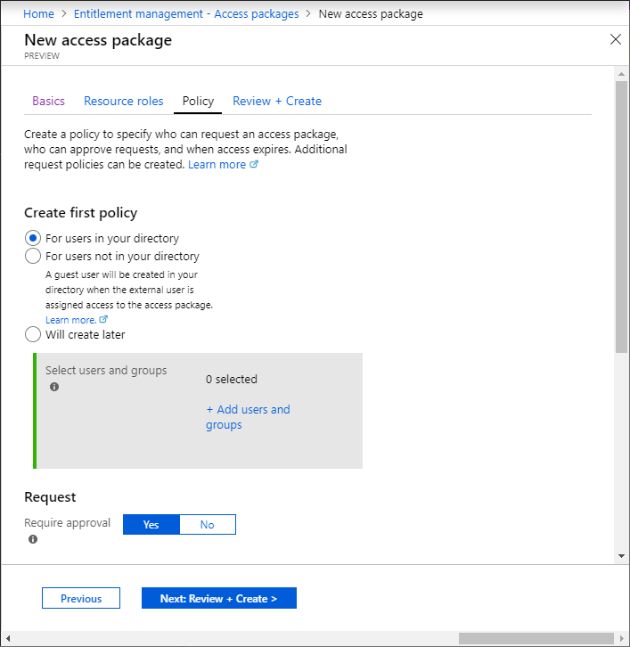
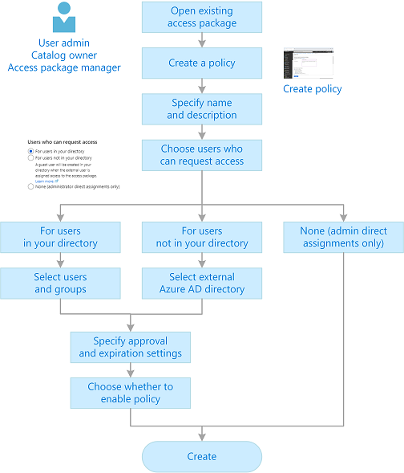

# Create and manage an access package in Azure AD entitlement management (Preview)

> [!IMPORTANT]
> Azure Active Directory (Azure AD) entitlement management is currently in public preview.
> This preview version is provided without a service level agreement, and it's not recommended for production workloads. Certain features might not be supported or might have constrained capabilities.
> For more information, see [Supplemental Terms of Use for Microsoft Azure Previews](https://azure.microsoft.com/support/legal/preview-supplemental-terms/).

An access package enables an access package manager to do a one-time setup or resources and policies that automatically administers access and the access lifecycle. The access package manager can change the resources without worrying about provisioning the user's access to the new resources, or removing their access from the previous resources. Policies can also be updated at any time, however, the policy changes only affect new accesses.

## Create an access package

All access packages must be put in a container called a catalog. A catalog defines what resources you can add to your access package. If you don't specify a catalog, your access package will be put into the Default catalog. Currently, you can't move an existing access package to a different catalog.

All access packages must have at least one policy. Policies define who can request the access package and other settings. When you create a new access package, you can create an initial policy for users in your directory, for users not in your directory, or you can choose to create the policy later.

The following diagram shows the high-level process to create a new access package.

**Prerequisite role:** User administrator or Catalog owner

1. Sign in to the [Azure portal](https://portal.azure.com).

1. Open the **Entitlement management** page at [https://aka.ms/elm](https://aka.ms/elm).

1. In the left menu, click **Access packages**.

    

1. Click **New access package**.

1. On the **Basics** tab, provide a display name and description for the access package. Users will see this information for the access package.

1. Set the **Do you want to have someone else manage this access package?** setting to **Yes** or **No**.

    Set this setting to **No** if you do not want to delegate management of this access package to a set of assigned Catalog owners. The access package will be created in the Default catalog. To create access package in the Default catalog, you must be at least a User administrator.

    Set this setting to **Yes** if you do want to delegate management of this access package. A **Catalog** drop-down list appears where you can select which catalog to crete this access package in.

1. In the **Catalog** drop-down list, select the catalog you would like to create the access package in. You will only be shown catalogs you have permission to create access packages in. To create access package in an existing catalog, you must be at least a User administrator, Catalog owner, or Access package manager.

    If you would like to create your access package in a new catalog, click **Create new**. Enter the Catalog name and description and then click **Create**.

    This access package you are creating and any resources included in it will be added to the new catalog. Additionally, you will automatically become the first owner of the catalog. You can add additional catalog owners.

    To create a new catalog, you must be at least a User administrator or Catalog creator.

    

1. Click **Next** to open the **Resource roles** tab.

    On this tab, you select the resource roles to be include in the access package.

1. Click the resource type you want to add (**Groups**, **Applications**, or **SharePoint sites**) and then select one or more resources from the list.

    

    If you are creating the access package in the Default catalog or a new catalog, you will be able to pick any resource from the directory that you own. You must be at least a User administrator or Catalog creator.

    If you are creating the access package in an existing catalog, you can select any resource that is already in the catalog without owning it.

    If you are a User administrator or Catalog Owner, you have the additional option of selecting resources you own that are not yet in the catalog. If added to the access package, these resources will also be added to the catalog for other catalog admins to build access packages with.

    Once you have selected the resources, you must choose which role you would like access for the resource to be assigned for.

1. Click **Next** to open the **Policy** tab.

1. Select if you want to allow users in your directory or users not in your directory to request the access package. You can also choose to create a policy later.

    

    To allow people to request the access package, you must create a policy. You can always create more policies to allow additional groups of users to request the access package with certain approval and expiration settings.

    - **For users in your directory**

        Select one or more users and/or groups you would like to be able to request the access package.

    - **For users not in your directory**

        Directories must be configured to be allowed in the **Organizational relationships collaboration restrictions** settings.

1. Select one or more external Azure AD directories whose users you would like to be able to request the access package. All users from the directory will be able to request.

1. Search for an external Azure AD directory by domain. Verify it is the correct directory by the provided directory name and initial domain. Click **Add**. Repeat this step to add any more directories.

    Users from all domain associated with the directory, not just the domain used in the search, will be able to request the access package

1. Once you have added all directories you'd like to include in the policy, click **Select**.

1. In request settings, to require approval on requests from the selected users, click **Yes** and select one or more users and/or groups to be approvers for requests from the users in this specific policy.

    Only one of the selected approvers needs to approve a request. Approval from all approvers is not required. The approval decision is based on whichever approver reviews the request first.

1. To have requests automatically approved, click **No**.

1. In advanced request settings, specify whether to require users to provide a justification to request the access package.

1. Specify whether to require the approver to provide a justification to approve a request for the access package.

1. Select the amount of time the approvers have to review a request. If no  approvers review it in this amount of days, the request will be cancelled and the user will have to re-request the access package.

1. In expiration settings, specify whether to expire a user's assignment to the access package on a certain date, a certain number of days after they are approved, or never.

1. In advanced expiration settings, specify whether to allow users to extend their assignments. If extensions are allowed, the user will receive an email 14 and 1 days before their access package assignment is set to expire prompting them to extend the assignment.

1. If you want to require approval for extensions, click **Yes**.

    Any extensions will require approval from one of the assigned approvers in the policy.

1. If you want the access package to be made immediately available to the users in the policy, click **Yes** to enable the policy.

    You can always enable it in the future after you have finished creating the access package.

1. Click **Review + create**.

1. Review the access package's settings and then click **Create** to create the access package.

## Add resource roles to an access package

**Prerequisite role:** User administrator, Catalog owner, or Access package manager

1. In the Azure portal, open the **Entitlement management** page at [https://aka.ms/elm](https://aka.ms/elm).

1. In the left menu, click **Access packages** and then open the access package.

1. Click **Resource roles**.

1. Click **Add resource roles**.

1. Select the resources you want to add.

1. Select the role.

1. Click **Add**.

Any users with existing assignments to the access package will automatically be given access to this resource role when it is added.

## Remove resource roles from an access package

**Prerequisite role:** User administrator, Catalog owner, or Access package manager

1. In the Azure portal, open the **Entitlement management** page at [https://aka.ms/elm](https://aka.ms/elm).

1. In the left menu, click **Access packages** and then open the access package.

1. Click **Resource roles**.

1. Click the ellipsis (**...**) and then click **Remove resource role**.

Any users with existing assignments to the access package will automatically have their access revoked to this resource role when it is removed.

## Specify who can request an access package

The way you specify who can request an access package is to create a policy. You can create multiple policies for a single access package if you want to allow different sets of users to be granted assignments with different approval and expiration settings. If there are multiple policies that apply to a user, they will be prompted at the time of their request to select the policy they would like to be assigned to.

The following diagram shows the high-level process to create a policy for an existing access package.

**Prerequisite role:** User administrator, Catalog owner, or Access package manager

1. In the Azure portal, open the **Entitlement management** page at [https://aka.ms/elm](https://aka.ms/elm).

1. In the left menu, click **Access packages** and then open the access package.

1. Click **Policies** and then **Add policy**.

1. Select the type of users you would like to be able to request your access package. You can also choose to directly assign users to the access package with this policy.

    - **For users in your directory**

        Select one or more users and/or groups you would like to be able to request the access package.

    - **For users not in your directory**

        Directories must be configured to be allowed in the **Organizational relationships collaboration restrictions** settings.

1. Select one or more external Azure AD directories whose users you would like to be able to request the access package. All users from the directory will be able to request.

1. Search for an external Azure AD directory by domain. Verify it is the correct directory by the provided directory name and initial domain. Click **Add**. Repeat this step to add any more directories.

    Users from all domain associated with the directory, not just the domain used in the search, will be able to request the access package.

1. Once you have added all directories you'd like to include in the policy, click **Select**.

1. Choose the **No one (admin directly assigns)** option if you want to bypass requests and directly assign users to the access package. You can still set expiration settings, but there are no request settings.

1. In request settings, to require approval on requests from the selected users, click **Yes** and select one or more users and/or groups to be approvers for requests from the users in this specific policy.

    Only one of the selected approvers needs to approve a request. Approval from all approvers is not required. The approval decision is based on whichever approver reviews the request first.

    To have requests automatically approved, click **No**.

1. In advanced request settings, specify whether to require users to provide a justification to request the access package.

1. Specify whether to require the approver to provide a justification to approve a request for the access package.

1. Select the amount of time the approvers have to review a request. If no  approvers review it in this amount of days, the request will be cancelled and the user will have to re-request the access package.

1. In expiration settings, specify whether to expire a user's assignment to the access package on a certain date, a certain number of days after they are approved, or never.

1. In advanced expiration settings, specify whether to allow users to extend their assignments. If extensions are allowed, the user will receive an email 14 and 1 days before their access package assignment is set to expire prompting them to extend the assignment.

1. If you want to require approval for extensions, click **Yes**.

    Any extensions will require approval from one of the assigned approvers in the policy.

1. If you want the access package to be made immediately available to the users in the policy, click **Yes** to enable the policy.

    You can always enable it in the future after you have finished creating the access package.

## Directly assign a user to an access package

You can directly assign specific users to an access package if you do not need them to request the access package.

**Prerequisite role:** User administrator, Catalog owner, or Access package manager

1. In the Azure portal, open the **Entitlement management** page at [https://aka.ms/elm](https://aka.ms/elm).

1. In the left menu, click **Access packages** and then open the access package.

1. Create a new policy.

1. In the **Users that can request options** section, select **No one (admin direct assignment only)**.

1. Set any expiration settings you like.

1. Go to the access package's **User assignments** page and click **New assignment**.

1. Select the users you want to give an assignment to.

1. Select the policy you created in step 2 that you want the users' assignment to be governed by.

1. Set the date and time you want the users' assignment to start and end. If an end date is not provided, the policy's expiration settings will be implemented.

1. Optionally provide a justification for your direct assignment for record keeping.

## View who has an assignment to an access package

**Prerequisite role:** User administrator, Catalog owner, or Access package manager

1. In the Azure portal, open the **Entitlement management** page at [https://aka.ms/elm](https://aka.ms/elm).

1. In the left menu, click **Access packages** and then open the access package.

1. Click **Assignments** to see a list of active assignments.

1. Click a specific assignment to see additional details.

1. To see a list of assignments that did not have all resource roles properly provisioned, click the filter status and select **Partially fulfilled**.

    You can see additional details on fulfillment errors by locating the user's corresponding request on the **Requests** page.

1. To see expired assignments, click the filter status and select **Expired**.

1. To download a CSV file of the filtered list, click **Download**.

## View an access package's requests

**Prerequisite role:** User administrator, Catalog owner, or Access package manager

1. In the Azure portal, open the **Entitlement management** page at [https://aka.ms/elm](https://aka.ms/elm).

1. In the left menu, click **Access packages** and then open the access package.

1. Click **Requests**.

1. Click a specific request to see additional details.

## View a request's fulfillment errors

**Prerequisite role:** User administrator, Catalog owner, or Access package manager

1. In the Azure portal, open the **Entitlement management** page at [https://aka.ms/elm](https://aka.ms/elm).

1. In the left menu, click **Access packages** and then open the access package.

1. Click **Requests**.

1. Select the request you want to view.

    If the request has any fulfillment errors, the request status will be **Unfulfilled** and the substatus will be **Partially fulfilled**.

    If there are any fulfillment errors, in the request's detail pane, there will be a count of fulfillment errors.

1. Click the count to see all of the request's fulfillment errors.

## Cancel a pending request

You can only cancel a pending request that has not yet been fulfilled.

**Prerequisite role:** User administrator, Catalog owner, or Access package manager

1. In the Azure portal, open the **Entitlement management** page at [https://aka.ms/elm](https://aka.ms/elm).

1. In the left menu, click **Access packages** and then open the access package.

1. Click **Requests**.

1. Click the request you want to cancel

1. In the request details pane, click **Cancel request**.

## Change the Hidden setting for an access package

Access packages are discoverable by default. This means that if a policy allows a user to request the access package, they will automatically see the access package listed in their My Access portal.

**Prerequisite role:** User administrator, Catalog owner, or Access package manager

1. In the Azure portal, open the **Entitlement management** page at [https://aka.ms/elm](https://aka.ms/elm).

1. In the left menu, click **Access packages** and then open the access package.

1. On the Overview page, click **Edit**.

1. Set the **Hidden** setting.

    If set to **No**, the access package will be listed in the user's My Access portal.

    If set to **Yes**, the access package will not be listed in the user's My Access portal. The only way a user can view the access package is if they have the direct **MyAccess portal link** to the access package.

## Delete an access package

An access package can only be deleted if it has no active user assignments.

**Prerequisite role:** User administrator, Catalog owner, or Access package manager

1. In the Azure portal, open the **Entitlement management** page at [https://aka.ms/elm](https://aka.ms/elm).

1. In the left menu, click **Access packages** and then open the access package.

1. On the access package's Overview page, click **Delete**.

## Next steps

- [Manage access for guest users](entitlement-management-guest-users.md)
