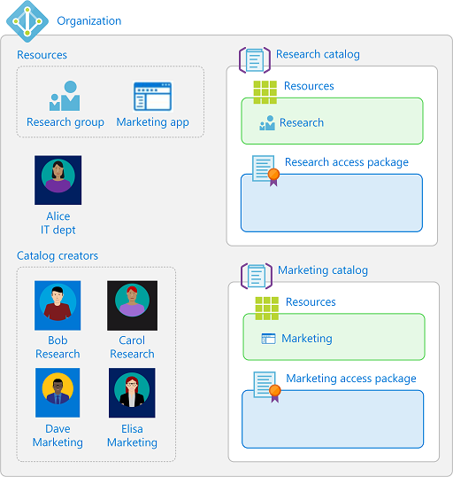

# Delegate tasks in Azure AD entitlement management (Preview)

> [!IMPORTANT]
> Azure Active Directory (Azure AD) entitlement management is currently in public preview.
> This preview version is provided without a service level agreement, and it's not recommended for production workloads. Certain features might not be supported or might have constrained capabilities.
> For more information, see [Supplemental Terms of Use for Microsoft Azure Previews](https://azure.microsoft.com/support/legal/preview-supplemental-terms/).

By default, Global administrators and User administrators can create and manage all aspects of Azure AD entitlement management. However, the users in these roles may not know all the scenarios where access packages are required. Typically it is users within departments who know who need to collaborate.

Instead of granting unrestricted permissions to non-administrators, you can grant users the least permissions they need to perform their job and avoid creating conflicting or inappropriate access rights. This article describes the roles that you can assign to delegate various tasks in entitlement management.

## Delegate example for departmental adoption

To understand how you might delegate tasks in entitlement management, it helps to consider an example. Suppose your organization has the following five users:

| User | Department | Notes |
| --- | --- | --- |
| Alice | IT | Global administrator |
| Bob | Research | Bob is also owner of a Research group |
| Carole | Research |  |
| Dave | Marketing |  |
| Elisa | Marketing | Elisa is also owner of a Marketing application |

Both the Research and Marketing departments want to use entitlement management for their users. Alice is not yet ready for other departments to use entitlement management. Here is one way that Alice could delegate tasks to the research and marketing departments.

1. Alice creates a new Azure AD security group for catalog creators, and adds Bob, Carol, Dave, and Elisa as members of that group.

1. Alice uses the entitlement management settings to add that group to the catalog creators role.

1. Carol creates a **Research** catalog, and adds Bob as a co-owner of that catalog. Bob adds the research group he owns to the catalog as a resource, so that it can be used in an access package for research collaboration.

1. Dave creates a **Marketing** catalog, and adds Elisa as a co-owner of that catalog. Elisa adds the marketing application she owns to the catalog as a resource, so that it can be used in an access package for marketing collaboration.

Now the research and marketing departments can utilize entitlement management. Bob, Carol, Dave, and Elisa can create and manage access packages in their respective catalogs.

## Entitlement management roles

Entitlement management has the following roles that are specific to entitlement management.

| Role | Description |
| --- | --- |
| Catalog creator | Create and manage catalogs. Typically an IT administrator who is not a Global administrator, or a resource owner for a collection of resources. The person that creates a catalog automatically becomes the catalog's first catalog owner, and can add additional catalog owners. |
| Catalog owner | Edit and manage existing catalogs. Typically an IT administrator or resource owners, or a user who the catalog owner has designated. |
| Access package manager | Edit and manage all existing access packages within a catalog. |

In addition, a designated approver and a requestor of an access package also have rights, although they are not roles.
 
* Approver: Authorized by a policy to approve or deny requests to access packages, though they cannot change the access package definitions.
* Requestor: Authorized by a policy of an access package to request that access package.

The following table lists the tasks that these roles can perform.

| Task | Catalog creator | Catalog owner | Access package manager | Approver |
| --- | :---: | :---: | :---: | :---: |
| [Create a new catalog](entitlement-management-catalog-create.md) | :heavy_check_mark: |  |  |  |
| [Add a resource to a catalog](entitlement-management-catalog-create.md#add-resources-to-a-catalog) | | :heavy_check_mark: | | |
| [Edit a catalog](entitlement-management-catalog-create.md#edit-a-catalog) |  | :heavy_check_mark: |  |  |
| [Delete a catalog](entitlement-management-catalog-create.md#delete-a-catalog) |  | :heavy_check_mark: |  |  |
| [Add a catalog owner or an access package manager to a catalog](#add-a-catalog-owner-or-an-access-package-manager) |  | :heavy_check_mark: |  |  |
| [Create a new access package in a catalog](entitlement-management-access-package-create.md) |  | :heavy_check_mark:  | :heavy_check_mark:  |  |
| [Manage resource roles in an access package](entitlement-management-access-package-edit.md) |  | :heavy_check_mark: | :heavy_check_mark: |  |
| [Specify who can request an access package](entitlement-management-access-package-edit.md#add-a-new-policy) |  | :heavy_check_mark: | :heavy_check_mark: |  |
| [Directly assign a user to an access package](entitlement-management-access-package-edit.md#directly-assign-a-user) |  | :heavy_check_mark: | :heavy_check_mark: |  |
| [View who has an assignment to an access package](entitlement-management-access-package-edit.md#view-who-has-an-assignment) |  | :heavy_check_mark: | :heavy_check_mark: |  |
| [View an access package's requests](entitlement-management-access-package-edit.md#view-requests) |  | :heavy_check_mark: | :heavy_check_mark: |  |
| [View a request's delivery errors](entitlement-management-access-package-edit.md#view-a-requests-delivery-errors) |  | :heavy_check_mark: | :heavy_check_mark: |  |
| [Cancel a pending request](entitlement-management-access-package-edit.md#cancel-a-pending-request) |  | :heavy_check_mark: | :heavy_check_mark: |  |
| [Hide an access package](entitlement-management-access-package-edit.md#change-the-hidden-setting) |  | :heavy_check_mark: | :heavy_check_mark: |  |
| [Delete an access package](entitlement-management-access-package-edit.md#delete) |  | :heavy_check_mark: | :heavy_check_mark: |  |
| [Approve an access request](entitlement-management-request-approve.md) |  |  |  | :heavy_check_mark: |

## Required roles to add resources to a catalog

A Global administrator can add or remove any group (cloud-created security groups or cloud-created Office 365 groups), application, or SharePoint Online site in a catalog. A User administrator can add or remove any group or application in a catalog.

For a user who is not a Global administrator or a User administrator, to add groups, applications, or SharePoint Online sites to a catalog, that user must have *both* the required Azure AD directory role and catalog owner entitlement management role. The following table lists the role combinations that are required to add resources to a catalog. To remove resources from a catalog, you must have the same roles.

| Azure AD directory role | Entitlement management role | Can add security group | Can add Office 365 group | Can add app | Can add SharePoint Online site |
| --- | :---: | :---: | :---: | :---: | :---: |
| [Global administrator](../users-groups-roles/directory-assign-admin-roles.md) | n/a |  :heavy_check_mark: | :heavy_check_mark: | :heavy_check_mark: | :heavy_check_mark: |
| [User administrator](../users-groups-roles/directory-assign-admin-roles.md) | n/a |  :heavy_check_mark: | :heavy_check_mark: | :heavy_check_mark: |  |
| [Intune administrator](../users-groups-roles/directory-assign-admin-roles.md) | Catalog owner | :heavy_check_mark: | :heavy_check_mark: |  |  |
| [Exchange administrator](../users-groups-roles/directory-assign-admin-roles.md) | Catalog owner |  | :heavy_check_mark: |  |  |
| [Teams service administrator](../users-groups-roles/directory-assign-admin-roles.md) | Catalog owner |  | :heavy_check_mark: |  |  |
| [SharePoint administrator](../users-groups-roles/directory-assign-admin-roles.md) | Catalog owner |  | :heavy_check_mark: |  | :heavy_check_mark: |
| [Application administrator](../users-groups-roles/directory-assign-admin-roles.md) | Catalog owner |  |  | :heavy_check_mark: |  |
| [Cloud application administrator](../users-groups-roles/directory-assign-admin-roles.md) | Catalog owner |  |  | :heavy_check_mark: |  |
| User | Catalog owner | Only if group owner | Only if group owner | Only if app owner |  |

## Add a catalog creator

If you want to delegate catalog creation, you add users to the catalog creator role.  You can add individual users, or for convenience can add a group, whose members are then able to create catalogs. Follow these steps to assign a user to the catalog creator role.

**Prerequisite role:** Global administrator or User administrator

1. In the Azure portal, click **Azure Active Directory** and then click **Identity Governance**.

1. In the left menu, in the **Entitlement management** section, click **Settings**.

1. Click **Edit**.

1. In the **Delegate entitlement management** section, click **Add catalog creators** to select the users or groups who will be the members for this entitlement management role.

1. Click **Select**.

1. Click **Save**.

## Add a catalog owner or an access package manager

If you want to delegate management of a catalog or access packages in the catalog, you add users to the catalog owner or access package manager roles. Whoever creates a catalog becomes the first catalog owner. Follow these steps to assign a user to the catalog owner or access package manager role.

**Prerequisite role:** User administrator or Catalog owner

1. In the Azure portal, click **Azure Active Directory** and then click **Identity Governance**.

1. In the left menu, click **Catalogs** and then open the catalog you want to add administrators to.

1. In the left menu, click **Roles and administrators**.

1. Click **Add owners** or **Add access package managers** to select the members for these roles.

1. Click **Select** to add these members.

## Next steps

- [Add approvers](entitlement-management-access-package-edit.md#policy-request)
- [Add resources to a catalog](entitlement-management-catalog-create.md#add-resources-to-a-catalog)
