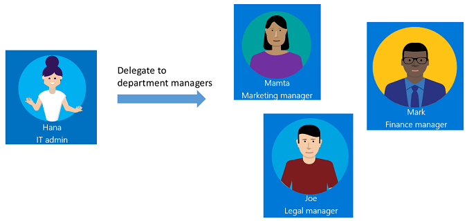

# Delegation and roles in Azure AD entitlement management

By default, Global administrators and User administrators can create and manage all aspects of Azure AD entitlement management. However, the users in these roles may not know all the situations where access packages are required. Typically it is users within the respective departments, teams, or projects who know who they are collaborating with, using what resources, and for how long. Instead of granting unrestricted permissions to non-administrators, you can grant users the least permissions they need to perform their job and avoid creating conflicting or inappropriate access rights.

This video provides an overview of how to delegate access governance from IT administrator to users who aren't administrators.

> [!VIDEO https://www.microsoft.com/videoplayer/embed/RE3Lq00]

## Delegate example

To understand how you might delegate access governance in entitlement management, it helps to consider an example. Suppose your organization has the following administrator and managers.

As the IT administrator, Hana has contacts in each department -- Mamta in Marketing, Mark in Finance, and Joe in Legal who are responsible for their department's resources and business critical content.

With entitlement management, you can delegate access governance to these non-administrators because they are the ones who know which users need access, for how long, and to which resources. This ensures the right people are managing access for their departments.

Here is one way that Hana could delegate access governance to the marketing, finance, and legal departments.

1. Hana creates a new Azure AD security group, and adds Mamta, Mark, and Joe as members of the group.

1. Hana adds that group to the catalog creators role.

    Mamta, Mark, and Joe can now create catalogs for their departments, add resources that their departments need, and do further delegation within the catalog.

    Note that Mamta, Mark, and Joe cannot see each other's catalogs.

1. Mamta creates a **Marketing** catalog, which is a container of resources.

1. Mamta adds the resources that her marketing department owns to this catalog.

1. Mamta can add additional people from her department as catalog owners for this catalog. This helps share the catalog management responsibilities.

1. Mamta can further delegate the creation and management of access packages in the Marketing catalog to project managers in the Marketing department. She can do this by assigning them to the access package manager role. An access package manager can create and manage access packages. 

The following diagram shows catalogs with resources for the marketing, finance, and legal departments. Using these catalogs, project managers can create access packages for their teams or projects.

After delegation, the marketing department might have roles similar to the following table.

| User | Job role | Azure AD role | Entitlement management role |
| --- | --- | --- | --- |
| Hana | IT administrator | Global administrator or User administrator |  |
| Mamta | Marketing manager | User | Catalog creator and Catalog owner |
| Bob | Marketing lead | User | Catalog owner |
| Jessica | Marketing project manager | User | Access package manager |

## Entitlement management roles

Entitlement management has the following roles that are specific to entitlement management.

| Entitlement management role | Description |
| --- | --- |
| Catalog creator | Create and manage catalogs. Typically an IT administrator who is not a Global administrator, or a resource owner for a collection of resources. The person that creates a catalog automatically becomes the catalog's first catalog owner, and can add additional catalog owners. A catalog creator can’t manage or see catalogs that they don’t own and can’t add resources they don’t own to a catalog. If the catalog creator needs to manage another catalog or add resources they don’t own, they can request to be a co-owner of that catalog or resource. |
| Catalog owner | Edit and manage existing catalogs. Typically an IT administrator or resource owners, or a user who the catalog owner has designated. |
| Access package manager | Edit and manage all existing access packages within a catalog. |

In addition, a designated approver and a requestor of an access package also have rights, although they are not roles.

| Right | Description |
| --- | --- |
| Approver | Authorized by a policy to approve or deny requests to access packages, though they cannot change the access package definitions. |
| Requestor | Authorized by a policy of an access package to request that access package. |

The following table lists the tasks that the entitlement management roles can perform.

| Task | Admin | Catalog creator | Catalog owner | Access package manager |
| --- | :---: | :---: | :---: | :---: |
| [Delegate to a catalog creator](entitlement-management-delegate-catalog.md) | :heavy_check_mark: |  |  |  |
| [Add a connected organization](entitlement-management-organization.md) | :heavy_check_mark: |  |  |  |
| [Create a new catalog](entitlement-management-catalog-create.md) | :heavy_check_mark: | :heavy_check_mark: |  |  |
| [Add a resource to a catalog](entitlement-management-catalog-create.md#add-resources-to-a-catalog) | :heavy_check_mark: |  | :heavy_check_mark: |  |
| [Add a catalog owner](entitlement-management-catalog-create.md#add-additional-catalog-owners) | :heavy_check_mark: |  | :heavy_check_mark: |  |
| [Edit a catalog](entitlement-management-catalog-create.md#edit-a-catalog) | :heavy_check_mark: |  | :heavy_check_mark: |  |
| [Delete a catalog](entitlement-management-catalog-create.md#delete-a-catalog) | :heavy_check_mark: |  | :heavy_check_mark: |  |
| [Delegate to an access package manager](entitlement-management-delegate-managers.md) | :heavy_check_mark: |  | :heavy_check_mark: |  |
| [Remove an access package manager](entitlement-management-delegate-managers.md#remove-an-access-package-manager) | :heavy_check_mark: |  | :heavy_check_mark: |  |
| [Create a new access package in a catalog](entitlement-management-access-package-create.md) | :heavy_check_mark: |  | :heavy_check_mark:  | :heavy_check_mark:  |
| [Change resource roles in an access package](entitlement-management-access-package-resources.md) | :heavy_check_mark: |  | :heavy_check_mark: | :heavy_check_mark: |
| [Create and edit policies](entitlement-management-access-package-request-policy.md) | :heavy_check_mark: |  | :heavy_check_mark: | :heavy_check_mark: |
| [Directly assign a user to an access package](entitlement-management-access-package-assignments.md#directly-assign-a-user) | :heavy_check_mark: |  | :heavy_check_mark: | :heavy_check_mark: |
| [View who has an assignment to an access package](entitlement-management-access-package-assignments.md#view-who-has-an-assignment) | :heavy_check_mark: |  | :heavy_check_mark: | :heavy_check_mark: |
| [View an access package's requests](entitlement-management-access-package-requests.md#view-requests) | :heavy_check_mark: |  | :heavy_check_mark: | :heavy_check_mark: |
| [View a request's delivery errors](entitlement-management-troubleshoot.md#view-a-requests-delivery-errors) | :heavy_check_mark: |  | :heavy_check_mark: | :heavy_check_mark: |
| [Reprocess a request](entitlement-management-troubleshoot.md#reprocess-a-request) | :heavy_check_mark: |  | :heavy_check_mark: | :heavy_check_mark: |
| [Cancel a pending request](entitlement-management-troubleshoot.md#cancel-a-pending-request) | :heavy_check_mark: |  | :heavy_check_mark: | :heavy_check_mark: |
| [Hide an access package](entitlement-management-access-package-edit.md#change-the-hidden-setting) | :heavy_check_mark: |  | :heavy_check_mark: | :heavy_check_mark: |
| [Delete an access package](entitlement-management-access-package-edit.md#delete-an-access-package) | :heavy_check_mark: |  | :heavy_check_mark: | :heavy_check_mark: |

## Required roles to add resources to a catalog

A Global administrator can add or remove any group (cloud-created security groups or cloud-created Office 365 Groups), application, or SharePoint Online site in a catalog. A User administrator can add or remove any group or application in a catalog.

For a user who is not a Global administrator or a User administrator, to add groups, applications, or SharePoint Online sites to a catalog, that user must have *both* the required Azure AD directory role and catalog owner entitlement management role. The following table lists the role combinations that are required to add resources to a catalog. To remove resources from a catalog, you must have the same roles.

| Azure AD directory role | Entitlement management role | Can add security group | Can add Office 365 Group | Can add app | Can add SharePoint Online site |
| --- | :---: | :---: | :---: | :---: | :---: |
| [Global administrator](../users-groups-roles/directory-assign-admin-roles.md) | n/a |  :heavy_check_mark: | :heavy_check_mark: | :heavy_check_mark: | :heavy_check_mark: |
| [User administrator](../users-groups-roles/directory-assign-admin-roles.md) | n/a |  :heavy_check_mark: | :heavy_check_mark: | :heavy_check_mark: |  |
| [Intune administrator](../users-groups-roles/directory-assign-admin-roles.md) | Catalog owner | :heavy_check_mark: | :heavy_check_mark: |  |  |
| [Exchange administrator](../users-groups-roles/directory-assign-admin-roles.md) | Catalog owner |  | :heavy_check_mark: |  |  |
| [Teams service administrator](../users-groups-roles/directory-assign-admin-roles.md) | Catalog owner |  | :heavy_check_mark: |  |  |
| [SharePoint administrator](../users-groups-roles/directory-assign-admin-roles.md) | Catalog owner |  | :heavy_check_mark: |  | :heavy_check_mark: |
| [Application administrator](../users-groups-roles/directory-assign-admin-roles.md) | Catalog owner |  |  | :heavy_check_mark: |  |
| [Cloud application administrator](../users-groups-roles/directory-assign-admin-roles.md) | Catalog owner |  |  | :heavy_check_mark: |  |
| User | Catalog owner | Only if group owner | Only if group owner | Only if app owner |  |

To determine the least privileged role for a task, you can also reference [Administrator roles by admin task in Azure Active Directory](../users-groups-roles/roles-delegate-by-task.md#entitlement-management).

## Next steps

- [Delegate access governance to catalog creators](entitlement-management-delegate-catalog.md)
- [Create and manage a catalog of resources](entitlement-management-catalog-create.md)
