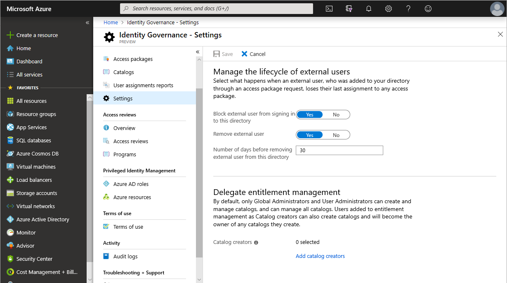

# Manage access for external users in Azure AD entitlement management (Preview)

> [!IMPORTANT]
> Azure Active Directory (Azure AD) entitlement management is currently in public preview.
> This preview version is provided without a service level agreement, and it's not recommended for production workloads. Certain features might not be supported or might have constrained capabilities.
> For more information, see [Supplemental Terms of Use for Microsoft Azure Previews](https://azure.microsoft.com/support/legal/preview-supplemental-terms/).

Azure AD entitlement management enables you collaborate with people outside your organization. If you create an access package with a [policy](entitlement-management-access-package-create.md#policy-for-users-not-in-your-directory) that allows users not in your directory to request access, a guest user account will be created in your directory when the request is approved.

This article describes the settings you can specify to manage access for external users.

## Manage the lifecyle of external users

You can select what happens when an external user, who was added to your directory through an access package request, loses their last assignment to any access package.

**Prerequisite role:** Global administrator or User administrator

1. In the Azure portal, click **Azure Active Directory** and then click **Identity Governance**.

1. In the left menu, in the **Entitlement management** section, click **Settings**.

1. Click **Edit**.

    

1. In the **Manage the lifecycle of external users** section, select the different settings for external users.

1. Once an external user loses their last assignment to any access packages, if you want to block them from signing in to this directory, set the **Block external user from signing in to this directory** to **Yes**.

1. Once an external user loses their last assignment to any access packages, if you want to remove their guest user account in your directory, set **Remove external user** to **Yes**.

    > [!NOTE]
    > If a guest user account was created by entitlement management, that user will be blocked and removed even if that user was added to resources outside of entitlement management like OneDrive or SharePoint Online files.

1. If you want to remove the guest user account in your directory, you can set the number of days before it is removed. If you want to remove the guest user account as soon as they lose their last assignment to any access packages, set **Number of days before removing external user from this directory** to **0**.

1. Click **Save**.

## Enable a catalog for external users

When you create a [new catalog](entitlement-management-catalog-create.md), there is a setting to enable users from external directories to request access packages in the catalog. If you don't want external users to have permissions to request access packages in the catalog, set **Enabled for external users** to **No**.

You can also change this setting after you have created the catalog.

## Next steps

- [Policy: For users not in your directory](entitlement-management-access-package-create.md#policy-for-users-not-in-your-directory)
- [Create and manage a catalog](entitlement-management-catalog-create.md)
- [Delegate tasks](entitlement-management-delegate.md)
