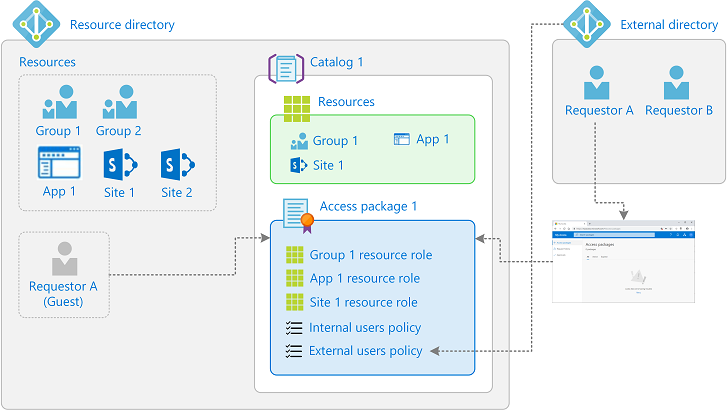
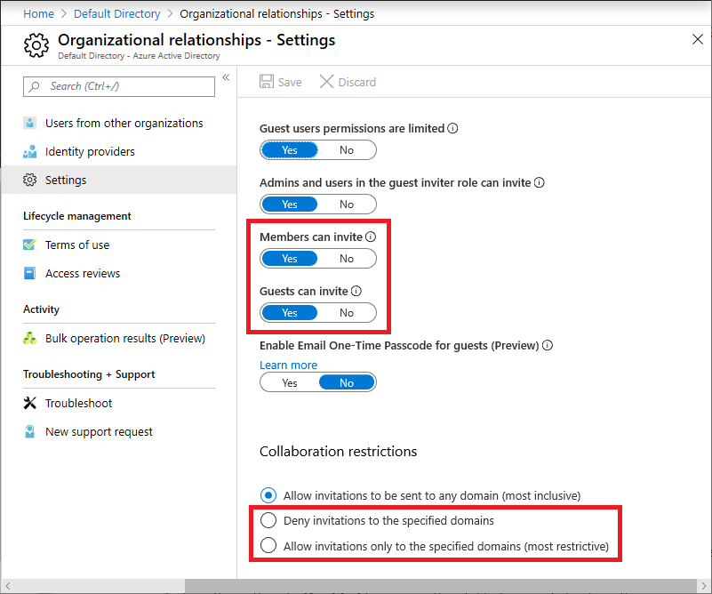
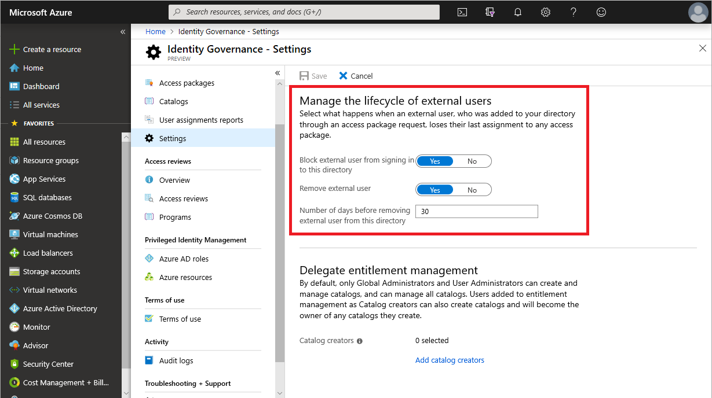

--- 
title: Govern access for external users in entitlement management
description: Learn about the settings you can specify to govern access for external users in entitlement management.
services: active-directory
documentationCenter: ''
author: owinfreyatl
manager: amycolannino
editor: markwahl-msft
ms.service: active-directory
ms.workload: identity
ms.tgt_pltfrm: na
ms.topic: how-to
ms.subservice: compliance
ms.date: 08/04/2023
ms.author: owinfrey
ms.reviewer: mwahl
ms.collection: M365-identity-device-management

#Customer intent: As a administrator, I want understand how I can govern access for external users in entitlement management.

---

# Govern access for external users in entitlement management

Entitlement management uses [Microsoft Entra business-to-business (B2B)](../external-identities/what-is-b2b.md) to share access so you can collaborate with people outside your organization. With Microsoft Entra B2B, external users authenticate to their home directory, but have a representation in your directory. The representation in your directory enables the user to be assigned access to your resources.

This article describes the settings you can specify to govern access for external users.

## How entitlement management can help

When using the [Microsoft Entra B2B](../external-identities/what-is-b2b.md) invite experience, you must already know the email addresses of the external guest users you want to bring into your resource directory and work with. Directly inviting each user works great when you're working on a smaller or short-term project and you already know all the participants, but this process is harder to manage if you have lots of users you want to work with, or if the participants change over time.  For example, you might be working with another organization and have one point of contact with that organization, but over time additional users from that organization will also need access.

With entitlement management, you can define a policy that allows users from organizations you specify to be able to self-request an access package. That policy includes whether approval is required, whether access reviews are required, and an expiration date for the access. In most cases, you'll want to require approval, in order to have appropriate oversight over which users are brought into your directory. If approval is required, then for major external organization partners, you might consider inviting one or more users from the external organization to your directory, designating them as sponsors, and configuring that sponsors are approvers - since they're likely to know which external users from their organization need access. Once you've configured the access package, obtain the access package's request link so you can send that link to your contact person (sponsor) at the external organization. That contact can share with other users in their external organization, and they can use this link to request the access package. Users from that organization who have already been invited into your directory can also use that link.

You can also use entitlement management for bringing in users from organizations that don't have their own Microsoft Entra directory.  You can configure a federated identity provider for their domain, or use email-based authentication.  You can also bring in users from social identity providers, including those with Microsoft accounts.

Typically, when a request is approved, entitlement management provisions the user with the necessary access. If the user isn't already in your directory, entitlement management will first invite the user. When the user is invited, Microsoft Entra ID will automatically create a B2B guest account for them but won't send the user an email. An administrator may have previously limited which organizations are allowed for collaboration, by setting a [B2B allow or blocklist](../external-identities/allow-deny-list.md) to allow or block invites to other organization's domains.  If the user's domain isn't allowed by those lists, then they won't be invited and can't be assigned access until the lists are updated.

Since you don't want the external user's access to last forever, you specify an expiration date in the policy, such as 180 days. After 180 days, if their access isn't extended, entitlement management will remove all access associated with that access package. By default, if the user who was invited through entitlement management has no other access package assignments, then when they lose their last assignment, their guest account is blocked from signing in for 30 days, and later removed. This prevents the proliferation of unnecessary accounts. As described in the following sections, these settings are configurable.

## How access works for external users

The following diagram and steps provide an overview of how external users are granted access to an access package.

1. You [add a connected organization](entitlement-management-organization.md) for the Microsoft Entra directory or domain you want to collaborate with.  You can also configure a connected organization for a social identity provider.

1. You check the catalog setting **Enabled for external users** in the catalog to contain the access package is **Yes**.

1. You create an access package in your directory that includes a policy [For users not in your directory](entitlement-management-access-package-create.md#allow-users-not-in-your-directory-to-request-the-access-package) and specifies the connected organizations that can request, the approver and lifecycle settings.  If you select in the policy the option of specific connected organizations or the option of all connected organizations, then only users from those organizations that have previously been configured can request.   If you select in the policy the option of all users, then any user can request, including those which aren't already part of your directory and not part of any connected organization.

1. You check [the hidden setting on the access package](entitlement-management-access-package-edit.md#change-the-hidden-setting) to ensure the access package is hidden.  If it isn't hidden, then any user allowed by the policy settings in that access package can browse for the access package in the My Access portal for your tenant.

1. You send a [My Access portal link](entitlement-management-access-package-settings.md) to your contact at the external organization that they can share with their users to request the access package.

1. An external user (**Requestor A** in this example) uses the My Access portal link to [request access](entitlement-management-request-access.md) to the access package. The My access portal requires that the user sign in as part of their connected organization. How the user signs in depends on the authentication type of the directory or domain that's defined in the connected organization and in the external users settings.

1. An approver [approves the request](entitlement-management-request-approve.md) (assuming the policy requires approval).

1. The request goes into the [delivering state](entitlement-management-process.md).

1. Using the B2B invite process, a guest user account is created in your directory (**Requestor A (Guest)** in this example). If an [allowlist or a blocklist](../external-identities/allow-deny-list.md) is defined, the list setting is applied.

1. The guest user is assigned access to all of the resources in the access package. It can take some time for changes to be made in Microsoft Entra ID and to other Microsoft Online Services or connected SaaS applications. For more information, see [When changes are applied](entitlement-management-access-package-resources.md#when-changes-are-applied).

1. The external user receives an email indicating that their access was [delivered](entitlement-management-process.md).

1. To access the resources, the external user can either select the link in the email or attempt to access any of the directory resources directly to complete the invitation process.

1. If the policy settings include an expiration date, then later when the access package assignment for the external user expires, the external user's access rights from that access package are removed.

1. Depending on the lifecycle of external users settings, when the external user no longer has any access package assignments, the external user will be blocked from signing in, and the external user account will be removed from your directory.

## Settings for external users

To ensure people outside of your organization can request access packages and get access to the resources in those access packages, there are some settings that you should verify are properly configured.

### Enable catalog for external users

- By default, when you create a [new catalog](entitlement-management-catalog-create.md), it's enabled to allow external users to request access packages in the catalog. Make sure **Enabled for external users** is set to **Yes**.

    

  If you're an administrator or catalog owner, you can view the list of catalogs currently enabled for external users in the Microsoft Entra admin center list of catalogs, by changing the filter setting for **Enabled for external users** to **Yes**.  If any of those catalogs shown in that filtered view have a non-zero number of access packages, those access packages may have a policy [for users not in your directory](entitlement-management-access-package-request-policy.md#for-users-not-in-your-directory) that allow external users to request.

### Configure your Microsoft Entra B2B external collaboration settings

- Allowing guests to invite other guests to your directory means that guest invites can occur outside of entitlement management. We recommend setting **Guests can invite** to **No** to only allow for properly governed invitations.
- If you have been previously using the B2B allowlist, you must either remove that list, or make sure all the domains of all the organizations you want to partner with using entitlement management are added to the list. Alternatively, if you're using the B2B blocklist, you must make sure no domain of any organization you want to partner with is present on that list.
- If you create an entitlement management policy for **All users** (All connected organizations + any new external users), and a user doesn’t belong to a connected organization in your directory, a connected organization will automatically be created for them when they request the package. However, any B2B [allow or blocklist](../external-identities/allow-deny-list.md) settings you have takes precedence. Therefore, you want to remove the allowlist, if you were using one, so that **All users** can request access, and exclude all authorized domains from your blocklist if you're using a blocklist.
- If you want to create an entitlement management policy that includes **All users** (All connected organizations + any new external users), you must first enable email one-time passcode authentication for your directory. For more information, see [Email one-time passcode authentication](../external-identities/one-time-passcode.md).
- For more information about Microsoft Entra B2B external collaboration settings, see [Configure external collaboration settings](../external-identities/external-collaboration-settings-configure.md).

    
    
    > [!NOTE]
    > If you create a connected organization for a Microsoft Entra tenant from a different Microsoft cloud, you also need to configure cross-tenant access settings appropriately. For more information on how to configure these settings, see [Configure cross-tenant access settings](../external-identities/cross-cloud-settings.md).

### Review your Conditional Access policies

- Make sure to exclude the Entitlement Management app from any Conditional Access policies that impact guest users. Otherwise, a Conditional Access policy could block them from accessing MyAccess or being able to sign in to your directory. For example, guests likely don't have a registered device, aren't in a known location, and don't want to re-register for multi-factor authentication (MFA), so adding these requirements in a Conditional Access policy will block guests from using entitlement management. For more information, see [What are conditions in Microsoft Entra Conditional Access?](../conditional-access/concept-conditional-access-conditions.md).

- A common policy for Entitlement Management customers is to block all apps from guests except Entitlement Management for guests. This policy allows guests to enter My Access and request an access package. This package should contain a group (it's called Guests from My Access in the following example), which should be excluded from the block all apps policy. Once the package is approved, the guest is in the directory. Given that the end user has the access package assignment and is part of the group, the end user is able to access all other apps. Other common policies include excluding Entitlement Management app from MFA and compliant device.   

    :::image type="content" source="media/entitlement-management-external-users/exclude-app-guests.png" alt-text="Screenshot of exclude app options.":::

    :::image type="content" source="media/entitlement-management-external-users/exclude-cloud-apps.png" alt-text="Screenshot of selection to exclude cloud apps.":::

    :::image type="content" source="media/entitlement-management-external-users/exclude-app-guests-selection.png" alt-text="Screenshot of the exclude guests app selection.":::

> [!NOTE]
> The Entitlement Management app includes the entitlement management side of MyAccess, the Entitlement Management side of the Microsoft Entra admin center, and the Entitlement Management part of MS graph. The latter two require additional permissions for access, hence won't be accessed by guests unless explicit permission is provided. 

### Review your SharePoint Online external sharing settings

- If you want to include SharePoint Online sites in your access packages for external users, make sure that your organization-level external sharing setting is set to **Anyone** (users don't require sign in), or **New and existing guests** (guests must sign in or provide a verification code). For more information, see [Turn external sharing on or off](/sharepoint/turn-external-sharing-on-or-off#change-the-organization-level-external-sharing-setting).

- If you want to restrict any external sharing outside of entitlement management, you can set the external sharing setting to **Existing guests**. Then, only new users that are invited through entitlement management are able to gain access to these sites. For more information, see [Turn external sharing on or off](/sharepoint/turn-external-sharing-on-or-off#change-the-organization-level-external-sharing-setting).

- Make sure that the site-level settings enable guest access (same option selections as previously listed). For more information, see [Turn external sharing on or off for a site](/sharepoint/change-external-sharing-site).

### Review your Microsoft 365 group sharing settings

- If you want to include Microsoft 365 groups in your access packages for external users, make sure the **Let users add new guests to the organization** is set to **On** to allow guest access. For more information, see [Manage guest access to Microsoft 365 Groups](/microsoft-365/admin/create-groups/manage-guest-access-in-groups#manage-groups-guest-access).

- If you want external users to be able to access the SharePoint Online site and resources associated with a Microsoft 365 group, make sure you turn on SharePoint Online external sharing. For more information, see [Turn external sharing on or off](/sharepoint/turn-external-sharing-on-or-off#change-the-organization-level-external-sharing-setting).

- For information about how to set the guest policy for Microsoft 365 groups at the directory level in PowerShell, see [Example: Configure Guest policy for groups at the directory level](../enterprise-users/groups-settings-cmdlets.md#example-configure-guest-policy-for-groups-at-the-directory-level).

### Review your Teams sharing settings

- If you want to include Teams in your access packages for external users, make sure the **Allow guest access in Microsoft Teams** is set to **On** to allow guest access. For more information, see [Configure guest access in the Microsoft Teams admin center](/microsoftteams/set-up-guests#configure-guest-access-in-the-teams-admin-center).

## Manage the lifecycle of external users

[!INCLUDE [portal updates](~/articles/active-directory/includes/portal-update.md)]

You can select what happens when an external user, who was invited to your directory through making an access package request, no longer has any access package assignments. This can happen if the user relinquishes all their access package assignments, or their last access package assignment expires. By default, when an external user no longer has any access package assignments, they're blocked from signing in to your directory. After 30 days, their guest user account is removed from your directory.  You can also configure that an external user is not blocked from sign in or deleted, or that an external user is not blocked from sign in but is deleted (preview).

**Prerequisite role:** Global Administrator or Identity Governance Administrator

1. Sign in to the [Microsoft Entra admin center](https://entra.microsoft.com) as at least an [Identity Governance Administrator](../roles/permissions-reference.md#identity-governance-administrator).

1. Browse to **Identity governance** > **Entitlement management** > **Settings**.

1. Select **Edit**.

    

1. In the **Manage the lifecycle of external users** section, select the different settings for external users.

1. Once an external user loses their last assignment to any access packages, if you want to block them from signing in to this directory, set the **Block external user from signing in to this directory** to **Yes**.

    > [!NOTE]
    > Entitlement management only blocks external guest user accounts from signing in that were invited through entitlement management or that were added to entitlement management for lifecycle management. Also, note that a user will be blocked from signing in even if that user was added to resources in this directory that were not access package assignments. If a user is blocked from signing in to this directory, then the user will be unable to re-request the access package or request additional access in this directory. Do not configure blocking them from signing in if they will subsequently need to request access to this or other access packages.

1. Once an external user loses their last assignment to any access packages, if you want to remove their guest user account in this directory, set **Remove external user** to **Yes**.

    > [!NOTE]
    > Entitlement management only removes external guest user accounts that were invited through entitlement management or  that were added to entitlement management for lifecycle managementh. Also, note that a user will be removed from this directory even if that user was added to resources in this directory that were not access package assignments. If the guest was present in this directory prior to receiving access package assignments, they will remain. However, if the guest was invited through an access package assignment, and after being invited was also assigned to a OneDrive for Business or SharePoint Online site, they will still be removed.

1. If you want to remove the guest user account in this directory, you can set the number of days before it's removed.  While an external user is notified when their access package expires, there is no notification when their account is removed. If you want to remove the guest user account as soon as they lose their last assignment to any access packages, set **Number of days before removing external user from this directory** to **0**.

1. Select **Save**.

## Next steps

- [Add a connected organization](entitlement-management-organization.md)
- [For users not in your directory](entitlement-management-access-package-request-policy.md#for-users-not-in-your-directory)
- [Troubleshoot](entitlement-management-troubleshoot.md)
