# Tutorial: Get started with Azure AD entitlement management (Preview)

> [!IMPORTANT]
> Azure Active Directory (Azure AD) entitlement management is currently in public preview.
> This preview version is provided without a service level agreement, and it's not recommended for production workloads. Certain features might not be supported or might have constrained capabilities.
> For more information, see [Supplemental Terms of Use for Microsoft Azure Previews](https://azure.microsoft.com/support/legal/preview-supplemental-terms/).

Intro para

In this tutorial, you'll learn how to:

> [!div class="checklist"]
> * Create an access package of your organization's resources
> * Demonstrate how a user from your organization can request the access package
> * Approve the access request
> * Demonstrate how a user from another organization can request the access package  

## Prerequisites

- User administrator
    - Directories that are deployed in Azure Government, China, or other specialized clouds are not currently available for use in this preview.
- Azure AD Premium P2
    - The directory where the preview is being configured must have a license for Azure AD Premium P2, or a license that contains Azure AD Premium P2 such as EMS E5. If you don't have an Azure subscription, sign up for an [EMS E5 trial](https://www.microsoft.com/en-us/cloud-platform/enterprise-mobility-security-trial) before you begin. (Note that a directory can only activate an EMS E5 trial once per directory).
- Email addresses
    - The users interacting with Azure AD entitlement management must have email addresses, either in Exchange or Exchange Online.

## Step 1: Prepare resource directory

The resource directory has one or more resources to share. In this step, you create a group named **Test** that is the target resource for entitlement management. You create a second group for users in the directory who can request access packages. You also set up two additional users, the approver and internal requester.

1. Sign in to the [Azure portal](https://portal.azure.com) as User administrator or Global administrator.  

1. In the upper right of the Azure portal, make sure you signed in to the resource directory. If not, switch to the resource directory.

1. In the left navigation, click **Azure Active Directory** and then click **Properties**.

1. Record the value of the **Directory ID**.

1. In the left menu, click **Custom domain names**.

1. Record the value of the domain name that ends with **onmicrosoft.com**.

1. Create or configure the following three users. Ensure each user has a mailbox.

    | Name | Directory role | Notes |
    | --- | --- | --- |
    | **Administrator** | Limited administrator (User administrator) | This user might be the user you are already signed in as |
    | **Approver** | User |
    | **Internal requester** | User |

1. Create an Azure AD security group named **Test** with a membership type of assigned.

    This group will be the target resource for entitlement management. The group should be empty of members to start.

1. Create another Azure AD security group named **Internal requesters** with a membership type of assigned.

1. Add the **Internal requester** user as a member of the **Internal requesters** group.

    This group represents users who are able to request the access package and are already in the resource directory.

## Step 2: Prepare users from another directory (optional)

Entitlement management uses Azure AD business-to-business (B2B) to allow a user from another organization to request access.

This step is optional. If you want to only use entitlement management for users already in your directory, you can skip to the next step.

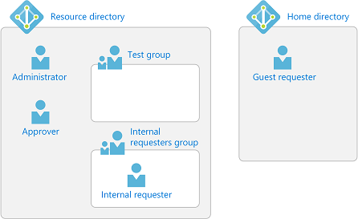

1. In a separate directory, called the *home directory*, sign in to the Azure portal as User administrator.

1. Record the domain name of the home directory, such as **microsoft.onmicrosoft.com**.

1. Create or configure one user.

1. Ensure that user can sign in and has a mailbox.

## Step 3: Create a catalog

In this step, you create a catalog and add the Test group as a resource. A catalog is a container of related resources and access packages.

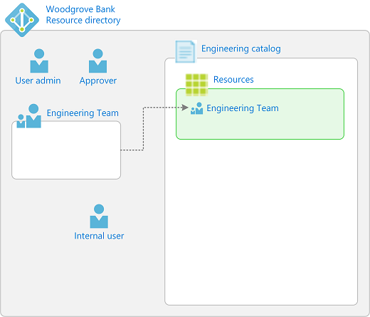

1. If you have not already signed in to the resource directory, sign in to the [Azure portal](https://portal.azure.com) as User administrator of the resource directory.

1. Navigate to the entitlement management preview administrative page, [https://aka.ms/elm](https://aka.ms/elm). Ensure that the directory name in the upper right of the Azure portal corresponds to the directory from Step 1.

    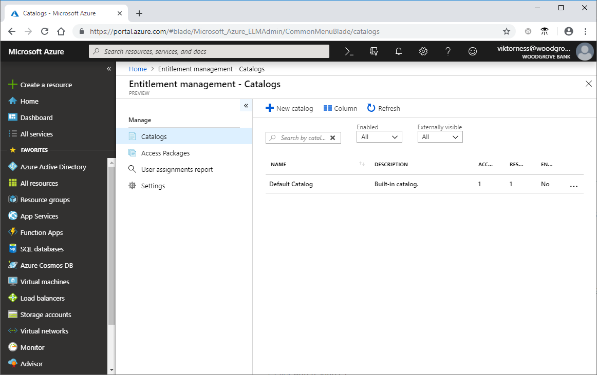

1. Click **Catalogs** and then click **New catalog** to create your first catalog. A pane will appear on the right.

1. For the catalog, type the name **First catalog** and the description **First catalog with a test group**.

1. Change the **Visible to users outside your directory** to **Yes** and change the **Publish** setting to **Yes**.

    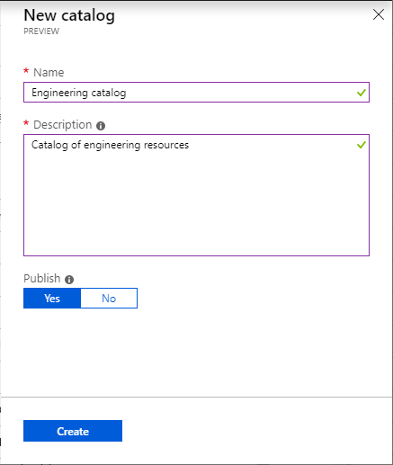

1. Click **Create** to create the catalog.

    Once created, the new catalog should open. If not, click its name to open it.

1. In the left menu, click **Resources**.

1. Click **Add resources**.

1. Click the **Add groups**.

1. In the Select groups pane, select the **Test** group you created earlier and then click **Select**.

    The Test group appears in the list of selected resources.

    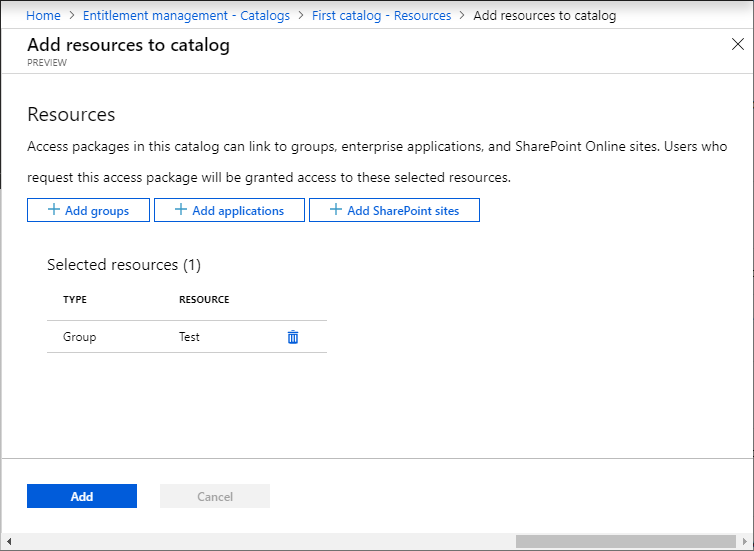

1. Click **Add** to add the group.

1. Click **Refresh** to ensure the group is visible in the list of resources in the catalog.

## Step 4: Create an access package

In this step, you create an access package and one policy for that access package. This policy allows users who are already in the resource directory to request access.

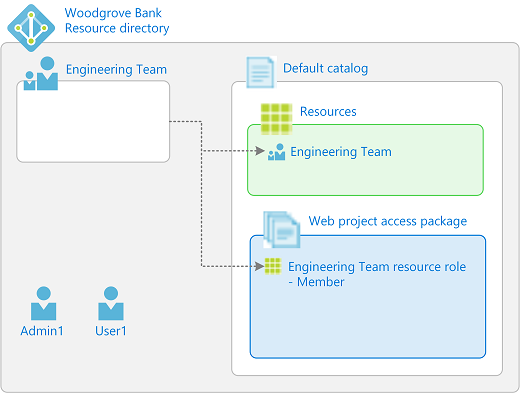

1. In the left menu, click **Access packages**.

1. Click **New access package**.

1. On the **Basics** tab, type the name **First access package** and description **First access package with a test group**.

    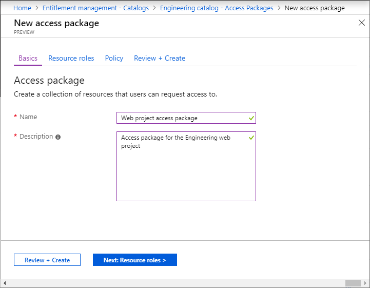

1. Click **Next** to open the **Resource roles** tab.

    On this tab, you select the permissions to include in the access package.

1. Click **Add groups**.

1. In the Select groups pane, select the **Test** group you created earlier and then click **Select**.

1. For the **Role** list, select **Member**.

    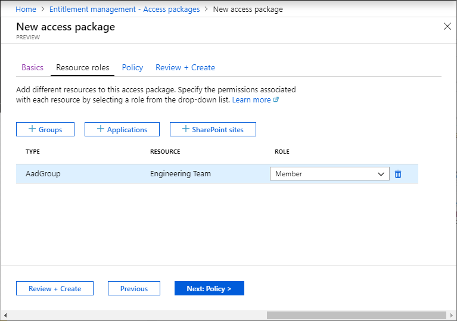

1. Click **Next** to open the **Policy** tab.

1. In the **Users who can request access** section, click **For users in your directory**.

1. In the **Select users and groups** section, click **Add users and groups**.

1. In the Select groups pane, select the **Internal requesters** group you created earlier and then click **Select**.

    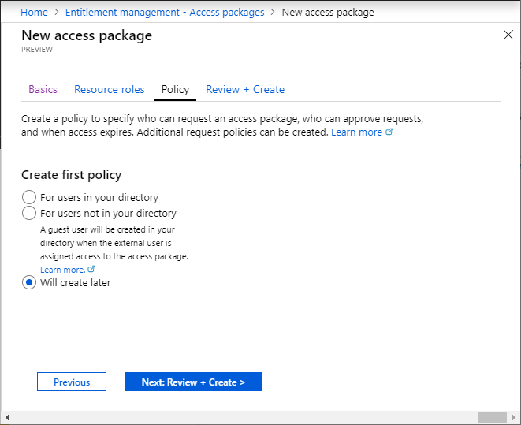

1. Scroll down and in the **Select approvers** section, click **Add approvers**.

1. In the Select approvers pane, select the **Approver** user you created earlier and then click **Select**.

1. For **Enable policy**, click **Yes**.

    

1. Click **Next** to open the **Review + create** tab.

1. Check that the access package's settings are correct and then click **Create** to create the access package.

## Step 5: Request access

In this step, you perform the steps as the internal requester user and request access to the access package.

1. Sign out of the Azure portal.

1. Sign in to [My Access portal](https://myaccess.microsoft.com) as the **Internal requester** user.

1. Find the **First access package** in the list of all access packages.

    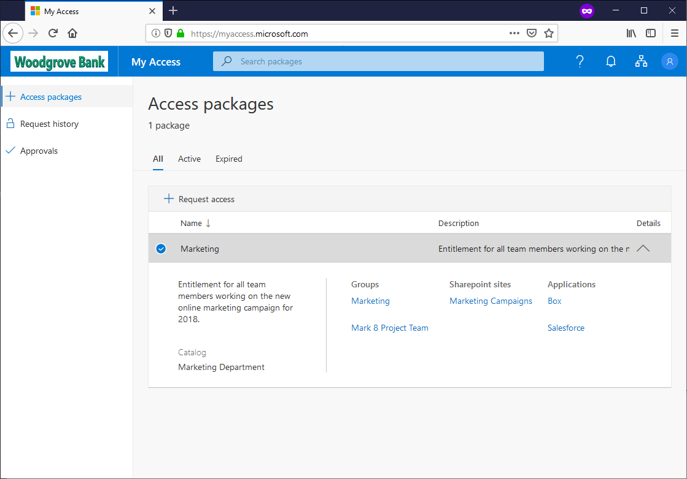

1. Click the chevron to view more details about the access package.

1. Click **Request access**.

1. In the **Business justification** box, type a justification.

1. Set the **Request for a specific period** to **Yes**.

1. Set the **Starts on** date to today and **Expires on** date to tomorrow.

1. Click **Submit**.

1. In the left menu, click **Request history** to view the status of your request. For example, whether it is pending approval or has been delivered.

## Step 6: Approve an access request

In this step, you sign in as the approver user and approve the access request for an internal requester user.

1. Sign out of the My Access portal.

1. Sign in to [My Access portal](https://myaccess.microsoft.com) as the **Approver** user.

1. In the left menu, click **Approvals**.

1. Find the **Internal requester** user.

1. Click **Details** to display details about the request.

1. In the **Reason** box, type a reason.

1. Click **Approve**.

## Step 7: Validate that access has been assigned

1. Sign out of the My Access portal.

1. Sign in to [My Access portal](https://myaccess.microsoft.com) as the **Internal requester** user.

1. In the left menu, click **Access package**.

1. Find the **First access package**. If you do not see the package, wait 5 minutes and refresh the page.

1. Click the **First access package**.

1. Click the **Resources** tab. You should see the **Test** group.

## Step 8: Add a policy for guest users to request access (optional)

In this step, you add an additional policy for users who are not yet in the resource directory to request access.

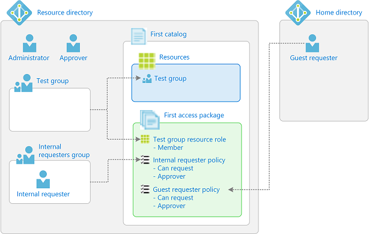

**Hana**

## Step 9: Request access as a guest user (optional)

**JoeC**

## Step 10: Approve an access request for a guest user (optional)

**JoeC**

## Step 11: Validate that access has been assigned for a guest user (optional)

**JoeC**

## Step 12: View changes in the audit log

**Hana/Mark**

## Step 13: Clean up resources

1. In entitlement management, open **First catalog** and delete **First access package**.

1. Delete **First catalog**.

1. In Azure Active Directory, remove the **Internal requester** user from the **Internal requesters** group.

1. Delete the **Internal requesters** group.

1. Delete the **Internal requester** user.

1. Delete the **Approver** user.

## Next steps

- [Create and manage a catalog](entitlement-management-create-catalog.md)
- [Create and manage an access package](entitlement-management-create-access-package.md)
