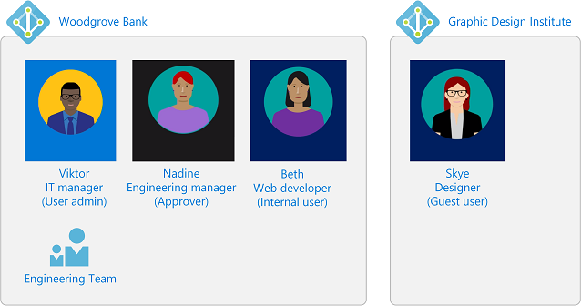
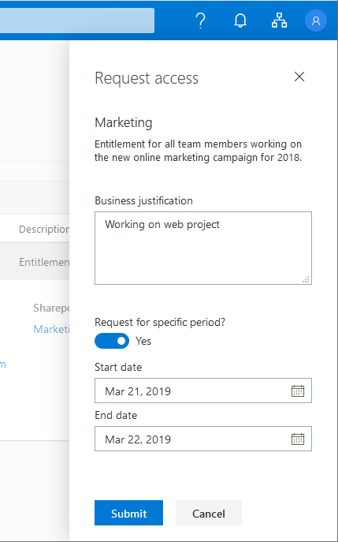
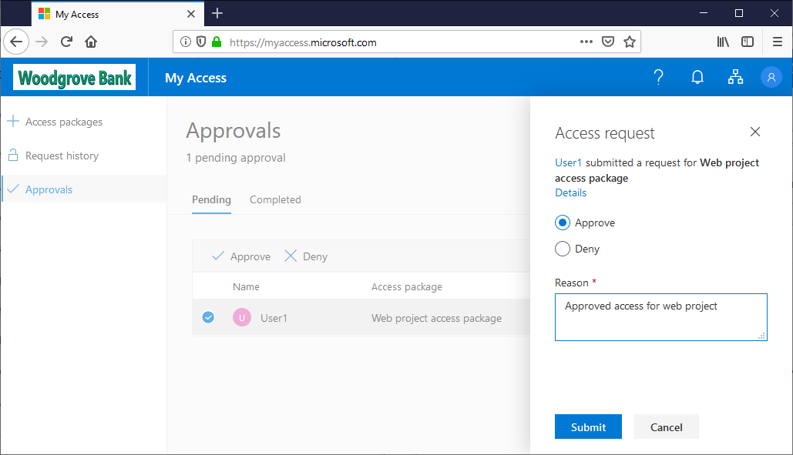

# Tutorial: Get started with Azure AD entitlement management (Preview)

> [!IMPORTANT]
> Azure Active Directory (Azure AD) entitlement management is currently in public preview.
> This preview version is provided without a service level agreement, and it's not recommended for production workloads. Certain features might not be supported or might have constrained capabilities.
> For more information, see [Supplemental Terms of Use for Microsoft Azure Previews](https://azure.microsoft.com/support/legal/preview-supplemental-terms/).

Managing access to all the resources employees need, such as groups, applications, and sites, is an important function for organizations. You want to grant employees the right level of access they need to be productive and remove their access when it is no longer needed. Since project managers are more familiar with the contributors and details of a project, you typically want to delegate the day-to-day administration to others.

In this tutorial, you work for Woodgrove Bank as an IT manager. You want to set up an engineering team group and allow an engineering manager to approve requests for access. You also want to allow an external designer at Graphic Design Institute to request access.

In this tutorial, you'll learn how to:

> [!div class="checklist"]
> * Create an access package with a group as a resource
> * Designate a user as an approver
> * Demonstrate how an internal user in your organization can request the access package
> * Approve the access request
> * Demonstrate how a guest user from another organization can request the access package  

## Prerequisites

- Global administrator or User administrator
    - Directories that are deployed in Azure Government, China, or other specialized clouds are not currently available for use in this preview.
- Azure AD Premium P2
    - The directory where the preview is being configured must have a license for Azure AD Premium P2, or a license that contains Azure AD Premium P2 such as EMS E5. If you don't have an Azure subscription, sign up for an [EMS E5 trial](https://www.microsoft.com/en-us/cloud-platform/enterprise-mobility-security-trial) before you begin. (Note that a directory can only activate an EMS E5 trial once per directory).
- Email addresses
    - The users interacting with Azure AD entitlement management must have email addresses, either in Exchange or Exchange Online.

## Step 1: Prepare resource directory

The resource directory has one or more resources to share. In this step, you create a group named **Engineering Team** in the Woodgrove Bank directory that is the target resource for entitlement management. You also set up two additional users: an approver and an internal user.

**Prerequisite role:** Global administrator or User administrator

1. Sign in to the [Azure portal](https://portal.azure.com) as a Global administrator or User administrator.  

1. In the upper right of the Azure portal, make sure you signed in to the resource directory. If not, switch to the resource directory.

1. In the left navigation, click **Azure Active Directory** and then click **Properties**.

1. Record the value of the **Directory ID**.

1. In the left menu, click **Custom domain names**.

1. Record the value of the domain name that ends with **onmicrosoft.com**.

1. Create or configure the following three users. You can use these names or different names. Ensure each user has a mailbox.

    | Name | Directory role | Description |
    | --- | --- | --- |
    | **Viktor** | Global administrator -or- Limited administrator (User administrator) | IT administrator This user might be the user you are already signed in as. |
    | **Nadine** | User | Approver |
    | **Beth** | User | Internal user |

1. Create an Azure AD security group named **Engineering Team** with a membership type of assigned.

    This group will be the target resource for entitlement management. The group should be empty of members to start.

## Step 2: Prepare users from another directory (optional)

Entitlement management uses Azure AD business-to-business (B2B) to allow a user from another organization to request access.

This step is optional. If you want to only use entitlement management for users already in your directory, you can skip to the next step.

**Prerequisite role:** Global administrator or User administrator

1. In a separate directory, called the *home directory*, sign in to the Azure portal as Global administrator or User administrator.

1. Record the domain name of the home directory, such as **microsoft.onmicrosoft.com**.

1. Create or configure one user named **Skye** or another name.

1. Ensure that user can sign in and has a mailbox.

## Step 3: Create a catalog

In this step, you create a catalog and add the **Engineering Team** group as a resource. A catalog is a container of related resources and access packages.

**Prerequisite role:** Global administrator, User administrator, or Catalog creator

1. If you have not already signed in to the resource directory, sign in to the [Azure portal](https://portal.azure.com) as a Global administrator or User administrator.

1. Navigate to the **Entitlement management** preview page at [https://aka.ms/elm](https://aka.ms/elm).

    

1. Ensure that the directory name in the upper right of the Azure portal corresponds to the resource directory from [Step 1: Prepare resource directory](#step-1-prepare-resource-directory).

1. Click **Catalogs** and then click **New catalog** to create your first catalog. A pane will appear on the right.

1. For the catalog, type the name **Engineering catalog** and the description **Catalog of engineering resources**.

1. Leave the **Publish** setting to **Yes** so that access packages can be requested as soon as they are created.

    

1. Click **Create** to create the catalog.

    Once created, the new catalog should open. If not, click its name to open it.

1. In the left menu, click **Resources**.

1. Click **Add resources**.

1. Click **Add groups**.

1. In the Select groups pane, select the **Engineering Team** group you created earlier and then click **Select**.

    The Engineering Team group appears in the list of selected resources.

    

1. Click **Add** to add the group.

1. Click **Refresh** to ensure the group appears in the list of resources in the Engineering catalog.

## Step 4: Create an access package

In this step, you create a **Web project access package** in the Engineering catalog and one policy for that access package. This policy allows users who are already in the resource directory to request access.

**Prerequisite role:** Global administrator, User administrator, or Catalog owner

1. In the left menu, click **Access packages**.

1. Click **New access package**.

1. On the **Basics** tab, type the name **Web project access package** and description **Access package for the Engineering web project**.

    

1. Click **Next** to open the **Resource roles** tab.

    On this tab, you select the permissions to include in the access package.

1. Click **Add groups**.

1. In the Select groups pane, select the **Engineering Team** group you added to the catalog earlier.

    Notice that by default you only see resources that are in the Engineering catalog.

1. Click **Select** to add the group to the list.

1. In the **Role** drop-down list, select **Member**.

    

1. Click **Next** to open the **Policy** tab.

1. In the **Users who can request access** section, click **For users in your directory**.

    Additional options appear.

1. In the **Select users and groups** section, click **Add users and groups**.

1. In the Select groups pane, select the **internal user** you created earlier (Beth or another user) and then click **Select**.

    

1. Scroll down and to the **Select approvers** section and click **Add approvers**.

1. In the Select approvers pane, select the **approver** you created earlier (Nadine or another user) and then click **Select**.

1. In the **Expiration** section, set **Access package expires** to **Number of days**.

1. Set **Access expires after** to **30** days.

1. For **Enable policy**, click **Yes**.

    

1. Click **Next** to open the **Review + create** tab.

1. Review the access package settings and then click **Create** to create the access package.

    After a few moments, you should see a notification that the access package was successfully created.

## Step 5: Request access

In this step, you perform the steps as the **internal user** and request access to the access package.

**Prerequisite role:** Internal user

1. Sign out of the Azure portal.

1. Sign in to the [My Access portal](https://myaccess.microsoft.com) as the **internal user** (Beth or another user).

1. In the left menu, click **Access packages**.

1. Find the **Web project access package** in the list of all access packages.

    

1. In the **Details** column, click the chevron to view details about the access package.

1. Click the checkmark to select the package.

1. Click **Request access** to open the Request access pane.

1. In the **Business justification** box, type the justification **Working on web project**.

1. Set the **Request for specific period** toggle to **Yes**.

1. Set the **Start date** date to today and **End date** date to tomorrow.

    

1. Click **Submit**.

1. In the left menu, click **Request history** to view the status of your request. For example, whether it is pending approval or has been delivered.

## Step 6: Approve an access request

In this step, you sign in as the **approver** user and approve the access request for an internal user.

**Prerequisite role:** Approver

1. Sign out of the My Access portal.

1. Sign in to the [My Access portal](https://myaccess.microsoft.com) as the **approver** user (Nadine or another user).

1. In the left menu, click **Approvals**.

1. On the **Pending** tab, find the **internal user** (Beth or another user).

1. In the **Details** column, click **View** to open the Access request pane.

1. Click **Approve**.

1. In the **Reason** box, type the reason **Approved access for web project**.

    

1. Click **Submit**.

## Step 7: Validate that access has been assigned

**Prerequisite role:** Global administrator, User administrator, Catalog owner, or Access package manager

1. Sign out of the My Access portal.

1. Sign in to the [My Access portal](https://myaccess.microsoft.com) as the **internal user** (Beth or another user).

1. In the left menu, click **Access packages**.

1. Find the **Web project access package**. If you do not see the package, wait 5 minutes and refresh the page.

1. In the **Details** column, click the chevron to view details about the access package.

    In the **Groups** list, you should see the **Engineering Team** group.

## Step 8: Add a policy for guest users to request access (optional)

In this step, you add an additional policy for users who are not yet in the resource directory to request access.

**Prerequisite role:** Global administrator, User administrator, Catalog owner, or Access package manager

## Step 9: Request access as a guest user (optional)

## Step 10: Approve an access request for a guest user (optional)

## Step 11: Validate that access has been assigned for a guest user (optional)

## Step 12: View changes in the audit log

## Step 13: Clean up resources

**Prerequisite role:**  Global administrator or User administrator

1. In the Azure portal, open entitlement management.

1. Open **Engineering catalog** and then open **Web project access package**.

1. Click **Assignments** and remove the assignments.

1. Click **Policies** and remove the policies.

1. Click **Resource roles** and remove the resource roles.

1. Open **Engineering catalog** and delete **Web project access package**.

1. Open the list of catalogs and delete **Engineering catalog**.

1. In Azure Active Directory, delete any users you added.

1. Delete the **Engineering Team** group.

## Next steps

- [Create and manage a catalog](entitlement-management-create-catalog.md)
- [Create and manage an access package](entitlement-management-create-access-package.md)
