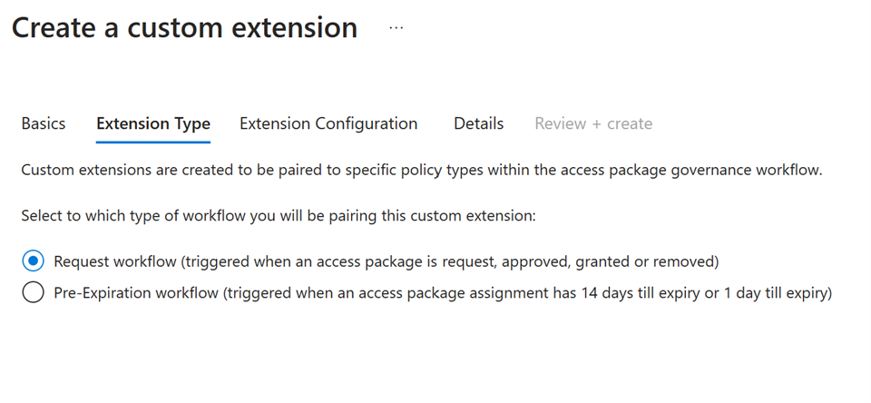
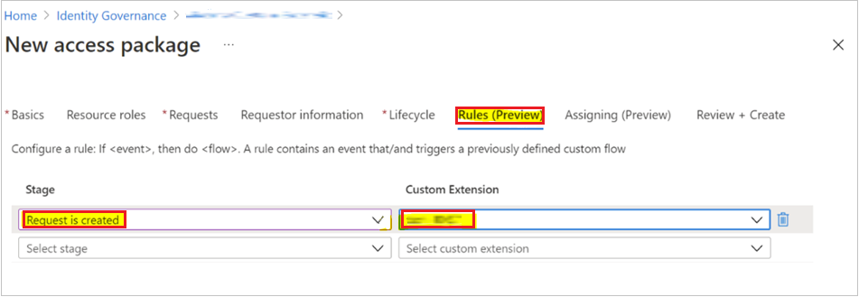

# Trigger Logic Apps with custom extensions in entitlement management


[Azure Logic Apps](../../logic-apps/logic-apps-overview.md) can be used to automate custom workflows and connect apps and services in one place. Users can integrate Logic Apps with entitlement management to broaden their governance workflows beyond the core entitlement management use cases.

These Logic Apps can then be triggered to run in accordance with entitlement management use cases such as when an access package is granted or requested. For example, an admin could create and link a custom Logic App to entitlement management, so that when a user requests an access package, a Logic App is triggered that ensures the user is also assigned certain characteristics in a third party SAAS app (like Salesforce) or is sent a custom email. 

Entitlement management use cases that can be integrated with Logic Apps include the following stages. These are the triggers associated with an access package that can launch the custom extension Logic App:  

- When an access package request is created

- When an access package request is approved 

- When an access package assignment is granted 

- When an access package assignment is removed

- 14 days before an access package assignment auto expires 

- One day before an access package assignment auto expires


These triggers to Logic Apps are controlled in a tab within access package policies called **Rules**. Additionally, a **Custom Extensions** tab on the Catalog page shows all added Logic Apps extensions for a given Catalog. This article describes how to create and add logic apps to catalogs and access packages in entitlement management. 

## License requirements

[!INCLUDE [active-directory-entra-governance-license.md](../../../includes/active-directory-entra-governance-license.md)]


## Create and add a Logic App workflow to a catalog for use in entitlement management 

[!INCLUDE [portal updates](~/articles/active-directory/includes/portal-update.md)]

**Prerequisite roles:** Global administrator, Identity Governance administrator, Catalog owner or Resource Group Owner 

1. Sign in to the [Microsoft Entra admin center](https://entra.microsoft.com) as at least an [Identity Governance Administrator](../roles/permissions-reference.md#identity-governance-administrator).

1. Browse to **Identity governance** > **Catalogs**.

1. Select the catalog for which you want to add a custom extension and then in the left menu, select **Custom Extensions**. 

1. In the header navigation bar, select **Add a Custom Extension**.  

1. In the **Basics** tab, enter the name of the custom extension, which should be the name of the Logic App you're linking, and a description of the workflow. These fields show up in the **Custom Extensions** tab of the Catalog.

    

1. The **Extension Type** tab defines what type of access package policies you can use the custom extension with. The “**Request workflow**” type supports policy stages: access package requested is created, when the request is approved, when assignment is granted, and when assignment is removed. This type also supports the  [Launch and wait](entitlement-management-logic-apps-integration.md#configuring-custom-extensions-that-pause-entitlement-management-processes).  capabilities. 

1. The pre-expiration workflow supports the policy stages: 14 days until access package assignment expiry, and 1 day until access package assignment expiration. This extension type doesn't support Launch and Wait. 

    :::image type="content" source="media/entitlement-management-logic-apps/extension-configuration-launch-wait.png" alt-text="Screenshot of launch and wait configuration options.":::

1. The **Extension Configuration** tab allows you to decide if your extension has “launch and continue” or “launch and wait” behavior. With “Launch and continue” the linked policy action on the access package, such as a request, triggers the Logic App attached to the custom extension. After the Logic App is triggered, the entitlement management process associated with the access package will continue. For “Launch and wait”, we'll pause the associated access package action until after the Logic App linked to the extension completes its task, and a resume action is sent by the admin to continue the process. If no response is sent back in the wait time period defined, this process would be considered a failure. This process is further described below in its own section [Configuring custom extensions that pause entitlement management processes](entitlement-management-logic-apps-integration.md#configuring-custom-extensions-that-pause-entitlement-management-processes). 


1. In the **Details** tab, choose whether you’d like to use an existing consumption plan Logic App. Selecting Yes in the field “Create new logic app” (default) creates a new blank consumption plan Logic App that is already linked to this custom extension. Regardless, you need to provide: 

    1. An Azure subscription.
    
    1. A resource group that has Logic App resource creation permissions if creating a new Logic App.
    
    1. Select “Create Logic App” if using that setting.
    
        :::image type="content" source="media/entitlement-management-logic-apps/create-logic-app-extension-details.png" alt-text="Screenshot of creating logic app detail selections.":::

    > [!NOTE]    
    > When creating a new Logic App in this modal, the length of "/subscriptions/{SubscriptionId}/resourceGroups/{RG Name}/providers/Microsoft.Logic/workflows/{Logicapp Name}" cannot exceed 150 characters.

1. In **Review and Create**, review the summary of your custom extension and make sure the details for your Logic App callout are correct. Then select **Create**.

1. This custom extension to the linked Logic App now appears in your Custom Extensions tab under Catalogs. You're able to call on this in access package policies.

## View and Edit Existing Custom Extensions for a Catalog

**Prerequisite roles:** Global administrator, Identity Governance administrator, or Catalog owner 

1. Navigate to the Custom Extensions tab within a Catalog as mentioned earlier.

1. Here, you can view all the custom extensions you've created, along with the associated Logic App and information about the custom extension type.
    :::image type="content" source="media/entitlement-management-logic-apps/custom-extension-list.png" alt-text="Screenshot of a list of custom extensions." lightbox="media/entitlement-management-logic-apps/custom-extension-list.png":::
1. Along with the Logic App name, the column Type dictates whether the custom extension was created in the new V2 auth model (after March 17, 2023), or the original model. If a custom extension was created in the new model, the Type column matches the selected type from the configuration modal that is either “*assignment request*” or “*pre-expiration*”. For older custom extensions, the type shows “*custom access package*”.    

1. The Token Security column shows the associated auth security framework used when creating the custom extension. New V2 custom extensions show “*proof-of-possession*” (PoP) as the token security type. Older custom extensions show “regular”.   

1. Old style custom extensions are no longer able to be created from the UI, however existing ones can be converted to new style custom extensions from the UI. 
   :::image type="content" source="media/entitlement-management-logic-apps/convert-token-security-extension.png" alt-text="Screenshot of converting old security token to new."::: 

1. Selecting the three dots at the end of the row of an old custom extension allows you to update the custom extension to a new type quickly. 
    > [!NOTE]
    > Custom extensions can only be converted to the new type if they are not in use, or if they are in use exclusively for policy stages of one specific extension type (assignment request stages or pre expiration stages).
1. You can also edit any custom extension. This allows you to update the name, description, and other field values. This can be accomplished by selecting **Edit** inside the three-dot pane for any custom extension. 

1. Old style custom extensions can continue to be used and edited even if not converted, even though they can no longer be created.

1. If an old style custom extension can't be updated to the new type because it's being used for policy stages, of **BOTH** assignment request and pre expiration types, then in order to update it you must either remove it from all linked policies or ensure it's only used for policy stages associated with **ONE** type (assignment request, or pre expiration).   


## Add custom extension to a policy in an access package

**Prerequisite roles:** Global administrator, Identity Governance administrator, Catalog owner, or Access package manager 

1. Sign in to the [Microsoft Entra admin center](https://entra.microsoft.com) as at least an [Identity Governance Administrator](../roles/permissions-reference.md#identity-governance-administrator).

1. Browse to **Identity governance** > **Entitlement management** > **Access package**.

1. Select the access package you want to add a custom extension (logic app) to from the list of access packages that have already been created.  

    > [!NOTE]  
    > Select **New access package** if you want to create a new access package.
    > For more information about how to create an access package, see [Create a new access package in entitlement management](entitlement-management-access-package-create.md).  For more information about how to edit an existing access package, see [Change request settings for an access package in Microsoft Entra entitlement management](entitlement-management-access-package-request-policy.md#open-and-edit-an-existing-policys-request-settings).

1. Change to the policy tab, select the policy and select **Edit**.

1. In the policy settings, go to the **Custom Extensions** tab.

1. In the menu below **Stage**, select the access package event you wish to use as trigger for this custom extension (Logic App). For example, if you only want to trigger the custom extension Logic App workflow when a user requests the access package, select **Request is created**. 

1. In the menu below **Custom Extension**, select the custom extension (Logic App) you want to add to the access package. The action you select executes when the event selected in the *when* field occurs.  

1. Select **Update** to add it to an existing access package's policy.

    

## Edit a linked Logic App's workflow definition 

**Prerequisite roles:** Global administrator, Identity Governance administrator, or Catalog owner 

For newly created Logic Apps linked to custom extensions, these Logic Apps begin blank. To create the workflows in the Logic Apps that will be triggered by the extension when the linked access package policy condition is triggered, you need to edit the definition of the Logic App workflow in Logic App designer.  To accomplish this, you'd follow these steps:

1. Navigate to the Custom Extensions tab within a Catalog as mentioned in the above section. 

1. Select the custom extension for whom you want to edit the Logic App. 

1. Select the Logic App under the Logic app column for the associated custom extension row. This allows you to edit or create the workflow in Logic App designer.  

For more information on creating logic app workflows, see [Quickstart: Create an example Consumption workflow in multi-tenant Azure Logic Apps](../../logic-apps/quickstart-create-example-consumption-workflow.md).


## Configuring custom extensions that pause entitlement management processes

A new update to the custom extensions feature is the ability to pause the access package policy process associated with a custom extension until after that Logic App completes, and a resume request payload is sent back to entitlement management. For example, if a custom extension for a Logic App is triggered from an access package grant policy, and “launch and wait” is enabled, once the Logic App is triggered the grant process won't resume until after the Logic App completes, and a resume request is sent back to entitlement management. 

This pause process allows admins to have control of workflows they’d like to run before continuing with access lifecycle tasks in entitlement management. The only exception to this is if a timeout occurs. Launch and wait processes require a timeout of up to 14 days noted in minutes, hours, or days. If a resume response isn't sent back to entitlement management by the time the “timeout” period elapses, the entitlement management request workflow process pauses. 

The admin is responsible for configuring an automated process that is able to send the API **resume request** payload back to entitlement management, once the Logic App workflow has completed. To send back the resume request payload, follow the instructions here in the graph API documents. See information here on the [resume request](/graph/api/accesspackageassignmentrequest-resume).

Specifically, when an access package policy has been enabled to call out a custom extension and the request processing is waiting for the callback from the customer, the customer can initiate a resume action. It's performed on an [accessPackageAssignmentRequest](/graph/api/resources/accesspackageassignmentrequest) object whose **requestStatus** is in a **WaitingForCallback** state. 

The resume request can be sent back for the following stages:  

``
microsoft.graph.accessPackageCustomExtensionStage.assignmentRequestCreated 
microsoft.graph.accessPackageCustomExtensionStage.assignmentRequestApproved 
microsoft.graph.accessPackageCustomExtensionStage.assignmentRequestGranted 
microsoft.graph.accessPackageCustomExtensionStage.assignmentRequestRemoved
``

The following flow diagram shows the entitlement management callout to Logic Apps workflow:
:::image type="content" source="media/entitlement-management-logic-apps/extensibility-diagram-flow.png" alt-text="A diagram of the entitlement management call to the logic apps workflow." lightbox="media/entitlement-management-logic-apps/extensibility-diagram-flow.png":::
 
The diagram flow diagram shows:

1. The user creates a custom endpoint able to receive the call from the Identity Service
1. The identity service makes a test call to confirm the endpoint can be called by the Identity Service
1. The User calls Graph API to request to add a user to an access package
1. The Identity Service is added to the queue triggering the backend workflow
1. Entitlement Management Service request processing calls the logic app with the request payload
1. Workflow expects the accepted code
1. The Entitlement Management Service waits for the blocking custom action to resume
1. The customer system calls the request resume API to the identity service to resume processing the request
1. The identity service adds the  resume request message to the Entitlement Management Service queue resuming the backend workflow
1. The Entitlement Management Service is resumed from the blocked state

An example of a resume request payload is:

``` http
POST https://graph.microsoft.com/beta/identityGovernance/entitlementManagement/accessPackageAssignmentRequests/0e60f18c-b2a0-4887-9da8-da2e30a39d99/resume
```

``` http
Content-Type: application/json

{
  "source": "Contoso.SodCheckProcess",
  "type": "microsoft.graph.accessPackageCustomExtensionStage.assignmentRequestCreated",
  "data": {
    "@odata.type": "microsoft.graph.accessPackageAssignmentRequestCallbackData",
    "stage": "assignmentRequestCreated",
    "customExtensionStageInstanceId": "957d0c50-466b-4840-bb5b-c92cea7141ff",
    "customExtensionStageInstanceDetail": "This user is all verified"
  }
}
```

With Launch and wait, admins also have the ability to deny a request if the extension is linked to the access package stages “*request is created*” or “*request is approved*”. In these cases, the Logic App can send back a *“deny”* message to entitlement management, which would end the process before the end user receives the access package. 

As mentioned, custom extensions created with the request workflow type, which includes four associated policy stages, can be enabled with “*Launch and wait*” if desired. 


The following is an example to resume the processing of an access package assignment request by denying the request that's waiting for a callback. A request can't be denied at the **assignmentRequestCreated** stage of the callout.

``` http
POST https://graph.microsoft.com/beta/identityGovernance/entitlementManagement/accessPackageAssignmentRequests/9e60f18c-b2a0-4887-9da8-da2e30a39d99/resume
```

``` http
Content-Type: application/json

{
  "source": "Contoso.SodCheckProcess",
  "type": "microsoft.graph.accessPackageCustomExtensionStage.assignmentRequestCreated",
  "data": {
    "@odata.type": "microsoft.graph.accessPackageAssignmentRequestCallbackData",
    "stage": "AssignmentRequestCreated",
    "customExtensionStageInstanceId": "857d0c50-466b-4840-bb5b-c92cea7141ff",
    "state": "denied",
    "customExtensionStageInstanceDetail": "Potential risk user based on the SOD check"
  }
}
```

## Extension end-user experience

### Approver experience

An approver sees the string specified in the resume request payload under `customExtensionStageInstanceDetail` as shown in the payload located in [Configuring custom extensions that pause entitlement management processes](entitlement-management-logic-apps-integration.md#configuring-custom-extensions-that-pause-entitlement-management-processes).
:::image type="content" source="media/entitlement-management-logic-apps/extensibility-approver-experience.png" alt-text="Screenshot of the approver screen." lightbox="media/entitlement-management-logic-apps/extensibility-approver-experience.png":::

### Requestor experience

When an access package has a custom extension with launch and wait functionality, and the Logic App is triggered when the access package request is created, requestors can see their request status within request history in MyAccess. 

The following status updates are displayed to users based on their custom extension stage:

|Custom Extension stage  |Message displayed to requestor in MyAccess request history  |
|---------|---------|
|When the extension is being processed     | Waiting for information before proceeding         |
|When the extension fails     | Process expired         |
|When the extension resumes      | Process continues         |

This is an example of a MyAccess request history from a requestor after the extension resumes:

 :::image type="content" source="media/entitlement-management-logic-apps/extensibility-requestor-experience.png" alt-text="Screenshot of the requestor screen." lightbox="media/entitlement-management-logic-apps/extensibility-requestor-experience.png":::

## Troubleshooting and Validation 

For custom extensions associated with a request, you can view details about the custom extension (and launch and wait if enabled) process from the Request history details link within the request details page of the associated access package.

:::image type="content" source="media/entitlement-management-logic-apps/extension-request-history.png" alt-text="Screenshot of requesting history for a custom task extension.":::
:::image type="content" source="media/entitlement-management-logic-apps/extension-selection-details.png" alt-text="Screenshot of selection details for custom task extension.":::

For example, here you can see the time the request was submitted, and the time the launch and wait process (waiting for callback) began. The request was approved, and the entitlement management stage “resumed”, once the Logic App executed and the resume request was returned at 12:15pm.     

Additionally, a new **Custom extension instances link** within request details show information about the custom extension associated with the access package for the request.  
 :::image type="content" source="media/entitlement-management-logic-apps/extension-selection-details-list.png" alt-text="Screenshot of selection details list items.":::

This shows the custom extension ID and the status. This information changes based on if there's an associated launch and wait callback. 

To verify that your custom extension has correctly triggered the associated Logic App you can view the Logic App logs as well, which have a timestamp of when the Logic App was last executed. 

## Next steps

- [Delegation and roles in entitlement management](entitlement-management-delegate.md)
- [Create and manage a catalog of resources in entitlement management](entitlement-management-catalog-create.md)
