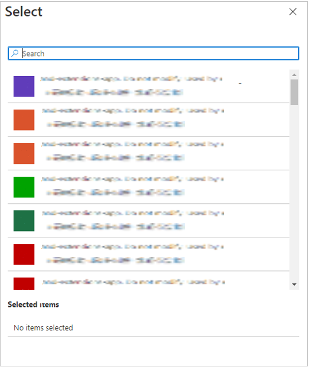
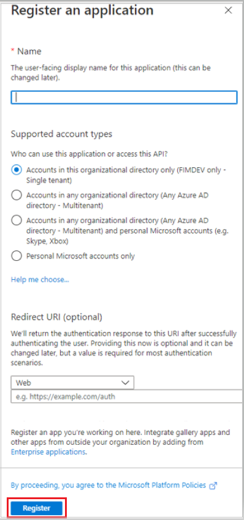
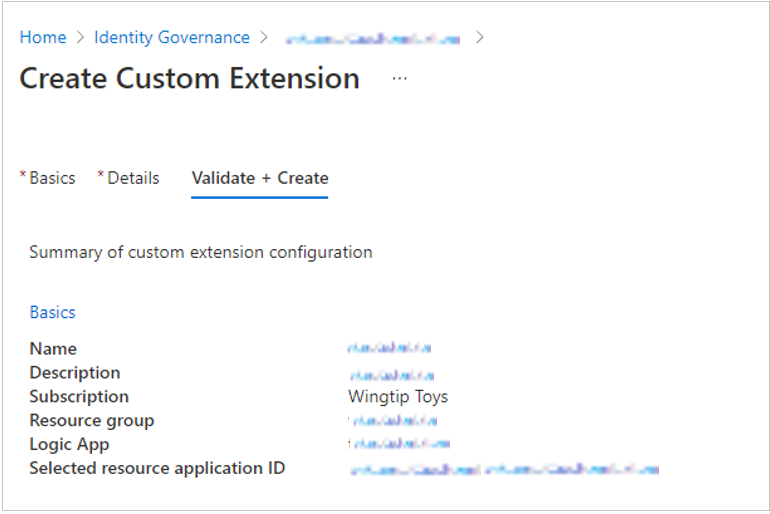

# Trigger custom Logic Apps with Azure AD entitlement management

[Azure Logic Apps](../../logic-apps/logic-apps-overview.md) can be used to automate custom workflows and connect apps and services in one place. Users can integrate Logic Apps with entitlement management to broaden their governance workflows beyond the core entitlement management use cases.

These Logic Apps can then be triggered to run in accordance with entitlement management use cases such as when an access package is granted or requested. For example, an admin could create and link a custom Logic App to entitlement management so that when a user requests an access package, a Logic App is triggered that ensures the user is also assigned certain characteristics in a 3rd party SAAS app (like Salesforce) or is sent a custom email.

Entitlement management use cases that can be integrated with Logic Apps include:  

- when an access package is requested  

- when an access package request is granted  

- when an access package assignment expires  

These triggers to Logic Apps are controlled in a new tab within access package policies called **Rules**. Additionally, a **Custom Extensions** tab on the Catalog page will show all added Logic Apps for a given Catalog. This article describes how to create and add logic apps to catalogs and access packages in entitlement management.

## Create and add a Logic App to a catalog for use in entitlement management 

**Prerequisite roles:** Global administrator, Identity Governance administrator, Catalog owner or Resource Group Owner 

1. Sign in to the [Azure portal](https://portal.azure.com). 

1. In the Azure portal, select **Azure Active Directory** and then select **Identity Governance**. 

1. In the left menu, select **Catalogs**. 

1. Select the catalog for which you want to add a custom extension and then in the left menu, select **Custom Extensions (Preview)**. 

1. In the header navigation bar, select **Add a Custom Extension**.  

1. In the **Basics** tab, enter the name of the custom extension (linked Logic App you are adding) and description of the workflow. These fields will show up in the **Custom Extensions** tab of the Catalog going forward. 

    

1. Then go on to the **Details** tab. 

1. Select **Yes** in the field “Create new logic app”. Otherwise, select **No** and move on to step 9 if you are going to use an existing Logic App. If you selected yes, select one of the options below and move on to step 9: 

    1. Select **create new Azure AD application** if you want to use a new application as the basis for the new Logic App, or
    
        

    1. select **an existing Azure AD Application** if you want to use an existing application as the basis for the new Logic App.
    
        

    > [!Note]    
    > Later, you can edit what your Logic App does in Logic App designer. To do so, select on the Logic App you created in the **Custom Extensions** tab of **Catalogs**.  

1. Next, enter the **Subscription ID**, **Resource group**, **Logic app name**. 

1. Then, select **Validate and Create**. 

1. Review the summary of your custom extension and make sure the details for your Logic App callout are correct. Then select **Create**.

    

1. This custom extension to the linked Logic App will now appear in your Custom Extensions tab under Catalogs. You will be able to call on this in access package policies.

## Edit a linked Logic App 

**Prerequisite roles:** Global administrator, Identity Governance administrator, or Catalog owner 

1. Sign in to the [Azure portal](https://portal.azure.com)l. 

1. In the Azure portal, select **Azure Active Directory** and then select **Identity Governance**. 

1. In the left menu, select **Catalogs**. 

1. In the left menu, select **Custom Extensions**. 

1. Here, you can view all custom extensions (Logic Apps) that you have added to this Catalog. To edit a Logic App workflow, or to create a workflow for a newly-added Logic App, select the Logic App custom extension under **Endpoint**. This will open Logic App Designer and allow you to create your workflow.  

 For more information on creating Logic App workflows, see [Create automated workflows with Azure Logic Apps in the Azure portal](../../logic-apps/quickstart-create-first-logic-app-workflow.md).

## Add custom extension to a policy in an access package

**Prerequisite roles:** Global administrator, Identity Governance administrator, Catalog owner, or Access package manager 

1. Sign in to the [Azure portal](https://portal.azure.com). 

1. In the Azure portal, select **Azure Active Directory** and then select **Identity Governance**. 

1. In the left menu, select **Access packages**. 

1. Select the access package you want to add a custom extension (Logic App) to from the list of access packages that have already been created.  

    > [!NOTE]  
    > Select **New access package** if you want to create a new access package.
    > For more information about how to create an access package see [Create a new access package in entitlement management](entitlement-management-access-package-create.md).  For more information about how to edit an existing access package, see [Change request settings for an access package in Azure AD entitlement management](entitlement-management-access-package-request-policy.md#open-and-edit-an-existing-policys-request-settings).

1. Change to the policy tab, select the policy and select **Edit**.

1. In the policy settings, go to the **Custom Extensions (Preview)** tab.

1. In the menu below **Stage**, select the access package event you wish to use as trigger for this custom extension (Logic App). For example, if you only want to trigger the custom extension Logic App workflow when a user requests the access package, select **Request is created**. 

1. In the menu below **Custom Extension**, select the custom extension (Logic App) you want to add to the access package. The do action you select will execute when the event selected in the when field occurs.  

1. Select **Update** to add it to an existing access package's policy.

    

## Troubleshooting and Validation 

To verify that your custom extension has correctly triggered the associated Logic App when called upon by the access package **Do** option, you can view the Logic App logs. 

The overview page for a specific Logic App will show timestamps of when the Logic App was last executed. Also, the Resource Group overview for a resource group with a linked custom extension will show the name of that custom extension in the overview if it has been configured correctly.  

## Next steps
