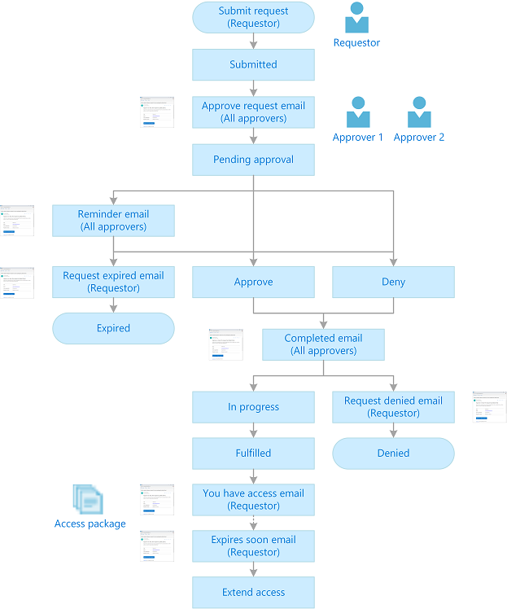
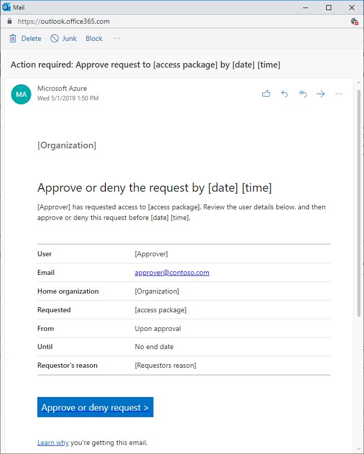

# Email notifications in Azure AD entitlement management (Preview)

> [!IMPORTANT]
> Azure Active Directory (Azure AD) entitlement management is currently in public preview.
> This preview version is provided without a service level agreement, and it's not recommended for production workloads. Certain features might not be supported or might have constrained capabilities.
> For more information, see [Supplemental Terms of Use for Microsoft Azure Previews](https://azure.microsoft.com/support/legal/preview-supplemental-terms/).

Azure AD entitlement management sends email notifications to key stakeholders for the request and approval process of access packages. These emails might also include links to relevant tasks.

This article describes what these emails look like, when they are sent, and who receives them.

## Email notifications

Here is a list of all the email notifications that might be sent by entitlement management.

| # | Email subject | When sent | Who receives |
| --- | --- | --- | --- |
| 1 | Action required: Approve request to *[access package]* by *[date]* *[time]* | When requestor submits request | All approvers |
| 2 | Status notification: *[requestor]* access request to *[access package]* has been completed | When the first approver approves or denies request | All approvers |
| 3 | You now have access to *[access package]*  | When the requestor has been granted access to every resource in the access package | Requestor |
| 4 | Your access to *[access package]* expires in X day(s) | X days before access expires | Requestor |
| 5 |  |  |  |
| 6 |  |  |  |
| 7 |  |  |  |

## Approve request emails

When a requestor submits an access request to an access package that is configured to require approval, all approvers configured in the policy receive an email notification with details of the request. Details include the requestor's name, organization, access start and end date if provided, business justification, when the request was submitted, and when the request will expire. The email includes a link where approvers can approve or deny the access request. Here is a sample email notification that is sent to an approver when a requestor submits an access request.

## Approved or denied emails

Requestors are notified when their access request is approved and available for access, or when their access request is denied. When an approver reviews an access request submitted by a requestor, they can approve or deny the access request. The approver needs to add a business justification for their decision.

When an access request is approved, entitlement management starts the process of granting the requestor access to each of the resources in the access package. After the requestor has been granted access to every resource in the access package, an email notification is sent to the requestor that their access request was approved and that they now have access to the access package. Here is a sample email notification that is sent to a requestor when they are granted access to an access package.

When an access request is denied, an email notification is sent to the requestor. Here is a sample email notification that is sent to a requestor when their access request is denied.

## Expired access request emails

Requestors are notified when their access request has expired (timed-out). When a requestor submits an access request, the request has a request duration after which it expires. If there are no approvers who submit an approve/deny decision, the request continues to remain in a pending approval state. When the request reaches its configured expiration duration, the request expires, and can no longer be approved or denied by the approvers. In this case, the request goes into an expired state. An expired request can no longer be approved or denied. An email notification is sent to the requestor that their access request has expired, and that they need to resubmit the access request. Here is a sample email notification that is sent to a requestor when their access request has expired.

## Next steps

- [Request access to an access package](entitlement-management-request-access.md)
