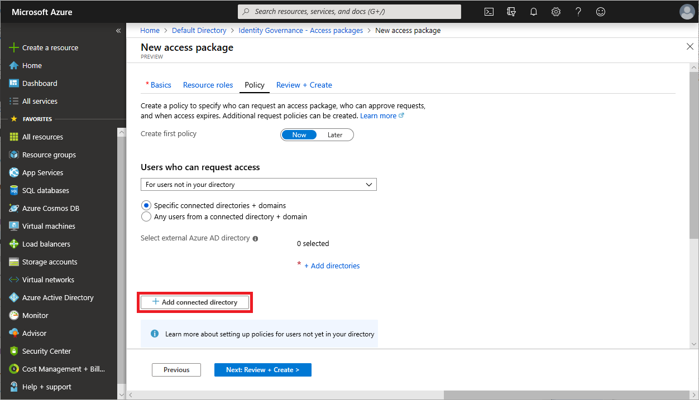
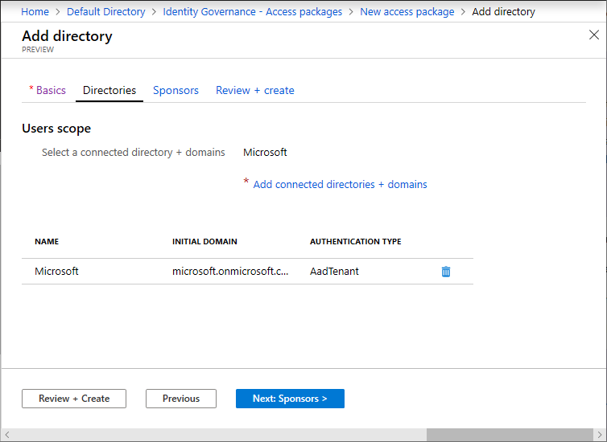

# Add a connected organization in Azure AD entitlement management (Preview)

Azure AD entitlement management enables you to collaborate with people outside your organization. If you frequently collaborate with users in an external Azure AD directory or domain, you can add them as a connected organization. A connected organization is an external Azure AD directory or domain that you define in entitlement management.

## Add a connected organization

Follow these steps to add an external Azure AD directory or a domain as a connected organization.

1. Open the Add connected organizations page. There are two ways that you can open this page.

    If you are [creating a policy](entitlement-management-access-package-create.md#policy) for an access package, in the **Users who can request access** section, click **Specific connected organizations** and then click **Add connected organization**.

    

    If you are on the **Identity Governance** page, click **Connected organizations** and then click **Add connected organization**.

    

1. On the **Basics** tab, enter a display name and description for the organization.

    

1. On the **Directories** tab, click **Add connected organization**.

1. Type a domain name to search for the Azure AD directory or domain. You must type the entire domain name.

1. Verify it is the correct organization by the provided directory name and initial domain.

    > [!NOTE]
    > All users from the organization will be able to request this access package. This includes users from all subdomains associated with the organization, not just the domain used in the search.

1. Click **Add** to add the organization.

1. Once you have added all the Azure AD directories and domains you'd like to include in the policy, click **Select**.

    

    The organization appears in the list of connected organizations.

    

1. On the **Sponsors** tab, add optional sponsors for this connected organization.

    Sponsors are internal or external users already in your directory that are the point of contact for the relationship with this connected organization. Internal sponsors are member users in your directory. External sponsors are guest users from the connected organization that were previously invited and are already in your directory. Sponsors can be utilized as approvers when users in this connected organization request access to this access package. For information about how to invite a guest user to your directory, see [Add Azure Active Directory B2B collaboration users in the Azure portal](../b2b/add-users-administrator.md).

    

1. On the **Review + create** tab, review your organization settings and then click **Create**.

    

## Next steps

- [Add a new policy](entitlement-management-access-package-edit.md#add-a-new-policy)
- [Edit an existing policy](entitlement-management-access-package-edit.md#edit-an-existing-policy)
