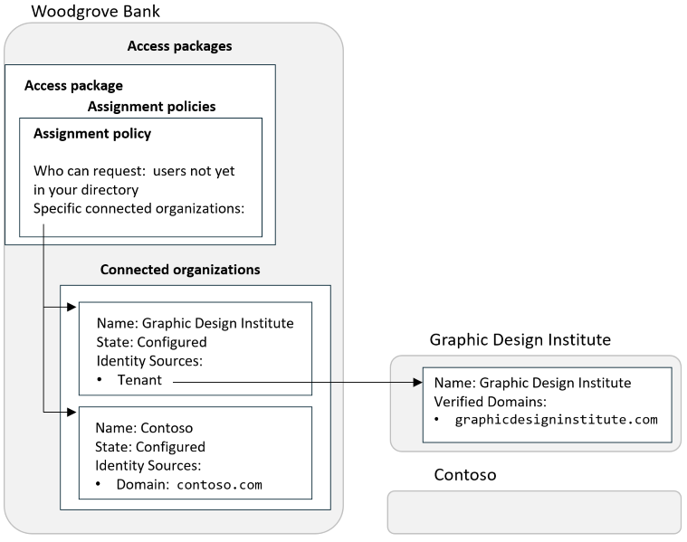
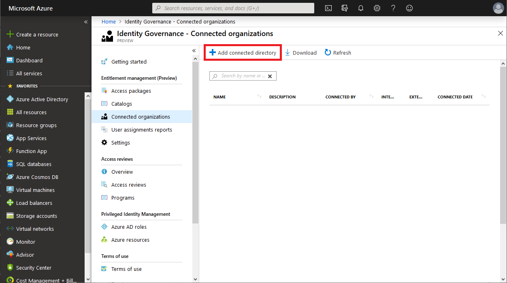
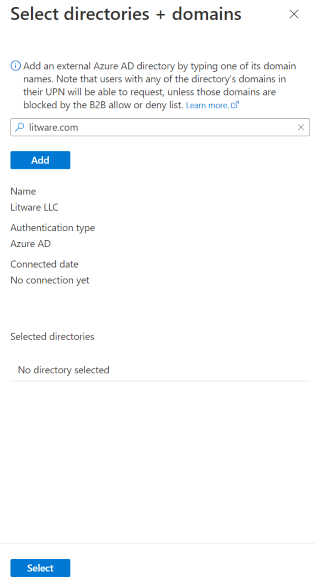
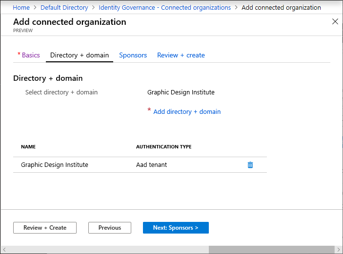
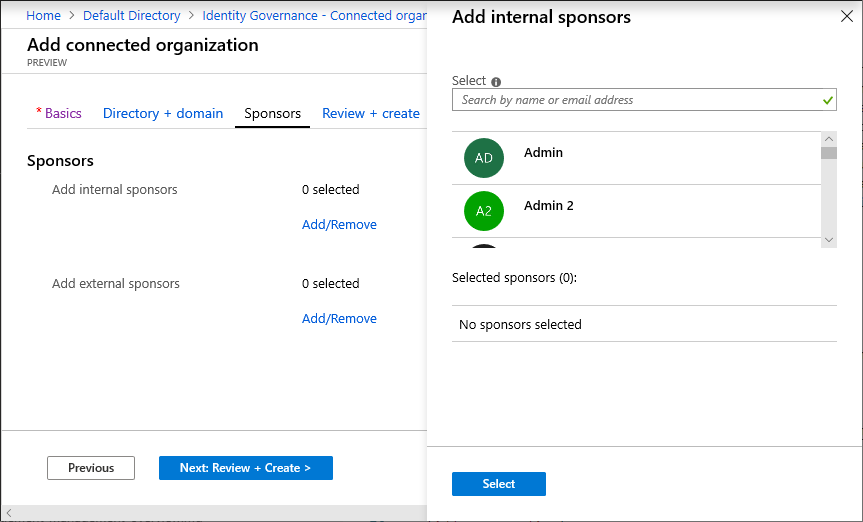
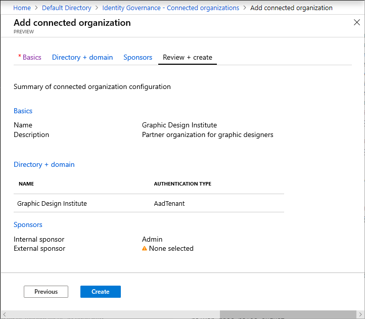
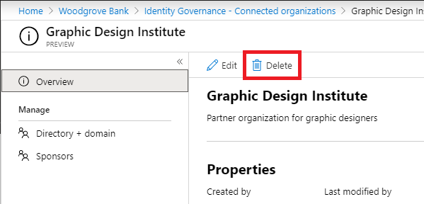

# Manage connected organizations in entitlement management

With entitlement management, you can collaborate with people outside your organization. If you frequently collaborate with many users from specific external organizations, you can add those organization's identity sources as connected organizations. Having a connected organization simplifies how more people from those organizations can request access. This article describes how to add a connected organization so that you can allow users outside your organization to request resources in your directory.

## What is a connected organization?

A connected organization is another organization that you have a relationship with.  In order for the users in that organization to be able to access your resources, such as your SharePoint Online sites or apps, you'll need a representation of that organization's users in that directory.  Because in most cases the users in that organization aren't already in your Microsoft Entra directory, you can use entitlement management to bring them into your Microsoft Entra directory as needed.  

If you want to provide a path for anyone to request access, and you are not sure which organizations those new users might be from, then you can configure an [access package assignment policy for users not in your directory](entitlement-management-access-package-request-policy.md#for-users-not-in-your-directory). In that policy, select the option of **All users (All connected organizations + any new external users)**. If the requestor is approved, and they don’t belong to a connected organization in your directory, a connected organization will automatically be created for them.

If you want to only allow individuals from designated organizations to request access, then first create those connected organizations. Second, configure an [access package assignment policy for users not in your directory](entitlement-management-access-package-request-policy.md#for-users-not-in-your-directory), select the option of **Specific connected organizations**, and select the organizations you created.


There are four ways that entitlement management lets you specify the users that form a connected organization.  It could be

* users in another Microsoft Entra directory (from any Microsoft cloud),
* users in another non-Azure AD directory that has been configured for direct federation,
* users in another non-Azure AD directory, whose email addresses all have the same domain name in common, or
* users with a Microsoft Account, such as from the domain *live.com*, if you have a business need for collaboration with users that have no common organization.

For example, suppose you work at Woodgrove Bank and you want to collaborate with two external organizations.  You want to give users from both external organizations access to the same resources, but these two organizations have different configurations:

- Contoso does not yet use Microsoft Entra ID. Contoso users have an email address that ends with *contoso.com*.
- Graphic Design Institute uses Microsoft Entra ID, and at least some of their users have a user principal name that ends with *graphicdesigninstitute.com*.

In this case, you can configure two connected organizations, then one access package with one policy.

1. Ensure that you have [email one-time passcode (OTP) authentication](../external-identities/one-time-passcode.md) turned on, so that  users from those domains that aren't yet part of Microsoft Entra directories who'll authenticate using email one-time-passcode when requesting access or later accessing your resources.  In addition, you may need to [configure your Microsoft Entra B2B external collaboration settings](entitlement-management-external-users.md?#configure-your-azure-ad-b2b-external-collaboration-settings) to allow external users access.
1. Create a connected organization for Contoso. When you specify the domain *contoso.com*, entitlement management will recognize that there is no existing Microsoft Entra tenant associated with that domain, and that users from that connected organization will be recognized if they  authenticate with an email one-time-passcode with a *contoso.com* email address domain.
1. Create another connected organization for Graphic Design Institute.  When you specify the domain *graphicdesigninstitute.com*, entitlement management will recognize that there is a tenant associated with that domain.
1. In a catalog that allows external users to request, create an access package.
1. In that access package, create an access package assignment policy for **users not yet in your directory**. In that policy, select the option **Specific connected organizations** and specify the two connected organizations. This will allow users from each organization, with an identity source that matches one of the connected organizations, to request the access package.
1. When external users with a user principal name that has a domain of *contoso.com* request the access package, they will authenticate using email. This email domain will match the Contoso-connected organization and the user will be allowed to request the package. After they request, [how access works for external users](entitlement-management-external-users.md?#how-access-works-for-external-users) describes how the B2B user is then invited and access is assigned for the external user.
1. In addition, external users that are using an organizational account from the Graphic Design Institute tenant would match the Graphic Design Institute-connected organization and be allowed to request the access package. And, because Graphic Design Institute uses Microsoft Entra ID, any users with a principal name that matches another [verified domain](../fundamentals/add-custom-domain.md#verify-your-custom-domain-name) that's added to the Graphic Design Institute tenant, such as *graphicdesigninstitute.example*, would also be able to request access packages by using the same policy.

[  ](./media/entitlement-management-organization/connected-organization-example-expanded.png#lightbox)

How users from the Microsoft Entra directory or domain authenticate depends on the authentication type. The authentication types for connected organizations are:

- Microsoft Entra ID, in the same cloud
- Microsoft Entra ID, in another cloud
- [Direct federation](../external-identities/direct-federation.md)
- [One-time passcode](../external-identities/one-time-passcode.md) (domain)
- Microsoft Account

For a demonstration of how to add a connected organization, watch the following video:

>[!VIDEO https://www.microsoft.com/videoplayer/embed/RE4dskS]

## View the list of connected organizations

[!INCLUDE [portal updates](~/articles/active-directory/includes/portal-update.md)]

**Prerequisite role**: *Global Administrator* or  *Identity Governance Administrator*

1. Sign in to the [Microsoft Entra admin center](https://entra.microsoft.com) as at least an [Identity Governance Administrator](../roles/permissions-reference.md#identity-governance-administrator).

1. Browse to **Identity governance** > **Entitlement management** > **Connected organizations**.

1. In the search box, you can search for a connected organization by the name of the connected organization.  However, you cannot search for a domain name.

## Add a connected organization

To add an external Microsoft Entra directory or domain as a connected organization, follow the instructions in this section.

**Prerequisite role**: *Global Administrator* or *Identity Governance Administrator*

1. Sign in to the [Microsoft Entra admin center](https://entra.microsoft.com) as at least an [Identity Governance Administrator](../roles/permissions-reference.md#identity-governance-administrator).

1. Browse to **Identity governance** > **Entitlement management** > **Connected organizations**.

1. On the **Connected organizations** page select **Add connected organization**.

    

1. Select the **Basics** tab, and then enter a display name and description for the organization.

    

1. The state will automatically be set to **Configured** when you create a new connected organization. For more information about state property of a connected organization, see [State property of connected organizations](#state-property-of-connected-organizations)

1. Select the **Directory + domain** tab, and then select **Add directory + domain**.

    Then **Select directories + domains** pane opens.

1. In the search box, enter a domain name to search for the Microsoft Entra directory or domain. You can also add domains that are not associated with any Microsoft Entra directory. Be sure to enter the entire domain name.

1. Confirm that the organization name(s) and authentication type(s) are correct. User sign in, prior to being able to access the MyAccess portal, depends on the authentication type for their organization.  If the authentication type for a connected organization is Microsoft Entra ID, all users with an account in that organization's directory, with any verified domain of that Microsoft Entra directory, will sign into their directory, and then can request access to access packages that allow that connected organization. If the authentication type is One-time passcode, this allows users with email addresses from just that domain to visit the MyAccess portal. After they authenticate with the passcode, the user can make a request.  

    

    > [!NOTE]
    > Access from some domains could be blocked by the Microsoft Entra business to business (B2B) allow or deny list. In addition, users who have an email address that has the same domain as a connected organization configured for Microsoft Entra authentication, but who do not authenticate to that Microsoft Entra directory, will not be recognized as part of that connected organization. For more information, see [Allow or block invitations to B2B users from specific organizations](../external-identities/allow-deny-list.md).  

1. Select **Add** to add the Microsoft Entra directory or domain. **You can add multiple Microsoft Entra directories and domains**.

1. After you've added the Microsoft Entra directories or domains, select **Select**.

    The organization(s) appears in the list.

    

1. Select the **Sponsors** tab, and then add optional sponsors for this connected organization.

    Sponsors are internal or external users already in your directory that are the point of contact for the relationship with this connected organization. Internal sponsors are member users in your directory. External sponsors are guest users from the connected organization that were previously invited and are already in your directory. Sponsors can be utilized as approvers when users in this connected organization request access to this access package. For information about how to invite a guest user to your directory, see [Add Microsoft Entra B2B collaboration users](../external-identities/add-users-administrator.md).

    When you select **Add/Remove**, a pane opens in which you can choose internal or external sponsors. The pane displays an unfiltered list of users and groups in your directory.

    

1. Select the **Review + create** tab, review your organization settings, and then select **Create**.

    

## Update a connected organization 

If the connected organization changes to a different domain, the organization's name changes, or you want to change the sponsors, you can update the connected organization by following the instructions in this section.

**Prerequisite role**: *Global Administrator* or *Identity Governance Administrator*

1. Sign in to the [Microsoft Entra admin center](https://entra.microsoft.com) as at least an [Identity Governance Administrator](../roles/permissions-reference.md#identity-governance-administrator).

1. Browse to **Identity governance** > **Entitlement management** > **Connected organizations**.

1. On the **Connected organizations** page select the connected organization you want to update.

1. In the connected organization's overview pane, select **Edit** to change the organization name, description, or state.  

1. In the **Directory + domain** pane, select **Update directory + domain** to change to a different directory or domain.

1. In the **Sponsors** pane, select **Add internal sponsors** or **Add external sponsors** to add a user as a sponsor. To remove a sponsor, select the sponsor and, in the right pane, select **Delete**.


## Delete a connected organization

If you no longer have a relationship with an external Microsoft Entra directory or domain, or do not wish to have a proposed connected organization any longer, you can delete the connected organization.

**Prerequisite role**: *Global Administrator* or *Identity Governance Administrator*

1. Sign in to the [Microsoft Entra admin center](https://entra.microsoft.com) as at least an [Identity Governance Administrator](../roles/permissions-reference.md#identity-governance-administrator).

1. Browse to **Identity governance** > **Entitlement management** > **Connected organizations**.

1. On the **Connected organizations** page select the connected organization you want to delete to open it.

1. In the connected organization's overview pane, select **Delete** to delete it.

    

## Managing a connected organization programmatically

You can also create, list, update, and delete connected organizations using Microsoft Graph. A user in an appropriate role with an application that has the delegated `EntitlementManagement.ReadWrite.All` permission can call the API to manage [connectedOrganization](/graph/api/resources/connectedorganization) objects and set sponsors for them.

### Manage connected organizations through Microsoft PowerShell

You can also manage connected organizations in PowerShell with the cmdlets from the [Microsoft Graph PowerShell cmdlets for Identity Governance](https://www.powershellgallery.com/packages/Microsoft.Graph.Identity.Governance/) module version 1.16.0 or later.

This script below illustrates using the `v1.0` profile of Graph to retrieve all the connected organizations.  Each returned connected organization contains a list  [identitySources](/graph/api/resources/identitysource) of the directories and domains of that connected organization.

```powershell
Connect-MgGraph -Scopes "EntitlementManagement.ReadWrite.All"

$co = Get-MgEntitlementManagementConnectedOrganization -all

foreach ($c in $co) {
  foreach ($i in $c.identitySources) {
    write-output $c.Id $c.DisplayName $i.AdditionalProperties["@odata.type"]
  }
}
```


## State property of connected organizations

There are two different states for connected organizations in entitlement management, configured and proposed:

- A **configured** connected organization is a fully functional connected organization that allows users within that organization access to access packages. When an admin creates a new connected organization in the Microsoft Entra admin center, it will be in the **configured** state by default since the administrator created and wants to use this connected organization. Additionally, when a connected org is created programmatically via the API, the default state should be **configured** unless set to another state explicitly.

    Configured connected organizations will show up in the pickers for connected organizations and will be in scope for any policies that target “all configured connected organizations”.

- A **proposed** connected organization is a connected organization that has been automatically created, but hasn't had an administrator create or approve the organization. When a user signs up for an access package outside of a configured connected organization, any automatically created connected organizations will be in the **proposed** state since no administrator in the tenant set-up that partnership.
    
    Proposed connected organizations are not in scope for the “all configured connected organizations” setting on any policies but can be used in policies only for policies targeting specific organizations. 

Only users from configured connected organizations can request access packages that are available to users from all configured organizations. Users from proposed connected organizations have an experience as if there is no connected organization for that domain; can only see and request access packages scoped to their specific organization or scoped to any user.  If you have policies in your tenant which allow “all configured connected organizations”, ensure that you do not convert proposed connected organizations for social identity providers to configured.

> [!NOTE]
> As part of rolling out this new feature, all connected organizations created before 09/09/20 were considered **configured**. If you had an access package that allowed users from any organization to sign up, you should review your list of connected organizations that were created before that date to ensure none are miscategorized as **configured**.  In particular, social identity providers should not be indicated as **configured** if there are assignment policies which do not require approval for users from all configured connected organizations. An admin can update the **State** property as appropriate. For guidance, see [Update a connected organization](#update-a-connected-organization).
> [!NOTE]
>  In some cases, a user might request an access package using their personal account from a social identity provider, where that account's email address has the same domain as an existing connected organization corresponding to a Microsoft Entra tenant. If that user is approved, it would result in a new proposed connected organization representing that domain. In this case, make sure the user is using their organization account instead to re-request access, and the portal will identify this user coming from the configured connected organization Microsoft Entra tenant.


## Next steps

- [Govern access for external users](./entitlement-management-external-users.md)
- [Govern access for users not in your directory](entitlement-management-access-package-request-policy.md#for-users-not-in-your-directory)
