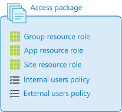
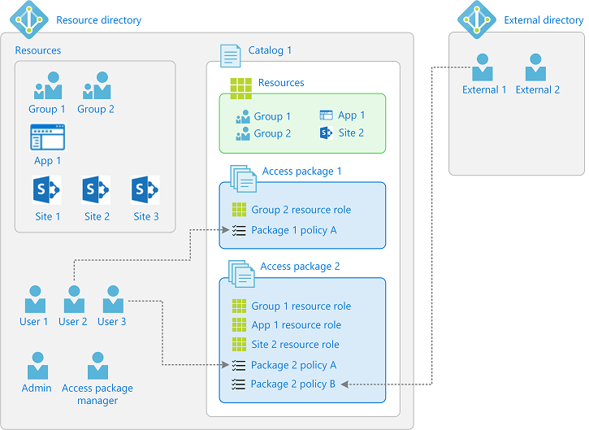

# What is Azure AD entitlement management?

Azure Active Directory (Azure AD) entitlement management is an [identity governance](identity-governance-overview.md) feature that  enables organizations to manage identity and access lifecycle at scale, by automating access request workflows, access assignments, reviews, and expiration.

Employees in organizations need access to various groups, applications, and sites to perform their job. Managing this access is challenging, as requirements change - new applications are added or users need additional access rights.  This scenario gets more complicated when you collaborate with outside organizations - you may not know who in the other organization needs access to your organization's resources, and they won't know what applications, groups or sites your organization is using.

Azure AD entitlement management can help you more efficiently manage access to groups, applications, and SharePoint Online sites for internal users, and also for users outside your organization who need access to those resources.

## Why use entitlement management?

Enterprise organizations often face challenges when managing employee access to resources such as:

- Users may not know what access they should have, and even if they do, they may have difficulty locating the right individuals to approve their access
- Once users find and receive access to a resource, they may hold on to access longer than is required for business purposes

These problems are compounded for users who need access from another organization, such as external users that are from supply chain organizations or other business partners. For example:

- No one person may know all of the specific individuals in other organization's directories to be able to invite them
- Even if they were able to invite these users, no one in that organization may remember to manage all of the user's access consistently

Azure AD entitlement management can help address these challenges.  To learn more about how customers have been using Azure AD entitlement management, you can read the [Avanade case study](https://customers.microsoft.com/story/avanade-professional-services-azure-canada) and the [Centrica case study](https://customers.microsoft.com/story/757467-centrica-energy-azure).  This video provides an overview of entitlement management and its value:

>[!VIDEO https://www.youtube.com/embed/_Lss6bFrnQ8]

## What can I do with entitlement management?

Here are some of capabilities of entitlement management:

- Delegate to non-administrators the ability to create access packages. These access packages contain resources that users can request, and the delegated access package managers can define policies with rules for which users can request, who must approve their access, and when access expires.
- Select connected organizations whose users can request access.  When a user who is not yet in your directory requests access, and is approved, they are automatically invited into your directory and assigned access.  When their access expires, if they have no other access package assignments, their B2B account in your directory can be automatically removed.

You can get started with our [tutorial to create your first access package](entitlement-management-access-package-first.md). You can also read the [common scenarios](entitlement-management-scenarios.md), or watch videos, including

- [How to deploy Azure AD entitlement management in your organization](https://www.youtube.com/watch?v=zaaKvaaYwI4)
- [How to monitor and scale your use of Azure AD entitlement management](https://www.youtube.com/watch?v=omtNJ7ySjS0)
- [How to delegate in entitlement management](https://www.youtube.com/watch?v=Fmp1eBxzrqw)

## What are access packages and what resources can I manage with them?

Entitlement management introduces to Azure AD the concept of an *access package*. An access package is a bundle of all the resources with the access a user needs to work on a project or perform their task. Access packages are used to govern access for your internal employees, and also users outside your organization.

 Here are the types of resources you can manage user's access to with entitlement management:

- Membership of Azure AD security groups
- Membership of Office 365 Groups and Teams
- Assignment to Azure AD enterprise applications, including SaaS applications and custom-integrated applications that support federation/single sign on and/or provisioning
- Membership of SharePoint Online sites

You can also control access to other resources that rely upon Azure AD security groups or Office 365 Groups.  For example:

- You can give users licenses for Microsoft Office 365 by using an Azure AD security group in an access package and configuring [group-based licensing](../users-groups-roles/licensing-groups-assign.md) for that group
- You can give users access to manage Azure resources by using an Azure AD security group in an access package and creating an [Azure role assignment](../../role-based-access-control/role-assignments-portal.md) for that group

## How do I control who gets access?

With an access package, an administrator or delegated access package manager lists the resources (groups, apps, and sites), and the roles the users need for those resources.

Access packages also include one or more *policies*. A policy defines the rules or guardrails for assignment to access package. Each policy can be used to ensure that only the appropriate users are able to request access, that there are approvers for their request, and that their access to those resources is time-limited and will expire if not renewed.

Within each policy, an administrator or access package manager defines

- Either the already-existing users (typically employees or already-invited guests), or the partner organizations of external users, that are eligible to request access
- The approval process and the users that can approve or deny access
- The duration of a user's access assignment, once approved, before the assignment expires

The following diagram shows an example of the different elements in entitlement management. It shows one catalog with two example access packages.

- **Access package 1** includes a single group as a resource. Access is defined with a policy that enables a set of users in the directory to request access.
- **Access package 2** includes a group, an application, and a SharePoint Online site as resources. Access is defined with two different policies. The first policy enables a set of users in the directory to request access. The second policy enables users in an external directory to request access.

## When should I use access packages?

Access packages do not replace other mechanisms for access assignment.  They are most appropriate in situations such as the following:

- Employees need time-limited access for a particular task.  For example, you might use group-based licensing and a dynamic group to ensure all employees have an Exchange Online mailbox, and then use access packages for situations in which employees need additional access,such as to read departmental resources from another department.
- Access needs to be approved by an employee's manager or other designated individuals.
- Departments wish to manage their own access policies for their resources without IT involvement.  
- Two or more organizations are collaborating on a project, and as a result, multiple users from one organization will need to be brought in via Azure AD B2B to access another organization's resources.

## How do I delegate access?

 Access packages are defined in containers called *catalogs*.  You can have a single catalog for all your access packages, or you can designate individuals to create and own their own catalogs. An administrator can add resources to any catalog, but a non-administrator can only add to a catalog the resources which they own. A catalog owner can add other users as catalog co-owners, or as access package managers.  These scenarios are described further in the article [delegation and roles in Azure AD entitlement management](entitlement-management-delegate.md).

## Summary of terminology

To better understand entitlement management and its documentation, you can refer back to the following list of terms.

| Term | Description |
| --- | --- |
| access package | A bundle of resources that a team or project needs and is governed with policies. An access package is always contained in a catalog. You would create a new access package for a scenario in which users need to request access.  |
| access request | A request to access the resources in an access package. A request typically goes through an approval workflow.  If approved, the requesting user receives an access package assignment. |
| assignment | An assignment of an access package to a user ensures the user has all the resource roles of that access package.  Access package assignments typically have a time limit before they expire. |
| catalog | A container of related resources and access packages.  Catalogs are used for delegation, so that non-administrators can create their own access packages. Catalog owners can add resources they own to a catalog. |
| catalog creator | A collection of users who are authorized to create new catalogs.  When a non-administrator user who is authorized to be a catalog creator creates a new catalog, they automatically become the owner of that catalog. |
| connected organization | A external Azure AD directory or domain that you have a relationship with. The users from a connected organization can be specified in a policy as being allowed to request access. |
| policy | A set of rules that defines the access lifecycle, such as how users get access, who can approve, and how long users have access through an assignment. A policy is linked to an access package. For example, an access package could have two policies - one for employees to request access and a second for external users to request access. |
| resource | An asset, such as an Office group, a security group, an application, or a SharePoint Online site, with a role that a user can be granted permissions to. |
| resource directory | A directory that has one or more resources to share. |
| resource role | A collection of permissions associated with and defined by a resource. A group has two roles - member and owner. SharePoint sites typically have 3 roles but may have additional custom roles. Applications can have custom roles. |

## License requirements

[!INCLUDE [Azure AD Premium P2 license](../../../includes/active-directory-p2-license.md)]

Specialized clouds, such as Azure Germany, and Azure China 21Vianet, are not currently available for use.

### How many licenses must you have?

Ensure that your directory has at least as many Azure AD Premium P2 licenses as you have:

- Member users who **can** request an access package.
- Member and guest users who request an access package.
- Member and guest users who approve requests for an access package.
- Member and guest users who have a direct assignment to an access package.

Azure AD Premium P2 licenses are **not** required for the following tasks:

- No licenses are required for users with the Global Administrator role who set up the initial catalogs, access packages, and policies, and delegate administrative tasks to other users.
- No licenses are required for users who have been delegated administrative tasks, such as catalog creator, catalog owner, and access package manager.
- No licenses are required for guests who **can** request access packages, but do **not** request an access package.

For each paid Azure AD Premium P2 license that you purchase for your member users (employees), you can use Azure AD B2B to invite up to 5 guest users. These guest users can also use Azure AD Premium P2 features. For more information, see [Azure AD B2B collaboration licensing guidance](../b2b/licensing-guidance.md).

For more information about licenses, see [Assign or remove licenses using the Azure Active Directory portal](../fundamentals/license-users-groups.md).

### Example license scenarios

Here are some example license scenarios to help you determine the number of licenses you must have.

| Scenario | Calculation | Number of licenses |
| --- | --- | --- |
| A Global Administrator at Woodgrove Bank creates initial catalogs and delegates administrative tasks to 6 other users. One of the policies specifies that **All employees** (2,000 employees) can request a specific set of access packages. 150 employees request the access packages. | 2,000 employees who **can** request the access packages | 2,000 |
| A Global Administrator at Woodgrove Bank creates initial catalogs and delegates administrative tasks to 6 other users. One of the policies specifies that **All employees** (2,000 employees) can request a specific set of access packages. Another policy specifies that some users from **Users from partner Contoso** (guests) can request the same access packages subject to approval. Contoso has 30,000 users. 150 employees request the access packages and 10,500 users from Contoso request access. | 2,000 employees + 500 guest users from Contoso that exceed the 1:5 ratio (10,500 - (2,000 * 5)) | 2,500 |

## Next steps

- [Tutorial: Create your first access package](entitlement-management-access-package-first.md)
- [Common scenarios](entitlement-management-scenarios.md)
