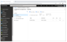
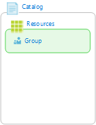
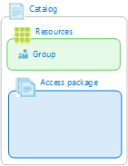
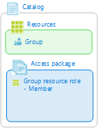
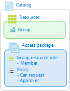

# What is Azure AD entitlement management? (Preview)

> [!IMPORTANT]
> Azure Active Directory (Azure AD) entitlement management is currently in public preview.
> This preview version is provided without a service level agreement, and it's not recommended for production workloads. Certain features might not be supported or might have constrained capabilities.
> For more information, see [Supplemental Terms of Use for Microsoft Azure Previews](https://azure.microsoft.com/support/legal/preview-supplemental-terms/).

Azure Active Directory (Azure AD) entitlement management enables organizations to efficiently manage user's access to groups, enterprise applications, and SharePoint Online sites.

For an overview of identity governance and entitlement management, watch the following video from the Ignite 2018 conference:

>[!VIDEO https://www.youtube.com/embed/aY7A0Br8u5M]

## Why use entitlement management?

Enterprise organizations often face challenges when managing access for users across resources:

- Users may not know what access rights they should have
- Users may have difficulty locating the right individuals or right resources
- Once users find and receive access to a resource, they may hold on to access rights longer than is required for business purposes

These problems are compounded for users who need access from another directory, such as guest users that are from supply chain organizations or other business partners. Organizations that want to make their resources available to authorized users in other directories also have these challenges:

- Organizations may not know all of the specific individuals in other directories to be able to invite them
- Even if organizations were able to invite these users, organizations may not remember to manage all of the user's access rights consistently

### Example scenario

To help better understand, let's look at an example. Let's say some of your organization's internal employees are working on a project and they need access to the resources for that project. They might need access to:

- Azure AD groups or security groups
- Applications
- SharePoint Online sites

Providing access to all the resources a user needs to be productive is challenging because typically there is no organized list of all the resources needed for a project. The absence of such a list causes unwanted delays in giving timely access to the users.

Typically, the project manager or the business manager has a good understanding of all the resources needed, the scope of the project, the individuals involved in the project, and how long the project will last. However, the business manager typically does not have permissions to approve or grant access to others.

The scenario gets more complicated when you try to work with individuals or companies outside your organization.

Azure AD entitlement management can help address these challenges.

## What can I do with entitlement management?

- Govern the lifecycle of access for both internal and guest users
- Define bundles of resources a user needs
- Define rules for how to request resources and when access expires
- Delegate managers to manage resources and approve requests
- Create reports to track history

## Who are the users for entitlement management?

- Administrators
- Access package managers
- Approvers
- Users

## What are access packages and policies?

Entitlement management introduces the concept of an *access package*. An access package is a bundle of all the resources a user needs to work on a project or perform their job. Access packages can be used to govern access by your internal employees, and also by guest users from outside your organization.

Access packages also include one or more *policies*. A policy defines the rules or guardrails around the access to the access package. Enabling a policy enforces that only the right users are granted access, to the right resources, and for the right amount of time. An access package must be configured with a policy.

With an access package and policies, the access package manager defines:

- Resources
- Users that are eligible for access
- Approval process with the right approvers to approve or deny access
- Technical roles the users need in the resources
- Duration of user's access

The access package empowers the access package manager to do a one-time setup, that automatically administers access, and manages the access lifecycle. There is built-in flexibility to allow the access package manager to change the resources, without needing to worry about provisioning the user's access to the new resources, or removing their access from the previous resources. Policies can also be updated at any time, however, the policy changes only affect new accesses.

Managing access to resources for users applies both to users already in your directory and to users not yet in your directory. Resource organizations can define that users from other organizations may need access for a project. Users from the other organization would be able to visit a resource organization portal and view available access packages, request those access packages. Assuming the request is approved, that user will be invited into the resource organization and provisioned into the resources associated with that access package. Based on the resource organizations policies, the approved user will only get for a certain period, after that time the system will remove access to resources including the B2B account.

## Prerequisites

To use Azure AD entitlement management (Preview), you must have one of the following licenses:

- Azure AD Premium P2
- Enterprise Mobility + Security (EMS) E5 license

For more information, see [Sign up for Azure Active Directory Premium editions](../fundamentals/active-directory-get-started-premium.md) or [Enterprise Mobility + Security E5 Trial](https://aka.ms/emse5trial).

## Basic steps

| # |  | Task | Portal | Who can perform |
| ---: | --- | --- | --- | --- |
| 1 |  | Create a catalog |  | User admin Catalog creator |
| 2 |  | Add resources to catalog |  | User admin Catalog owner |
| 3 |  | Create an access package in catalog |  | User admin Catalog owner |
| 4 |  | Add resource roles to access package |  | User admin Catalog owner Access package manager |
| 5 |  | Add policy - Who can request access - Who can approve - Expiration settings |  | User admin Catalog owner Access package manager |
| 6 |  | Request access |  | User |
| 7 |  | Approve access request |  | Approver |
| 8 |  | Use resources in access package |  | User |

## Approval process

A user that needs access to an access package must submit a request. Depending on the configuration of the policy, the access package might require an approval process. When a user submits an access request, their request is in the **submitted** state. This triggers the approval process, and moves the request to the **pending approval** state.

The access package approvers are notified of the user's access request. There may be a single approver, multiple approvers, or a group of approvers defined in the policy. Only one approver needs to review the access request, and submit the approve or deny decision.

If the access request is approved, the request is in the **approved** state. Entitlement management starts the process of provisioning the user's access to each resource in the access package. This moves the request to the **provisioning** state. When the user is provisioned access to all the resources in the access packages, they are notified of their access to the access package.

If the access request is denied, the user gets notified of the deny decision. This changes the request to a **denied** state.

## Roles to perform tasks

To perform tasks in Azure AD entitlement management, you must have the appropriate permissions. The following table lists the minimum roles you must have to perform certain tasks.

| Task | User admin | Catalog creator | Catalog owner | Access package manager |
| --- | :---: | :---: | :---: | :---: |
| Create a catalog | :heavy_check_mark: | :heavy_check_mark: |  |  |
| Edit/delete a catalog | :heavy_check_mark: |  | :heavy_check_mark: |  |
| Add additional catalog owners | :heavy_check_mark: |  | :heavy_check_mark: |  |
| Add/remove resources to/from the **Default** catalog | :heavy_check_mark: |  |  |  |
| Add/remove resources to/from a catalog | :heavy_check_mark: |  | :heavy_check_mark: |  |
| Create an access package in the **Default** catalog | :heavy_check_mark: |  :heavy_check_mark: |  |  |
| Create an access package in a catalog | :heavy_check_mark: |   | :heavy_check_mark: |  |
| Delete an access package | :heavy_check_mark: |  | :heavy_check_mark: | :heavy_check_mark: |
| Add/remove access packages to/from a catalog | :heavy_check_mark: |  |  | :heavy_check_mark: |
| Add/remove resource roles to/from an access package | :heavy_check_mark: |  | :heavy_check_mark: | :heavy_check_mark: |
| Directly assign a user to an access package | :heavy_check_mark: |  | :heavy_check_mark: | :heavy_check_mark: |
| View who has an assignment to an access package | :heavy_check_mark: |  | :heavy_check_mark: | :heavy_check_mark: |
| View an access package's requests | :heavy_check_mark: |  | :heavy_check_mark: | :heavy_check_mark: |
| View a request's fulfillment errors | :heavy_check_mark: |  | :heavy_check_mark: | :heavy_check_mark: |
| Cancel a pending request | :heavy_check_mark: |  | :heavy_check_mark: | :heavy_check_mark: |
| Hide an access package | :heavy_check_mark: |  | :heavy_check_mark: | :heavy_check_mark: |

The person that creates a catalog automatically becomes the catalog's first Catalog Owner.

## Terminology

To better understand entitlement management and its documentation, you should review the following terms.

| Term or concept | Description |
| --- | --- |
| entitlement management | A service that assigns, revokes, and administers access packages. |
| catalog | A container of related resources and access packages. A catalog can be configured to be visible outside the current directory. |
| Default catalog | A built-in catalog that is always available. To add resources to the Default catalog requires certain permissions. |
| access package | A collection of permissions and policies to resources that users can request. An access package is always contained in a catalog. |
| access package manager | Users that can manage all access packages within a catalog. |
| access request | A request to access an access package. A request typically goes through a workflow. |
| policy | A set of rules that defines the access lifecycle, such as how users get access, who can approve, and how long users have access. Example policies include guest access and employee access. |
| resource | An asset or service (such as a group, application, or site) that a user can be granted permissions to. |
| resource type | The type of resource. A resource type includes: Azure AD security group, Office 365 group, Azure AD enterprise application, SaaS applications, custom integrated applications, SharePoint Online site collection, and SharePoint Online site. |
| resource role | A collection of permissions associated with a resource. |
| resource directory | A directory that has one or more resources to share. |
| assigned users | An assignment of an access package to a user or group. |
| enable | The process of making an access package visible for users to request. |

## Next steps

- [Tutorial: Get started with Azure AD entitlement management](entitlement-management-get-started.md)
