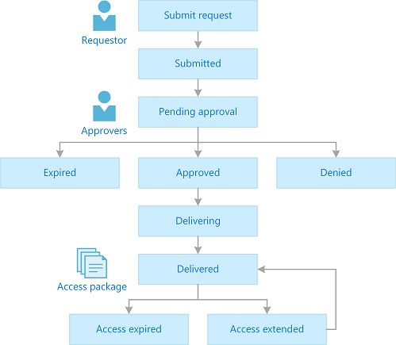
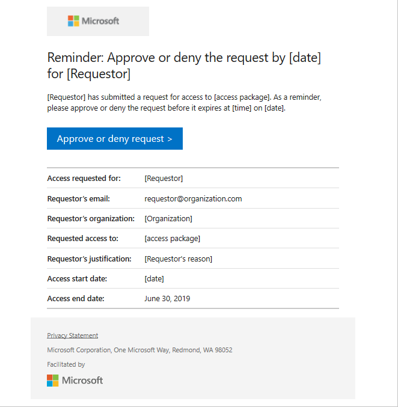
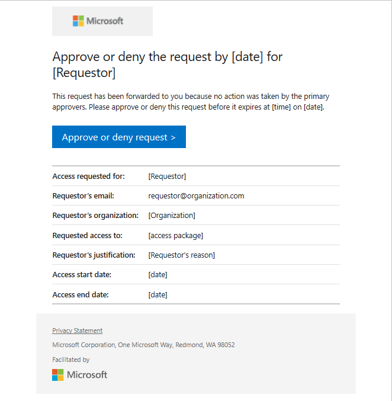
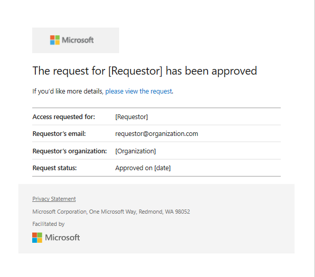
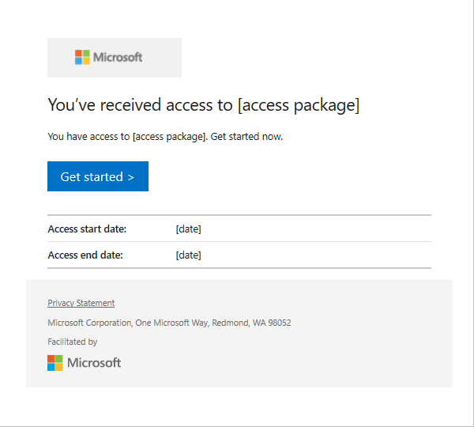
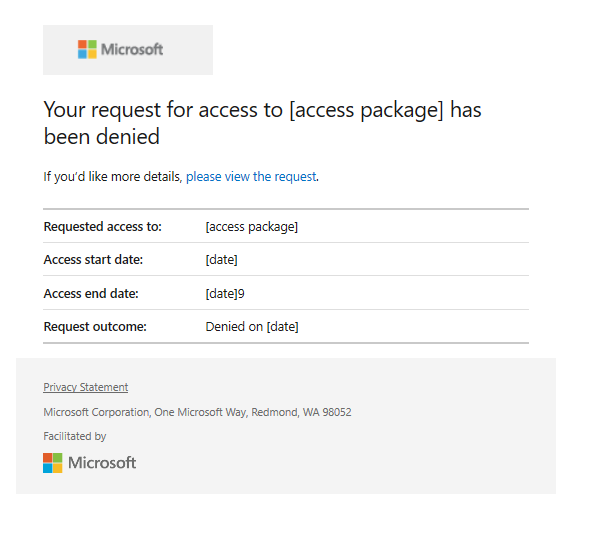
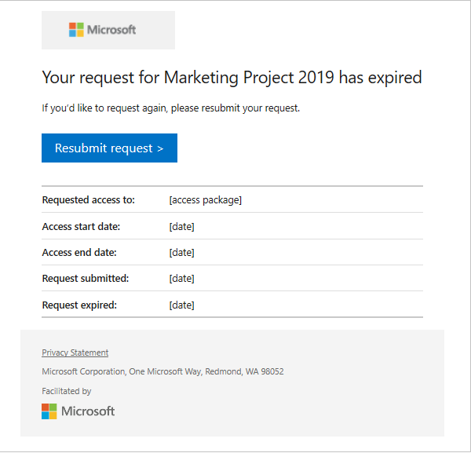

# Request process and email notifications in entitlement management

When a user submits a request to an access package, a process begins to deliver that access request. Entitlement management sends email notifications to approvers and requestors when key events occur during the process. This article describes the request process and the email notifications that are sent.

## Who can request an access package

The catalog, access package and policy settings control whether a user can request an access package.

* The catalog setting of **Enabled** determines whether users can request access packages in the catalog.
* The catalog setting of **Enabled for external users** determines whether users who are from external directories can request access packages in the catalog.
* The access package setting of **Hidden** determines whether users can see the access package in My access. It does not limit whether a user who has a link to the access package can request it.
* The access package list of incompatible access packages and groups determines whether users who already have other assignments can request.
* The policy settings within the access package determine who can request.

## Request process

A user that needs access to the resources in an access package can submit an access request. Depending on the configuration of the policy, the request might require an approval. When a request is approved, a process begins to assign the user access to each resource in the access package. The following diagram shows an overview of the process and the different states:

| State | Description |
| --- | --- |
| Submitted | User submits a request. |
| Pending approval | If the policy for an access package requires approval, a request moves to pending approval. |
| Expired | If no approvers approve a request within the approval request timeout, the request expires. To try again, the user has to resubmit their request. |
| Denied | Approver denies a request. |
| Approved | Approver approves a request. |
| Delivering | User has **not** been assigned access to all the resources in the access package. If this is an external user, the user may not have accessed the resource directory yet. They also may not have accepted the consent prompt. |
| Delivered | User has been assigned access to all the resources in the access package. |
| Partially Delivered |  User has **not** been assigned access to all the resources in the access package yet. |
| Access extended | If extensions are allowed in the policy, the user extended the assignment. |
| Access expired | User's access to the access package has expired. To get access again, the user has to submit a request. |

## Email notifications

If you're an approver, you're sent email notifications when you need to approve an access request. You also receive notifications when an access request has been completed. You're also sent email notifications that indicate the status of your request if you're a requestor.

The following diagrams show when these email notifications are sent to either the approvers or the requestor. Reference the [email notifications table](entitlement-management-process.md#email-notifications-table) to find the corresponding number to the email notifications displayed in the diagrams.

> [!NOTE]
> If the admin directly assigns a user to an access package, you won't receive an email notification when an access request has been completed or denied. Email notifications are sent only when a user makes a request for access.

### First approvers and alternate approvers
The following diagram shows the experience of first approvers and alternate approvers, and the email notifications they receive during the request process:

:::image type="content" source="./media/entitlement-management-process/first-approvers-and-alternate-with-escalation-flow.png" alt-text="First and alternate approvers process flow" lightbox="./media/entitlement-management-process/first-approvers-and-alternate-with-escalation-flow.png":::

### Requestors
The following diagram shows the experience of requestors and the email notifications they receive during the request process:

:::image type="content" source="./media/entitlement-management-process/requestor-approval-request-flow.png" alt-text="Requestor process flow" lightbox="./media/entitlement-management-process/requestor-approval-request-flow.png":::

### Multi-stage approval
The following diagram shows the experience of stage-1 and stage-2 approvers and the email notifications they receive during the request process:

:::image type="content" source="./media/entitlement-management-process/2stage-approval-with-request-timeout-flow.png" alt-text="2-stage approval process flow" lightbox="./media/entitlement-management-process/2stage-approval-with-request-timeout-flow.png":::

### Email notifications table
The following table provides more detail about each of these email notifications. To manage these emails, you can use rules. For example, in Outlook, you can create rules to move the emails to a folder if the subject contains words from this table.  The words are based on the default language settings of the tenant where the user is requesting access.

| # | Email subject | When sent | Sent to |
| --- | --- | --- | --- |
| 1 | Action required: Approve or deny forwarded request by *[date]* | This email will be sent to Stage-1 alternate approvers (after the request has been escalated) to take action. | Stage-1 alternate approvers |
| 2 | Action required: Approve or deny request by *[date]* | This email is sent to the first approver, if escalation is disabled, to take action. | First approver |
| 3 | Reminder: Approve or deny the request by *[date]* for *[requestor]* | This reminder email is sent to the first approver, if escalation is disabled. The email asks them to take action if they haven't. | First approver |
| 4 | Approve or deny the request by *[time]* on *[date]* | This email is sent to the first approver (if escalation is enabled) to take action. | First approver |
| 5 | Action required reminder: Approve or deny the request by *[date]* for *[requestor]* | This reminder email is sent to the first approver, if escalation is enabled. The email asks them to take action if they haven't. | First approver |
| 6 | Request has expired for *[access_package]* | This email will be sent to the first approver and stage-1 alternate approvers after the request has expired. | First approver, stage-1 alternate approvers |
| 7 | Request approved for *[requestor]* to *[access_package]* | This email is sent to the first approver and stage-1 alternate approvers upon request completion. | First approver, stage-1 alternate approvers |
| 8 | Request approved for *[requestor]* to *[access_package]* | This email is sent to the first approver and stage-1 alternate approvers of a multi-stage request when the stage-1 request is approved. | First approver, stage-1 alternate approvers |
| 9 | Request denied to *[access_package]* | This email is sent to the requestor when their request is denied | Requestor |
| 10 | Your request has expired for *[access_package]* | This email is sent to the requestor at the end of a single or multi-stage request. The email notifies the requestor that the request expired. | Requestor |
| 11 | Action required: Approve or deny request by *[date]* | This email is sent to the second approver, if escalation is disabled, to take action. | Second approver |
| 12 | Action required reminder: Approve or deny the request by *[date]* | This reminder email is sent to the second approver, if escalation is disabled. The notification asks them to take action if they haven't yet. | Second approver |
| 13 | Action required: Approve or deny the request by *[date]* for *[requestor]* | This email is sent to second approver, if escalation is enabled, to take action. | Second approver |
| 14 | Action required reminder: Approve or deny the request by *[date]* for *[requestor]* | This reminder email is sent to the second approver, if escalation is enabled. The notification asks them to take action if they haven't yet. | Second approver |
| 15 | Action required: Approve or deny forwarded request by *[date]* | This email is sent to stage-2 alternate approvers, if escalation is enabled, to take action. | Stage-2 alternate approvers |
| 16 | Request approved for *[requestor]* to *[access_package]* | This email is sent to the second approver and stage-2 alternate approvers upon approving the request. | Second approver, Stage-2 alternate approvers |
| 17 | A request has expired for *[access_package]* | This email will be sent to the second approver or alternate approvers, after the request expires. | Second approver, stage-2 alternate approvers |
| 18 | You now have access to *[access_package]* | This email is sent to the end users to start using their access. | Requestor |
| 19 | Extend access for *[access_package]* by *[date]* | This email is sent to the end users before their access expires. | Requestor |
| 20 | Access has ended for *[access_package]* | This email will be sent to the end users after their access expires. | Requestor |

### Access request emails

When a requestor submits an access request for an access package configured to require approval, all approvers added to the policy receives an email notification with details of the request, at their approval stage. The details in the email include: requestor's name organization, and business justification; and the requested access start and end date (if provided). The details will also include when the request was submitted and when the request will expire.

The email includes a link approvers can select on to go to My Access to approve or deny the access request. Here's a sample email notification that is sent to an approver to complete an access request:

Approvers can also receive a reminder email. The email asks the approver to make a decision on the request. Here's a sample email notification the approver receives to remind them to take action:

### Alternate approvers request emails

If the alternate approvers setting is enabled and the request is still pending, it's forwarded. Alternate approvers receive an email to approve or deny the request. You can enable alternate approvers in stage-1 and stage-2. Here's a sample email of the notification the alternate approvers receive:

Both the approver and the alternate approvers can approve or deny the request.

### Approved or denied emails

 When an approver receives an access request submitted by a requestor, they can approve or deny the access request. The approver needs to add a business justification for their decision. Here's a sample email sent to the approvers
 and alternate approvers after a request is approved:

When an access request is approved, and their access is provisioned, an email notification is sent to the requestor that they now have access to the access package. Here's a sample email notification that is sent to a requestor when they're granted access to an access package:

When an access request is denied, an email notification is sent to the requestor. Here's a sample email notification that is sent to a requestor when their access request is denied:

### Multi-stage approval access request emails

If multi-stage approval is enabled, at least one approver from each stage must approve the request, before the requestor can receive access.

During stage-1, the first approver receives the access request email and makes a decision.

After the first or alternate approvers approve the request in stage-1, stage-2 begins. During stage-2, the second approver receives the access request notification email. After the second approver or alternate approvers in stage-2 (if escalation is enabled) decide to approve or deny the request, notification emails are sent to the first and second approvers, and all alternate approvers in stage-1 and stage-2, as well as the requestor.

### Expired access request emails

Access requests could expire if no approver has approved or denied the request. 

When the request reaches its configured expiration date and expires, it can no longer be approved or denied by the approvers.

An email notification is sent to the requestor, notifying them that their access request has expired, and that they need to resubmit the access request. The following diagram shows the experience of the requestor and the email notifications they receive when they request to extend access:

:::image type="content" source="./media/entitlement-management-process/requestor-expiration-request-flow.png" alt-text="Requestor extend access process flow" lightbox="./media/entitlement-management-process/requestor-expiration-request-flow.png":::

Here's a sample email notification that is sent to a requestor when their access request has expired:

## Next steps

- [Request access to an access package](entitlement-management-request-access.md)
- [Approve or deny access requests](entitlement-management-request-approve.md)
