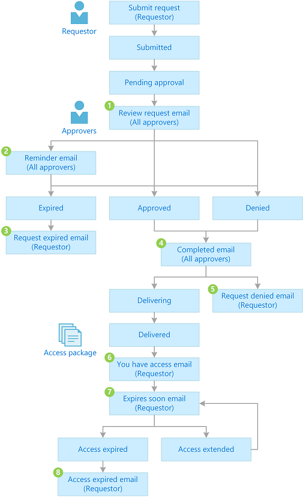
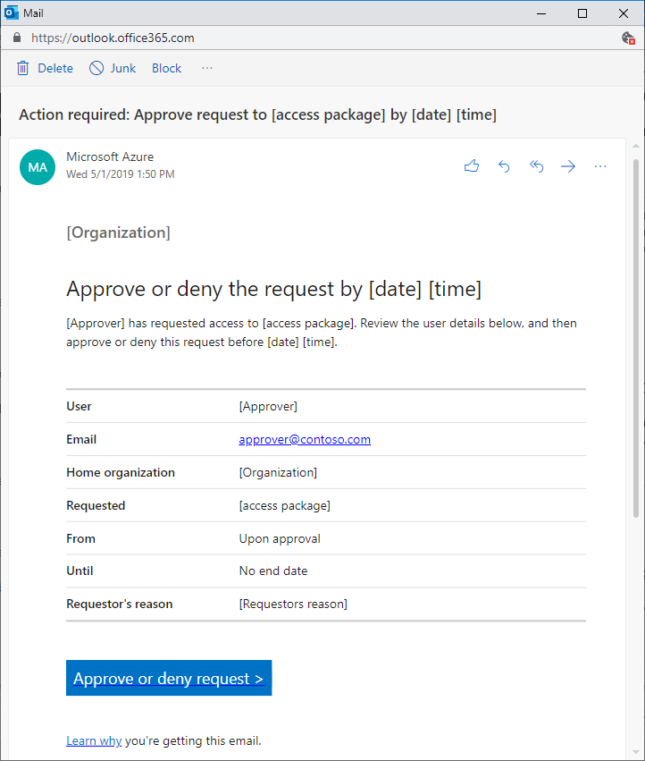
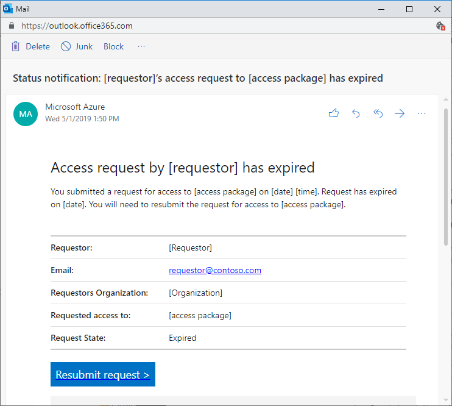

# Request process and email notifications in Azure AD entitlement management (Preview)

> [!IMPORTANT]
> Azure Active Directory (Azure AD) entitlement management is currently in public preview.
> This preview version is provided without a service level agreement, and it's not recommended for production workloads. Certain features might not be supported or might have constrained capabilities.
> For more information, see [Supplemental Terms of Use for Microsoft Azure Previews](https://azure.microsoft.com/support/legal/preview-supplemental-terms/).

When a user submits a request to an access package, a process is started to deliver that request. Azure AD entitlement management also sends email notifications to approvers and requestors when key events occur during the process.

This article describes the request process, and the email notifications that are sent.

## Request process

A user that needs access to an access package can submit an access request. Depending on the configuration of the policy, the request might require an approval. When a request is approved, a process begins to assign the user access to each resource in the access package. The following diagram shows an overview of the process and the different states.

| State | Description |
| --- | --- |
| Submitted | User submits a request. |
| Pending approval | If the policy for an access package requires approval, a request moves to pending approval. |
| Expired | If no approvers approve a request within the approval request timeout, the request expires. To try again, the user will have to resubmit their request. |
| Denied | Approver denies a request. |
| Approved | Approver approves a request. |
| Delivering | User has **not** been assigned access to all the resources in the access package. If this is an external user, the user may not yet have accessed the resource directory and accepted the consent prompt. |
| Delivered | User has been assigned access to all the resources in the access package. |
| Access extended | If extensions are allowed in the policy, the user extended the assignment. |
| Access expired | User's access to the access package has expired. To get access again, the user will have to submit a request. |

## Email notifications

If you are an approver, you are sent email notifications when you need to approve an access request and when an access request has been completed. If you are a requestor, you are sent email notifications that indicate the status of your request. The following diagram shows when these email notifications are sent.

The following table provides more detail about each of these email notifications.

| # | Email subject | When sent | Sent to |
| --- | --- | --- | --- |
| 1 | Action required: Approve or deny forwarded request by *[date]* | This email will be sent to Stage-1 Alternate approvers (after the request has been escalated) to take action. | Stage-1 Alternate Approver |
| 2 | Action required: Approve or deny request by *[date]* | This email will be sent to Stage-1 Primary approvers, if escalation is disabled, to take action. | Stage-1 Primary Approver |
| 3 | Reminder: Approve or deny the request by *[date]* for *[requestor]* | This reminder email will be sent to Stage-1 Primary approvers, if escalation is disabled, to take action, only when they haven’t yet taken action. | Stage-1 Primary Approver |
| 4 | Approve or deny the request by *[time]* on *[date]* | This email will be sent to Stage-1 Primary approvers (if escalation is enabled) to take action. | Stage-1 Primary Approver |
| 5 | Action required reminder: Approve or deny the request by *[date]* for *[requestor]* | This reminder email will be sent to Stage-1 Primary approvers, if escalation is enabled, to take action, only when they haven’t yet taken action. | Stage-1 Primary Approver |
| 6 | Request has expired for *[access_package]* | This email will be sent to Stage-1 primary approvers and/or Stage-1 alternate approvers, of a single-stage or multi-stage request, after the request has expired. | Stage-1 Primary Approver, Stage-1 Alternate Approver |
| 7 | Request approved for *[requestor]* to *[access_package]* | This email will be sent to the stage-1 primary approvers and/or stage-1 alternate approvers, upon completion of a request. | Stage-1 Primary Approver, Stage-1 Alternate Approver |
| 8 | Request approved for *[requestor]* to *[access_package]* | This email will be sent to the stage-1 primary approvers and/or stage-1 alternate approvers, of a 2-stage request, only when stage-1 is approved. | Stage-1 Primary Approver, Stage-1 Alternate Approver |
| 9 | Request denied to *[access_package]* | This email will be sent to the requestor only when his request is denied | Requestor |
| 10 | Your request has expired for *[access_package]* | This email will be sent to the requestor at the end of Stage-1, of a single-stage or multi-stage request, after the request has expired. | Requestor |
| 11 | Action required: Approve or deny request by *[date]* | This email will be sent to Stage-2 Primary approvers, if escalation is disabled, to take action. | Stage-2 Primary Approver |
| 12 | Action required reminder: Approve or deny the request by *[date]* | This reminder email will be sent to Stage-2 Primary approvers, if escalation is disabled, to take action. | Stage-2 Primary Approver |
| 13 | Action required: Approve or deny the request by *[date]* for *[requestor]* | This email will be sent to Stage-2 Primary approvers, if escalation is enabled, to take action. | Stage-2 Primary Approver |
| 14 | Action required reminder: Approve or deny the request by *[date]* for *[requestor]* | This reminder email will be sent to Stage-2 Primary approvers, if escalation is enabled, to take action. | Stage-2 Primary Approver |
| 15 | Action required: Approve or deny forwarded request by *[date]* | This email will be sent to Stage-2 Alternate approvers, if escalation is enabled, to take action. | Stage-2 Alternate Approver |
| 16 | Request approved for *[requestor]* to *[access_package]* | This email will be sent to the stage-2 primary approvers and/or stage-2 alternate approvers, upon completion of a request. | Stage-2 Primary Approver, Stage-2 Alternate Approver |
| 17 | A request has expired for *[access_package]* | This email will be sent to stage-2 primary or alternate approvers, after the request expires. | Stage-2 Primary Approver, Stage-2 Alternate Approver |
| 18 | You now have access to *[access_package]* | This email will be sent to the end-users to start using their access. | Requestor |
| 19 | Extend access for *[access_package]* by *[date]* | This email will be sent to the end-users before their access expires. | Requestor |
| 20 | Access has ended for *[access_package]* | This email will be sent to the end-users after their access expires. | Requestor |

### Access request emails

When a requestor submits an access request for an access package that is configured to require approval, all approvers configured in the policy receive an email notification with details of the request. Details include the requestor's name, organization, access start and end date if provided, business justification, when the request was submitted, and when the request will expire. The email includes a link where approvers can approve or deny the access request. Here is a sample email notification that is sent to an approver when a requestor submits an access request.

### Approved or denied emails

Requestors are notified when their access request is approved and available for access, or when their access request is denied. When an approver receives an access request submitted by a requestor, they can approve or deny the access request. The approver needs to add a business justification for their decision.

When an access request is approved, entitlement management starts the process of granting the requestor access to each of the resources in the access package. After the requestor has been granted access to every resource in the access package, an email notification is sent to the requestor that their access request was approved and that they now have access to the access package. Here is a sample email notification that is sent to a requestor when they are granted access to an access package.

When an access request is denied, an email notification is sent to the requestor. Here is a sample email notification that is sent to a requestor when their access request is denied.

### Expired access request emails

Requestors are notified when their access request has expired. When a requestor submits an access request, the request has a request duration after which it expires. If there are no approvers who submit an approve/deny decision, the request continues to remain in a pending approval state. When the request reaches its configured expiration duration, the request expires, and can no longer be approved or denied by the approvers. In this case, the request goes into an expired state. An expired request can no longer be approved or denied. An email notification is sent to the requestor that their access request has expired, and that they need to resubmit the access request. Here is a sample email notification that is sent to a requestor when their access request has expired.

## Next steps

- [Request access to an access package](entitlement-management-request-access.md)
- [Approve or deny access requests](entitlement-management-request-approve.md)
