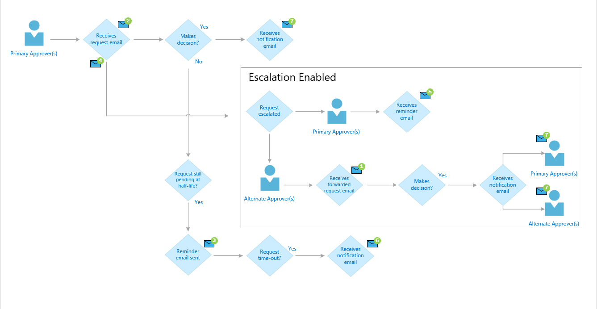
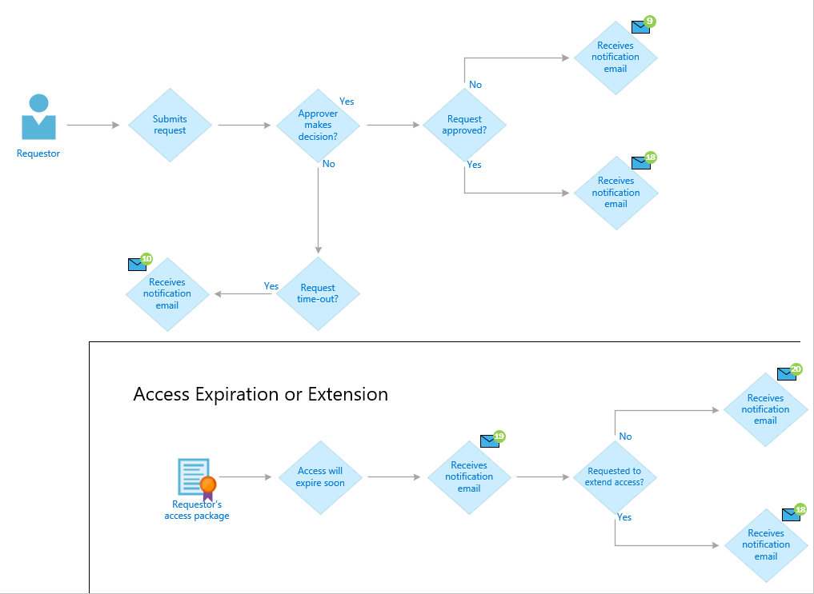
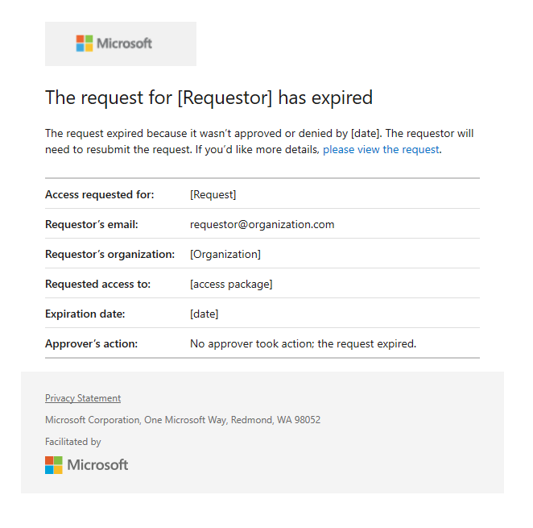

# Request process and email notifications in Azure AD entitlement management

When a user submits a request to an access package, a process begins to deliver that access request. Azure AD entitlement management sends email notifications to approvers and requestors when key events occur during the process. This article describes the request process and the email notifications that are sent.

## Request process

A user that needs access to an access package can submit an access request. Depending on the configuration of the policy, the request might require an approval. When a request is approved, a process begins to assign the user access to each resource in the access package. The following diagram shows an overview of the process and the different states:

| State | Description |
| --- | --- |
| Submitted | User submits a request. |
| Pending approval | If the policy for an access package requires approval, a request moves to pending approval. |
| Expired | If no approvers approve a request within the approval request timeout, the request expires. To try again, the user will have to resubmit their request. |
| Denied | Approver denies a request. |
| Approved | Approver approves a request. |
| Delivering | User has **not** been assigned access to all the resources in the access package. If this is an external user, the user may not yet have accessed the resource directory and accepted the consent prompt. |
| Delivered | User has been assigned access to all the resources in the access package. |
| Access extended | If extensions are allowed in the policy, the user extended the assignment. |
| Access expired | User's access to the access package has expired. To get access again, the user will have to submit a request. |

## Email notifications

If you are an approver, you are sent email notifications when you need to approve an access request and when an access request has been completed. If you are a requestor, you are sent email notifications that indicate the status of your request.

The following diagrams shows when these email notifications are sent to either the approvers or the requestor. Reference the [email notifications table](entitlement-management-process.md#email-notifications-table) to find the corresponding number to the email notifications displayed in the diagrams.

### Primary approvers and alternate approvers
The following diagram shows the experience of primary approvers and alternate approvers, and the email notifications they receive during the request process:

### Requestors
The following diagram shows the experience of requestors and the email notifications they receive during the request process:

### Email notifications table
The following table provides more detail about each of these email notifications. To manage these emails, you can use rules. For example, in Outlook, you can create rules to move the emails to a folder if the subject contains words from this table:

| # | Email subject | When sent | Sent to |
| --- | --- | --- | --- |
| 1 | Action required: Approve or deny forwarded request by *[date]* | This email will be sent to Stage-1 Alternate approvers (after the request has been escalated) to take action. | Stage-1 Alternate Approver |
| 2 | Action required: Approve or deny request by *[date]* | This email will be sent to Stage-1 Primary approvers, if escalation is disabled, to take action. | Stage-1 Primary Approver |
| 3 | Reminder: Approve or deny the request by *[date]* for *[requestor]* | This reminder email will be sent to Stage-1 Primary approvers, if escalation is disabled, to take action, only when they haven’t yet taken action. | Stage-1 Primary Approver |
| 4 | Approve or deny the request by *[time]* on *[date]* | This email will be sent to Stage-1 Primary approvers (if escalation is enabled) to take action. | Stage-1 Primary Approver |
| 5 | Action required reminder: Approve or deny the request by *[date]* for *[requestor]* | This reminder email will be sent to Stage-1 Primary approvers, if escalation is enabled, to take action, only when they haven’t yet taken action. | Stage-1 Primary Approver |
| 6 | Request has expired for *[access_package]* | This email will be sent to Stage-1 primary approvers and/or Stage-1 alternate approvers, of a single-stage or multi-stage request, after the request has expired. | Stage-1 Primary Approver, Stage-1 Alternate Approver |
| 7 | Request approved for *[requestor]* to *[access_package]* | This email will be sent to the stage-1 primary approvers and/or stage-1 alternate approvers, upon completion of a request. | Stage-1 Primary Approver, Stage-1 Alternate Approver |
| 8 | Request approved for *[requestor]* to *[access_package]* | This email will be sent to the stage-1 primary approvers and/or stage-1 alternate approvers, of a 2-stage request, only when stage-1 is approved. | Stage-1 Primary Approver, Stage-1 Alternate Approver |
| 9 | Request denied to *[access_package]* | This email will be sent to the requestor only when his request is denied | Requestor |
| 10 | Your request has expired for *[access_package]* | This email will be sent to the requestor at the end of Stage-1, of a single-stage or multi-stage request, after the request has expired. | Requestor |
| 18 | You now have access to *[access_package]* | This email will be sent to the end-users to start using their access. | Requestor |
| 19 | Extend access for *[access_package]* by *[date]* | This email will be sent to the end-users before their access expires. | Requestor |
| 20 | Access has ended for *[access_package]* | This email will be sent to the end-users after their access expires. | Requestor |

### Access request emails

When a requestor submits an access request for an access package configured to require approval, all approvers added to the policy will receive an email notification with details of the request. Details include the requestor's name, organization, access start and end date (if provided), business justification, when the request was submitted, and when the request will expire.

The email includes a link approvers can click on to go to Myaccess to approve or deny the access request. Here is a sample email notification that is sent to an approver when a requestor submits an access request:

The primary approvers are also sent an email notification with a reminder to take action and make a decision for the request. Here is a sample email of the notification primary approvers receive to remind them to take action:

### Alternate approver request emails

If forwarding to alternate approvers is enabled, per the forwarding policy, if the request is still pending, the request will be forwarded. The alternate approver will receive a notification email to approve or deny the request. Here is a sample email of the notification the alternate approvers receive:

Both, the primary approvers and the alternate approvers can approve or deny the request.

### Approved or denied emails

Requestors are notified when their access request is approved and available for access, or when their access request is denied. When an approver receives an access request submitted by a requestor, they can approve or deny the access request. The approver needs to add a business justification for their decision. Here is a sample email sent to primary or alternate approvers after a request is approved:

When an access request is approved, and their access is provisioned, an email notification is sent to the requestor that they now have access to the access package. Here is a sample email notification that is sent to a requestor when they are granted access to an access package:

When an access request is denied, an email notification is sent to the requestor. Here is a sample email notification that is sent to a requestor when their access request is denied:

### Expired access request emails

Access requests could expire if no approver has approved or denied the request. 

When the request reaches its configured expiration date and expires, it can no longer be approved or denied by the approvers. Here is a sample email of the notification sent to all of the primary and alternate approvers:

 

 An email notification is also sent to the requestor, notifying them that their access request has expired, and that they need to resubmit the access request. Here is a sample email notification that is sent to a requestor when their access request has expired:

## Next steps

- [Request access to an access package](entitlement-management-request-access.md)
- [Approve or deny access requests](entitlement-management-request-approve.md)
