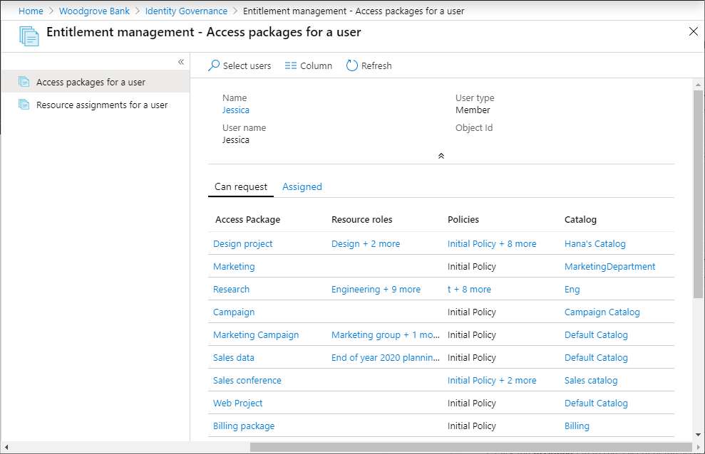
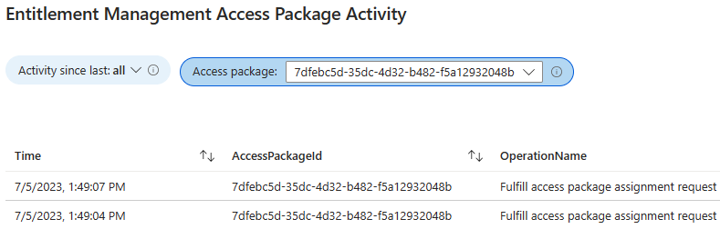
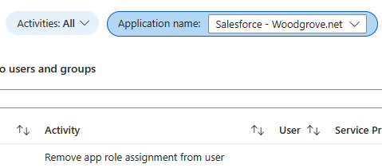

# View reports and logs in entitlement management

The entitlement management reports and Microsoft Entra audit log provide additional details about what resources users have access to. As an administrator, you can view the access packages and resource assignments for a user and view request logs for auditing purposes or  determining the status of a user's request. This article describes how to use the entitlement management reports and Microsoft Entra audit logs.

Watch the following video to learn how to view what resources users have access to in entitlement management:

>[!VIDEO https://www.youtube.com/embed/omtNJ7ySjS0]

## View users assigned to an access package

[!INCLUDE [portal updates](~/articles/active-directory/includes/portal-update.md)]

This report enables you to list all of the users who are assigned to an access package.

**Prerequisite role:** Global Administrator or Identity Governance Administrator

1. Sign in to the [Microsoft Entra admin center](https://entra.microsoft.com) as at least an [Identity Governance Administrator](../roles/permissions-reference.md#identity-governance-administrator).

1. Browse to **Identity governance** > **Entitlement management** > **Access packages**.

1. On the **Access packages** page select the access package of interest.

1. In the left menu, select **Assignments**, then select **Download**.

1. Confirm the file name and then click **Download**.

## View access packages for a user

This report enables you to list all of the access packages a user can request and the access packages that are currently assigned to the user.

**Prerequisite role:** Global Administrator or Identity Governance Administrator

1. Sign in to the [Microsoft Entra admin center](https://entra.microsoft.com) as at least an [Identity Governance Administrator](../roles/permissions-reference.md#identity-governance-administrator).

1. Browse to **Identity governance** > **Entitlement management** > **Reports**.

1. Select **Access packages for a user**.

1. Select **Select users** to open the Select users pane.

1. Find the user in the list and then select **Select**.

    The **Can request** tab displays a list of the access packages the user can request. This list is determined by the [request policies](entitlement-management-access-package-request-policy.md#for-users-in-your-directory) defined for the access packages. 

    

1. If there are more than one resource roles or policies for an access package, select the resource roles or policies entry to see selection details.

1. Select the **Assigned** tab to see a list of the access packages currently assigned to the user. When an access package is assigned to a user, it means that the user has access to all of the resource roles in the access package.

## View resource assignments for a user

This report enables you to list the resources currently assigned to a user in entitlement management. This report is for resources managed with entitlement management. The user might have access to other resources in your directory outside of entitlement management.

**Prerequisite role:** Global administrator or Identity Governance Administrator

1. Sign in to the [Microsoft Entra admin center](https://entra.microsoft.com) as at least an [Identity Governance Administrator](../roles/permissions-reference.md#identity-governance-administrator).

1. Browse to **Identity governance** > **Entitlement management** > **Reports**.

1. Select **Resource assignments for a user**.

1. Select **Select users** to open the Select users pane.

1. Find the user in the list and then select **Select**.

    A list of the resources currently assigned to the user is displayed. The list also shows the access package and policy they got the resource role from, along with start and end date for access.
    
    If a user got access to the same resource in two or more packages, you can select an arrow to see each package and policy.

    

## Determine the status of a user's request

To get additional details on how a user requested and received access to an access package, you can use the Microsoft Entra audit log. In particular, you can use the log records in the `EntitlementManagement` and `UserManagement` categories to get additional details on the processing steps for each request.  

1. Sign in to the [Microsoft Entra admin center](https://entra.microsoft.com) as at least an [Identity Governance Administrator](../roles/permissions-reference.md#identity-governance-administrator).

1. Browse to **Identity governance** > **Entitlement management** > **Audit logs**.

1. At the top, change the **Category** to either `EntitlementManagement` or `UserManagement`, depending on the audit record you're looking for.  

1. Select **Apply**.

1. To download the logs, select **Download**.

When Microsoft Entra ID receives a new request, it writes an audit record, in which the **Category** is `EntitlementManagement` and the **Activity** is typically `User requests access package assignment`.  In the case of a direct assignment created in the Microsoft Entra admin center, the **Activity** field of the audit record is `Administrator directly assigns user to access package`, and the user performing the assignment is identified by the **ActorUserPrincipalName**.

Microsoft Entra ID writes additional audit records while the request is in progress, including:

| Category | Activity | Request status |
| :---- | :------------ | :------------ |
| `EntitlementManagement` | `Auto approve access package assignment request` | Request doesn't require approval |
| `UserManagement` | `Create request approval` | Request requires approval |
| `UserManagement` | `Add approver to request approval` | Request requires approval |
| `EntitlementManagement` | `Approve access package assignment request` | Request approved |
| `EntitlementManagement` | `Ready to fulfill access package assignment request` |Request approved, or doesn't require approval |

When a user is assigned access, Microsoft Entra ID writes an audit record for the `EntitlementManagement` category with **Activity** `Fulfill access package assignment`.  The user who received the access is identified by **ActorUserPrincipalName** field.

If access wasn't assigned, then Microsoft Entra ID writes an audit record for the `EntitlementManagement` category with **Activity** either `Deny access package assignment request`, if the request was denied by an approver, or `Access package assignment request timed out (no approver action taken)`, if the request timed out before an approver could approve.

When the user's access package assignment expires, is canceled by the user, or removed by an administrator, then Microsoft Entra ID writes an audit record for the `EntitlementManagement` category with **Activity** of `Remove access package assignment`.

## Download list of connected organizations

**Prerequisite role**: *Global Administrator* or *Identity Governance Administrator*

1. Sign in to the [Microsoft Entra admin center](https://entra.microsoft.com) as at least an [Identity Governance Administrator](../roles/permissions-reference.md#identity-governance-administrator).

1. Browse to **Identity governance** > **Entitlement management** > **Connected organizations**.

1. On the **Connected organizations** page select **Download**.

## View events for an access package  

If you have configured to send audit log events to [Azure Monitor](entitlement-management-logs-and-reporting.md), then you can use the built-in workbooks and custom workbooks to view the audit logs retained in Azure Monitor. 

To view events for an access package, you must have access to the underlying Azure monitor workspace (see [Manage access to log data and workspaces in Azure Monitor](../../azure-monitor/logs/manage-access.md#azure-rbac) for information) and in one of the following roles: 

- Global administrator  
- Security administrator  
- Security reader  
- Reports reader  
- Application administrator  

1. In the Microsoft Entra admin center, select **Identity** then select **Workbooks** under **Monitoring & health**. If you only have one subscription, move on to step 3. 

1. If you have multiple subscriptions, select the subscription that contains the workspace.  

1. Select the workbook named *Access Package Activity*. 

1. In that workbook, select a time range (change to **All** if not sure), and select an access package ID from the drop-down list of all access packages that had activity during that time range. The events related to the access package that occurred during the selected time range will be displayed.

    

    Each row includes the time, access package ID, the name of the operation, the object ID, UPN, and the display name of the user who started the operation.  Additional details are included in JSON.

1. If you would like to see if there have been changes to application role assignments for an application that weren't due to access package assignments, such as by a global administrator directly assigning a user to an application role, then you can select the workbook named *Application role assignment activity*.

    

## Next steps

- [Archive reports and Logs](entitlement-management-logs-and-reporting.md)
- [Troubleshoot entitlement management](entitlement-management-troubleshoot.md)
- [Common scenarios](entitlement-management-scenarios.md)
