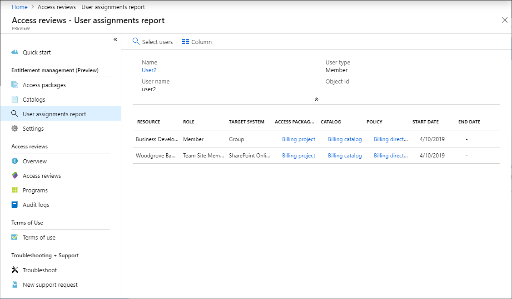

# View reports in Azure AD entitlement management (Preview)

> [!IMPORTANT]
> Azure Active Directory (Azure AD) entitlement management is currently in public preview.
> This preview version is provided without a service level agreement, and it's not recommended for production workloads. Certain features might not be supported or might have constrained capabilities.
> For more information, see [Supplemental Terms of Use for Microsoft Azure Previews](https://azure.microsoft.com/support/legal/preview-supplemental-terms/).

## View resources a user has access to

1. Click **Azure Active Directory** and then click **Identity governance**.

1. In the left menu, click **User assignments report**.

1. Click **Select users** to open the Select users pane.

1. Find the user in the list that you want to view the resources they have access to.

1. Click the user and then click **Select**.

    A list of resources that the user has access to is displayed. It includes the access package, policy, and dates.

    

## Determining the status of a user's request

Additional details on how a user requested and received access are available through the Azure AD audit log.  In particular, the log records in categories `EntitlementManagement` and `UserManagement` provide additional details on the processing steps for each request.  

1. Click **Azure Active Directory** and then click **Audit logs**.

1. At the top, change the **Category** to either `EntitlementManagement` or `UserManagement`, depending on the audit record you're looking for.  
1. Click **Apply**.
1. Click **Download**.

When Azure AD receives a new request, it writes an audit record, in which the **Category** is `EntitlementManagement` and the **Activity** is typically `User requests access package assignment`.  In the case of an assignment created in the Azure Portal, the **Activity** field of the audit record is `Administrator directly assigns user to access package`, and the user performing the assignment is identified by the **ActorUserPrincipalName**.

Azure AD will write additional audit records while the request is in progress, including:

 |Category     | Activity | Request status |
-|:----|:------------|:------------|
 | `EntitlementManagement` | `Auto approve access package assignment request` | Request does not require approval |
 | `UserManagement` | `Create request approval` | Request requires approval |
 | `UserManagement` | `Add approver to request approval` | Request requires approval |
 | `EntitlementManagement` | `Approve access package assignment request` | Request approved |
 | `EntitlementManagement` | `Ready to fulfill access package assignment request` |Request approved, or does not require approval |

When the user is assigned access, Azure AD writes an audit record for the `EntitlementManagement` category with **Activity** `Fulfill access package assignment`.  The user who received the access is identified by **ActorUserPrincipalName** field.

If access was not assigned, then Azure AD will write an audit record for the `EntitlementManagement` category with **Activity** either `Deny access package assignment request`, if the request was denied by an approver, or `Access package assignment request timed out (no approver action taken)`, if the request timed out before an approver could approve.

When the user's access package assignment expires, is canceled by the user or removed by an administrator, then Azure AD will write an audit record for the `EntitlementManagement` category with **Activity** of `Remove access package assignment`.

## Next steps

- [Common scenarios](entitlement-management-scenarios.md)
