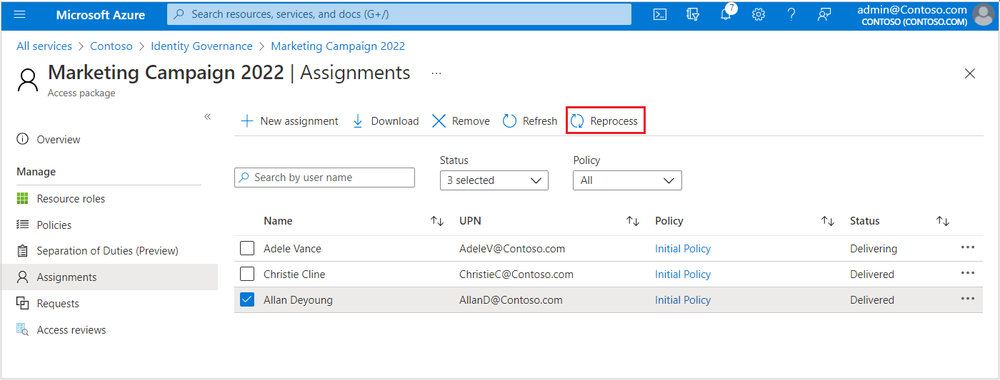

# Reprocess assignments for an access package in entitlement management

As an access package manager, you can automatically reevaluate and enforce users’ original assignments in an access package using the reprocess functionality. Reprocessing eliminates the need for users to repeat the access package request process if their access to resources was impacted by changes outside of Entitlement Management.

For example, a user may have been removed from a group manually, thereby causing that user to lose access to necessary resources. 

Entitlement Management does not block outside updates to the access package’s resources, so the Entitlement Management UI would not accurately display this change. Therefore, the user’s assignment status would be shown as “Delivered” even though the user does not have access to the resources anymore. However, if the user’s assignment is reprocessed, they will be added to the access package’s resources again. Reprocessing ensures that the access package assignments are up to date, that users have access to necessary resources, and that assignments are accurately reflected in the UI.

This article describes how to reprocess assignments in an existing access package.

## Prerequisites

To use entitlement management and assign users to access packages, you must have one of the following licenses:

- Azure AD Premium P2
- Enterprise Mobility + Security (EMS) E5 license

## Open an existing access package and reprocess user assignments

**Prerequisite role**: Global administrator, Identity Governance administrator, User administrator, Catalog owner, Access package manager or Access package assignment manager

If you have users who are in the "Delivered" state but do not have access to resources that are a part of the access package, you will likely need to reprocess the assignments to reassign those users to the access package's resources. Follow these steps to reprocess assignments for an existing access package:

1.	Sign in to the [Azure portal](https://portal.azure.com).

1.  Click **Azure Active Directory**, and then click **Identity Governance**.

1.	In the left menu, click **Access packages** and then open the access package with the user assignment you want to reprocess.

1.	Underneath **Manage** on the left side, click **Assignments**.

    

1.	Select all users whose assignments you wish to reprocess.

1.	Click **Reprocess**.

## Next steps

- [View, add, and remove assignments for an access package](entitlement-management-access-package-assignments.md)
- [View reports and logs](entitlement-management-reports.md)
