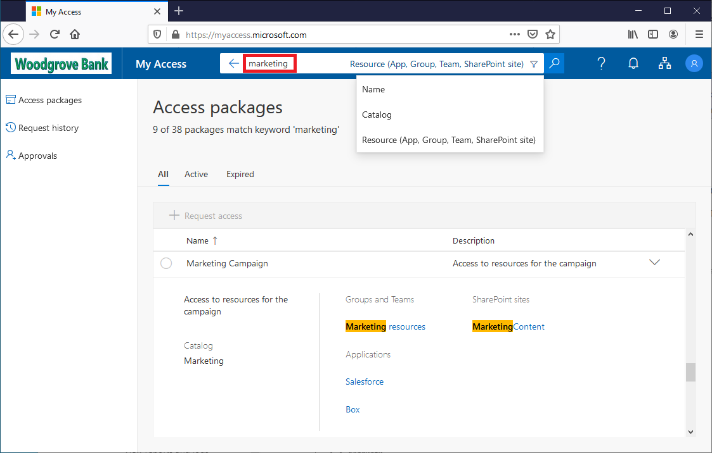
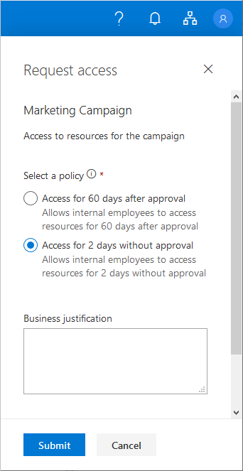
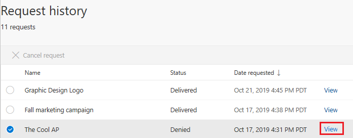
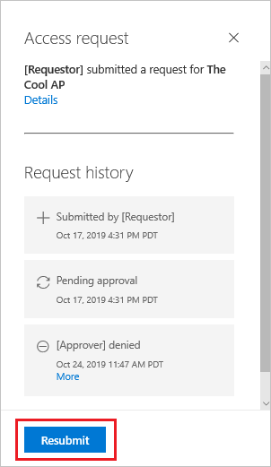

# Request access to an access package in Azure AD entitlement management

With Azure AD entitlement management, an access package enables a one-time setup of resources and policies that automatically administers access for the life of the access package. 

An access package manager can configure policies to require approval for users to have access to access packages. A user that needs access to an access package can submit a request to get access. This article describes how to submit an access request.

## Sign in to the My Access portal

The first step is to sign in to the My Access portal where you can request access to an access package.

**Prerequisite role:** Requestor

1. Look for an email or a message from the project or business manager you are working with. The email should include a link to the access package you will need access to. The link starts with `myaccess`, includes a directory hint, and ends with an access package ID.  (For US Government, the domain may be `https://myaccess.microsoft.us` instead.)
 
    `https://myaccess.microsoft.com/@<directory_hint>#/access-packages/<access_package_id>`

1. Open the link.

1. Sign in to the My Access portal.

    Be sure you use your organizational (work or school) account. If you're unsure, check with your project or business manager.

## Request an access package

Once you have found the access package in the My Access portal, you can submit a request.

**Prerequisite role:** Requestor

1. Find the access package in the list.  If necessary, you can search by typing a search string and then selecting the **Name**, **Catalog**, or **Resources** filter.

    

1. Click the checkmark to select the access package.

1. Click **Request access** to open the Request access pane.

    

1. If the **Business justification** box is displayed, type a justification for needing access.

1. If **Request for specific period?** is enabled, select **Yes** or **No**.

1. If necessary, specify the start date and end date.

    

1. When finished, click **Submit** to submit your request.

1. Click **Request history** to see a list of your requests and the status.

    If the access package requires approval, the request is now in a pending approval state.

### Select a policy

If you request access to an access package that has multiple policies that apply, you might be asked to select a policy. For example, an access package manager might configure an access package with two policies for two groups of internal employees. The first policy might allow access for 60 days and require approval. The second policy might allow access for 2 days and not require approval. If you encounter this scenario, you must select the policy you want to use.

## Resubmit a request

When you request access to an access package, your request might be denied or your request might expire if approvers don't respond in time. If you need access, you can try again and resubmit your request. The following procedure explains how to resubmit an access request:

**Prerequisite role:** Requestor

1. Sign in to the **My Access** portal.

1. Click **Request history** from the navigation menu to the left.

1. Find the access package for which you are resubmitting a request.

1. Click the check mark to select the access package.

1. Click the blue **View** link to the right of the selected access package.
    
    

    A pane will open to the right with the request history for the access package.
    
    

1. Click the **Resubmit** button at the bottom of the pane.

## Cancel a request

If you submit an access request and the request is still in the **pending approval** state, you can cancel the request.

**Prerequisite role:** Requestor

1. In the My Access portal, on the left, click **Request history** to see a list of your requests and the status.

1. Click the **View** link for the request you want to cancel.

1. If the request is still in the **pending approval** state, you can click **Cancel request** to cancel the request.

    

1. Click **Request history** to confirm the request was canceled.

## Next steps

- [Approve or deny access requests](entitlement-management-request-approve.md)
- [Request process and email notifications](entitlement-management-process.md)
