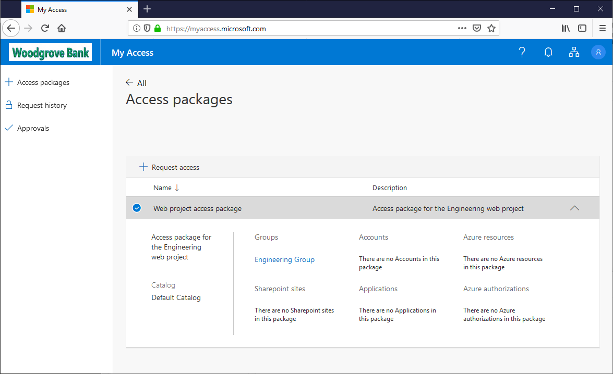
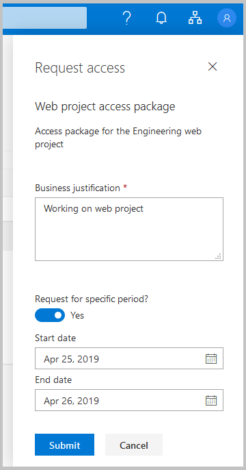
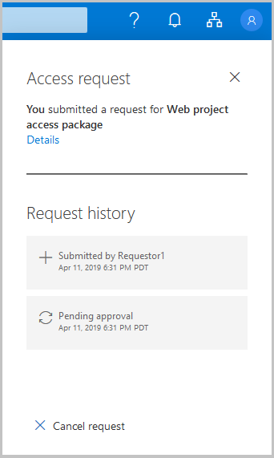

# Request access to an access package in Azure AD entitlement management (Preview)

> [!IMPORTANT]
> Azure Active Directory (Azure AD) entitlement management is currently in public preview.
> This preview version is provided without a service level agreement, and it's not recommended for production workloads. Certain features might not be supported or might have constrained capabilities.
> For more information, see [Supplemental Terms of Use for Microsoft Azure Previews](https://azure.microsoft.com/support/legal/preview-supplemental-terms/).

## Sign in to the My Access portal

The first step is to sign in to the My Access portal where you can request access to an access package.

**Prerequisite role:** Requestor

1. Look for an email or a message from the project or business manager you are working with. The email should include a link to the access package you will need access to. The link will start with:

    `https://myaccess.microsoft.com`

1. Open the link.

1. Sign in to the My Access portal.

    Be sure you use your organizational account. If you unsure, check with your project or business manager.

## Request an access package

Once you have found the access package in the My Access portal, you can submit a request.

**Prerequisite role:** Requestor

1. Click the checkmark to select the access package.

    

1. Click **Request access** to open the Request access pane.

1. If the **Business justification** box is displayed, type a justification for needing access.

1. If **Request for specific period?** is enabled, select **Yes** or **No**.

1. If necessary, specify the start date and end date.

    

1. When finished, click **Submit** to submit your request.

1. Click **Request history** to see a list of your requests and the status.

    If the access package requires approval, the request is now in a pending approval state.

## Cancel a request

If you submit an access request and the request is still in the **pending approval** state, you can cancel the request.

**Prerequisite role:** Requestor

1. In the My Access portal, on the left, click **Request history** to see a list of your requests and the status.

1. Click the **View** link for the request you want to cancel.

1. If the request is still in the **pending approval** state, you can click **Cancel request** to cancel the request.

    

1. Click **Request history** to confirm the request was canceled.

## Select a policy

If you are requesting access to an access package that has multiple policies that apply, you might be asked to select a policy. For example, an access package manager might configure an access package with two policies for two groups of internal employees. The first policy might allow access for 60 days and require approval. The second policy might allow access for 2 days and not require approval. If you encounter this scenario, you must select the policy you want to use.

**Prerequisite role:** Requestor

## Next steps

- [Approve or deny access requests](entitlement-management-request-approve.md)
- [Request process and email notifications](entitlement-management-process.md)
