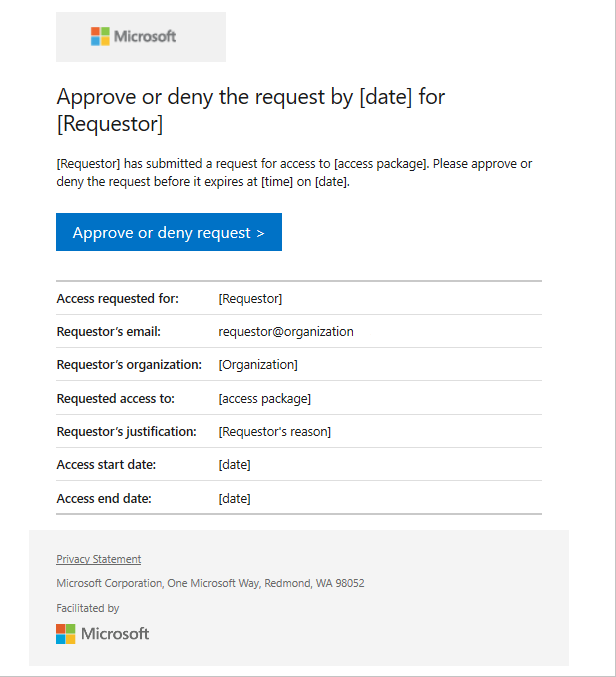
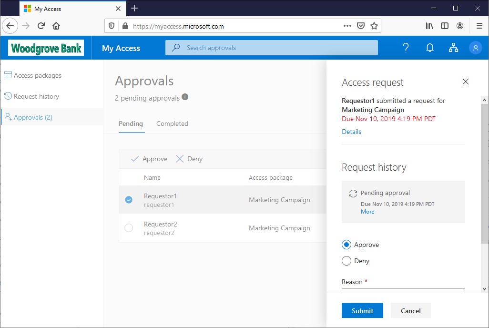

# Approve or deny access requests in Azure AD entitlement management

With Azure AD entitlement management, you can configure policies to require approval for access packages, and choose one or more approvers. This article describes how designated approvers can approve or deny requests for access packages.

## Open request

The first step to approve or deny access requests is to find and open the access request pending approval. There are two ways to open the access request.

**Prerequisite role:** Approver

1. Look for an email from Microsoft Azure that asks you to approve or deny a request. Here is an example email:

    

1. Click the **Approve or deny request** link to open the access request.

1. Sign in to the My Access portal.

If you don't have the email, you can find the access requests pending your approval by following these steps.

1. Sign in to the My Access portal at [https://myaccess.microsoft.com](https://myaccess.microsoft.com).  (For US Government, the domain in the My Access portal link will be `myaccess.microsoft.us`.)

1. In the left menu, click **Approvals** to see a list of access requests pending approval.

1. On the **Pending** tab, find the request.

## Approve or deny request

After you open an access request pending approval, you can see details that will help you make an approve or deny decision.

**Prerequisite role:** Approver

1. Click the **View** link to open the Access request pane.

1. Click **Details** to see details about the access request.

    The details include the user's name, organization, access start and end date if provided, business justification, when the request was submitted, and when the request will expire.

1. Click **Approve** or **Deny**.

1. If necessary, enter a reason.

    

1. Click **Submit** to submit your decision.

    If a policy is configured with multiple approvers, only one approver needs to make a decision about the pending approval. After an approver has submitted their decision to the access request, the request is completed and is no longer available for the other approvers to approve or deny the request. The other approvers can see the request decision and the decision maker in their My Access portal. At this time, only single-stage approval is supported.

    If none of the configured approvers are able to approve or deny the access request, the request expires after the configured request duration. The user gets notified that their access request has expired and that they need to resubmit the access request.

## Next steps

- [Request access to an access package](entitlement-management-request-access.md)
- [Request process and email notifications](entitlement-management-process.md)
